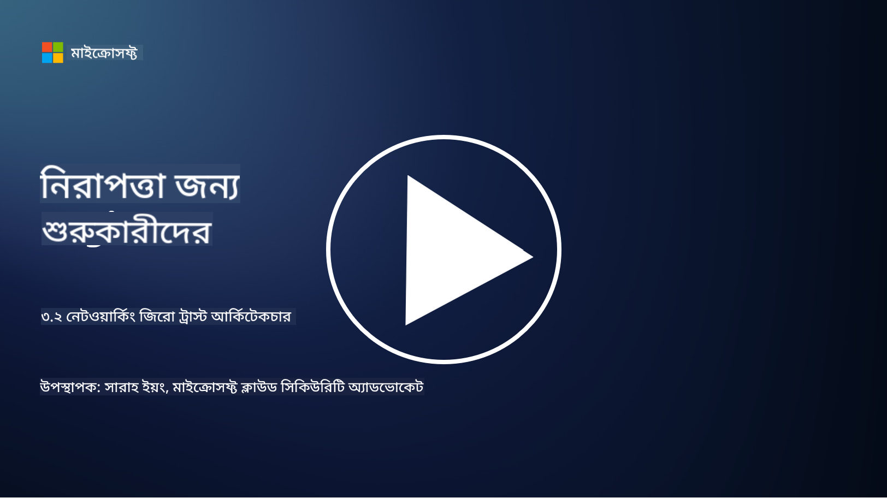

<!--
CO_OP_TRANSLATOR_METADATA:
{
  "original_hash": "680d6e14d9d33fc471c22f44679713f8",
  "translation_date": "2025-09-03T21:12:01+00:00",
  "source_file": "3.2 Networking zero trust architecture.md",
  "language_code": "bn"
}
-->
# নেটওয়ার্কিং জিরো ট্রাস্ট আর্কিটেকচার

নেটওয়ার্ক জিরো ট্রাস্ট নিয়ন্ত্রণে একটি গুরুত্বপূর্ণ স্তর প্রদান করে। এই পাঠে আমরা আরও শিখব:

- নেটওয়ার্ক সেগমেন্টেশন কী?  
- নেটওয়ার্ক সেগমেন্টেশন কীভাবে জিরো ট্রাস্ট বাস্তবায়নে সাহায্য করে?  
- এন্ড-টু-এন্ড এনক্রিপশন কী?

## নেটওয়ার্ক সেগমেন্টেশন কী?

নেটওয়ার্ক সেগমেন্টেশন হলো একটি নেটওয়ার্ককে ছোট, বিচ্ছিন্ন অংশ বা সাবনেটওয়ার্কে ভাগ করার প্রক্রিয়া। প্রতিটি অংশ অন্য অংশ থেকে বিচ্ছিন্ন থাকে এবং অংশগুলোর মধ্যে অ্যাক্সেস নির্দিষ্ট নিরাপত্তা নীতির ভিত্তিতে নিয়ন্ত্রিত ও সীমাবদ্ধ থাকে। নেটওয়ার্ক সেগমেন্টেশন নিরাপত্তা উন্নত করতে ব্যবহৃত হয়, কারণ এটি সম্ভাব্য আক্রমণের প্রভাব সীমিত করে এবং নেটওয়ার্কের মধ্যে আক্রমণকারীদের পার্শ্বীয় গতিবিধি কমায়।

নেটওয়ার্ক সেগমেন্টেশন বাস্তবায়নের মাধ্যমে একটি প্রতিষ্ঠান "জোন" তৈরি করতে পারে যা বিভিন্ন ধরনের ব্যবহারকারী, অ্যাপ্লিকেশন এবং ডেটাকে আলাদা করে। এটি আক্রমণের পৃষ্ঠতল কমায় এবং নিরাপত্তা ঘটনার কারণে সম্ভাব্য ক্ষতি সীমিত করে। নেটওয়ার্ক সেগমেন্টেশন ভার্চুয়াল LANs (VLANs), ফায়ারওয়াল এবং অ্যাক্সেস নিয়ন্ত্রণের মতো প্রযুক্তি ব্যবহার করে অর্জন করা যায়।

## নেটওয়ার্ক সেগমেন্টেশন কীভাবে জিরো ট্রাস্ট বাস্তবায়নে সাহায্য করে?

নেটওয়ার্ক সেগমেন্টেশন জিরো ট্রাস্ট মডেলের নীতিগুলোর সাথে ঘনিষ্ঠভাবে সামঞ্জস্যপূর্ণ। জিরো ট্রাস্ট আর্কিটেকচারে, নেটওয়ার্ক সেগমেন্টেশন "লিস্ট প্রিভিলেজ" নীতিকে কার্যকর করতে সাহায্য করে, যা নিশ্চিত করে যে ব্যবহারকারী এবং ডিভাইসগুলো শুধুমাত্র তাদের কাজ সম্পাদনের জন্য প্রয়োজনীয় নির্দিষ্ট রিসোর্স এবং পরিষেবাগুলোতে অ্যাক্সেস পায়। নেটওয়ার্ককে ছোট জোনে ভাগ করে, প্রতিষ্ঠানগুলো কঠোর অ্যাক্সেস নিয়ন্ত্রণ বাস্তবায়ন করতে পারে, গুরুত্বপূর্ণ সম্পদ বিচ্ছিন্ন করতে পারে এবং আক্রমণকারীদের পার্শ্বীয় গতিবিধি প্রতিরোধ করতে পারে।

নেটওয়ার্ক সেগমেন্টেশন পরিচয়-ভিত্তিক অ্যাক্সেস নিয়ন্ত্রণ কার্যকর করতেও সাহায্য করে, যেখানে ব্যবহারকারী এবং ডিভাইসগুলো নির্দিষ্ট অংশে অ্যাক্সেস করার আগে সম্পূর্ণভাবে প্রমাণীকৃত এবং অনুমোদিত হয়। এটি সংবেদনশীল রিসোর্সে অননুমোদিত অ্যাক্সেস প্রতিরোধ করে এবং ক্ষতিগ্রস্ত পরিচয়ের সম্ভাব্য প্রভাব কমায়।

## এন্ড-টু-এন্ড এনক্রিপশন কী?

এন্ড-টু-এন্ড (E2E) এনক্রিপশন একটি নিরাপত্তা ব্যবস্থা যা নিশ্চিত করে যে ডেটা প্রেরক থেকে প্রাপক পর্যন্ত তার পুরো যাত্রাপথে এনক্রিপ্ট থাকে। এই প্রক্রিয়ায়, ডেটা প্রেরকের প্রান্তে এনক্রিপ্ট করা হয় এবং শুধুমাত্র প্রাপক ডিক্রিপশন কী ধারণ করে ডেটা আনলক এবং পড়তে পারে। এনক্রিপশন এবং ডিক্রিপশন প্রক্রিয়া এন্ডপয়েন্টে ঘটে, যা অননুমোদিত পক্ষ, এমনকি পরিষেবা প্রদানকারী এবং মধ্যস্থতাকারীদের জন্যও প্লেইনটেক্সট ডেটা অ্যাক্সেস করা অত্যন্ত কঠিন করে তোলে।

E2E এনক্রিপশন ডেটা ট্রান্সমিশনের জন্য উচ্চ স্তরের গোপনীয়তা এবং নিরাপত্তা প্রদান করে, এমনকি যদি ডেটা বিভিন্ন মধ্যস্থতাকারী সিস্টেম বা নেটওয়ার্কের মধ্য দিয়ে যায়। এটি সাধারণত নিরাপদ মেসেজিং অ্যাপ, ইমেইল পরিষেবা এবং অন্যান্য যোগাযোগ প্ল্যাটফর্মে ব্যবহৃত হয় সংবেদনশীল তথ্যকে অনুপ্রবেশ এবং অননুমোদিত অ্যাক্সেস থেকে রক্ষা করতে।

এই এনক্রিপশন পদ্ধতি নিশ্চিত করে যে যদি আক্রমণকারীরা ট্রানজিটে ডেটা অ্যাক্সেস করতে সক্ষম হয়, তারা শুধুমাত্র এনক্রিপ্টেড বিষয়বস্তু দেখতে পাবে, যা ডিক্রিপশন কী ছাড়া অর্থহীন। এন্ড-টু-এন্ড এনক্রিপশন ব্যবহারকারীর গোপনীয়তা রক্ষা এবং সংবেদনশীল তথ্য অননুমোদিত পক্ষের কাছে প্রকাশিত হওয়া থেকে রক্ষা করতে গুরুত্বপূর্ণ ভূমিকা পালন করে।

## SASE কী?

SASE হলো "Secure Access Service Edge" এর সংক্ষিপ্ত রূপ, এবং এটি একটি সাইবার নিরাপত্তা ফ্রেমওয়ার্ক এবং আর্কিটেকচার যা নেটওয়ার্ক নিরাপত্তা এবং ওয়াইড-এরিয়া নেটওয়ার্কিং (WAN) সক্ষমতাগুলোকে একটি একক ক্লাউড-ভিত্তিক পরিষেবায় একত্রিত করে। SASE ডিজাইন করা হয়েছে দূরবর্তী এবং মোবাইল ব্যবহারকারীদের জন্য নেটওয়ার্ক রিসোর্স, অ্যাপ্লিকেশন এবং ডেটাতে নিরাপদ এবং স্কেলযোগ্য অ্যাক্সেস প্রদান করতে, একই সাথে নেটওয়ার্ক ব্যবস্থাপনাকে সহজতর করতে এবং ঐতিহ্যবাহী নেটওয়ার্ক এবং নিরাপত্তা আর্কিটেকচারের জটিলতা কমাতে।

SASE-এর মূল বৈশিষ্ট্য এবং উপাদানগুলো হলো:

1. **ক্লাউড-ভিত্তিক:** SASE একটি ক্লাউড পরিষেবা হিসেবে সরবরাহ করা হয়, যার অর্থ নিরাপত্তা এবং নেটওয়ার্কিং ফাংশনগুলো ক্লাউড থেকে প্রদান করা হয়, ঐতিহ্যবাহী অন-প্রিমাইস হার্ডওয়্যার এবং অ্যাপ্লায়েন্সের উপর নির্ভর না করে।  
   
2. **নিরাপত্তা এবং নেটওয়ার্কিংয়ের ইন্টিগ্রেশন:** SASE বিভিন্ন নিরাপত্তা পরিষেবা যেমন সিকিউর ওয়েব গেটওয়ে (SWG), ফায়ারওয়াল অ্যাজ এ সার্ভিস (FWaaS), ডেটা লস প্রিভেনশন (DLP), জিরো-ট্রাস্ট নেটওয়ার্ক অ্যাক্সেস (ZTNA), এবং WAN অপ্টিমাইজেশনকে ওয়াইড-এরিয়া নেটওয়ার্কিং সক্ষমতার সাথে একত্রিত করে। এই ইন্টিগ্রেশন নিরাপত্তা এবং নেটওয়ার্কিং অপারেশনগুলোকে সহজতর করতে সাহায্য করে।  
   
3. **জিরো ট্রাস্ট:** SASE জিরো ট্রাস্ট নীতির উপর কাজ করে, যার অর্থ এটি কঠোর অ্যাক্সেস নিয়ন্ত্রণ এবং লিস্ট-প্রিভিলেজ অ্যাক্সেস নীতিগুলো কার্যকর করে। ব্যবহারকারী এবং ডিভাইসগুলো ডিফল্টভাবে বিশ্বাসযোগ্য নয় এবং রিসোর্সে অ্যাক্সেস করার আগে তাদের প্রমাণীকৃত এবং অনুমোদিত হতে হয়।  
   
4. **পরিচয়-কেন্দ্রিক:** SASE ব্যবহারকারী এবং ডিভাইসের পরিচয়কে অ্যাক্সেস নিয়ন্ত্রণের ভিত্তি হিসেবে ফোকাস করে। পরিচয় এবং প্রসঙ্গ-ভিত্তিক নীতিগুলো ব্যবহার করে অ্যাক্সেস অনুমতি নির্ধারণ করা হয়, এবং এই নীতিগুলো ব্যবহারকারীর আচরণ এবং প্রসঙ্গের উপর ভিত্তি করে গতিশীলভাবে পরিবর্তিত হয়।  
   
5. **স্কেলযোগ্যতা এবং নমনীয়তা:** SASE সহজেই বড় সংখ্যক ব্যবহারকারী এবং ডিভাইসের জন্য স্কেল করতে পারে, যা বিভিন্ন এবং পরিবর্তনশীল নেটওয়ার্কিং এবং নিরাপত্তা চাহিদাসম্পন্ন প্রতিষ্ঠানের জন্য উপযুক্ত।  

SASE আধুনিক দূরবর্তী কাজ এবং ক্লাউড গ্রহণের যুগে বিশেষভাবে প্রাসঙ্গিক, কারণ এটি নেটওয়ার্ক অ্যাক্সেস সুরক্ষিত এবং পরিচালনা করার জন্য একটি ব্যাপক এবং দ্রুতগতির পদ্ধতি প্রদান করে। এটি ব্যবহারকারী-কেন্দ্রিক এবং জিরো-ট্রাস্ট নিরাপত্তা মডেলের উপর একটি শক্তিশালী ফোকাস বজায় রেখে প্রতিষ্ঠানের পরিবর্তনশীল নিরাপত্তা এবং নেটওয়ার্কিং প্রয়োজনের সাথে মানিয়ে নিতে সাহায্য করে।

## আরও পড়ুন

- [What Is Network Segmentation? - Cisco](https://www.cisco.com/c/en/us/products/security/what-is-network-segmentation.html#~benefits)  
- [What Is Micro-Segmentation? - Cisco](https://www.cisco.com/c/en/us/products/security/what-is-microsegmentation.html)  
- [Implementing Network Segmentation and Segregation | Cyber.gov.au](https://www.cyber.gov.au/resources-business-and-government/maintaining-devices-and-systems/system-hardening-and-administration/network-hardening/implementing-network-segmentation-and-segregation)  
- [What Is Network Segmentation and Why It Matters | CompTIA](https://www.comptia.org/blog/security-awareness-training-network-segmentation)  
- [Network Segmentation: Concepts and Practices (cmu.edu)](https://insights.sei.cmu.edu/blog/network-segmentation-concepts-and-practices/)  
- [Secure networks with Zero Trust | Microsoft Learn](https://learn.microsoft.com/security/zero-trust/deploy/networks?WT.mc_id=academic-96948-sayoung)  
- [What is end-to-end encryption? | IBM](https://www.ibm.com/topics/end-to-end-encryption)  
- [What Is End-to-End Encryption, and Why Does It Matter? (howtogeek.com)](https://www.howtogeek.com/711656/what-is-end-to-end-encryption-and-why-does-it-matter/)  
- [Definition of Secure Access Service Edge (SASE) - Gartner Information Technology Glossary](https://www.gartner.com/en/information-technology/glossary/secure-access-service-edge-sase)  
- [What Is Secure Access Service Edge (SASE)? | Microsoft Security](https://www.microsoft.com/security/business/security-101/what-is-sase?WT.mc_id=academic-96948-sayoung)  

---

**অস্বীকৃতি**:  
এই নথিটি AI অনুবাদ পরিষেবা [Co-op Translator](https://github.com/Azure/co-op-translator) ব্যবহার করে অনুবাদ করা হয়েছে। আমরা যথাসাধ্য সঠিকতা নিশ্চিত করার চেষ্টা করি, তবে অনুগ্রহ করে মনে রাখবেন যে স্বয়ংক্রিয় অনুবাদে ত্রুটি বা অসঙ্গতি থাকতে পারে। মূল ভাষায় থাকা নথিটিকে প্রামাণিক উৎস হিসেবে বিবেচনা করা উচিত। গুরুত্বপূর্ণ তথ্যের জন্য, পেশাদার মানব অনুবাদ সুপারিশ করা হয়। এই অনুবাদ ব্যবহারের ফলে কোনো ভুল বোঝাবুঝি বা ভুল ব্যাখ্যা হলে আমরা দায়বদ্ধ থাকব না।