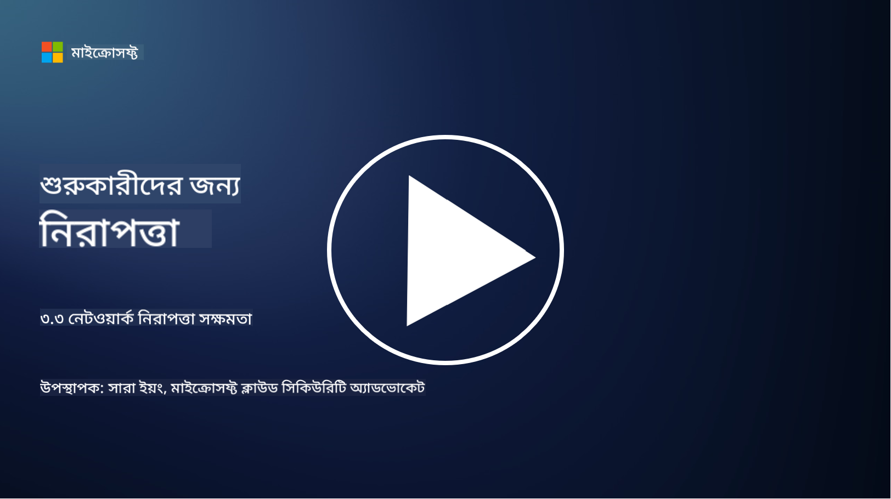

<!--
CO_OP_TRANSLATOR_METADATA:
{
  "original_hash": "c3aba077bb98eebc925dd58d870229ab",
  "translation_date": "2025-09-03T20:18:34+00:00",
  "source_file": "3.3 Network security capabilities.md",
  "language_code": "bn"
}
-->
# নেটওয়ার্ক সুরক্ষা সক্ষমতা

এই পাঠে আমরা নেটওয়ার্ক সুরক্ষার জন্য ব্যবহৃত নিম্নলিখিত সক্ষমতা সম্পর্কে শিখব:

 - প্রচলিত ফায়ারওয়াল
 - ওয়েব অ্যাপ্লিকেশন ফায়ারওয়াল
 - ক্লাউড সিকিউরিটি গ্রুপ
 - CDN
 - লোড ব্যালেন্সার
 - ব্যাস্টিয়ন হোস্ট
 - VPN
 - DDoS সুরক্ষা

## প্রচলিত ফায়ারওয়াল

প্রচলিত ফায়ারওয়াল হল এমন সুরক্ষা ডিভাইস যা পূর্বনির্ধারিত সুরক্ষা নিয়মের ভিত্তিতে নেটওয়ার্কে প্রবেশ এবং প্রস্থান করা ট্রাফিক নিয়ন্ত্রণ ও পর্যবেক্ষণ করে। এগুলো একটি বিশ্বাসযোগ্য অভ্যন্তরীণ নেটওয়ার্ক এবং অবিশ্বাসযোগ্য বাহ্যিক নেটওয়ার্কের মধ্যে বাধা হিসেবে কাজ করে, ট্রাফিক ফিল্টার করে অননুমোদিত প্রবেশ এবং সম্ভাব্য হুমকি প্রতিরোধ করে।

## ওয়েব অ্যাপ্লিকেশন ফায়ারওয়াল

ওয়েব অ্যাপ্লিকেশন ফায়ারওয়াল (WAF) হল বিশেষায়িত ফায়ারওয়াল যা ওয়েব অ্যাপ্লিকেশনকে বিভিন্ন আক্রমণ থেকে রক্ষা করে, যেমন SQL ইনজেকশন, ক্রস-সাইট স্ক্রিপ্টিং এবং অন্যান্য দুর্বলতা। এগুলো HTTP অনুরোধ এবং প্রতিক্রিয়া বিশ্লেষণ করে ক্ষতিকারক ট্রাফিক সনাক্ত ও ব্লক করে যা ওয়েব অ্যাপ্লিকেশনকে লক্ষ্য করে।

## ক্লাউড সিকিউরিটি গ্রুপ

সিকিউরিটি গ্রুপ হল ক্লাউড পরিষেবা প্রদানকারীদের দ্বারা সরবরাহিত একটি মৌলিক নেটওয়ার্ক সুরক্ষা বৈশিষ্ট্য। এগুলো ভার্চুয়াল ফায়ারওয়ালের মতো কাজ করে যা ক্লাউড রিসোর্স, যেমন ভার্চুয়াল মেশিন (VM) এবং ইনস্ট্যান্সে প্রবেশ এবং প্রস্থান করা ট্রাফিক নিয়ন্ত্রণ করে। সিকিউরিটি গ্রুপ সংস্থাগুলোকে নিয়ম সংজ্ঞায়িত করতে দেয় যা নির্ধারণ করে কোন ধরনের ট্রাফিক অনুমোদিত এবং নিষিদ্ধ, ক্লাউড ডিপ্লয়মেন্টে একটি অতিরিক্ত সুরক্ষা স্তর যোগ করে।

## কন্টেন্ট ডেলিভারি নেটওয়ার্ক (CDN)

কন্টেন্ট ডেলিভারি নেটওয়ার্ক হল বিভিন্ন ভৌগোলিক স্থানে অবস্থিত সার্ভারের একটি বিতরণকৃত নেটওয়ার্ক। CDN ওয়েবসাইটের কর্মক্ষমতা এবং প্রাপ্যতা উন্নত করতে সাহায্য করে, কন্টেন্ট ক্যাশিং করে এবং ব্যবহারকারীর কাছাকাছি থাকা সার্ভার থেকে তা সরবরাহ করে। এগুলো DDoS আক্রমণের বিরুদ্ধে কিছু স্তরের সুরক্ষা প্রদান করে, ট্রাফিককে একাধিক সার্ভার স্থানে বিতরণ করে।

## লোড ব্যালেন্সার

লোড ব্যালেন্সার নেটওয়ার্কে প্রবেশ করা ট্রাফিককে একাধিক সার্ভারে বিতরণ করে, রিসোর্সের ব্যবহার অপ্টিমাইজ করে, উচ্চ প্রাপ্যতা নিশ্চিত করে এবং অ্যাপ্লিকেশনের কর্মক্ষমতা উন্নত করে। এগুলো সার্ভার ওভারলোড প্রতিরোধ করতে এবং দক্ষ প্রতিক্রিয়া সময় বজায় রাখতে সাহায্য করে, নেটওয়ার্কের স্থিতিশীলতা বাড়ায়।

## ব্যাস্টিয়ন হোস্ট

ব্যাস্টিয়ন হোস্ট হল অত্যন্ত সুরক্ষিত এবং বিচ্ছিন্ন সার্ভার যা একটি বাহ্যিক, অবিশ্বাসযোগ্য নেটওয়ার্ক (যেমন ইন্টারনেট) থেকে নেটওয়ার্কে নিয়ন্ত্রিত প্রবেশ প্রদান করে। এগুলো প্রশাসকদের অভ্যন্তরীণ সিস্টেমে নিরাপদে প্রবেশের জন্য প্রবেশপথ হিসেবে কাজ করে। ব্যাস্টিয়ন হোস্ট সাধারণত শক্তিশালী সুরক্ষা ব্যবস্থার সাথে কনফিগার করা হয় যাতে আক্রমণের সম্ভাবনা কমানো যায়।

## ভার্চুয়াল প্রাইভেট নেটওয়ার্ক (VPN)

VPN ব্যবহারকারীর ডিভাইস এবং একটি দূরবর্তী সার্ভারের মধ্যে এনক্রিপ্টেড টানেল তৈরি করে, ইন্টারনেটের মতো সম্ভাব্য অনিরাপদ নেটওয়ার্কে নিরাপদ এবং ব্যক্তিগত যোগাযোগ নিশ্চিত করে। VPN সাধারণত অভ্যন্তরীণ নেটওয়ার্কে দূরবর্তী প্রবেশ প্রদান করতে ব্যবহৃত হয়, ব্যবহারকারীদের এমনভাবে রিসোর্সে প্রবেশ করতে দেয় যেন তারা শারীরিকভাবে একই নেটওয়ার্কে রয়েছে।

## DDoS সুরক্ষা সরঞ্জাম

DDoS (Distributed Denial of Service) সুরক্ষা সরঞ্জাম এবং পরিষেবাগুলো DDoS আক্রমণের প্রভাব কমানোর জন্য ডিজাইন করা হয়েছে, যেখানে একাধিক সংক্রমিত ডিভাইস একটি নেটওয়ার্ক বা পরিষেবাকে অভিভূত করতে ট্রাফিকের বন্যা সৃষ্টি করে। DDoS সুরক্ষা সমাধান ক্ষতিকারক ট্রাফিক সনাক্ত ও ফিল্টার করে, নিশ্চিত করে যে বৈধ ট্রাফিক তার নির্ধারিত গন্তব্যে পৌঁছাতে পারে।

## আরও পড়ুন

- [What Is a Firewall? - Cisco](https://www.cisco.com/c/en/us/products/security/firewalls/what-is-a-firewall.html#~types-of-firewalls)
- [What Does a Firewall Actually Do? (howtogeek.com)](https://www.howtogeek.com/144269/htg-explains-what-firewalls-actually-do/)
- [What is a Firewall? How Firewalls Work & Types of Firewalls (kaspersky.com)](https://www.kaspersky.com/resource-center/definitions/firewall)
- [Network security group - how it works | Microsoft Learn](https://learn.microsoft.com/azure/virtual-network/network-security-group-how-it-works)
- [Introduction to Azure Content Delivery Network (CDN) - Training | Microsoft Learn](https://learn.microsoft.com/training/modules/intro-to-azure-content-delivery-network/?WT.mc_id=academic-96948-sayoung)
- [What is a content delivery network (CDN)? - Azure | Microsoft Learn](https://learn.microsoft.com/azure/cdn/cdn-overview?WT.mc_id=academic-96948-sayoung)
- [What Is Load Balancing? How Load Balancers Work (nginx.com)](https://www.nginx.com/resources/glossary/load-balancing/)
- [Bastion hosts vs. VPNs · Tailscale](https://tailscale.com/learn/bastion-hosts-vs-vpns/)
- [What is VPN? How It Works, Types of VPN (kaspersky.com)](https://www.kaspersky.com/resource-center/definitions/what-is-a-vpn)
- [Introduction to Azure DDoS Protection - Training | Microsoft Learn](https://learn.microsoft.com/training/modules/introduction-azure-ddos-protection/?WT.mc_id=academic-96948-sayoung)
- [What Is a DDoS Attack? | Microsoft Security](https://www.microsoft.com/security/business/security-101/what-is-a-ddos-attack?WT.mc_id=academic-96948-sayoung)

---

**অস্বীকৃতি**:  
এই নথিটি AI অনুবাদ পরিষেবা [Co-op Translator](https://github.com/Azure/co-op-translator) ব্যবহার করে অনুবাদ করা হয়েছে। আমরা যথাসম্ভব সঠিক অনুবাদ প্রদানের চেষ্টা করি, তবে অনুগ্রহ করে মনে রাখবেন যে স্বয়ংক্রিয় অনুবাদে ত্রুটি বা অসঙ্গতি থাকতে পারে। মূল ভাষায় থাকা নথিটিকে প্রামাণিক উৎস হিসেবে বিবেচনা করা উচিত। গুরুত্বপূর্ণ তথ্যের জন্য, পেশাদার মানব অনুবাদ সুপারিশ করা হয়। এই অনুবাদ ব্যবহারের ফলে কোনো ভুল বোঝাবুঝি বা ভুল ব্যাখ্যা হলে আমরা দায়বদ্ধ থাকব না।