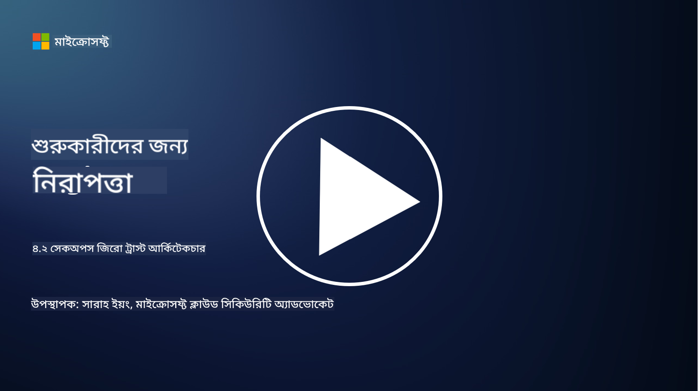

<!--
CO_OP_TRANSLATOR_METADATA:
{
  "original_hash": "45bbdc114e70936816b0b3e7c40189cf",
  "translation_date": "2025-09-03T21:18:21+00:00",
  "source_file": "4.2 SecOps zero trust architecture.md",
  "language_code": "bn"
}
-->
# SecOps জিরো ট্রাস্ট আর্কিটেকচার

সিকিউরিটি অপারেশনস জিরো ট্রাস্ট আর্কিটেকচারের দুটি অংশ গঠন করে এবং এই পাঠে আমরা উভয় সম্পর্কে শিখব:

- আইটি আর্কিটেকচার কীভাবে তৈরি করা উচিত যাতে কেন্দ্রীয় লগ সংগ্রহ সম্ভব হয়?

- আধুনিক আইটি পরিবেশে সিকিউরিটি অপারেশনের সেরা পদ্ধতিগুলি কী?

## আইটি আর্কিটেকচার কীভাবে তৈরি করা উচিত যাতে কেন্দ্রীয় লগ সংগ্রহ সম্ভব হয়?

কেন্দ্রীয় লগ সংগ্রহ আধুনিক সিকিউরিটি অপারেশনের একটি গুরুত্বপূর্ণ উপাদান। এটি সংস্থাগুলিকে বিভিন্ন উৎস থেকে লগ এবং ডেটা সংগ্রহ করতে দেয়, যেমন সার্ভার, অ্যাপ্লিকেশন, নেটওয়ার্ক ডিভাইস এবং সিকিউরিটি টুল, একটি কেন্দ্রীয় সংগ্রহস্থলে বিশ্লেষণ, পর্যবেক্ষণ এবং ঘটনাগুলির প্রতিক্রিয়ার জন্য। কেন্দ্রীয় লগ সংগ্রহকে সমর্থন করার জন্য আইটি আর্কিটেকচার তৈরি করার কিছু সেরা পদ্ধতি এখানে দেওয়া হলো:

1. **লগ সোর্স ইন্টিগ্রেশন**:

- নিশ্চিত করুন যে সমস্ত প্রাসঙ্গিক ডিভাইস এবং সিস্টেম লগ তৈরি করতে কনফিগার করা হয়েছে। এর মধ্যে রয়েছে সার্ভার, ফায়ারওয়াল, রাউটার, সুইচ, অ্যাপ্লিকেশন এবং সিকিউরিটি অ্যাপ্লায়েন্স।

- লগ সোর্সগুলোকে কেন্দ্রীয় লগ সংগ্রাহক বা ম্যানেজমেন্ট সিস্টেমে লগ ফরওয়ার্ড করতে কনফিগার করুন।

2. **উপযুক্ত SIEM (Security Information and Event Management) টুল নির্বাচন করুন**:

- এমন একটি SIEM (Security Information and Event Management) সমাধান নির্বাচন করুন যা আপনার সংস্থার প্রয়োজন এবং স্কেলের সাথে সামঞ্জস্যপূর্ণ।

- নিশ্চিত করুন যে নির্বাচিত সমাধান লগ সংগ্রহ, একত্রিতকরণ, বিশ্লেষণ এবং রিপোর্টিং সমর্থন করে।

3. **স্কেলেবিলিটি এবং রিডান্ডেন্সি**:

- লগ সোর্সের সংখ্যা এবং লগ ভলিউম বৃদ্ধির জন্য স্কেলেবিলিটি নিশ্চিত করে আর্কিটেকচার ডিজাইন করুন।

- হার্ডওয়্যার বা নেটওয়ার্ক ব্যর্থতার কারণে ব্যাঘাত এড়াতে উচ্চ প্রাপ্যতার জন্য রিডান্ডেন্সি বাস্তবায়ন করুন।

4. **লগ নিরাপদে পরিবহন করুন**:

- লগ সোর্স থেকে কেন্দ্রীয় সংগ্রহস্থলে পরিবহনের জন্য TLS/SSL বা IPsec-এর মতো নিরাপদ প্রোটোকল ব্যবহার করুন।

- শুধুমাত্র অনুমোদিত ডিভাইসগুলিকে লগ পাঠানোর অনুমতি দিতে প্রমাণীকরণ এবং অ্যাক্সেস নিয়ন্ত্রণ বাস্তবায়ন করুন।

5. **নরমালাইজেশন**:

- লগ ফরম্যাটগুলোকে মানসম্মত করুন এবং ডেটা নরমালাইজ করুন যাতে বিশ্লেষণ সহজ হয়।

6. **স্টোরেজ এবং রিটেনশন**:

- সম্মতি এবং সিকিউরিটি প্রয়োজনীয়তার উপর ভিত্তি করে লগের জন্য উপযুক্ত রিটেনশন সময় নির্ধারণ করুন।

- লগগুলোকে নিরাপদে সংরক্ষণ করুন, যাতে অননুমোদিত অ্যাক্সেস এবং পরিবর্তন থেকে সুরক্ষিত থাকে।

## আধুনিক আইটি পরিবেশে সিকিউরিটি অপারেশনের সেরা পদ্ধতিগুলি কী?

কেন্দ্রীয় লগ সংগ্রহের পাশাপাশি, আধুনিক আইটি পরিবেশে সিকিউরিটি অপারেশনের জন্য কিছু সেরা পদ্ধতি এখানে দেওয়া হলো:

1. **নিরবিচ্ছিন্ন পর্যবেক্ষণ**: নেটওয়ার্ক এবং সিস্টেম কার্যক্রমের নিরবিচ্ছিন্ন পর্যবেক্ষণ বাস্তবায়ন করুন যাতে রিয়েল-টাইমে হুমকি সনাক্ত এবং প্রতিক্রিয়া জানানো যায়।

2. **থ্রেট ইন্টেলিজেন্স**: উদীয়মান হুমকি এবং দুর্বলতার বিষয়ে অবগত থাকতে থ্রেট ইন্টেলিজেন্স ফিড এবং পরিষেবাগুলি ব্যবহার করুন।

3. **ব্যবহারকারীর প্রশিক্ষণ**: কর্মচারীদের জন্য নিয়মিত সিকিউরিটি সচেতনতা প্রশিক্ষণ পরিচালনা করুন যাতে সোশ্যাল ইঞ্জিনিয়ারিং এবং ফিশিং আক্রমণের ঝুঁকি কমানো যায়।

4. **ইনসিডেন্ট রেসপন্স প্ল্যান**: একটি ইনসিডেন্ট রেসপন্স প্ল্যান তৈরি এবং পরীক্ষা করুন যাতে সিকিউরিটি ঘটনার জন্য দ্রুত এবং কার্যকর প্রতিক্রিয়া নিশ্চিত করা যায়।

5. **সিকিউরিটি অটোমেশন**: ইনসিডেন্ট রেসপন্স এবং পুনরাবৃত্তিমূলক কাজগুলোকে সহজতর করতে সিকিউরিটি অটোমেশন এবং অর্কেস্ট্রেশন টুল ব্যবহার করুন।

6. **ব্যাকআপ এবং পুনরুদ্ধার**: ডেটা ক্ষতি বা র‍্যানসমওয়্যার আক্রমণের ক্ষেত্রে ডেটার প্রাপ্যতা নিশ্চিত করতে শক্তিশালী ব্যাকআপ এবং দুর্যোগ পুনরুদ্ধার সমাধান বাস্তবায়ন করুন।

## আরও পড়ুন

- [Microsoft Security Best Practices module: Security operations | Microsoft Learn](https://learn.microsoft.com/security/operations/security-operations-videos-and-decks?WT.mc_id=academic-96948-sayoung)
- [Security operations - Cloud Adoption Framework | Microsoft Learn](https://learn.microsoft.com/azure/cloud-adoption-framework/secure/security-operations?WT.mc_id=academic-96948-sayoung)
- [What is Security Operations and Analytics Platform Architecture? A Definition of SOAPA, How It Works, Benefits, and More (digitalguardian.com)](https://www.digitalguardian.com/blog/what-security-operations-and-analytics-platform-architecture-definition-soapa-how-it-works#:~:text=All%20in%20all%2C%20security%20operations%20and%20analytics%20platform,become%20more%20efficient%20and%20operative%20with%20your%20security.)

---

**অস্বীকৃতি**:  
এই নথিটি AI অনুবাদ পরিষেবা [Co-op Translator](https://github.com/Azure/co-op-translator) ব্যবহার করে অনুবাদ করা হয়েছে। আমরা যথাসম্ভব সঠিক অনুবাদ প্রদানের চেষ্টা করি, তবে অনুগ্রহ করে মনে রাখবেন যে স্বয়ংক্রিয় অনুবাদে ত্রুটি বা অসঙ্গতি থাকতে পারে। মূল ভাষায় থাকা নথিটিকে প্রামাণিক উৎস হিসেবে বিবেচনা করা উচিত। গুরুত্বপূর্ণ তথ্যের জন্য, পেশাদার মানব অনুবাদ সুপারিশ করা হয়। এই অনুবাদ ব্যবহারের ফলে কোনো ভুল বোঝাবুঝি বা ভুল ব্যাখ্যা হলে আমরা দায়বদ্ধ থাকব না।