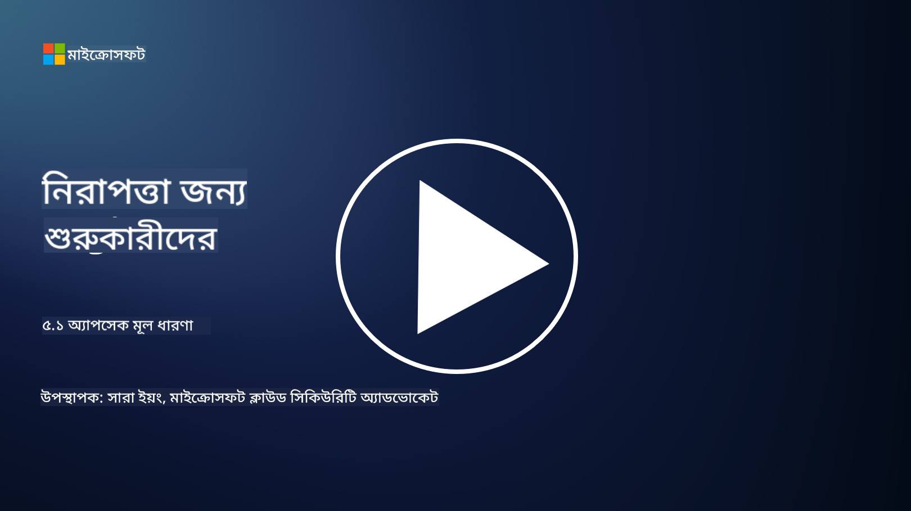

<!--
CO_OP_TRANSLATOR_METADATA:
{
  "original_hash": "e4b56bb23078d3ffb7ad407d280b0c36",
  "translation_date": "2025-09-03T21:08:00+00:00",
  "source_file": "5.1 AppSec key concepts.md",
  "language_code": "bn"
}
-->
# AppSec মূল ধারণা

অ্যাপ্লিকেশন সিকিউরিটি নিজেই একটি বিশেষায়িত নিরাপত্তা ক্ষেত্র। এই কোর্সের এই অংশে আমরা অ্যাপ্লিকেশন সিকিউরিটি সম্পর্কে আরও গভীরভাবে আলোচনা করব।

## পরিচিতি

এই পাঠে আমরা আলোচনা করব:

- অ্যাপ্লিকেশন সিকিউরিটি কী?

- অ্যাপ্লিকেশন সিকিউরিটির মূল ধারণা/নীতিগুলি কী কী?

## অ্যাপ্লিকেশন সিকিউরিটি কী?

অ্যাপ্লিকেশন সিকিউরিটি, সংক্ষেপে "AppSec," বলতে সফটওয়্যার অ্যাপ্লিকেশনকে নিরাপত্তা হুমকি, দুর্বলতা এবং আক্রমণ থেকে সুরক্ষিত রাখার প্রক্রিয়া বোঝায়। এটি এমন প্রক্রিয়া, কৌশল এবং সরঞ্জামগুলিকে অন্তর্ভুক্ত করে যা অ্যাপ্লিকেশনের উন্নয়ন, স্থাপন এবং রক্ষণাবেক্ষণের পুরো জীবনচক্র জুড়ে নিরাপত্তা ঝুঁকি চিহ্নিত, হ্রাস এবং প্রতিরোধ করতে ব্যবহৃত হয়।

অ্যাপ্লিকেশন সিকিউরিটি গুরুত্বপূর্ণ কারণ অ্যাপ্লিকেশনগুলি সাইবার আক্রমণের সাধারণ লক্ষ্য। ক্ষতিকারক ব্যক্তি সফটওয়্যারের দুর্বলতা এবং ত্রুটি কাজে লাগিয়ে অননুমোদিত প্রবেশ, ডেটা চুরি, পরিষেবা ব্যাহত করা বা অন্যান্য ক্ষতিকারক কার্যক্রম সম্পাদন করে। কার্যকর অ্যাপ্লিকেশন সিকিউরিটি অ্যাপ্লিকেশন এবং এর সাথে সম্পর্কিত ডেটার গোপনীয়তা, অখণ্ডতা এবং প্রাপ্যতা নিশ্চিত করতে সাহায্য করে।

## অ্যাপ্লিকেশন সিকিউরিটির মূল ধারণা/নীতিগুলি কী কী?

অ্যাপ্লিকেশন সিকিউরিটির ভিত্তি গঠনকারী মূল ধারণা এবং নীতিগুলি হল:

1. **ডিজাইনে সুরক্ষা**:

- অ্যাপ্লিকেশনের ডিজাইন এবং স্থাপত্যে শুরু থেকেই সুরক্ষা অন্তর্ভুক্ত করা উচিত, পরে যোগ করার পরিবর্তে।

2. **ইনপুট যাচাইকরণ**:

- সমস্ত ব্যবহারকারীর ইনপুট যাচাই করা উচিত যাতে তা প্রত্যাশিত ফরম্যাটে থাকে এবং ক্ষতিকারক কোড বা ডেটা মুক্ত থাকে।

3. **আউটপুট এনকোডিং**:

- ক্লায়েন্টে পাঠানো ডেটা সঠিকভাবে এনকোড করা উচিত যাতে ক্রস-সাইট স্ক্রিপ্টিং (XSS) এর মতো দুর্বলতা প্রতিরোধ করা যায়।

4. **প্রমাণীকরণ এবং অনুমোদন**:

- ব্যবহারকারীদের প্রমাণীকরণ করুন এবং তাদের ভূমিকা ও অনুমতির ভিত্তিতে সম্পদের অ্যাক্সেস অনুমোদন করুন।

5. **ডেটা সুরক্ষা**:

- সংবেদনশীল ডেটা সংরক্ষণ, প্রেরণ এবং প্রক্রিয়াকরণের সময় এনক্রিপ্ট করা উচিত যাতে অননুমোদিত প্রবেশ প্রতিরোধ করা যায়।

6. **সেশন ব্যবস্থাপনা**:

- সুরক্ষিত সেশন ব্যবস্থাপনা ব্যবহারকারীর সেশনকে হাইজ্যাকিং এবং অননুমোদিত প্রবেশ থেকে রক্ষা করে।

7. **নিরাপদ নির্ভরতা**:

- সফটওয়্যারের সমস্ত নির্ভরতা নিরাপত্তা প্যাচ সহ আপডেট রাখুন যাতে দুর্বলতা প্রতিরোধ করা যায়।

8. **ত্রুটি পরিচালনা এবং লগিং**:

- সংবেদনশীল তথ্য প্রকাশ না করে সুরক্ষিত ত্রুটি পরিচালনা বাস্তবায়ন করুন এবং সুরক্ষিত লগিং অনুশীলন নিশ্চিত করুন।

9. **নিরাপত্তা পরীক্ষা**:

- পেনিট্রেশন টেস্টিং, কোড রিভিউ এবং স্বয়ংক্রিয় স্ক্যানিং টুলের মতো পদ্ধতি ব্যবহার করে নিয়মিত অ্যাপ্লিকেশনগুলির দুর্বলতা পরীক্ষা করুন।

10. **নিরাপদ সফটওয়্যার উন্নয়ন জীবনচক্র (SDLC)**:

- সফটওয়্যার উন্নয়নের জীবনচক্রের প্রতিটি ধাপে, প্রয়োজনীয়তা থেকে স্থাপন এবং রক্ষণাবেক্ষণ পর্যন্ত, নিরাপত্তা অনুশীলন অন্তর্ভুক্ত করুন।

## আরও পড়ুন

- [SheHacksPurple: What is Application Security? - YouTube](https://www.youtube.com/watch?v=eNmccQNzSSY)
- [What Is Application Security? - Cisco](https://www.cisco.com/c/en/us/solutions/security/application-first-security/what-is-application-security.html#~how-does-it-work)
- [What is application security? A process and tools for securing software | CSO Online](https://www.csoonline.com/article/566471/what-is-application-security-a-process-and-tools-for-securing-software.html)
- [OWASP Cheat Sheet Series | OWASP Foundation](https://owasp.org/www-project-cheat-sheets/)

---

**অস্বীকৃতি**:  
এই নথিটি AI অনুবাদ পরিষেবা [Co-op Translator](https://github.com/Azure/co-op-translator) ব্যবহার করে অনুবাদ করা হয়েছে। আমরা যথাসম্ভব সঠিক অনুবাদ প্রদানের চেষ্টা করি, তবে অনুগ্রহ করে মনে রাখবেন যে স্বয়ংক্রিয় অনুবাদে ত্রুটি বা অসঙ্গতি থাকতে পারে। মূল ভাষায় থাকা নথিটিকে প্রামাণিক উৎস হিসেবে বিবেচনা করা উচিত। গুরুত্বপূর্ণ তথ্যের জন্য, পেশাদার মানব অনুবাদ সুপারিশ করা হয়। এই অনুবাদ ব্যবহারের ফলে কোনো ভুল বোঝাবুঝি বা ভুল ব্যাখ্যা হলে আমরা দায়বদ্ধ থাকব না।