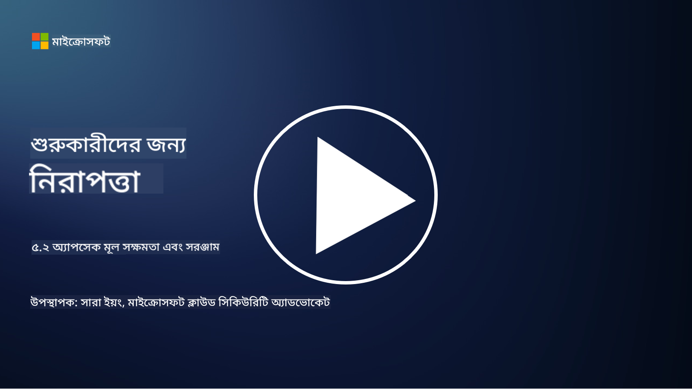

<!--
CO_OP_TRANSLATOR_METADATA:
{
  "original_hash": "790a3fa7e535ec60bb51bde13e759781",
  "translation_date": "2025-09-03T21:22:37+00:00",
  "source_file": "5.2 AppSec key capabilities.md",
  "language_code": "bn"
}
-->
## পরিচিতি

এই অংশে আমরা অ্যাপ্লিকেশন সিকিউরিটির মূল ক্ষমতা এবং টুলগুলোর বিস্তারিত আলোচনা করব।

## অ্যাপসেকের মূল ক্ষমতা এবং টুল

অ্যাপ্লিকেশন সিকিউরিটির জন্য ব্যবহৃত মূল ক্ষমতা এবং টুলগুলো সফটওয়্যার অ্যাপ্লিকেশনে নিরাপত্তা দুর্বলতা এবং হুমকি শনাক্ত, প্রতিরোধ এবং মোকাবেলা করার জন্য অত্যন্ত গুরুত্বপূর্ণ। নিচে কিছু গুরুত্বপূর্ণ ক্ষমতা এবং টুলের তালিকা দেওয়া হলো:

**1. স্ট্যাটিক অ্যাপ্লিকেশন সিকিউরিটি টেস্টিং (SAST)**:

- **ক্ষমতা**: সোর্স কোড, বাইটকোড বা বাইনারি কোড বিশ্লেষণ করে অ্যাপ্লিকেশনের কোডবেসে নিরাপত্তা দুর্বলতা শনাক্ত করে।

- **টুল**: উদাহরণস্বরূপ Fortify, Checkmarx, এবং Veracode।

**2. ডায়নামিক অ্যাপ্লিকেশন সিকিউরিটি টেস্টিং (DAST)**:

- **ক্ষমতা**: চলমান অ্যাপ্লিকেশন স্ক্যান করে ইনপুট অনুরোধ পাঠিয়ে এবং প্রতিক্রিয়া বিশ্লেষণ করে দুর্বলতা শনাক্ত করে।

- **টুল**: উদাহরণস্বরূপ ZAP, Burp Suite, এবং Qualys Web Application Scanning।

**3. ইন্টারঅ্যাকটিভ অ্যাপ্লিকেশন সিকিউরিটি টেস্টিং (IAST)**:

- **ক্ষমতা**: SAST এবং DAST এর উপাদানগুলো একত্রিত করে রানটাইমে কোড বিশ্লেষণ করে, আরও সঠিক ফলাফল প্রদান করে এবং ভুল পজিটিভ কমায়।

- **টুল**: উদাহরণস্বরূপ Contrast Security এবং HCL AppScan।

**4. রানটাইম অ্যাপ্লিকেশন সেলফ-প্রোটেকশন (RASP)**:

- **ক্ষমতা**: রিয়েল-টাইমে অ্যাপ্লিকেশন পর্যবেক্ষণ এবং সুরক্ষা প্রদান করে, নিরাপত্তা হুমকি শনাক্ত এবং প্রতিক্রিয়া জানায়।

- **টুল**: উদাহরণস্বরূপ Veracode Runtime Protection এবং F5 Advanced WAF with RASP।

**5. ওয়েব অ্যাপ্লিকেশন ফায়ারওয়াল (WAFs)**:

- **ক্ষমতা**: অ্যাপ্লিকেশন এবং ইন্টারনেটের মধ্যে একটি সুরক্ষিত স্তর প্রদান করে, ইনকামিং ট্রাফিক ফিল্টার করে এবং ক্ষতিকারক অনুরোধ ব্লক করে।

- **টুল**: উদাহরণস্বরূপ ModSecurity, AWS WAF, এবং Akamai Kona Site Defender।

**6. ডিপেনডেন্সি স্ক্যানিং**:

- **ক্ষমতা**: অ্যাপ্লিকেশনে ব্যবহৃত তৃতীয় পক্ষের লাইব্রেরি এবং উপাদানগুলোর দুর্বলতা শনাক্ত করে।

- **টুল**: উদাহরণস্বরূপ OWASP Dependency-Check এবং Snyk।

**7. পেনিট্রেশন টেস্টিং (Pen Testing)**:

- **ক্ষমতা**: বাস্তব-জগতের আক্রমণ অনুকরণ করে দুর্বলতা শনাক্ত এবং অ্যাপ্লিকেশনের নিরাপত্তা মূল্যায়ন করে।

- **টুল**: সার্টিফাইড এথিক্যাল হ্যাকার এবং নিরাপত্তা পেশাদারদের দ্বারা বিভিন্ন টুল ব্যবহার করে পরিচালিত হয়, যেমন Metasploit এবং Nmap।

**8. সিকিউরিটি স্ক্যানিং এবং বিশ্লেষণ**:

- **ক্ষমতা**: পরিচিত দুর্বলতা, কনফিগারেশন ত্রুটি এবং নিরাপত্তা মিসকনফিগারেশন স্ক্যান করে।

- **টুল**: উদাহরণস্বরূপ Nessus, Qualys Vulnerability Management, এবং OpenVAS।

**9. কন্টেইনার সিকিউরিটি টুল**:

- **ক্ষমতা**: কন্টেইনারাইজড অ্যাপ্লিকেশন এবং তাদের পরিবেশ সুরক্ষিত করার উপর ফোকাস করে।

- **টুল**: উদাহরণস্বরূপ Docker Security Scanning এবং Aqua Security।

**10. সুরক্ষিত ডেভেলপমেন্ট প্রশিক্ষণ**:

- **ক্ষমতা**: ডেভেলপমেন্ট টিমের জন্য সুরক্ষিত কোডিং অনুশীলন প্রচারের জন্য প্রশিক্ষণ এবং সচেতনতা প্রোগ্রাম প্রদান করে।

- **টুল**: কাস্টমাইজড প্রশিক্ষণ প্রোগ্রাম এবং প্ল্যাটফর্ম।

**11. সিকিউরিটি টেস্টিং ফ্রেমওয়ার্ক**:

- **ক্ষমতা**: বিভিন্ন অ্যাপ্লিকেশন সিকিউরিটি টেস্টিং প্রয়োজনের জন্য ব্যাপক টেস্টিং ফ্রেমওয়ার্ক প্রদান করে।

- **টুল**: OWASP Amass, OWASP OWTF এবং FrAppSec।

**12. সুরক্ষিত কোড রিভিউ টুল**:

- **ক্ষমতা**: সোর্স কোড পর্যালোচনা করে নিরাপত্তা দুর্বলতা এবং কোডিং সেরা অনুশীলন নিশ্চিত করে।

- **টুল**: উদাহরণস্বরূপ SonarQube এবং Checkmarx।

**13. সুরক্ষিত API এবং মাইক্রোসার্ভিস টুল**:

- **ক্ষমতা**: API এবং মাইক্রোসার্ভিস সুরক্ষিত করার উপর ফোকাস করে, যার মধ্যে রয়েছে প্রমাণীকরণ, অনুমোদন এবং ডেটা সুরক্ষা।

- **টুল**: উদাহরণস্বরূপ Apigee, AWS API Gateway, এবং Istio।

## আরও পড়ুন

- [What Is Application Security? Concepts, Tools & Best Practices | HackerOne](https://www.hackerone.com/knowledge-center/what-application-security-concepts-tools-best-practices)
- [What is IAST? (Interactive Application Security Testing) (comparitech.com)](https://www.comparitech.com/net-admin/what-is-iast/)
- [10 Types of Application Security Testing Tools: When and How to Use Them (cmu.edu)](https://insights.sei.cmu.edu/blog/10-types-of-application-security-testing-tools-when-and-how-to-use-them/)
- [Shifting the Balance of Cybersecurity Risk: Principles and Approaches for Security-by-Design and Default | Cyber.gov.au](https://www.cyber.gov.au/about-us/view-all-content/publications/principles-and-approaches-for-security-by-design-and-default)

---

**অস্বীকৃতি**:  
এই নথিটি AI অনুবাদ পরিষেবা [Co-op Translator](https://github.com/Azure/co-op-translator) ব্যবহার করে অনুবাদ করা হয়েছে। আমরা যথাসম্ভব সঠিক অনুবাদ প্রদানের চেষ্টা করি, তবে অনুগ্রহ করে মনে রাখবেন যে স্বয়ংক্রিয় অনুবাদে ত্রুটি বা অসঙ্গতি থাকতে পারে। মূল ভাষায় থাকা নথিটিকে প্রামাণিক উৎস হিসেবে বিবেচনা করা উচিত। গুরুত্বপূর্ণ তথ্যের জন্য, পেশাদার মানব অনুবাদ সুপারিশ করা হয়। এই অনুবাদ ব্যবহারের ফলে কোনো ভুল বোঝাবুঝি বা ভুল ব্যাখ্যা হলে আমরা তার জন্য দায়বদ্ধ থাকব না।