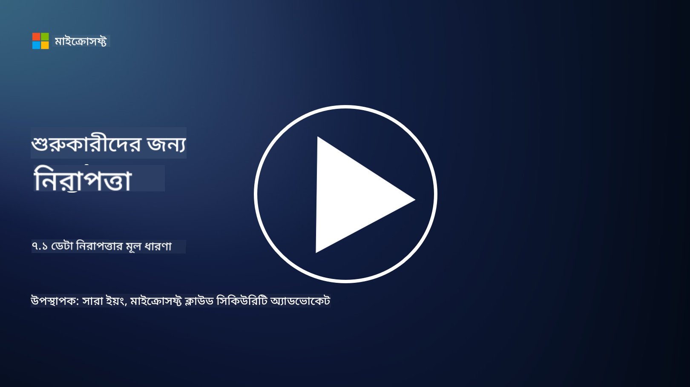

<!--
CO_OP_TRANSLATOR_METADATA:
{
  "original_hash": "9703868f41dcddd5a98dea9ea6fcd94d",
  "translation_date": "2025-09-03T20:37:22+00:00",
  "source_file": "7.1 Data security key concepts.md",
  "language_code": "bn"
}
-->
# ডেটা সুরক্ষার মূল ধারণা

আমরা এই কোর্সে ডেটা সুরক্ষার কথা উল্লেখ করেছি এবং এটি নিয়ে একাধিকবার আলোচনা করেছি। এখন, চলুন এই বিষয়ের গভীরে যাই। এই পাঠে আপনি শিখবেন:

- ডেটা সুরক্ষা কী?

- ডেটা শ্রেণীবিন্যাস কী?

- ডেটা লাইফসাইকেল ম্যানেজমেন্ট কী?

- ডেটা লস প্রিভেনশন (DLP) কী?

- কেন একটি প্রতিষ্ঠানের জন্য ডেটা সুরক্ষা গুরুত্বপূর্ণ?

## ডেটা সুরক্ষা কী?

**ডেটা সুরক্ষা** বলতে ডিজিটাল ডেটা যেমন ডেটাবেস, ফাইল এবং সংবেদনশীল তথ্যকে অননুমোদিত প্রবেশ, প্রকাশ, পরিবর্তন বা ধ্বংস থেকে রক্ষা করার প্রক্রিয়াকে বোঝায়। ডেটা সুরক্ষার প্রধান লক্ষ্য হলো ডেটার গোপনীয়তা, অখণ্ডতা এবং প্রাপ্যতা নিশ্চিত করা। এটি বিভিন্ন প্রযুক্তিগত, প্রশাসনিক এবং শারীরিক সুরক্ষা ব্যবস্থা প্রয়োগের মাধ্যমে ডেটাকে সাইবার আক্রমণ, অভ্যন্তরীণ হুমকি এবং ডেটা লঙ্ঘনের মতো বিভিন্ন ঝুঁকি ও দুর্বলতা থেকে রক্ষা করে। ডেটা সুরক্ষার ব্যবস্থাগুলোর মধ্যে এনক্রিপশন, অ্যাক্সেস নিয়ন্ত্রণ, প্রমাণীকরণ, অডিট ট্রেইল এবং সুরক্ষা নীতিমালা অন্তর্ভুক্ত থাকতে পারে।

## ডেটা শ্রেণীবিন্যাস কী?

**ডেটা শ্রেণীবিন্যাস** হলো ডেটাকে তার সংবেদনশীলতা, মূল্য এবং প্রতিষ্ঠানের জন্য গুরুত্বের ভিত্তিতে শ্রেণীবদ্ধ করার প্রক্রিয়া। ডেটা শ্রেণীবিন্যাসের উদ্দেশ্য হলো বিভিন্ন ধরনের ডেটার সুরক্ষা এবং পরিচালনার অগ্রাধিকার নির্ধারণে প্রতিষ্ঠানগুলোকে সহায়তা করা। সাধারণ ডেটা শ্রেণীবিন্যাসের বিভাগগুলোর মধ্যে "পাবলিক," "ইন্টারনাল," "কনফিডেনশিয়াল," এবং "রেস্ট্রিকটেড" বা "হাইলি কনফিডেনশিয়াল" অন্তর্ভুক্ত। একবার ডেটা শ্রেণীবদ্ধ করা হলে, প্রতিষ্ঠানগুলো উপযুক্ত সুরক্ষা নিয়ন্ত্রণ এবং অ্যাক্সেস সীমাবদ্ধতা প্রয়োগ করতে পারে যাতে সংবেদনশীল ডেটা যথাযথভাবে সুরক্ষিত থাকে এবং নিয়মতান্ত্রিক চাহিদা পূরণ হয়।

## ডেটা লাইফসাইকেল ম্যানেজমেন্ট কী?

**ডেটা লাইফসাইকেল ম্যানেজমেন্ট** হলো ডেটার পুরো জীবনচক্র জুড়ে এটি পরিচালনার জন্য একটি কাঠামোবদ্ধ পদ্ধতি, যা তৈরি বা অধিগ্রহণ থেকে শুরু করে আর্কাইভ বা মুছে ফেলা পর্যন্ত বিস্তৃত। ডেটার জীবনচক্র সাধারণত তৈরি, সংরক্ষণ, প্রক্রিয়াকরণ, প্রেরণ, আর্কাইভ এবং নিষ্পত্তি পর্যায়গুলো নিয়ে গঠিত। ডেটা লাইফসাইকেল ম্যানেজমেন্টের মধ্যে প্রতিটি পর্যায়ের জন্য নীতিমালা এবং পদ্ধতি সংজ্ঞায়িত করা অন্তর্ভুক্ত, যেমন ডেটা সংরক্ষণ, অ্যাক্সেস নিয়ন্ত্রণ, ব্যাকআপ এবং ডেটা পরিশোধন। কার্যকর ডেটা লাইফসাইকেল ম্যানেজমেন্ট প্রতিষ্ঠানগুলোকে ডেটা সংরক্ষণ অপ্টিমাইজ করতে, ডেটার গুণমান উন্নত করতে এবং ডেটা সুরক্ষা সংক্রান্ত নিয়মকানুন মেনে চলতে সহায়তা করে।

## ডেটা লস প্রিভেনশন (DLP) কী?

**ডেটা লস প্রিভেনশন (DLP)** হলো একটি প্রযুক্তি, নীতিমালা এবং পদ্ধতির সেট যা সংবেদনশীল বা গোপনীয় ডেটার অননুমোদিত প্রবেশ, শেয়ারিং বা ফাঁস প্রতিরোধ করার জন্য ডিজাইন করা হয়েছে। DLP সমাধানগুলো কন্টেন্ট পরিদর্শন এবং প্রাসঙ্গিক বিশ্লেষণের মাধ্যমে চলমান ডেটা (যেমন ইমেইল, ওয়েব ট্রাফিক), স্থির ডেটা (যেমন সংরক্ষিত ফাইল এবং ডেটাবেস), এবং ব্যবহৃত ডেটা (যেমন ব্যবহারকারীদের দ্বারা অ্যাক্সেস বা প্রক্রিয়াকৃত ডেটা) পর্যবেক্ষণ এবং নিয়ন্ত্রণ করে। DLP-এর লক্ষ্য হলো সংবেদনশীল ডেটা সনাক্ত করা এবং এটি ব্লক বা এনক্রিপ্ট করা যাতে ডেটা লঙ্ঘন প্রতিরোধ করা যায়, ডেটা সুরক্ষা সংক্রান্ত নিয়মকানুন মেনে চলা যায় এবং একটি প্রতিষ্ঠানের সুনাম রক্ষা করা যায়।

## কেন একটি প্রতিষ্ঠানের জন্য ডেটা সুরক্ষা গুরুত্বপূর্ণ?

ডেটা সুরক্ষা প্রতিষ্ঠানের জন্য বিভিন্ন কারণে অত্যন্ত গুরুত্বপূর্ণ:

- **সংবেদনশীল তথ্যের সুরক্ষা**: প্রতিষ্ঠানগুলো প্রায়ই গ্রাহকের রেকর্ড, মেধাস্বত্ব, আর্থিক তথ্য এবং কর্মচারীদের তথ্যের মতো সংবেদনশীল ডেটা সংরক্ষণ করে। ডেটা সুরক্ষা এই সংবেদনশীল তথ্যকে অননুমোদিত প্রবেশ বা চুরির হাত থেকে রক্ষা করে।

- **নিয়ম মেনে চলা**: অনেক শিল্প এবং অঞ্চলে কঠোর ডেটা সুরক্ষা এবং গোপনীয়তা সম্পর্কিত নিয়মকানুন রয়েছে। ডেটা সুরক্ষা প্রতিষ্ঠানগুলোকে এই আইনগুলো মেনে চলতে সহায়তা করে, আইনি জরিমানা এবং সুনামের ক্ষতি এড়ায়।

- **ডেটা লঙ্ঘন প্রতিরোধ**: ডেটা লঙ্ঘনের ফলে আর্থিক ক্ষতি, সুনামের ক্ষতি এবং আইনি পরিণতি হতে পারে। কার্যকর ডেটা সুরক্ষা ব্যবস্থা ডেটা লঙ্ঘন প্রতিরোধ করতে বা এর প্রভাব সীমিত করতে সহায়তা করে।

- **বিশ্বাস সংরক্ষণ**: গ্রাহক এবং স্টেকহোল্ডাররা তাদের ডেটা প্রতিষ্ঠানের কাছে বিশ্বাস করে। ডেটা সুরক্ষার লঙ্ঘন এই বিশ্বাসকে ক্ষুণ্ন করে। শক্তিশালী ডেটা সুরক্ষা বজায় রাখা বিশ্বাস এবং গ্রাহকের আস্থা সংরক্ষণে সহায়তা করে।

- **প্রতিযোগিতামূলক সুবিধা**: ডেটা সুরক্ষার প্রতি প্রতিশ্রুতি প্রদর্শন করা একটি প্রতিযোগিতামূলক সুবিধা হতে পারে। গ্রাহক এবং অংশীদাররা এমন প্রতিষ্ঠানের সাথে কাজ করতে বেশি আগ্রহী যারা ডেটা সুরক্ষাকে গুরুত্ব দেয়।

- **অপারেশনাল ধারাবাহিকতা**: ডেটা সুরক্ষা ব্যবস্থা, যার মধ্যে ডেটা ব্যাকআপ এবং দুর্যোগ পুনরুদ্ধার পরিকল্পনা অন্তর্ভুক্ত, ডেটার প্রাপ্যতা এবং ডেটা ক্ষতি বা দুর্যোগের ক্ষেত্রে ব্যবসার ধারাবাহিকতা নিশ্চিত করতে সহায়তা করে।

- **অভ্যন্তরীণ হুমকি থেকে সুরক্ষা**: ডেটা সুরক্ষা ব্যবস্থা প্রতিষ্ঠানের অভ্যন্তরীণ হুমকি, যেমন কর্মচারীদের দ্বারা দুর্ঘটনাজনিত ডেটা প্রকাশ এবং অভ্যন্তরীণদের দ্বারা ক্ষতিকারক কার্যকলাপ, মোকাবিলা করে।

সারসংক্ষেপে, ডেটা সুরক্ষা সংবেদনশীল তথ্য রক্ষা, নিয়ম মেনে চলা, ডেটা লঙ্ঘন প্রতিরোধ, বিশ্বাস সংরক্ষণ এবং একটি প্রতিষ্ঠানের ধারাবাহিক সাফল্য ও সুনাম নিশ্চিত করার জন্য অপরিহার্য।

## আরও পড়ুন

- [What Is Data Security? | Microsoft Security](https://www.microsoft.com/en-au/security/business/security-101/what-is-data-security?WT.mc_id=academic-96948-sayoung)  
- [Automatically Classify & Protect Documents & Data | Microsoft Purview Information Protection](https://youtu.be/v8LqmzBUaOo)  
- [Example data classification policy](https://www.cmu.edu/data/guidelines/data-classification.html)  
- [What is Data Security? Data Security Definition and Overview | IBM](https://www.ibm.com/topics/data-security)  
- [Data Lifecycle Management: A 2023 Guide for Your Business (cloudwards.net)](https://www.cloudwards.net/data-lifecycle-management/)  
- [What is data loss prevention (DLP)? | Microsoft Security](https://www.microsoft.com/security/business/security-101/what-is-data-loss-prevention-dlp?WT.mc_id=academic-96948-sayoung)  
- [What is DLP? How data loss prevention software works and why you need it | CSO Online](https://www.csoonline.com/article/569559/what-is-dlp-how-data-loss-prevention-software-works-and-why-you-need-it.html)  

---

**অস্বীকৃতি**:  
এই নথিটি AI অনুবাদ পরিষেবা [Co-op Translator](https://github.com/Azure/co-op-translator) ব্যবহার করে অনুবাদ করা হয়েছে। আমরা যথাসম্ভব সঠিকতার জন্য চেষ্টা করি, তবে অনুগ্রহ করে মনে রাখবেন যে স্বয়ংক্রিয় অনুবাদে ত্রুটি বা অসঙ্গতি থাকতে পারে। মূল ভাষায় থাকা নথিটিকে প্রামাণিক উৎস হিসেবে বিবেচনা করা উচিত। গুরুত্বপূর্ণ তথ্যের জন্য, পেশাদার মানব অনুবাদ সুপারিশ করা হয়। এই অনুবাদ ব্যবহারের ফলে কোনো ভুল বোঝাবুঝি বা ভুল ব্যাখ্যা হলে আমরা দায়বদ্ধ থাকব না।