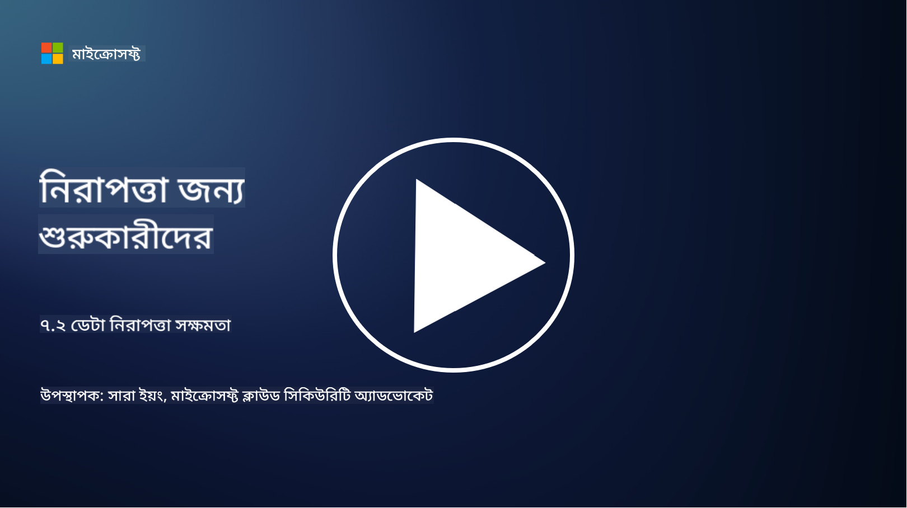

<!--
CO_OP_TRANSLATOR_METADATA:
{
  "original_hash": "50697add9758e54693442d502d2d5f8a",
  "translation_date": "2025-09-03T21:27:36+00:00",
  "source_file": "7.2 Data security capabilities.md",
  "language_code": "bn"
}
-->
# ডেটা সুরক্ষা সক্ষমতা

এই অংশে, আমরা ডেটা সুরক্ষার জন্য ব্যবহৃত মূল টুল এবং সক্ষমতা সম্পর্কে আরও বিস্তারিত আলোচনা করব:

**ভূমিকা**

এই পাঠে আমরা আলোচনা করব:

- ডেটা লস প্রিভেনশন টুলিং কী?

- ইনসাইডার রিস্ক ম্যানেজমেন্ট টুলিং কী?

- কোন ডেটা রিটেনশন টুলিং উপলব্ধ?

## ডেটা লস প্রিভেনশন টুলিং কী?

ডেটা লস প্রিভেনশন (DLP) টুলিং হলো সফটওয়্যার সমাধান এবং প্রযুক্তির একটি সেট যা সংস্থার সংবেদনশীল বা গোপনীয় ডেটার অননুমোদিত অ্যাক্সেস, শেয়ারিং বা লিকেজ প্রতিরোধ করার জন্য ডিজাইন করা হয়েছে। এই টুলগুলো কন্টেন্ট পরিদর্শন, নীতিমালা প্রয়োগ এবং পর্যবেক্ষণের মাধ্যমে সংবেদনশীল ডেটা সনাক্ত এবং সুরক্ষিত করতে সাহায্য করে যাতে এটি প্রকাশ বা অপব্যবহার না হয়। উদাহরণস্বরূপ DLP পণ্যগুলোর মধ্যে রয়েছে: Symantec Data Loss Prevention, McAfee Total Protection for Data Loss Prevention, Microsoft 365 DLP**: Microsoft 365 অ্যাপ্লিকেশনের সাথে ইন্টিগ্রেট করে সংস্থাগুলোকে ইমেইল, ডকুমেন্ট এবং মেসেজের মধ্যে সংবেদনশীল ডেটা সনাক্ত এবং সুরক্ষিত করতে সাহায্য করে।

## ইনসাইডার রিস্ক ম্যানেজমেন্ট টুলিং কী?

ইনসাইডার রিস্ক ম্যানেজমেন্ট টুলিং সংস্থাগুলোকে কর্মচারী, ঠিকাদার বা অংশীদারদের দ্বারা সৃষ্ট ঝুঁকি সনাক্ত এবং কমাতে সাহায্য করে, যারা ইচ্ছাকৃত বা অনিচ্ছাকৃতভাবে ডেটা সুরক্ষা ক্ষতিগ্রস্ত করতে পারে। এই টুলগুলো ব্যবহারকারীর আচরণ, অ্যাক্সেস প্যাটার্ন এবং ডেটা ব্যবহারের উপর নজর রাখে যাতে সন্দেহজনক কার্যক্রম এবং সম্ভাব্য ইনসাইডার হুমকি সনাক্ত করা যায়। উদাহরণস্বরূপ ইনসাইডার রিস্ক ম্যানেজমেন্ট পণ্যগুলোর মধ্যে রয়েছে: Microsoft Insider Risk Management (Microsoft 365 এর অংশ), Forcepoint Insider Threat Data Protection, Varonis Insider Threat Detection।

## কোন ডেটা রিটেনশন টুলিং উপলব্ধ?

ডেটা রিটেনশন টুলিং হলো সফটওয়্যার এবং সমাধান যা সংস্থার ডেটা রিটেনশন নীতিমালা এবং আইনি প্রয়োজনীয়তার সাথে সামঞ্জস্য রেখে ডেটা সংরক্ষণ এবং মুছে ফেলার ব্যবস্থাপনা করে। এই টুলগুলো নির্দিষ্ট সময়ের জন্য ডেটা সংরক্ষণ এবং এটি আর প্রয়োজন না হলে নিরাপদে মুছে ফেলার প্রক্রিয়া স্বয়ংক্রিয় করতে সাহায্য করে। উদাহরণস্বরূপ ডেটা রিটেনশন পণ্যগুলোর মধ্যে রয়েছে: Veritas Enterprise Vault, Commvault Complete Data Protection, Microsoft data lifecycle management। এই টুলিং সমাধানগুলো সংস্থাগুলোকে ডেটা সংরক্ষণ এবং নিষ্পত্তির উপর নিয়ন্ত্রণ বজায় রাখতে সাহায্য করে, ডেটা সুরক্ষা নিয়মাবলীর সাথে সামঞ্জস্য রেখে ডেটার জীবনচক্রের পুরো সময়কাল দক্ষতার সাথে পরিচালনা করে।

## আরও পড়ুন

- [Guide to Data Security Posture Management (DSPM) | CSA (cloudsecurityalliance.org)](https://cloudsecurityalliance.org/blog/2023/03/31/the-big-guide-to-data-security-posture-management-dspm/)
- [Data Loss Prevention across endpoints, apps, & services | Microsoft Purview](https://youtu.be/hvqq8L_0kgI)
- [18 Best Data Loss Prevention Software Tools 2023 (Free + Paid) (comparitech.com)](https://www.comparitech.com/data-privacy-management/data-loss-prevention-tools-software/)
- [Data Loss Prevention (nist.gov)](https://tsapps.nist.gov/publication/get_pdf.cfm?pub_id=904672)
- [Learn about insider risk management | Microsoft Learn](https://learn.microsoft.com/purview/insider-risk-management?WT.mc_id=academic-96948-sayoung)
- [Data Lifecycle Management | IBM](https://www.ibm.com/topics/data-lifecycle-management)
- [What Is Data Lifecycle Management (DLM)? | 2023 Best Practices (selecthub.com)](https://www.selecthub.com/big-data-analytics/data-lifecycle-management/)

---

**অস্বীকৃতি**:  
এই নথিটি AI অনুবাদ পরিষেবা [Co-op Translator](https://github.com/Azure/co-op-translator) ব্যবহার করে অনুবাদ করা হয়েছে। আমরা যথাসাধ্য সঠিকতা নিশ্চিত করার চেষ্টা করি, তবে অনুগ্রহ করে মনে রাখবেন যে স্বয়ংক্রিয় অনুবাদে ত্রুটি বা অসঙ্গতি থাকতে পারে। মূল ভাষায় থাকা নথিটিকে প্রামাণিক উৎস হিসেবে বিবেচনা করা উচিত। গুরুত্বপূর্ণ তথ্যের জন্য, পেশাদার মানব অনুবাদ সুপারিশ করা হয়। এই অনুবাদ ব্যবহারের ফলে কোনো ভুল বোঝাবুঝি বা ভুল ব্যাখ্যা হলে আমরা দায়বদ্ধ থাকব না।