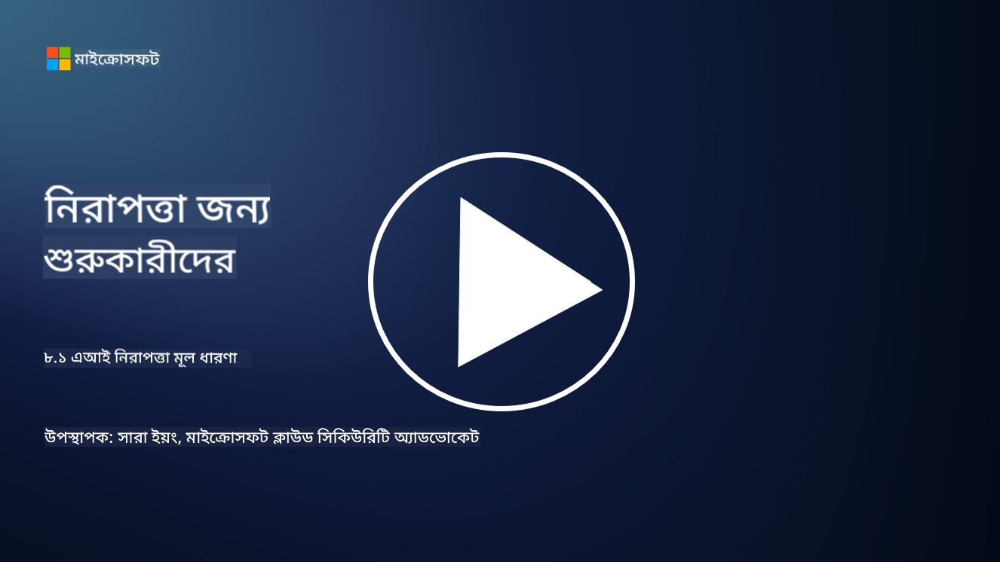

<!--
CO_OP_TRANSLATOR_METADATA:
{
  "original_hash": "66b61d96936cf25d20fcb411d4ce5227",
  "translation_date": "2025-09-03T19:40:16+00:00",
  "source_file": "8.1 AI security key concepts.md",
  "language_code": "bn"
}
-->
# এআই নিরাপত্তার মূল ধারণা

## এআই নিরাপত্তা কীভাবে প্রচলিত সাইবার নিরাপত্তার থেকে আলাদা?

এআই সিস্টেম সুরক্ষিত করা প্রচলিত সাইবার নিরাপত্তার তুলনায় অনন্য চ্যালেঞ্জ উপস্থাপন করে, বিশেষত এআই-এর শেখার ক্ষমতা এবং সিদ্ধান্ত গ্রহণ প্রক্রিয়ার কারণে। এখানে কিছু গুরুত্বপূর্ণ পার্থক্য তুলে ধরা হলো:

-   **ডেটার অখণ্ডতা**: এআই সিস্টেম শেখার জন্য ডেটার উপর ব্যাপকভাবে নির্ভর করে। [এই ডেটার অখণ্ডতা নিশ্চিত করা অত্যন্ত গুরুত্বপূর্ণ, কারণ আক্রমণকারীরা ডেটা পরিবর্তন করে এআই-এর আচরণকে প্রভাবিত করতে পারে, যা "ডেটা পয়জনিং" নামে পরিচিত।
-   **মডেল নিরাপত্তা**: এআই-এর সিদ্ধান্ত গ্রহণের মডেল নিজেই একটি লক্ষ্য হতে পারে। [আক্রমণকারীরা মডেলটি রিভার্স-ইঞ্জিনিয়ার করার চেষ্টা করতে পারে বা এর দুর্বলতাগুলো কাজে লাগিয়ে ভুল বা ক্ষতিকর সিদ্ধান্ত নিতে বাধ্য করতে পারে।
-   **প্রতিপক্ষের আক্রমণ**: এআই সিস্টেম প্রতিপক্ষের আক্রমণের শিকার হতে পারে, যেখানে ইনপুট ডেটায় সামান্য, প্রায় অদৃশ্য পরিবর্তন এআই-কে ভুল বা ভুল পূর্বাভাস দিতে বাধ্য করতে পারে।
-   **ইনফ্রাস্ট্রাকচার নিরাপত্তা**: প্রচলিত সাইবার নিরাপত্তা যেমন ইনফ্রাস্ট্রাকচার সুরক্ষার উপর জোর দেয়, এআই সিস্টেমে অতিরিক্ত জটিলতা থাকতে পারে, যেমন ক্লাউড-ভিত্তিক পরিষেবা বা বিশেষ হার্ডওয়্যার, যা নির্দিষ্ট নিরাপত্তা ব্যবস্থা প্রয়োজন।
-   **নৈতিক বিবেচনা**: নিরাপত্তায় এআই ব্যবহারের ফলে নৈতিক বিষয়গুলো উঠে আসে, যেমন গোপনীয়তা সংক্রান্ত উদ্বেগ এবং সিদ্ধান্ত গ্রহণে পক্ষপাতিত্বের সম্ভাবনা, যা নিরাপত্তা কৌশলে সমাধান করতে হবে।

সামগ্রিকভাবে, এআই সিস্টেম সুরক্ষিত করতে একটি ভিন্ন পদ্ধতির প্রয়োজন, যা এআই প্রযুক্তির অনন্য দিকগুলো বিবেচনা করে, যেমন ডেটা, মডেল এবং এআই-এর শেখার প্রক্রিয়া সুরক্ষিত করা, পাশাপাশি এআই ব্যবহারের নৈতিক প্রভাবগুলো সমাধান করা।

## এআই নিরাপত্তা এবং প্রচলিত সাইবার নিরাপত্তার মধ্যে পার্থক্য কী?

এআই নিরাপত্তা এবং প্রচলিত সাইবার নিরাপত্তার মধ্যে অনেক মিল রয়েছে, তবে কৃত্রিম বুদ্ধিমত্তা সিস্টেমের অনন্য বৈশিষ্ট্য এবং ক্ষমতার কারণে কিছু স্পষ্ট পার্থক্যও রয়েছে। এখানে তাদের পার্থক্য তুলে ধরা হলো:

- **হুমকির জটিলতা**: এআই সিস্টেম সাইবার নিরাপত্তায় নতুন স্তরের জটিলতা যোগ করে। প্রচলিত সাইবার নিরাপত্তা মূলত ম্যালওয়্যার, ফিশিং আক্রমণ এবং নেটওয়ার্ক অনুপ্রবেশের মতো হুমকির সাথে মোকাবিলা করে। তবে, এআই সিস্টেম প্রতিপক্ষের আক্রমণ, ডেটা পয়জনিং এবং মডেল এভেশন-এর মতো আক্রমণের শিকার হতে পারে, যা বিশেষভাবে মেশিন লার্নিং অ্যালগরিদমকে লক্ষ্য করে।

- **আক্রমণের পৃষ্ঠতল**: এআই সিস্টেম প্রচলিত সিস্টেমের তুলনায় বড় আক্রমণের পৃষ্ঠতল থাকতে পারে। কারণ এগুলো শুধু সফটওয়্যারের উপর নির্ভর করে না, বরং ডেটা এবং মডেলের উপরও নির্ভর করে। আক্রমণকারীরা প্রশিক্ষণ ডেটা লক্ষ্য করতে পারে, মডেল পরিবর্তন করতে পারে, বা অ্যালগরিদমের দুর্বলতাগুলো কাজে লাগাতে পারে।

- **হুমকির অভিযোজনযোগ্যতা**: এআই সিস্টেম পরিবেশ থেকে শিখতে এবং অভিযোজিত হতে পারে, যা তাদের অভিযোজিত এবং বিকশিত হুমকির প্রতি আরও সংবেদনশীল করে তোলে। প্রচলিত সাইবার নিরাপত্তা ব্যবস্থা এআই সিস্টেমের আচরণের উপর ভিত্তি করে ক্রমাগত বিকশিত আক্রমণ প্রতিরোধে যথেষ্ট নাও হতে পারে।

- **ব্যাখ্যা এবং ব্যাখ্যাযোগ্যতা**: এআই সিস্টেম কেন একটি নির্দিষ্ট সিদ্ধান্ত নিয়েছে তা বোঝা প্রচলিত সফটওয়্যার সিস্টেমের তুলনায় বেশি চ্যালেঞ্জিং। এই ব্যাখ্যা এবং ব্যাখ্যাযোগ্যতার অভাব এআই সিস্টেমে আক্রমণ সনাক্ত এবং প্রশমিত করা কঠিন করে তুলতে পারে।

- **ডেটা গোপনীয়তার উদ্বেগ**: এআই সিস্টেম প্রায়শই বিপুল পরিমাণ ডেটার উপর নির্ভর করে, যা সঠিকভাবে পরিচালিত না হলে গোপনীয়তার ঝুঁকি তৈরি করতে পারে। প্রচলিত সাইবার নিরাপত্তা ব্যবস্থা এআই সিস্টেমের নির্দিষ্ট ডেটা গোপনীয়তার উদ্বেগগুলো যথাযথভাবে সমাধান করতে পারে না।

- **নিয়ন্ত্রক সম্মতি**: এআই নিরাপত্তার জন্য নিয়ন্ত্রক কাঠামো এখনও বিকাশমান, যেখানে এআই সিস্টেমের অনন্য চ্যালেঞ্জগুলো সমাধানের জন্য নির্দিষ্ট নিয়ম এবং মান তৈরি হচ্ছে। প্রচলিত সাইবার নিরাপত্তা কাঠামোকে এই নতুন নিয়মগুলোর সাথে সম্মতি নিশ্চিত করতে প্রসারিত বা অভিযোজিত করতে হতে পারে।

- **নৈতিক বিবেচনা**: এআই নিরাপত্তা শুধুমাত্র সিস্টেমগুলোকে ক্ষতিকর আক্রমণ থেকে রক্ষা করার বিষয় নয়, বরং এআই সিস্টেমগুলোকে নৈতিক এবং দায়িত্বশীলভাবে ব্যবহার করার বিষয়ও। এর মধ্যে ন্যায্যতা, স্বচ্ছতা এবং জবাবদিহিতার মতো বিষয়গুলো অন্তর্ভুক্ত রয়েছে, যা প্রচলিত সাইবার নিরাপত্তায় তেমনভাবে প্রাধান্য পায় না।

## এআই কীভাবে প্রচলিত আইটি সিস্টেম সুরক্ষার মতো?

এআই সিস্টেম সুরক্ষিত করার ক্ষেত্রে প্রচলিত সাইবার নিরাপত্তার সাথে বেশ কিছু মৌলিক নীতির মিল রয়েছে:

-   **হুমকি সুরক্ষা**: এআই এবং প্রচলিত সিস্টেম উভয়কেই অননুমোদিত প্রবেশ, ডেটা পরিবর্তন এবং ধ্বংস, এবং অন্যান্য সাধারণ হুমকির বিরুদ্ধে সুরক্ষিত করতে হবে।
-   **দুর্বলতা ব্যবস্থাপনা**: প্রচলিত সিস্টেমকে প্রভাবিত করা অনেক দুর্বলতা, যেমন সফটওয়্যার বাগ বা ভুল কনফিগারেশন, এআই সিস্টেমকেও প্রভাবিত করতে পারে।
-   **ডেটা নিরাপত্তা**: প্রক্রিয়াকৃত ডেটার সুরক্ষা উভয় ক্ষেত্রেই গুরুত্বপূর্ণ, যাতে ডেটা লঙ্ঘন প্রতিরোধ করা যায় এবং গোপনীয়তা নিশ্চিত করা যায়।
-   **সরবরাহ চেইন নিরাপত্তা**: উভয় ধরনের সিস্টেম সরবরাহ চেইন আক্রমণের শিকার হতে পারে, যেখানে একটি ক্ষতিগ্রস্ত উপাদান পুরো সিস্টেমের নিরাপত্তাকে দুর্বল করে দিতে পারে।

এই মিলগুলো দেখায় যে, এআই সিস্টেম নতুন নিরাপত্তা চ্যালেঞ্জ তৈরি করলেও, প্রতিষ্ঠিত সাইবার নিরাপত্তা অনুশীলনগুলো প্রয়োগ করাও গুরুত্বপূর্ণ, যাতে শক্তিশালী সুরক্ষা নিশ্চিত করা যায়। এটি প্রচলিত নিরাপত্তা জ্ঞানের ব্যবহার এবং এআই প্রযুক্তির অনন্য দিকগুলোতে অভিযোজনের একটি মিশ্রণ।

## আরও পড়ুন

- [Not with a Bug, But with a Sticker [Book] (oreilly.com)](https://www.oreilly.com/library/view/not-with-a/9781119883982/)
   
- [Intro to AI Security Part 1: AI Security 101 | by HarrietHacks | Medium](https://medium.com/@harrietfarlow/intro-to-ai-security-part-1-ai-security-101-b8662a9efe5)
   
- [Best practices for AI security risk management | Microsoft Security Blog](https://www.microsoft.com/en-us/security/blog/2021/12/09/best-practices-for-ai-security-risk-management/?WT.mc_id=academic-96948-sayoung)
   
- [OWASP AI Security and Privacy Guide | OWASP Foundation](https://owasp.org/www-project-ai-security-and-privacy-guide/)

---

**অস্বীকৃতি**:  
এই নথিটি AI অনুবাদ পরিষেবা [Co-op Translator](https://github.com/Azure/co-op-translator) ব্যবহার করে অনুবাদ করা হয়েছে। আমরা যথাসম্ভব সঠিক অনুবাদ প্রদানের চেষ্টা করি, তবে অনুগ্রহ করে মনে রাখবেন যে স্বয়ংক্রিয় অনুবাদে ত্রুটি বা অসঙ্গতি থাকতে পারে। মূল ভাষায় থাকা নথিটিকে প্রামাণিক উৎস হিসেবে বিবেচনা করা উচিত। গুরুত্বপূর্ণ তথ্যের জন্য, পেশাদার মানব অনুবাদ সুপারিশ করা হয়। এই অনুবাদ ব্যবহারের ফলে কোনো ভুল বোঝাবুঝি বা ভুল ব্যাখ্যা হলে আমরা তার জন্য দায়ী থাকব না।