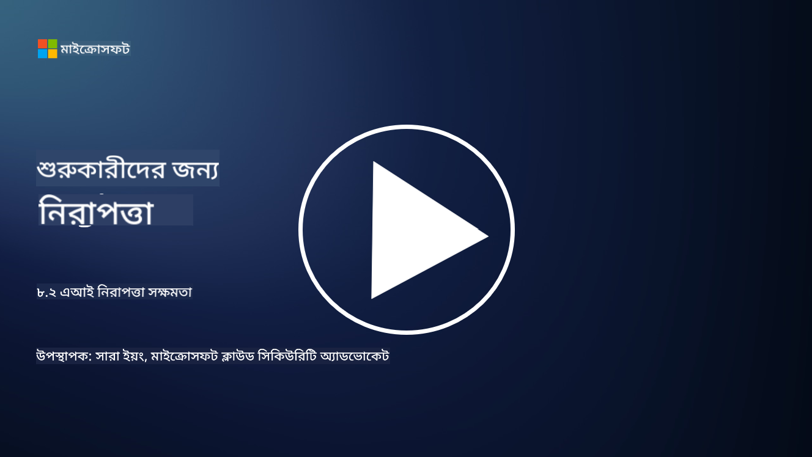

<!--
CO_OP_TRANSLATOR_METADATA:
{
  "original_hash": "b6bb7175672298d1e2f73ba7e0006f95",
  "translation_date": "2025-09-03T21:34:42+00:00",
  "source_file": "8.2 AI security capabilities.md",
  "language_code": "bn"
}
-->
# AI নিরাপত্তা সক্ষমতা

## বর্তমানে AI সিস্টেম সুরক্ষিত করার জন্য আমাদের কাছে কী কী টুল এবং সক্ষমতা রয়েছে?

বর্তমানে AI সিস্টেম সুরক্ষিত করার জন্য বেশ কিছু টুল এবং সক্ষমতা উপলব্ধ রয়েছে:

-   **Counterfit**: AI সিস্টেমের নিরাপত্তা পরীক্ষার জন্য একটি ওপেন-সোর্স অটোমেশন টুল, যা সংস্থাগুলিকে AI নিরাপত্তা ঝুঁকি মূল্যায়ন করতে এবং তাদের অ্যালগরিদমের দৃঢ়তা নিশ্চিত করতে সহায়তা করে।
-   **Adversarial Machine Learning Tools**: এই টুলগুলো মেশিন লার্নিং মডেলের দৃঢ়তা মূল্যায়ন করে, বিশেষ করে প্রতিকূল আক্রমণের বিরুদ্ধে, যা দুর্বলতা চিহ্নিত করতে এবং তা মোকাবিলা করতে সহায়তা করে।
-   **AI Security Toolkits**: ওপেন-সোর্স টুলকিটগুলো AI সিস্টেম সুরক্ষিত করার জন্য বিভিন্ন সম্পদ সরবরাহ করে, যার মধ্যে রয়েছে লাইব্রেরি এবং ফ্রেমওয়ার্ক যা নিরাপত্তা ব্যবস্থা বাস্তবায়নে সহায়ক।
-   **Collaborative Platforms**: কোম্পানি এবং AI সম্প্রদায়ের মধ্যে অংশীদারিত্ব, যা AI-নির্দিষ্ট নিরাপত্তা স্ক্যানার এবং অন্যান্য টুল তৈরি করে AI সরবরাহ চেইন সুরক্ষিত করতে সহায়তা করে।

এই টুল এবং সক্ষমতাগুলো AI সিস্টেমের নিরাপত্তা উন্নত করার জন্য একটি ক্রমবর্ধমান ক্ষেত্রের অংশ, যা বিভিন্ন হুমকির বিরুদ্ধে সুরক্ষা প্রদান করে। এগুলো গবেষণা, ব্যবহারিক টুল এবং শিল্প সহযোগিতার সমন্বয়ে গঠিত, যা AI প্রযুক্তির অনন্য চ্যালেঞ্জ মোকাবিলার জন্য তৈরি।

## AI রেড টিমিং সম্পর্কে কী? এটি কীভাবে প্রচলিত নিরাপত্তা রেড টিমিং থেকে আলাদা?

AI রেড টিমিং প্রচলিত নিরাপত্তা রেড টিমিং থেকে কয়েকটি গুরুত্বপূর্ণ দিক দিয়ে আলাদা:

-   **AI সিস্টেমের উপর ফোকাস**: AI রেড টিমিং বিশেষভাবে AI সিস্টেমের অনন্য দুর্বলতাগুলো লক্ষ্য করে, যেমন মেশিন লার্নিং মডেল এবং ডেটা পাইপলাইন, প্রচলিত IT অবকাঠামোর পরিবর্তে।
-   **AI আচরণ পরীক্ষা**: এটি AI সিস্টেমগুলো অস্বাভাবিক বা অপ্রত্যাশিত ইনপুটের প্রতি কীভাবে প্রতিক্রিয়া জানায় তা পরীক্ষা করে, যা দুর্বলতা প্রকাশ করতে পারে যা আক্রমণকারীরা কাজে লাগাতে পারে।
-   **AI ব্যর্থতা অন্বেষণ**: AI রেড টিমিং ক্ষতিকারক এবং নিরীহ উভয় ধরনের ব্যর্থতা পরীক্ষা করে, শুধুমাত্র নিরাপত্তা লঙ্ঘনের বাইরেও সম্ভাব্য সিস্টেম ব্যর্থতার বিস্তৃত সেট বিবেচনা করে।
-   **প্রম্পট ইনজেকশন এবং বিষয়বস্তু তৈরি**: AI রেড টিমিং প্রম্পট ইনজেকশন-এর মতো ব্যর্থতা পরীক্ষা করে, যেখানে আক্রমণকারীরা AI সিস্টেমকে ক্ষতিকারক বা ভিত্তিহীন বিষয়বস্তু তৈরি করতে প্ররোচিত করে।
-   **নৈতিক এবং দায়িত্বশীল AI**: এটি দায়িত্বশীল AI নিশ্চিত করার একটি অংশ, যা AI সিস্টেমগুলোকে অনাকাঙ্ক্ষিত আচরণে প্ররোচিত করার প্রচেষ্টার বিরুদ্ধে দৃঢ় করে তোলে।

সামগ্রিকভাবে, AI রেড টিমিং একটি বিস্তৃত অনুশীলন, যা শুধুমাত্র নিরাপত্তা দুর্বলতা পরীক্ষা করাই নয়, AI প্রযুক্তির জন্য নির্দিষ্ট অন্যান্য ধরনের সিস্টেম ব্যর্থতা পরীক্ষা করাও অন্তর্ভুক্ত করে। এটি AI সিস্টেমগুলোকে নিরাপদ করার জন্য একটি গুরুত্বপূর্ণ পদক্ষেপ, যা AI প্রয়োগের সাথে সম্পর্কিত নতুন ঝুঁকিগুলো বোঝা এবং মোকাবিলা করার জন্য সহায়ক।

## আরও পড়ুন

 - [Microsoft AI Red Team building future of safer AI | Microsoft Security Blog](https://www.microsoft.com/en-us/security/blog/2023/08/07/microsoft-ai-red-team-building-future-of-safer-ai/?WT.mc_id=academic-96948-sayoung)
 - [Announcing Microsoft’s open automation framework to red team generative AI Systems | Microsoft Security Blog](https://www.microsoft.com/en-us/security/blog/2024/02/22/announcing-microsofts-open-automation-framework-to-red-team-generative-ai-systems/?WT.mc_id=academic-96948-sayoung)
 - [AI Security Tools: The Open-Source Toolkit | Wiz](https://www.wiz.io/academy/ai-security-tools)

---

**অস্বীকৃতি**:  
এই নথিটি AI অনুবাদ পরিষেবা [Co-op Translator](https://github.com/Azure/co-op-translator) ব্যবহার করে অনুবাদ করা হয়েছে। আমরা যথাসাধ্য সঠিকতা নিশ্চিত করার চেষ্টা করি, তবে অনুগ্রহ করে মনে রাখবেন যে স্বয়ংক্রিয় অনুবাদে ত্রুটি বা অসঙ্গতি থাকতে পারে। মূল ভাষায় থাকা নথিটিকে প্রামাণিক উৎস হিসেবে বিবেচনা করা উচিত। গুরুত্বপূর্ণ তথ্যের জন্য, পেশাদার মানব অনুবাদ সুপারিশ করা হয়। এই অনুবাদ ব্যবহারের ফলে কোনো ভুল বোঝাবুঝি বা ভুল ব্যাখ্যা হলে আমরা দায়বদ্ধ থাকব না।