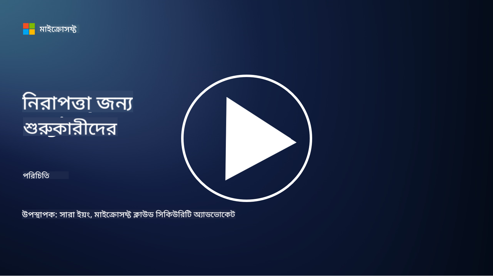

<!--
CO_OP_TRANSLATOR_METADATA:
{
  "original_hash": "fc3d47b5af0cc4fc954ae5d2ea2f7811",
  "translation_date": "2025-10-24T09:00:56+00:00",
  "source_file": "README.md",
  "language_code": "bn"
}
-->

### 🌐 বহু ভাষার সমর্থন

#### GitHub Action এর মাধ্যমে সমর্থিত (স্বয়ংক্রিয় এবং সর্বদা আপডেটেড)

<!-- CO-OP TRANSLATOR LANGUAGES TABLE START -->
[আরবি](../ar/README.md) | [বাংলা](./README.md) | [বুলগেরিয়ান](../bg/README.md) | [বর্মী (মায়ানমার)](../my/README.md) | [চীনা (সরলীকৃত)](../zh/README.md) | [চীনা (প্রথাগত, হংকং)](../hk/README.md) | [চীনা (প্রথাগত, ম্যাকাও)](../mo/README.md) | [চীনা (প্রথাগত, তাইওয়ান)](../tw/README.md) | [ক্রোয়েশিয়ান](../hr/README.md) | [চেক](../cs/README.md) | [ড্যানিশ](../da/README.md) | [ডাচ](../nl/README.md) | [এস্তোনিয়ান](../et/README.md) | [ফিনিশ](../fi/README.md) | [ফরাসি](../fr/README.md) | [জার্মান](../de/README.md) | [গ্রীক](../el/README.md) | [হিব্রু](../he/README.md) | [হিন্দি](../hi/README.md) | [হাঙ্গেরিয়ান](../hu/README.md) | [ইন্দোনেশিয়ান](../id/README.md) | [ইতালিয়ান](../it/README.md) | [জাপানি](../ja/README.md) | [কোরিয়ান](../ko/README.md) | [লিথুয়ানিয়ান](../lt/README.md) | [মালয়](../ms/README.md) | [মারাঠি](../mr/README.md) | [নেপালি](../ne/README.md) | [নরওয়েজিয়ান](../no/README.md) | [ফার্সি](../fa/README.md) | [পোলিশ](../pl/README.md) | [পর্তুগিজ (ব্রাজিল)](../br/README.md) | [পর্তুগিজ (পর্তুগাল)](../pt/README.md) | [পাঞ্জাবি (গুরমুখী)](../pa/README.md) | [রোমানিয়ান](../ro/README.md) | [রাশিয়ান](../ru/README.md) | [সার্বিয়ান (সিরিলিক)](../sr/README.md) | [স্লোভাক](../sk/README.md) | [স্লোভেনিয়ান](../sl/README.md) | [স্প্যানিশ](../es/README.md) | [সোয়াহিলি](../sw/README.md) | [সুইডিশ](../sv/README.md) | [টাগালগ (ফিলিপিনো)](../tl/README.md) | [তামিল](../ta/README.md) | [থাই](../th/README.md) | [তুর্কি](../tr/README.md) | [ইউক্রেনীয়](../uk/README.md) | [উর্দু](../ur/README.md) | [ভিয়েতনামিজ](../vi/README.md)
<!-- CO-OP TRANSLATOR LANGUAGES TABLE END -->

**যদি আপনি অতিরিক্ত ভাষার অনুবাদ চান, তাহলে [এখানে](https://github.com/Azure/co-op-translator/blob/main/getting_started/supported-languages.md) তালিকাভুক্ত ভাষাগুলি সমর্থিত।**

#### আমাদের কমিউনিটিতে যোগ দিন 

# 🚀 সাইবার নিরাপত্তা শিক্ষার জন্য প্রাথমিক পাঠক্রম

এই দ্রুত পরিবর্তনশীল AI প্রযুক্তি গ্রহণের যুগে, আইটি সিস্টেমকে সুরক্ষিত করার গুরুত্ব আরও বেশি। এই কোর্সটি আপনাকে সাইবার নিরাপত্তার মৌলিক ধারণাগুলি শেখানোর জন্য ডিজাইন করা হয়েছে, যা আপনার নিরাপত্তা শেখার যাত্রা শুরু করতে সাহায্য করবে। এটি নিরপেক্ষ এবং ছোট ছোট পাঠে বিভক্ত, যা সম্পূর্ণ করতে প্রায় ৩০-৬০ মিনিট সময় লাগবে। প্রতিটি পাঠে একটি ছোট কুইজ এবং আরও পড়ার লিঙ্ক রয়েছে, যদি আপনি বিষয়টি আরও গভীরভাবে জানতে চান।

এই কোর্সে যা অন্তর্ভুক্ত 📚

- 🔐 সাইবার নিরাপত্তার মৌলিক ধারণা যেমন CIA ত্রিভুজ, ঝুঁকি, হুমকি ইত্যাদির পার্থক্য।
- 🛡️ নিরাপত্তা নিয়ন্ত্রণ কী এবং এর বিভিন্ন রূপ বোঝা।
- 🌐 জিরো ট্রাস্ট কী এবং আধুনিক সাইবার নিরাপত্তায় এর গুরুত্ব বোঝা।
- 🔑 পরিচয়, নেটওয়ার্কিং, নিরাপত্তা অপারেশন, অবকাঠামো এবং ডেটা নিরাপত্তার মূল ধারণা এবং থিম বোঝা।
- 🔧 নিরাপত্তা নিয়ন্ত্রণ বাস্তবায়নের জন্য ব্যবহৃত কিছু টুলের উদাহরণ দেওয়া।

এই কোর্সে যা অন্তর্ভুক্ত নয় 🙅‍♂️

- 🚫 নির্দিষ্ট নিরাপত্তা টুল ব্যবহার করার পদ্ধতি।
- 🚫 "হ্যাকিং" বা রেড টিমিং/অফেন্সিভ সিকিউরিটি শেখা।
- 🚫 নির্দিষ্ট কমপ্লায়েন্স স্ট্যান্ডার্ড সম্পর্কে শেখা।

এই কোর্স শেষ করার পর, আপনি আমাদের Microsoft Learn মডিউলগুলিতে যেতে পারেন। আমরা আপনাকে [Microsoft Security, Compliance, and Identity Fundamentals](https://learn.microsoft.com/training/paths/describe-concepts-of-security-compliance-identity/?WT.mc_id=academic-96948-sayoung) দিয়ে আপনার শেখা চালিয়ে যাওয়ার পরামর্শ দিই।

শেষ পর্যন্ত, আপনি [Exam SC-900: Microsoft Security, Compliance, and Identity Fundamentals exam](https://learn.microsoft.com/credentials/certifications/exams/sc-900/?WT.mc_id=academic-96948-sayoung) দেওয়ার কথা বিবেচনা করতে পারেন।

> 💁 যদি এই কোর্স সম্পর্কে আপনার কোনো মতামত বা পরামর্শ থাকে এবং আমরা কোনো বিষয়বস্তু মিস করেছি বলে মনে করেন, তাহলে আমাদের জানাতে দ্বিধা করবেন না!

## মডিউল ওভারভিউ 📝 
| **মডিউল নম্বর** | **মডিউলের নাম**                           | **শেখানো ধারণা**                  | **শেখার উদ্দেশ্য**                                                                                          |
|-------------------|-------------------------------------------|--------------------------------------|-----------------------------------------------------------------------------------------------------------------|
| **1.1**           | মৌলিক নিরাপত্তা ধারণা                   | [CIA ত্রিভুজ](https://github.com/microsoft/Security-101/blob/main/1.1%20The%20CIA%20triad%20and%20other%20key%20concepts.md)                        | গোপনীয়তা, প্রাপ্যতা এবং অখণ্ডতা সম্পর্কে জানুন। এছাড়াও প্রমাণীকরণ, অস্বীকৃতি এবং গোপনীয়তা। |
| **1.2**           | মৌলিক নিরাপত্তা ধারণা                   | [সাধারণ সাইবার নিরাপত্তা হুমকি](https://github.com/microsoft/Security-101/blob/main/1.2%20Common%20cybersecurity%20threats.md)        | ব্যক্তি এবং সংস্থাগুলির মুখোমুখি সাধারণ সাইবার নিরাপত্তা হুমকি সম্পর্কে জানুন।                             |
| **1.3**           | মৌলিক নিরাপত্তা ধারণা                   | [ঝুঁকি ব্যবস্থাপনা বোঝা](https://github.com/microsoft/Security-101/blob/main/1.3%20Understanding%20risk%20management.md)       | ঝুঁকি মূল্যায়ন এবং বোঝা সম্পর্কে জানুন – প্রভাব/সম্ভাবনা এবং নিয়ন্ত্রণ বাস্তবায়ন।                                                                                                               | |
| **1.4**           | মৌলিক নিরাপত্তা ধারণা                   | [নিরাপত্তা অনুশীলন এবং ডকুমেন্টেশন](https://github.com/microsoft/Security-101/blob/main/1.4%20Security%20practices%20and%20documentation.md) | নীতিমালা, পদ্ধতি, মান এবং নিয়ম/আইনের মধ্যে পার্থক্য সম্পর্কে জানুন।                         |
| **1.5**           | মৌলিক নিরাপত্তা ধারণা                   | [জিরো ট্রাস্ট](https://github.com/microsoft/Security-101/blob/main/1.5%20Zero%20trust.md)                           | জিরো ট্রাস্ট কী এবং এটি স্থাপত্যকে কীভাবে প্রভাবিত করে তা জানুন। গভীর প্রতিরক্ষা কী?                   |
| **1.6**           | মৌলিক নিরাপত্তা ধারণা                   | [শেয়ারড রেসপন্সিবিলিটি মডেল](https://github.com/microsoft/Security-101/blob/main/1.6%20Shared%20responsibility%20model.md)                           | শেয়ারড রেসপন্সিবিলিটি মডেল কী এবং এটি সাইবার নিরাপত্তাকে কীভাবে প্রভাবিত করে তা জানুন।                  |
| **1.7**           | [মডিউলের শেষে কুইজ](https://github.com/microsoft/Security-101/blob/main/1.7%20End%20of%20module%20quiz.md)                        |                                      |                                                                                                                 |
| **2.1**           | পরিচয় ও অ্যাক্সেস ব্যবস্থাপনা মৌলিক ধারণা | [IAM মূল ধারণা](https://github.com/microsoft/Security-101/blob/main/2.1%20IAM%20key%20concepts.md)                     | সর্বনিম্ন বিশেষাধিকার নীতি, দায়িত্বের বিভাজন, কীভাবে IAM জিরো ট্রাস্টকে সমর্থন করে তা জানুন।               |
| **2.2**           | পরিচয় ও অ্যাক্সেস ব্যবস্থাপনা মৌলিক ধারণা | [IAM জিরো ট্রাস্ট স্থাপত্য](https://github.com/microsoft/Security-101/blob/main/2.2%20IAM%20zero%20trust%20architecture.md)          | পরিচয় কীভাবে আধুনিক আইটি পরিবেশের জন্য নতুন সীমানা এবং এটি যে হুমকিগুলি প্রশমিত করে তা জানুন।          |
| **2.3**           | পরিচয় ও অ্যাক্সেস ব্যবস্থাপনা মৌলিক ধারণা | [IAM সক্ষমতা](https://github.com/microsoft/Security-101/blob/main/2.3%20IAM%20capabilities.md)                     | পরিচয় সুরক্ষিত করার জন্য IAM সক্ষমতা এবং নিয়ন্ত্রণ সম্পর্কে জানুন।                                                  |
| **2.4**           | [মডিউলের শেষে কুইজ](https://github.com/microsoft/Security-101/blob/main/2.4%20End%20of%20module%20quiz.md)                        |                                      |                                                                                                                 |
| **3.1**           | নেটওয়ার্ক নিরাপত্তা মৌলিক ধারণা             | [নেটওয়ার্কিং মূল ধারণা](https://github.com/microsoft/Security-101/blob/main/3.1%20Networking%20key%20concepts.md)              | নেটওয়ার্কিং ধারণা সম্পর্কে জানুন (IP ঠিকানা, পোর্ট নম্বর, এনক্রিপশন ইত্যাদি)।                                 |
| **3.2**           | নেটওয়ার্ক নিরাপত্তা মৌলিক ধারণা             | [নেটওয়ার্কিং জিরো ট্রাস্ট স্থাপত্য](https://github.com/microsoft/Security-101/blob/main/3.2%20Networking%20zero%20trust%20architecture.md)   | নেটওয়ার্কিং কীভাবে E2E ZT স্থাপত্যে অবদান রাখে এবং এটি যে হুমকিগুলি প্রশমিত করে তা জানুন।                  |
| **3.3**           | নেটওয়ার্ক নিরাপত্তা মৌলিক ধারণা             | [নেটওয়ার্ক নিরাপত্তা সক্ষমতা](https://github.com/microsoft/Security-101/blob/main/3.3%20Network%20security%20capabilities.md)        | নেটওয়ার্ক নিরাপত্তা টুলিং সম্পর্কে জানুন – ফায়ারওয়াল, WAF, DDoS সুরক্ষা ইত্যাদি।                                    |
| **3.4**           | [মডিউলের শেষে কুইজ](https://github.com/microsoft/Security-101/blob/main/3.4%20End%20of%20module%20quiz.md)                        |                                      |                                                                                                                 |
| **4.1**           | নিরাপত্তা অপারেশন মৌলিক ধারণা          | [SecOps মূল ধারণা](https://github.com/microsoft/Security-101/blob/main/4.1%20SecOps%20key%20concepts.md)                  | নিরাপত্তা অপারেশন কেন গুরুত্বপূর্ণ এবং এটি সাধারণ আইটি অপস টিম থেকে কীভাবে আলাদা তা জানুন।                  |
| **4.2**           | নিরাপত্তা অপারেশন মৌলিক ধারণা          | [SecOps জিরো ট্রাস্ট স্থাপত্য](https://github.com/microsoft/Security-101/blob/main/4.2%20SecOps%20zero%20trust%20architecture.md)       | SecOps কীভাবে E2E ZT স্থাপত্যে অবদান রাখে এবং এটি যে হুমকিগুলি প্রশমিত করে তা জানুন।                      |
| **4.3**           | নিরাপত্তা অপারেশন মৌলিক ধারণা          | [SecOps সক্ষমতা](https://github.com/microsoft/Security-101/blob/main/4.3%20SecOps%20capabilities.md)                  | SecOps টুলিং সম্পর্কে জানুন – SIEM, XDR ইত্যাদি।                                                                    |
| **4.4**           | [মডিউলের শেষে কুইজ](https://github.com/microsoft/Security-101/blob/main/4.4%20End%20of%20module%20quiz.md)                        |                                      |                                                                                                                 |
| **5.1**           | অ্যাপ্লিকেশন নিরাপত্তা মৌলিক ধারণা         | [AppSec মূল ধারণা](https://github.com/microsoft/Security-101/blob/main/5.1%20AppSec%20key%20concepts.md)                  | AppSec ধারণা সম্পর্কে জানুন যেমন ডিজাইন দ্বারা সুরক্ষিত, ইনপুট যাচাইকরণ ইত্যাদি।                                    |
| **5.2**           | অ্যাপ্লিকেশন সিকিউরিটির মৌলিক বিষয়         | [অ্যাপসেক সক্ষমতা](https://github.com/microsoft/Security-101/blob/main/5.2%20AppSec%20key%20capabilities.md)                  | অ্যাপসেক টুলিং সম্পর্কে জানুন: পাইপলাইন সিকিউরিটি টুলস, কোড স্ক্যানিং, সিক্রেট স্ক্যানিং ইত্যাদি।                       |
| **5.3**           | [মডিউলের শেষে কুইজ](https://github.com/microsoft/Security-101/blob/main/5.3%20End%20of%20module%20quiz.md)                        |                                      |                                                                                                                 |
| **6.1**           | অবকাঠামো সিকিউরিটির মৌলিক বিষয়      | [অবকাঠামো সিকিউরিটির মূল ধারণা](https://github.com/microsoft/Security-101/blob/main/6.1%20Infrastructure%20security%20key%20concepts.md) | সিস্টেম শক্তিশালীকরণ, প্যাচিং, সিকিউরিটি হাইজিন, কন্টেইনার সিকিউরিটি সম্পর্কে জানুন।                                  |
| **6.2**           | অবকাঠামো সিকিউরিটির মৌলিক বিষয়      | [অবকাঠামো সিকিউরিটির সক্ষমতা](https://github.com/microsoft/Security-101/blob/main/6.2%20Infrastructure%20security%20capabilities.md) | অবকাঠামো সিকিউরিটিতে সহায়ক টুলিং সম্পর্কে জানুন যেমন CSPM, কন্টেইনার সিকিউরিটি ইত্যাদি।            |
| **6.3**           | [মডিউলের শেষে কুইজ](https://github.com/microsoft/Security-101/blob/main/6.3%20End%20of%20module%20quiz.md)                        |                                      |                                                                                                                 |
| **7.1**           | ডেটা সিকিউরিটির মৌলিক বিষয়                | [ডেটা সিকিউরিটির মূল ধারণা](https://github.com/microsoft/Security-101/blob/main/7.1%20Data%20security%20key%20concepts.md)           | ডেটা শ্রেণিবিন্যাস এবং সংরক্ষণ সম্পর্কে জানুন এবং কেন এটি একটি প্রতিষ্ঠানের জন্য গুরুত্বপূর্ণ।                     |
| **7.2**           | ডেটা সিকিউরিটির মৌলিক বিষয়                | [ডেটা সিকিউরিটির সক্ষমতা](https://github.com/microsoft/Security-101/blob/main/7.2%20Data%20security%20capabilities.md)           | ডেটা সিকিউরিটি টুলিং সম্পর্কে জানুন – DLP, ইনসাইড রিস্ক ম্যানেজমেন্ট, ডেটা গভর্নেন্স ইত্যাদি।                          |
| **7.3**           | [মডিউলের শেষে কুইজ](https://github.com/microsoft/Security-101/blob/main/7.3%20End%20of%20module%20quiz.md)                        |
| **8.1**           | এআই সিকিউরিটির মৌলিক বিষয়                | [এআই সিকিউরিটির মূল ধারণা](https://github.com/microsoft/Security-101/blob/main/8.1%20AI%20security%20key%20concepts.md)          | প্রচলিত সিকিউরিটি এবং এআই সিকিউরিটির মধ্যে পার্থক্য এবং মিল সম্পর্কে জানুন।                 |
| **8.2**           | এআই সিকিউরিটির মৌলিক বিষয়                | [এআই সিকিউরিটির সক্ষমতা](https://github.com/microsoft/Security-101/blob/main/8.2%20AI%20security%20capabilities.md)           | এআই সিকিউরিটি টুলিং এবং এআই সুরক্ষিত করার জন্য ব্যবহৃত নিয়ন্ত্রণ সম্পর্কে জানুন।                         |
| **8.3**           | এআই সিকিউরিটির মৌলিক বিষয়                | [দায়িত্বশীল এআই](https://github.com/microsoft/Security-101/blob/main/8.3%20Responsible%20AI.md)          | দায়িত্বশীল এআই কী এবং এআই-সম্পর্কিত ক্ষতি সম্পর্কে জানুন যা সিকিউরিটি পেশাদারদের জানা উচিত।                          |
| **8.4**           | [মডিউলের শেষে কুইজ](https://github.com/microsoft/Security-101/blob/main/8.4%20End%20of%20module%20quiz.md)     

## 🎒 অন্যান্য কোর্সসমূহ 

আমাদের টিম অন্যান্য কোর্স তৈরি করে! দেখে নিন:

### Azure / Edge / MCP / Agents

---
 
### Generative AI সিরিজ

[-9333EA?style=for-the-badge&labelColor=E5E7EB&color=9333EA)](https://github.com/microsoft/Generative-AI-for-beginners-dotnet?WT.mc_id=academic-105485-koreyst)
[-C084FC?style=for-the-badge&labelColor=E5E7EB&color=C084FC)](https://github.com/microsoft/generative-ai-for-beginners-java?WT.mc_id=academic-105485-koreyst)
[-E879F9?style=for-the-badge&labelColor=E5E7EB&color=E879F9)](https://github.com/microsoft/generative-ai-with-javascript?WT.mc_id=academic-105485-koreyst)

---
 
### মূল শিক্ষণ

---
 
### Copilot সিরিজ

## সাহায্য পাওয়া

যদি আপনি আটকে যান বা এআই অ্যাপ তৈরি করার বিষয়ে কোনো প্রশ্ন থাকে, যোগ দিন:

যদি আপনার পণ্য সম্পর্কিত মতামত থাকে বা তৈরি করার সময় কোনো ত্রুটি হয়, দেখুন:

---

**অস্বীকৃতি**:  
এই নথিটি AI অনুবাদ পরিষেবা [Co-op Translator](https://github.com/Azure/co-op-translator) ব্যবহার করে অনুবাদ করা হয়েছে। আমরা যথাসাধ্য সঠিকতার জন্য চেষ্টা করি, তবে অনুগ্রহ করে মনে রাখবেন যে স্বয়ংক্রিয় অনুবাদে ত্রুটি বা অসঙ্গতি থাকতে পারে। মূল ভাষায় থাকা নথিটিকে প্রামাণিক উৎস হিসেবে বিবেচনা করা উচিত। গুরুত্বপূর্ণ তথ্যের জন্য, পেশাদার মানব অনুবাদ সুপারিশ করা হয়। এই অনুবাদ ব্যবহারের ফলে কোনো ভুল বোঝাবুঝি বা ভুল ব্যাখ্যা হলে আমরা দায়বদ্ধ থাকব না।