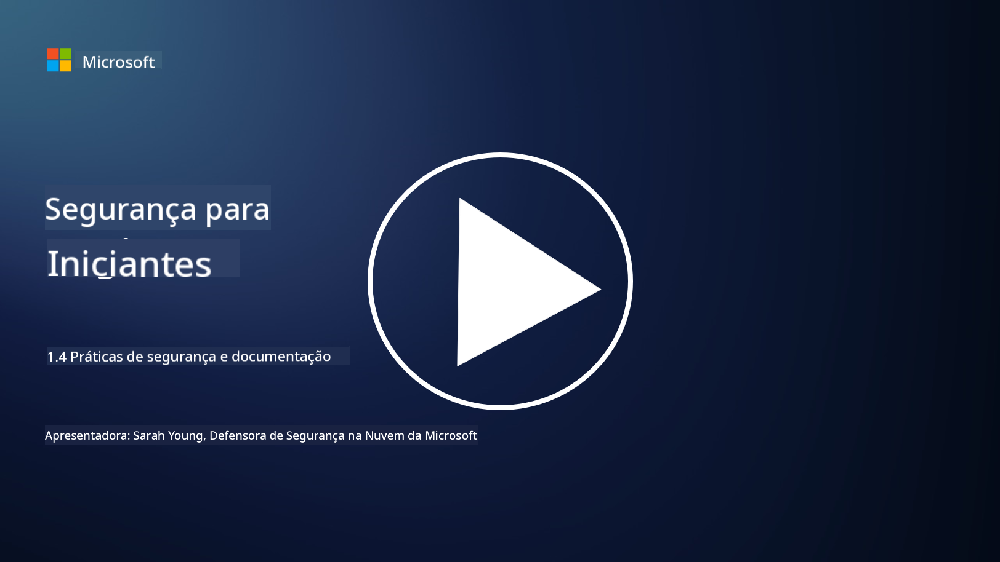

<!--
CO_OP_TRANSLATOR_METADATA:
{
  "original_hash": "d33500902124e52870935bdce4546fcc",
  "translation_date": "2025-09-03T20:58:36+00:00",
  "source_file": "1.4 Security practices and documentation.md",
  "language_code": "br"
}
-->
# Práticas de segurança e documentação

Você já deve ter ouvido as expressões “política de segurança”, “padrão de segurança”, etc., mas a realidade é que muitos profissionais de cibersegurança não as utilizam corretamente. Nesta seção, explicaremos o que cada uma dessas expressões significa e por que uma organização as utiliza.

## Introdução

Nesta lição, abordaremos:

- O que é uma política de segurança?
  
- O que é um padrão de segurança?

- O que é uma linha de base de segurança?

- O que é uma diretriz de segurança?

- O que é um procedimento de segurança?

- O que são leis e regulamentações no contexto da cibersegurança?

Esses termos são frequentemente usados no contexto da cibersegurança para definir diferentes níveis de documentação e práticas de segurança dentro de uma organização. Vamos esclarecer cada termo:

## O que é uma política de segurança?

Uma política de segurança é um documento de alto nível que descreve os objetivos, princípios e diretrizes gerais de segurança de uma organização. Ela fornece um framework para a tomada de decisões relacionadas à segurança e define o tom da postura de segurança da organização. Políticas de segurança geralmente abordam tópicos como uso aceitável de recursos, proteção de dados, controle de acesso, resposta a incidentes e mais. Uma política é independente de soluções e tecnologias. Um exemplo de política de segurança comumente conhecido seria a política de uso aceitável de uma organização.

## O que é um padrão de segurança?

Um padrão de segurança é um documento mais detalhado e específico que fornece diretrizes e requisitos para a implementação de controles e medidas de segurança dentro de uma organização. Os padrões são mais concretos e técnicos do que as políticas, oferecendo instruções e recomendações específicas para configurar e manter sistemas, redes e processos para atender aos objetivos de segurança. Um exemplo de padrão de segurança seria: _“Todos os dados internos devem ser criptografados em repouso e em trânsito.”_

## O que é uma linha de base de segurança?

Uma linha de base de segurança é um conjunto de configurações mínimas de segurança consideradas essenciais para um sistema, aplicação ou ambiente específico em um determinado momento. Ela define um ponto de partida para a segurança que deve ser implementado em todas as instâncias relevantes. Linhas de base de segurança ajudam a garantir consistência e um certo nível de segurança em toda a infraestrutura de TI de uma organização. Um exemplo de linha de base de segurança seria: _“VMs do Azure não devem ter acesso direto à Internet.”_

## O que é uma diretriz de segurança?

Uma diretriz de segurança é um documento que oferece recomendações e orientações quando um padrão de segurança específico não se aplica. Diretrizes tentam lidar com as “áreas cinzentas” que surgem quando um padrão não cobre ou cobre apenas parcialmente uma questão.

## O que é um procedimento de segurança?

Um procedimento de segurança é um guia detalhado, passo a passo, que descreve as ações e tarefas específicas que precisam ser realizadas para executar um processo ou tarefa relacionado à segurança. Procedimentos são documentos práticos e acionáveis que fornecem uma sequência clara de ações a serem seguidas durante a resposta a incidentes, manutenção de sistemas, integração de usuários e outras atividades relacionadas à segurança. Um exemplo de procedimento de segurança seria: _“Quando um incidente de segurança P1 for gerado pelo Microsoft Sentinel, o centro de operações de segurança (SOC) deve informar imediatamente o gerente de segurança de plantão e enviar os detalhes do incidente para ele.”_

Em resumo, esses termos representam diferentes níveis de documentação e orientação dentro do framework de cibersegurança de uma organização. Políticas de segurança definem os objetivos de alto nível, padrões fornecem requisitos detalhados, linhas de base estabelecem configurações mínimas de segurança, diretrizes oferecem melhores práticas e procedimentos fornecem etapas acionáveis para processos de segurança.

## O que são leis/regulamentações no contexto da cibersegurança?

Leis e regulamentações referem-se a frameworks legais estabelecidos por governos e órgãos reguladores para definir e impor regras, padrões e requisitos para proteger sistemas digitais, dados e informações. Essas leis e regulamentações variam de acordo com a jurisdição e se concentram em diferentes aspectos da cibersegurança, incluindo proteção de dados, privacidade, relato de incidentes e segurança de infraestruturas críticas. Aqui estão alguns exemplos de leis e regulamentações relacionadas à cibersegurança: por exemplo, Regulamento Geral de Proteção de Dados (GDPR), Lei de Portabilidade e Responsabilidade de Seguros de Saúde (HIPAA), Lei de Privacidade do Consumidor da Califórnia (CCPA), Padrão de Segurança de Dados da Indústria de Cartões de Pagamento (PCI DSS).

## Leitura adicional

[Modelos de Políticas de Segurança da Informação | SANS Institute](https://www.sans.org/information-security-policy/)

[Conformidade com Leis e Regulamentações de Cibersegurança e Privacidade | NIST](https://www.nist.gov/mep/cybersecurity-resources-manufacturers/compliance-cybersecurity-and-privacy-laws-and-regulations)

---

**Aviso Legal**:  
Este documento foi traduzido utilizando o serviço de tradução por IA [Co-op Translator](https://github.com/Azure/co-op-translator). Embora nos esforcemos para garantir a precisão, esteja ciente de que traduções automatizadas podem conter erros ou imprecisões. O documento original em seu idioma nativo deve ser considerado a fonte autoritativa. Para informações críticas, recomenda-se a tradução profissional realizada por humanos. Não nos responsabilizamos por quaisquer mal-entendidos ou interpretações equivocadas decorrentes do uso desta tradução.