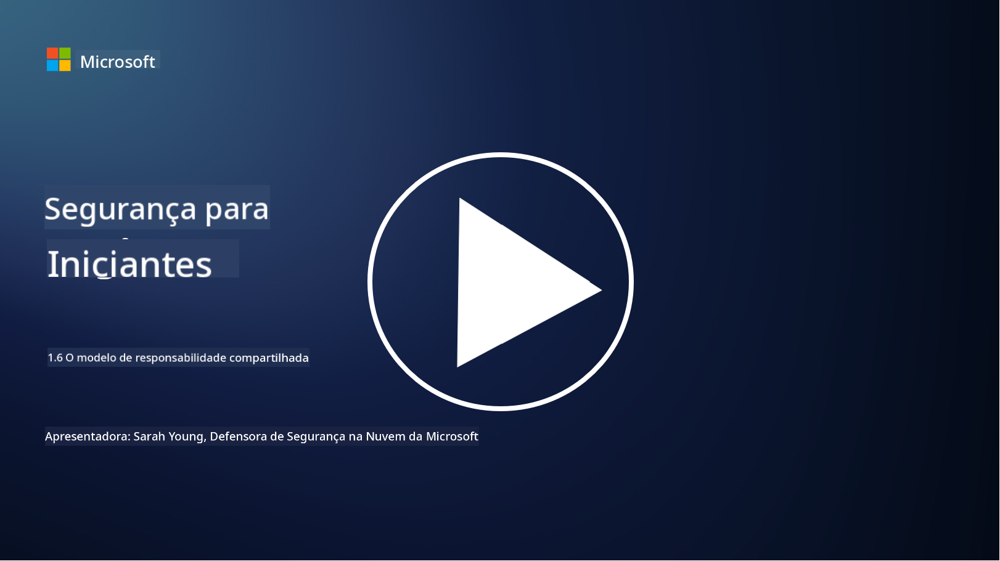

<!--
CO_OP_TRANSLATOR_METADATA:
{
  "original_hash": "a48db640d80c786b928ca178c414f084",
  "translation_date": "2025-09-03T21:03:38+00:00",
  "source_file": "1.6 Shared responsibility model.md",
  "language_code": "br"
}
-->
# O modelo de responsabilidade compartilhada

Responsabilidade compartilhada é um conceito mais recente na TI que surgiu com o advento da computação em nuvem. Do ponto de vista da cibersegurança, é fundamental entender quem está fornecendo quais controles de segurança para que não haja lacunas na defesa.

## Introdução

Nesta lição, abordaremos:

 - O que é responsabilidade compartilhada no contexto da cibersegurança?
   
 - Qual é a diferença na responsabilidade compartilhada pelos controles de segurança entre IaaS, PaaS e SaaS?

 - Onde você pode descobrir quais controles de segurança sua plataforma de nuvem está fornecendo?

 - O que significa "confiar, mas verificar"?

## O que é responsabilidade compartilhada no contexto da cibersegurança?

Responsabilidade compartilhada na cibersegurança refere-se à distribuição de responsabilidades de segurança entre um provedor de serviços de nuvem (CSP) e seus clientes. Em ambientes de computação em nuvem, como Infraestrutura como Serviço (IaaS), Plataforma como Serviço (PaaS) e Software como Serviço (SaaS), tanto o CSP quanto o cliente têm papéis a desempenhar para garantir a segurança dos dados, aplicativos e sistemas.

## Qual é a diferença na responsabilidade compartilhada pelos controles de segurança entre IaaS, PaaS e SaaS?

A divisão de responsabilidades geralmente depende do tipo de serviço de nuvem utilizado:

 - **IaaS (Infraestrutura como Serviço)**: O CSP fornece a infraestrutura básica (servidores, rede, armazenamento), enquanto o cliente é responsável por gerenciar os sistemas operacionais, aplicativos e configurações de segurança nessa infraestrutura.
   
 - **PaaS (Plataforma como Serviço):** O CSP oferece uma plataforma na qual os clientes podem construir e implantar aplicativos. O CSP gerencia a infraestrutura subjacente, e o cliente foca no desenvolvimento de aplicativos e na segurança dos dados.

 - **SaaS (Software como Serviço)**: O CSP fornece aplicativos totalmente funcionais acessíveis pela internet. Nesse caso, o CSP é responsável pela segurança do aplicativo e da infraestrutura, enquanto o cliente gerencia o acesso dos usuários e o uso dos dados.

Compreender a responsabilidade compartilhada é essencial porque esclarece quais aspectos de segurança são cobertos pelo CSP e quais o cliente precisa abordar. Isso ajuda a evitar mal-entendidos e garante que as medidas de segurança sejam implementadas de forma holística.

## Onde você pode descobrir quais controles de segurança sua plataforma de nuvem está fornecendo?

Para descobrir quais controles de segurança sua plataforma de nuvem está fornecendo, você deve consultar a documentação e os recursos do provedor de serviços de nuvem. Isso inclui:

 - **Site e documentação do CSP**: o site do CSP terá informações sobre os recursos e controles de segurança oferecidos como parte de seus serviços. Os CSPs geralmente oferecem documentação detalhada que explica suas práticas de segurança, controles e recomendações. Isso pode incluir whitepapers, guias de segurança e documentação técnica.
   
 - **Avaliações e auditorias de segurança**: a maioria dos CSPs tem seus controles de segurança avaliados por especialistas independentes e organizações de segurança. Essas análises podem fornecer insights sobre a qualidade das medidas de segurança do CSP. Às vezes, isso resulta na obtenção de certificados de conformidade de segurança pelo CSP (veja o próximo ponto).
   
 - **Certificações de conformidade de segurança**: a maioria dos CSPs obtém certificações como ISO:27001, SOC 2 e FedRAMP, entre outras. Essas certificações demonstram que o provedor atende a padrões específicos de segurança e conformidade.

Lembre-se de que o nível de detalhe e a disponibilidade das informações podem variar entre os provedores de nuvem. Sempre certifique-se de consultar recursos oficiais e atualizados fornecidos pelo provedor de serviços de nuvem para tomar decisões informadas sobre a segurança de seus ativos baseados na nuvem.

## O que significa "confiar, mas verificar"?

No contexto de usar um CSP, software de terceiros ou outro serviço de segurança de TI, uma organização pode inicialmente confiar nas alegações do provedor sobre as medidas de segurança. No entanto, para realmente garantir a segurança de seus dados e sistemas, é necessário verificar essas alegações por meio de avaliações de segurança, testes de penetração e uma revisão dos controles de segurança da parte externa antes de integrar totalmente o software ou serviço às suas operações. Todas as pessoas e organizações devem buscar confiar, mas verificar os controles de segurança pelos quais não são responsáveis.

## Responsabilidade compartilhada dentro de uma organização

Lembre-se de que a responsabilidade compartilhada pela segurança dentro de uma organização entre diferentes equipes também precisa ser levada em conta. A equipe de segurança raramente implementará todos os controles sozinha e precisará colaborar com equipes de operações, desenvolvedores e outras partes do negócio para implementar todos os controles de segurança necessários para manter a organização segura.

## Leituras adicionais
- [Shared responsibility in the cloud - Microsoft Azure | Microsoft Learn](https://learn.microsoft.com/azure/security/fundamentals/shared-responsibility?WT.mc_id=academic-96948-sayoung)
- [What is shared responsibility model? – Definition from TechTarget.com](https://www.techtarget.com/searchcloudcomputing/definition/shared-responsibility-model)
- [The shared responsibility model explained and what it means for cloud security | CSO Online](https://www.csoonline.com/article/570779/the-shared-responsibility-model-explained-and-what-it-means-for-cloud-security.html)
- [Shared Responsibility for Cloud Security: What You Need to Know (cisecurity.org)](https://www.cisecurity.org/insights/blog/shared-responsibility-cloud-security-what-you-need-to-know)

---

**Aviso Legal**:  
Este documento foi traduzido utilizando o serviço de tradução por IA [Co-op Translator](https://github.com/Azure/co-op-translator). Embora nos esforcemos para garantir a precisão, esteja ciente de que traduções automatizadas podem conter erros ou imprecisões. O documento original em seu idioma nativo deve ser considerado a fonte autoritativa. Para informações críticas, recomenda-se a tradução profissional realizada por humanos. Não nos responsabilizamos por quaisquer mal-entendidos ou interpretações equivocadas decorrentes do uso desta tradução.