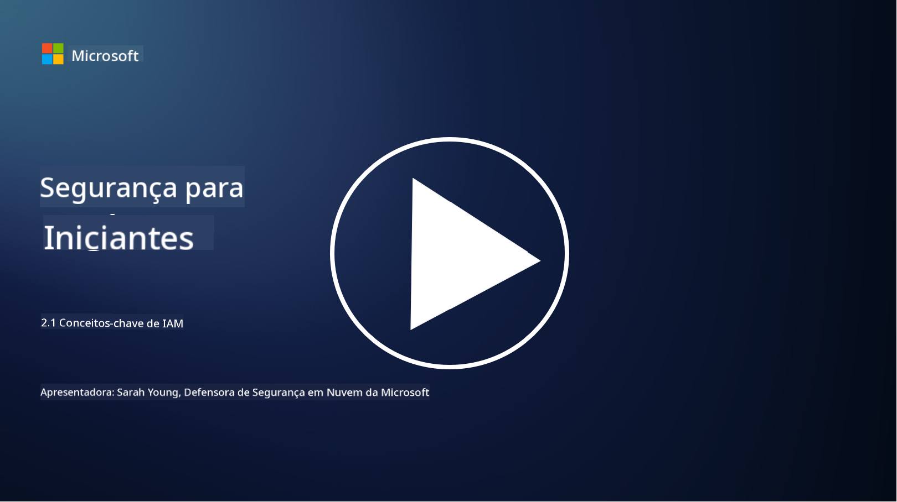

<!--
CO_OP_TRANSLATOR_METADATA:
{
  "original_hash": "2e3864e3d579f0dbb4ac2ec8c5f82acf",
  "translation_date": "2025-09-03T19:35:01+00:00",
  "source_file": "2.1 IAM key concepts.md",
  "language_code": "br"
}
-->
# Conceitos-chave de IAM

Você já fez login em um computador ou site? Claro que sim! Isso significa que você já utilizou controles de identidade no seu dia a dia. Gerenciamento de Identidade e Acesso (IAM) é um pilar essencial da segurança, e vamos aprender mais sobre isso nas próximas lições.

**Introdução**

Nesta lição, vamos abordar:

- O que queremos dizer com gerenciamento de identidade e acesso (IAM) no
  contexto da cibersegurança?
  
- O que é o princípio do menor privilégio?
  
- O que é segregação de funções?
  
- O que são autenticação e autorização?

## O que queremos dizer com gerenciamento de identidade e acesso (IAM) no contexto da cibersegurança?

Gerenciamento de Identidade e Acesso (IAM) refere-se a um conjunto de processos, tecnologias e políticas implementados para garantir que as pessoas certas tenham o acesso adequado aos recursos dentro do ambiente digital de uma organização. IAM envolve o gerenciamento de identidades digitais (usuários, funcionários, parceiros) e seu acesso a sistemas, aplicativos, dados e redes. O objetivo principal do IAM é melhorar a segurança, simplificar o acesso dos usuários e garantir conformidade com as políticas e regulamentações organizacionais. As soluções de IAM geralmente incluem autenticação de usuários, autorização, provisionamento de identidades, controle de acesso e gerenciamento do ciclo de vida do usuário (garantindo que contas sejam excluídas quando não estiverem mais em uso).

## O que é o princípio do menor privilégio?

O princípio do menor privilégio é um conceito fundamental que defende conceder a usuários e sistemas apenas os privilégios mínimos necessários para realizar suas tarefas ou funções. Esse princípio ajuda a limitar os danos potenciais em caso de uma violação de segurança ou ameaça interna. Ao aderir ao princípio do menor privilégio, as organizações reduzem a superfície de ataque e minimizam o risco de acesso não autorizado, vazamentos de dados e uso indevido de privilégios. Na prática, isso significa que os usuários recebem acesso apenas aos recursos e funcionalidades específicas necessárias para suas funções de trabalho, e nada mais. Por exemplo, se você só precisa ler um documento, seria excessivo receber privilégios administrativos completos para esse documento.

## O que é segregação de funções?

Segregação de funções é um princípio que visa prevenir conflitos de interesse e reduzir o risco de fraudes e erros, distribuindo tarefas e responsabilidades críticas entre diferentes indivíduos dentro de uma organização. No contexto da cibersegurança, a segregação de funções envolve garantir que nenhum indivíduo tenha controle sobre todos os aspectos de um processo ou sistema crítico. O objetivo é criar um sistema de verificações e balanços que impeça qualquer pessoa de realizar tanto a configuração quanto a aprovação de um processo. Por exemplo, em sistemas financeiros, isso pode determinar que a pessoa que insere transações no sistema não seja a mesma que aprova essas transações. Isso reduz o risco de ações não autorizadas ou fraudulentas passarem despercebidas.

## O que são autenticação e autorização?

Autenticação e autorização são dois conceitos fundamentais na cibersegurança que desempenham um papel crucial na garantia da segurança e integridade de sistemas computacionais e dados. Eles são frequentemente usados em conjunto para controlar o acesso a recursos e proteger informações sensíveis.

**1. Autenticação**: Autenticação é o processo de verificar a identidade de um usuário, sistema ou entidade que tenta acessar um sistema computacional ou recurso específico. Ela garante que a identidade reivindicada seja genuína e precisa. Os métodos de autenticação geralmente envolvem o uso de um ou mais dos seguintes fatores:
    
    a. Algo que você sabe: Inclui senhas, PINs ou outros conhecimentos secretos que apenas o usuário autorizado deve possuir.
    
    b. Algo que você tem: Envolve tokens físicos ou dispositivos como cartões inteligentes, tokens de segurança ou telefones celulares usados para confirmar a identidade do usuário.
    
    c. Algo que você é: Refere-se a fatores biométricos como impressões digitais, reconhecimento facial ou escaneamento de retina, que são únicos para cada indivíduo.
    

Os mecanismos de autenticação são usados para confirmar que um usuário é quem afirma ser antes de permitir o acesso a um sistema ou recurso. Isso ajuda a prevenir acessos não autorizados e garante que apenas usuários legítimos possam realizar ações dentro de um sistema.

**2. Autorização**: Autorização é o processo de conceder ou negar permissões e privilégios específicos a usuários ou entidades autenticados após sua identidade ter sido verificada. Ela determina quais ações ou operações um usuário pode realizar dentro de um sistema ou em recursos específicos. A autorização geralmente é baseada em políticas predefinidas, regras de controle de acesso e funções atribuídas aos usuários.

A autorização pode ser vista como a resposta à pergunta: "O que um usuário autenticado pode fazer?" Ela envolve definir e aplicar políticas de controle de acesso para proteger dados e recursos sensíveis contra acessos ou modificações não autorizados.

**Resumindo:**

- Autenticação estabelece a identidade de usuários ou entidades.
- Autorização determina quais ações e recursos usuários autenticados podem acessar ou manipular.

## Leitura adicional

- [Describe identity concepts - Training | Microsoft Learn](https://learn.microsoft.com/training/modules/describe-identity-principles-concepts/?WT.mc_id=academic-96948-sayoung)
- [Introduction to identity - Microsoft Entra | Microsoft Learn](https://learn.microsoft.com/azure/active-directory/fundamentals/identity-fundamental-concepts?WT.mc_id=academic-96948-sayoung)
- [What is Identity Access Management (IAM)? | Microsoft Security](https://www.microsoft.com/security/business/security-101/what-is-identity-access-management-iam?WT.mc_id=academic-96948-sayoung)
- [What is IAM? Identity and access management explained | CSO Online](https://www.csoonline.com/article/518296/what-is-iam-identity-and-access-management-explained.html)
- [What is IAM? (auth0.com)](https://auth0.com/blog/what-is-iam/)
- [Security+: implementing Identity and Access Management (IAM) controls [updated 2021] | Infosec (infosecinstitute.com)](https://resources.infosecinstitute.com/certifications/securityplus/security-implementing-identity-and-access-management-iam-controls/)
- [least privilege - Glossary | CSRC (nist.gov)](https://csrc.nist.gov/glossary/term/least_privilege)
- [Security: The Principle of Least Privilege (POLP) - Microsoft Community Hub](https://techcommunity.microsoft.com/t5/azure-sql-blog/security-the-principle-of-least-privilege-polp/ba-p/2067390?WT.mc_id=academic-96948-sayoung)
- [Principle of least privilege | CERT NZ](https://www.cert.govt.nz/it-specialists/critical-controls/principle-of-least-privilege/)
- [Why is separation of duties required by NIST 800-171 and CMMC? - (totem.tech)](https://www.totem.tech/cmmc-separation-of-duties/)

---

**Aviso Legal**:  
Este documento foi traduzido utilizando o serviço de tradução por IA [Co-op Translator](https://github.com/Azure/co-op-translator). Embora nos esforcemos para garantir a precisão, esteja ciente de que traduções automatizadas podem conter erros ou imprecisões. O documento original em seu idioma nativo deve ser considerado a fonte autoritativa. Para informações críticas, recomenda-se a tradução profissional realizada por humanos. Não nos responsabilizamos por quaisquer mal-entendidos ou interpretações equivocadas decorrentes do uso desta tradução.