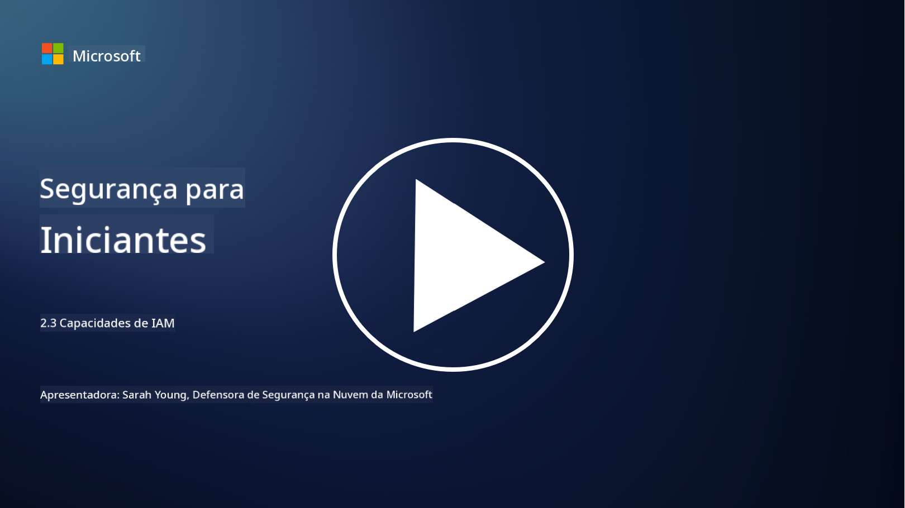

<!--
CO_OP_TRANSLATOR_METADATA:
{
  "original_hash": "bf0b8a54f2c69951744df5a94bc923f7",
  "translation_date": "2025-09-03T22:09:25+00:00",
  "source_file": "2.3 IAM capabilities.md",
  "language_code": "br"
}
-->
# Capacidades de IAM

Nesta seção, abordaremos mais detalhes sobre as principais ferramentas e capacidades utilizadas na segurança de identidade.

## Introdução

Nesta lição, abordaremos:

 - O que é um serviço de diretório?
      
     
    
 - Que tipo de capacidades podem ser usadas para proteger identidades?
>
>        Autenticação Multifator (MFA)
> 
>        Single Sign-On (SSO)
> 
>        Controle de Acesso Baseado em Funções (RBAC)
> 
>        Autenticação Adaptativa
> 
>        Autenticação Biométrica
> 
>        Gerenciamento de Acesso Privilegiado (PAM)
> 
>        Governança e Administração de Identidade (IGA)
> 
>        Análise Comportamental

## O que é um serviço de diretório?

Um serviço de diretório é um banco de dados especializado que armazena e gerencia informações sobre recursos de rede, incluindo usuários, grupos, dispositivos, aplicativos e outros objetos. Ele serve como um repositório centralizado de dados relacionados à identidade e acesso, permitindo que as organizações gerenciem e controlem autenticação, autorização e outras tarefas relacionadas à segurança de forma eficiente.

Os serviços de diretório desempenham um papel crucial nos ambientes de TI modernos, fornecendo a base para soluções de gerenciamento de identidade e acesso (IAM). Eles facilitam o acesso seguro a recursos, aplicam políticas de acesso e simplificam tarefas administrativas. Um dos serviços de diretório mais conhecidos é o Microsoft Active Directory, mas existem outras soluções, como diretórios LDAP (Lightweight Directory Access Protocol), que têm propósitos semelhantes.

As principais funções e características de um serviço de diretório no contexto da cibersegurança incluem:

 - **Autenticação de Usuário**: Os serviços de diretório validam as credenciais dos usuários (como nomes de usuário e senhas) para garantir que apenas usuários autorizados possam acessar a rede e seus recursos.
 - **Autorização de Usuário**: Eles determinam o nível de acesso que cada usuário possui com base em sua função, associação a grupos e outros atributos. Isso garante que os usuários possam acessar apenas os recursos aos quais têm direito.
 - **Gerenciamento de Grupos**: Os serviços de diretório permitem que os administradores organizem usuários em grupos lógicos, simplificando o gerenciamento de controle de acesso. Permissões podem ser atribuídas a grupos em vez de usuários individuais.
 - **Políticas de Senhas**: Eles aplicam regras de complexidade e expiração de senhas, aumentando a segurança das contas de usuário.
 - **Single Sign-On (SSO)**: Alguns serviços de diretório suportam SSO, permitindo que os usuários acessem múltiplos aplicativos e serviços com um único conjunto de credenciais.
 - **Gerenciamento Centralizado de Usuários**: Os serviços de diretório centralizam as informações dos usuários, facilitando o gerenciamento de contas, perfis e atributos a partir de um único local.
 - **Auditoria e Registro**: Eles podem registrar atividades de autenticação e acesso de usuários, auxiliando em auditorias de segurança e esforços de conformidade.

## Que tipo de capacidades podem ser usadas para proteger identidades?

**Autenticação Multifator (MFA)**

A MFA exige que os usuários forneçam múltiplas formas de verificação antes de conceder acesso. Isso geralmente inclui algo que o usuário sabe (senha), algo que o usuário possui (smartphone ou token de segurança) e algo que o usuário é (dados biométricos como impressão digital ou reconhecimento facial).

**Single Sign-On (SSO)**

O SSO permite que os usuários acessem múltiplos aplicativos e sistemas com um único conjunto de credenciais. Isso melhora a experiência do usuário e reduz os riscos associados ao gerenciamento de várias senhas.

**Controle de Acesso Baseado em Funções (RBAC)**

O RBAC atribui permissões com base em funções predefinidas. Os usuários recebem acesso com base em suas funções dentro da organização.

**Autenticação Adaptativa**

A autenticação adaptativa avalia fatores de risco, como localização, dispositivo, horário de acesso e comportamento do usuário, para ajustar dinamicamente o nível de autenticação necessário. Se uma solicitação parecer suspeita, etapas adicionais de autenticação podem ser acionadas.

**Autenticação Biométrica**

A autenticação biométrica utiliza características biológicas únicas, como impressões digitais, traços faciais, padrões de voz e até mesmo características comportamentais, como velocidade de digitação, para verificação de identidade.

**Gerenciamento de Acesso Privilegiado (PAM)**

O PAM foca em proteger o acesso a sistemas e dados críticos, aplicando controles rigorosos sobre contas privilegiadas. Inclui recursos como acesso just-in-time e monitoramento de sessões.

**Governança e Administração de Identidade (IGA)**

As soluções de IGA gerenciam identidades de usuários e seus acessos a recursos ao longo de seu ciclo de vida. Isso inclui integração, provisionamento, controle de acesso baseado em funções e desprovisionamento.

**Análise Comportamental**

A análise comportamental monitora o comportamento dos usuários e estabelece padrões de referência. Desvios da norma podem gerar alertas para investigação adicional.

# Leitura adicional
- [Documentação sobre fundamentos do Azure Active Directory - Microsoft Entra | Microsoft Learn](https://learn.microsoft.com/azure/active-directory/fundamentals/?WT.mc_id=academic-96948-sayoung)
- [O que é o Azure Active Directory? - Microsoft Entra | Microsoft Learn](https://learn.microsoft.com/azure/active-directory/fundamentals/whatis?WT.mc_id=academic-96948-sayoung)
- [Gerencie sua infraestrutura de identidade multi-cloud com o Microsoft Entra - YouTube](https://www.youtube.com/watch?v=9qQiq3wTS2Y&list=PLXtHYVsvn_b_gtX1-NB62wNervQx1Fhp4&index=18)

---

**Aviso Legal**:  
Este documento foi traduzido utilizando o serviço de tradução por IA [Co-op Translator](https://github.com/Azure/co-op-translator). Embora nos esforcemos para garantir a precisão, esteja ciente de que traduções automatizadas podem conter erros ou imprecisões. O documento original em seu idioma nativo deve ser considerado a fonte autoritativa. Para informações críticas, recomenda-se a tradução profissional realizada por humanos. Não nos responsabilizamos por quaisquer mal-entendidos ou interpretações equivocadas decorrentes do uso desta tradução.