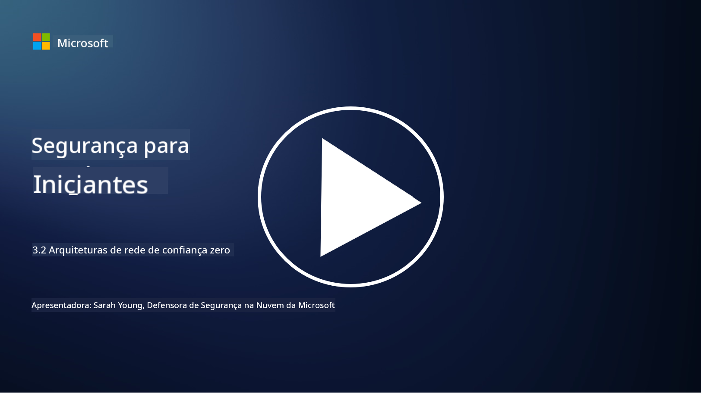

<!--
CO_OP_TRANSLATOR_METADATA:
{
  "original_hash": "680d6e14d9d33fc471c22f44679713f8",
  "translation_date": "2025-09-03T21:12:55+00:00",
  "source_file": "3.2 Networking zero trust architecture.md",
  "language_code": "br"
}
-->
# Arquiteturas de rede com confiança zero

A rede fornece uma camada crucial nos controles de confiança zero. Nesta lição, aprenderemos mais sobre:

- O que é segmentação de rede?  
- Como a segmentação de rede ajuda a implementar confiança zero?  
- O que é criptografia de ponta a ponta?

## O que é segmentação de rede?

Segmentação de rede é a prática de dividir uma rede em segmentos menores e isolados ou sub-redes. Cada segmento é isolado dos outros, e o acesso entre os segmentos é controlado e restrito com base em políticas de segurança específicas. A segmentação de rede é usada para melhorar a segurança, contendo o impacto de possíveis violações e limitando o movimento lateral de atacantes dentro da rede.

Ao implementar a segmentação de rede, uma organização pode criar "zonas" que separam diferentes tipos de usuários, aplicativos e dados. Isso reduz a superfície de ataque e minimiza os danos potenciais causados por um incidente de segurança. A segmentação de rede pode ser realizada por meio de tecnologias como VLANs (redes locais virtuais), firewalls e controles de acesso.

## Como a segmentação de rede ajuda a implementar confiança zero?

A segmentação de rede está alinhada aos princípios do modelo de confiança zero. Em uma arquitetura de confiança zero, a segmentação de rede ajuda a aplicar o princípio de "menor privilégio", garantindo que usuários e dispositivos tenham acesso apenas aos recursos e serviços específicos necessários para realizar suas tarefas. Ao segmentar a rede em zonas menores, as organizações podem implementar controles de acesso rigorosos, isolar ativos críticos e impedir o movimento lateral de atacantes.

A segmentação de rede também auxilia na aplicação de controles de acesso baseados em identidade, onde usuários e dispositivos são autenticados e autorizados de forma rigorosa antes de acessar segmentos específicos. Isso evita o acesso não autorizado a recursos sensíveis e reduz o impacto potencial de credenciais comprometidas.

## O que é criptografia de ponta a ponta?

Criptografia de ponta a ponta (E2E) é uma medida de segurança que garante que os dados permaneçam criptografados durante toda a sua jornada, desde o remetente até o destinatário. Nesse processo, os dados são criptografados na origem, e apenas o destinatário possui a chave de descriptografia para desbloquear e ler os dados. Os processos de criptografia e descriptografia ocorrem nos pontos finais, tornando extremamente difícil para partes não autorizadas, incluindo provedores de serviços e intermediários, acessarem os dados em texto claro.

A criptografia de ponta a ponta oferece um alto nível de confidencialidade e segurança na transmissão de dados, mesmo que os dados passem por vários sistemas ou redes intermediárias. É comumente usada em aplicativos de mensagens seguras, serviços de e-mail e outras plataformas de comunicação para proteger informações sensíveis contra interceptação e acesso não autorizado.

Esse método de criptografia garante que, mesmo que atacantes consigam acessar os dados em trânsito, eles verão apenas conteúdo criptografado, que é inútil sem a chave de descriptografia. A criptografia de ponta a ponta desempenha um papel crucial na proteção da privacidade do usuário e na segurança de informações sensíveis contra exposição a partes não autorizadas.

## O que é SASE?

SASE significa "Secure Access Service Edge" (Borda de Serviço de Acesso Seguro) e é uma estrutura e arquitetura de cibersegurança que combina segurança de rede e capacidades de rede de longa distância (WAN) em um único serviço baseado na nuvem. O SASE é projetado para fornecer acesso seguro e escalável a recursos de rede, aplicativos e dados para usuários remotos e móveis, simplificando o gerenciamento de rede e reduzindo a complexidade das arquiteturas tradicionais de rede e segurança.

Características e componentes principais do SASE incluem:

1. **Baseado na Nuvem:** O SASE é fornecido como um serviço na nuvem, o que significa que as funções de segurança e rede são disponibilizadas a partir da nuvem, em vez de depender de hardware e dispositivos locais tradicionais.

2. **Integração de Segurança e Rede:** O SASE integra vários serviços de segurança, como gateways web seguros (SWG), firewall como serviço (FWaaS), prevenção contra perda de dados (DLP), acesso à rede com confiança zero (ZTNA) e otimização de WAN com capacidades de rede de longa distância. Essa integração ajuda a simplificar as operações de segurança e rede.

3. **Confiança Zero:** O SASE opera com base no princípio de confiança zero, o que significa que aplica controles de acesso rigorosos e políticas de menor privilégio. Usuários e dispositivos não são confiáveis por padrão e devem ser autenticados e autorizados antes de acessar recursos.

4. **Foco em Identidade:** O SASE concentra-se em identidades de usuários e dispositivos como base para controle de acesso. Políticas baseadas em identidade e contexto são usadas para determinar permissões de acesso, e essas políticas se adaptam dinamicamente com base no comportamento e contexto do usuário.

5. **Escalabilidade e Flexibilidade:** O SASE pode escalar facilmente para acomodar um grande número de usuários e dispositivos, tornando-o adequado para organizações com necessidades de rede e segurança diversificadas e em constante evolução.

O SASE é particularmente relevante na era moderna de trabalho remoto e adoção de nuvem, pois oferece uma abordagem abrangente e ágil para proteger e gerenciar o acesso à rede. Ele ajuda as organizações a se adaptarem às mudanças nas exigências de segurança e rede, mantendo um forte foco em modelos de segurança centrados no usuário e confiança zero.

## Leituras adicionais

- [O que é segmentação de rede? - Cisco](https://www.cisco.com/c/en/us/products/security/what-is-network-segmentation.html#~benefits)  
- [O que é micro-segmentação? - Cisco](https://www.cisco.com/c/en/us/products/security/what-is-microsegmentation.html)  
- [Implementando segmentação e segregação de rede | Cyber.gov.au](https://www.cyber.gov.au/resources-business-and-government/maintaining-devices-and-systems/system-hardening-and-administration/network-hardening/implementing-network-segmentation-and-segregation)  
- [O que é segmentação de rede e por que ela é importante | CompTIA](https://www.comptia.org/blog/security-awareness-training-network-segmentation)  
- [Segmentação de rede: conceitos e práticas (cmu.edu)](https://insights.sei.cmu.edu/blog/network-segmentation-concepts-and-practices/)  
- [Proteja redes com confiança zero | Microsoft Learn](https://learn.microsoft.com/security/zero-trust/deploy/networks?WT.mc_id=academic-96948-sayoung)  
- [O que é criptografia de ponta a ponta? | IBM](https://www.ibm.com/topics/end-to-end-encryption)  
- [O que é criptografia de ponta a ponta e por que ela é importante? (howtogeek.com)](https://www.howtogeek.com/711656/what-is-end-to-end-encryption-and-why-does-it-matter/)  
- [Definição de Secure Access Service Edge (SASE) - Glossário de TI da Gartner](https://www.gartner.com/en/information-technology/glossary/secure-access-service-edge-sase)  
- [O que é Secure Access Service Edge (SASE)? | Microsoft Security](https://www.microsoft.com/security/business/security-101/what-is-sase?WT.mc_id=academic-96948-sayoung)  

---

**Aviso Legal**:  
Este documento foi traduzido utilizando o serviço de tradução por IA [Co-op Translator](https://github.com/Azure/co-op-translator). Embora nos esforcemos para garantir a precisão, esteja ciente de que traduções automatizadas podem conter erros ou imprecisões. O documento original em seu idioma nativo deve ser considerado a fonte autoritativa. Para informações críticas, recomenda-se a tradução profissional realizada por humanos. Não nos responsabilizamos por quaisquer mal-entendidos ou interpretações equivocadas decorrentes do uso desta tradução.