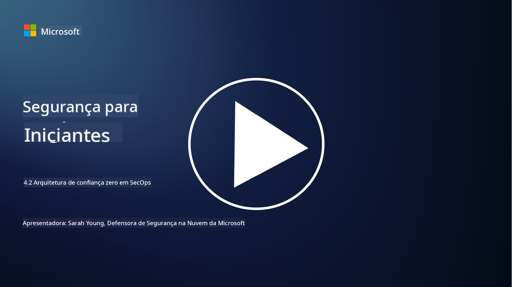

<!--
CO_OP_TRANSLATOR_METADATA:
{
  "original_hash": "45bbdc114e70936816b0b3e7c40189cf",
  "translation_date": "2025-09-03T21:18:55+00:00",
  "source_file": "4.2 SecOps zero trust architecture.md",
  "language_code": "br"
}
-->
# Arquitetura de confiança zero em operações de segurança

As operações de segurança formam duas partes da arquitetura de confiança zero, e nesta lição aprenderemos sobre ambas:

- Como as arquiteturas de TI devem ser construídas para permitir a coleta centralizada de logs?

- Quais são as melhores práticas para operações de segurança em ambientes modernos de TI?

## Como as arquiteturas de TI devem ser construídas para permitir a coleta centralizada de logs?

A coleta centralizada de logs é um componente essencial das operações de segurança modernas. Ela permite que as organizações agreguem logs e dados de várias fontes, como servidores, aplicativos, dispositivos de rede e ferramentas de segurança, em um repositório central para análise, monitoramento e resposta a incidentes. Aqui estão algumas melhores práticas para construir arquiteturas de TI que suportem a coleta centralizada de logs:

1. **Integração de fontes de logs**:

- Certifique-se de que todos os dispositivos e sistemas relevantes estejam configurados para gerar logs. Isso inclui servidores, firewalls, roteadores, switches, aplicativos e dispositivos de segurança.

- Configure as fontes de logs para encaminhar os logs para um coletor ou sistema de gerenciamento centralizado.

2. **Escolha da ferramenta SIEM (Gerenciamento de Informações e Eventos de Segurança)**:

- Escolha uma solução SIEM que esteja alinhada às necessidades e ao tamanho da sua organização.

- Certifique-se de que a solução escolhida suporte coleta, agregação, análise e geração de relatórios de logs.

3. **Escalabilidade e Redundância**:

- Projete a arquitetura para ser escalável, acomodando um número crescente de fontes de logs e maior volume de dados.

- Implemente redundância para alta disponibilidade, evitando interrupções devido a falhas de hardware ou rede.

4. **Transporte seguro de logs**:

- Utilize protocolos seguros como TLS/SSL ou IPsec para transportar os logs das fontes até o repositório centralizado.

- Implemente autenticação e controles de acesso para garantir que apenas dispositivos autorizados possam enviar logs.

5. **Normalização**:

- Padronize os formatos de logs e normalize os dados para garantir consistência e facilitar a análise.

6. **Armazenamento e retenção**:

- Determine o período de retenção adequado para os logs com base em requisitos de conformidade e segurança.

- Armazene os logs de forma segura, protegendo-os contra acesso não autorizado e adulteração.

## Quais são as melhores práticas para operações de segurança em ambientes modernos de TI?

Além da coleta centralizada de logs, aqui estão algumas melhores práticas para operações de segurança em ambientes modernos de TI:

1. **Monitoramento contínuo**: Implemente monitoramento contínuo das atividades da rede e dos sistemas para detectar e responder a ameaças em tempo real.

2. **Inteligência de ameaças**: Mantenha-se informado sobre ameaças e vulnerabilidades emergentes utilizando feeds e serviços de inteligência de ameaças.

3. **Treinamento de usuários**: Realize treinamentos regulares de conscientização em segurança para os funcionários, reduzindo os riscos associados a engenharia social e ataques de phishing.

4. **Plano de resposta a incidentes**: Desenvolva e teste um plano de resposta a incidentes para garantir uma resposta rápida e eficaz a incidentes de segurança.

5. **Automação de segurança**: Utilize ferramentas de automação e orquestração de segurança para agilizar a resposta a incidentes e tarefas repetitivas.

6. **Backup e recuperação**: Implemente soluções robustas de backup e recuperação de desastres para garantir a disponibilidade dos dados em caso de perda ou ataques de ransomware.

## Leitura adicional

- [Módulo de Melhores Práticas de Segurança da Microsoft: Operações de segurança | Microsoft Learn](https://learn.microsoft.com/security/operations/security-operations-videos-and-decks?WT.mc_id=academic-96948-sayoung)
- [Operações de segurança - Cloud Adoption Framework | Microsoft Learn](https://learn.microsoft.com/azure/cloud-adoption-framework/secure/security-operations?WT.mc_id=academic-96948-sayoung)
- [O que é Arquitetura de Plataforma de Operações e Análise de Segurança? Uma definição de SOAPA, como funciona, benefícios e mais (digitalguardian.com)](https://www.digitalguardian.com/blog/what-security-operations-and-analytics-platform-architecture-definition-soapa-how-it-works#:~:text=All%20in%20all%2C%20security%20operations%20and%20analytics%20platform,become%20more%20efficient%20and%20operative%20with%20your%20security.)

---

**Aviso Legal**:  
Este documento foi traduzido utilizando o serviço de tradução por IA [Co-op Translator](https://github.com/Azure/co-op-translator). Embora nos esforcemos para garantir a precisão, esteja ciente de que traduções automatizadas podem conter erros ou imprecisões. O documento original em seu idioma nativo deve ser considerado a fonte autoritativa. Para informações críticas, recomenda-se a tradução profissional realizada por humanos. Não nos responsabilizamos por quaisquer mal-entendidos ou interpretações equivocadas decorrentes do uso desta tradução.