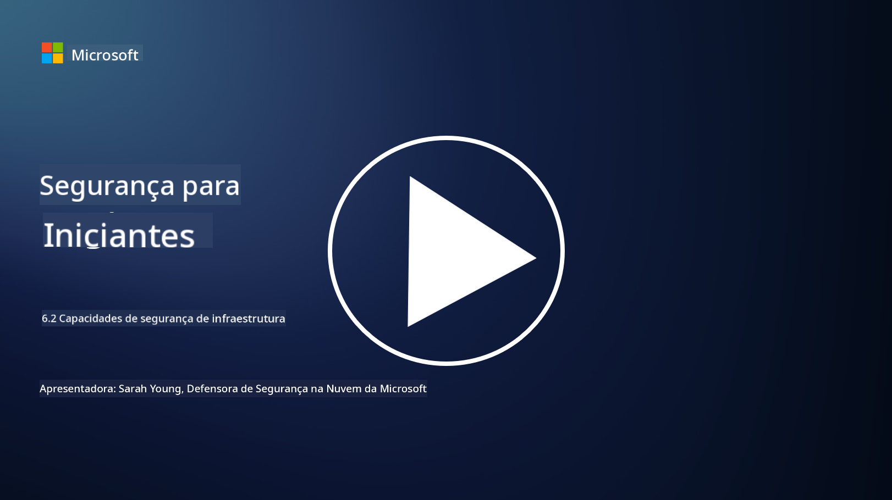

<!--
CO_OP_TRANSLATOR_METADATA:
{
  "original_hash": "7d79ba0e7668b3bdae1fba7aa047f6c0",
  "translation_date": "2025-09-03T20:51:31+00:00",
  "source_file": "6.2 Infrastructure security capabilities.md",
  "language_code": "br"
}
-->
# Capacidades de segurança de infraestrutura

Nesta seção, abordaremos mais detalhes sobre as principais ferramentas e capacidades utilizadas na segurança de infraestrutura.

**Introdução**

Nesta lição, abordaremos:

- O que é gerenciamento de vulnerabilidades?

- O que é CSPM?

- O que é CNAPP?

## O que é gerenciamento de vulnerabilidades?

O gerenciamento de vulnerabilidades é um processo sistemático de identificar, avaliar, priorizar, mitigar e monitorar vulnerabilidades em sistemas computacionais, softwares, redes e infraestrutura. O objetivo principal do gerenciamento de vulnerabilidades é reduzir a exposição de uma organização a riscos de segurança, abordando proativamente vulnerabilidades conhecidas antes que possam ser exploradas por agentes mal-intencionados. Aqui está uma visão geral das etapas principais envolvidas:

Identificação: Escanear e descobrir vulnerabilidades nos ativos da organização, que podem incluir servidores, aplicativos, dispositivos de rede e endpoints.

Avaliação: Avaliar a gravidade e o impacto potencial de cada vulnerabilidade com base em fatores como a pontuação do Common Vulnerability Scoring System (CVSS) e o contexto do negócio.

Priorização: Classificar as vulnerabilidades com base no nível de risco e no impacto potencial nas operações e dados da organização.

Mitigação: Desenvolver e implementar estratégias para remediar ou mitigar vulnerabilidades, o que pode incluir a aplicação de patches, configuração de definições de segurança ou implantação de controles compensatórios.

Verificação: Confirmar que as medidas de mitigação foram eficazes para resolver as vulnerabilidades.

Monitoramento Contínuo: Acompanhamento contínuo de vulnerabilidades e ameaças potenciais, com escaneamentos e avaliações regulares.

O gerenciamento de vulnerabilidades é um componente crítico da cibersegurança, ajudando as organizações a manter uma postura de segurança robusta e a reduzir a probabilidade de violações de segurança. Exemplos de ferramentas de gerenciamento de vulnerabilidades incluem Defender for Cloud, Nessus e Qualys.

## O que é CSPM?

Cloud Security Posture Management (CSPM) é um conjunto de ferramentas, processos e práticas projetados para avaliar, monitorar e aplicar configurações de segurança e melhores práticas em ambientes de nuvem. As soluções CSPM ajudam as organizações a identificar e corrigir configurações incorretas, lacunas de segurança e violações de conformidade em sua infraestrutura de nuvem, como na Amazon Web Services (AWS), Microsoft Azure, Google Cloud Platform (GCP) e outros provedores de nuvem.

Os principais aspectos do CSPM incluem:

- Avaliação de Configuração: Escanear recursos e serviços na nuvem para identificar configurações incorretas, definições inseguras e desvios das melhores práticas de segurança.

- Aplicação de Políticas de Segurança: Aplicar políticas de segurança e padrões de conformidade em ambientes de nuvem, corrigindo automaticamente configurações incorretas ou gerando alertas.

- Monitoramento Contínuo: Fornecer visibilidade contínua sobre a postura de segurança de ativos e recursos na nuvem, com alertas em tempo real para incidentes de segurança.

- Relatórios de Conformidade: Gerar relatórios e painéis para demonstrar conformidade com requisitos regulatórios e padrões da indústria.

O CSPM ajuda as organizações a garantir que sua infraestrutura de nuvem seja segura, esteja em conformidade e alinhada com as melhores práticas, reduzindo o risco de incidentes de segurança relacionados à nuvem. Exemplos de ferramentas CSPM incluem Defender for Cloud e Snyk.

## O que é CNAPP?

CNAPP significa Cloud-Native Application Protection Platform. Trata-se de uma plataforma de software nativa da nuvem, tudo-em-um, que simplifica o monitoramento, a detecção e a ação sobre potenciais ameaças e vulnerabilidades de segurança na nuvem. Ela combina várias ferramentas e capacidades em uma única solução de software para minimizar a complexidade e facilitar as operações das equipes de DevOps e DevSecOps. O CNAPP oferece segurança de ponta a ponta para nuvem e aplicações ao longo de todo o ciclo de vida CI/CD, desde o desenvolvimento até a produção. Ele atende à necessidade da indústria por ferramentas modernas de monitoramento de segurança na nuvem, gerenciamento de postura, prevenção de violações e controle. As soluções CNAPP fornecem às equipes de segurança a capacidade de quantificar e responder a riscos no ambiente de nuvem. Algumas das características do CNAPP incluem visibilidade aprimorada, quantificação de riscos, desenvolvimento de software seguro e uma solução de segurança na nuvem integrada. O CNAPP integra várias soluções de segurança na nuvem que tradicionalmente eram isoladas em uma única interface de usuário, tornando mais fácil para as organizações protegerem todo o seu ambiente de aplicações na nuvem. Os CNAPPs consolidam múltiplas ferramentas de segurança nativa da nuvem e fontes de dados, incluindo escaneamento de contêineres, gerenciamento de postura de segurança na nuvem, escaneamento de infraestrutura como código, gerenciamento de permissões de infraestrutura na nuvem e plataformas de proteção de workloads em tempo de execução.

## Leituras adicionais
- [What is CSPM? | Microsoft Security](https://www.microsoft.com/security/business/security-101/what-is-cspm?WT.mc_id=academic-96948-sayoung)
- [What is Cloud Security Posture Management (CSPM)? | HackerOne](https://www.hackerone.com/knowledge-center/what-cloud-security-posture-management)
- [Function of cloud security posture management - Cloud Adoption Framework | Microsoft Learn](https://learn.microsoft.com/azure/cloud-adoption-framework/organize/cloud-security-posture-management?WT.mc_id=academic-96948-sayoung)
- [What Is a CNAPP? | Microsoft Security](https://www.microsoft.com/security/business/security-101/what-is-cnapp?WT.mc_id=academic-96948-sayoung)
- [Why Everyone Is Talking About CNAPP (forbes.com)](https://www.forbes.com/sites/forbestechcouncil/2021/12/10/why-everyone-is-talking-about-cnapp/?sh=567275ca1549)
- [Improving Your Multi-Cloud Security with a Cloud-Native Application Protection Platform (CNAPP)](https://www.youtube.com/watch?v=5w42kQ_QjZg&t=212s)

---

**Aviso Legal**:  
Este documento foi traduzido utilizando o serviço de tradução por IA [Co-op Translator](https://github.com/Azure/co-op-translator). Embora nos esforcemos para garantir a precisão, esteja ciente de que traduções automatizadas podem conter erros ou imprecisões. O documento original em seu idioma nativo deve ser considerado a fonte autoritativa. Para informações críticas, recomenda-se a tradução profissional realizada por humanos. Não nos responsabilizamos por quaisquer mal-entendidos ou interpretações equivocadas decorrentes do uso desta tradução.