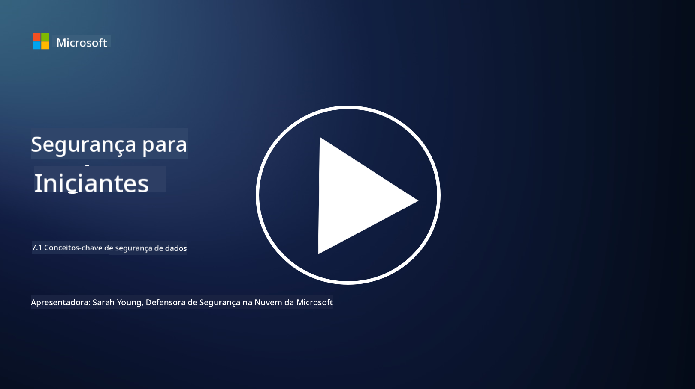

<!--
CO_OP_TRANSLATOR_METADATA:
{
  "original_hash": "9703868f41dcddd5a98dea9ea6fcd94d",
  "translation_date": "2025-09-03T20:38:06+00:00",
  "source_file": "7.1 Data security key concepts.md",
  "language_code": "br"
}
-->
# Conceitos-chave de segurança de dados

Mencionamos segurança de dados e abordamos esse tema várias vezes ao longo deste curso. Agora, vamos explorar esse tópico com mais profundidade. Nesta lição, você aprenderá:

- O que é segurança de dados?

- O que é classificação de dados?

- O que é gerenciamento do ciclo de vida dos dados?

- O que é prevenção contra perda de dados (DLP)?

- Por que a segurança de dados é importante para uma organização?

## O que é segurança de dados?

**Segurança de dados** refere-se à prática de proteger dados digitais, como bancos de dados, arquivos e informações sensíveis, contra acesso não autorizado, divulgação, alteração ou destruição. O principal objetivo da segurança de dados é garantir a confidencialidade, integridade e disponibilidade dos dados. Isso envolve a implementação de uma combinação de medidas de segurança técnicas, administrativas e físicas para proteger os dados contra diversas ameaças e vulnerabilidades, incluindo ataques cibernéticos, ameaças internas e vazamentos de dados. As medidas de segurança de dados podem incluir criptografia, controles de acesso, autenticação, trilhas de auditoria e políticas de segurança.

## O que é classificação de dados?

**Classificação de dados** é o processo de categorizar dados com base em sua sensibilidade, valor e importância para uma organização. O objetivo da classificação de dados é ajudar as organizações a identificar e priorizar a proteção e o tratamento de diferentes tipos de dados. Categorias comuns de classificação de dados incluem "público", "interno", "confidencial" e "restrito" ou "altamente confidencial". Após a classificação dos dados, as organizações podem aplicar controles de segurança e restrições de acesso apropriados para garantir que os dados sensíveis sejam adequadamente protegidos e que a conformidade com os requisitos regulatórios seja mantida.

## O que é gerenciamento do ciclo de vida dos dados?

**Gerenciamento do ciclo de vida dos dados** é uma abordagem estruturada para gerenciar dados ao longo de todo o seu ciclo de vida, desde a criação ou aquisição até o arquivamento ou exclusão. O ciclo de vida dos dados geralmente consiste em etapas como criação, armazenamento, processamento, transmissão, arquivamento e descarte. O gerenciamento do ciclo de vida dos dados envolve a definição de políticas e procedimentos para cada etapa do ciclo de vida dos dados, incluindo retenção de dados, controles de acesso, backups e limpeza de dados. Um gerenciamento eficaz do ciclo de vida dos dados ajuda as organizações a otimizar o armazenamento de dados, melhorar a qualidade dos dados e garantir a conformidade com as regulamentações de proteção de dados.

## O que é prevenção contra perda de dados (DLP)?

**Prevenção contra perda de dados (DLP)** refere-se a um conjunto de tecnologias, políticas e práticas projetadas para evitar o acesso, compartilhamento ou vazamento não autorizado de dados sensíveis ou confidenciais. As soluções de DLP utilizam inspeção de conteúdo e análise contextual para monitorar e controlar dados em movimento (por exemplo, e-mails, tráfego na web), dados em repouso (por exemplo, arquivos armazenados e bancos de dados) e dados em uso (por exemplo, dados sendo acessados ou manipulados por usuários). O objetivo do DLP é identificar e bloquear ou criptografar dados sensíveis para evitar vazamentos de dados, cumprir regulamentações de proteção de dados e proteger a reputação de uma organização.

## Por que a segurança de dados é importante para uma organização?

A segurança de dados é extremamente importante para as organizações por vários motivos:

- **Proteção de Informações Sensíveis**: As organizações frequentemente armazenam dados sensíveis, como registros de clientes, propriedade intelectual, dados financeiros e informações de funcionários. A segurança de dados protege essas informações contra acesso ou roubo não autorizado.

- **Conformidade**: Muitos setores e jurisdições possuem regulamentações rigorosas de proteção e privacidade de dados. A segurança de dados ajuda as organizações a cumprir essas leis, evitando penalidades legais e danos à reputação.

- **Prevenção de Vazamentos de Dados**: Vazamentos de dados podem resultar em perdas financeiras, danos à reputação e consequências legais. Medidas eficazes de segurança de dados ajudam a prevenir vazamentos ou limitar seu impacto.

- **Preservação da Confiança**: Clientes e partes interessadas confiam nas organizações para proteger seus dados. Vazamentos de segurança de dados comprometem essa confiança. Manter uma forte segurança de dados ajuda a preservar a confiança e a confiança dos clientes.

- **Vantagem Competitiva**: Demonstrar um compromisso com a segurança de dados pode ser uma vantagem competitiva. Clientes e parceiros têm maior probabilidade de trabalhar com organizações que levam a segurança de dados a sério.

- **Continuidade Operacional**: Medidas de segurança de dados, incluindo backups e planejamento de recuperação de desastres, ajudam a garantir a disponibilidade de dados críticos e a continuidade dos negócios em caso de perda de dados ou desastres.

- **Proteção Contra Ameaças Internas**: As medidas de segurança de dados também abordam ameaças internas, incluindo exposição acidental de dados por funcionários e ações maliciosas de pessoas dentro da organização.

Em resumo, a segurança de dados é essencial para proteger informações sensíveis, cumprir regulamentações, prevenir vazamentos de dados, preservar a confiança e garantir o sucesso e a reputação contínuos de uma organização.

## Leitura adicional

- [O que é segurança de dados? | Microsoft Security](https://www.microsoft.com/en-au/security/business/security-101/what-is-data-security?WT.mc_id=academic-96948-sayoung)
- [Classifique e proteja documentos e dados automaticamente | Microsoft Purview Information Protection](https://youtu.be/v8LqmzBUaOo)
- [Exemplo de política de classificação de dados](https://www.cmu.edu/data/guidelines/data-classification.html)
- [O que é segurança de dados? Definição e visão geral | IBM](https://www.ibm.com/topics/data-security)
- [Gerenciamento do ciclo de vida dos dados: Um guia de 2023 para sua empresa (cloudwards.net)](https://www.cloudwards.net/data-lifecycle-management/)
- [O que é prevenção contra perda de dados (DLP)? | Microsoft Security](https://www.microsoft.com/security/business/security-101/what-is-data-loss-prevention-dlp?WT.mc_id=academic-96948-sayoung)
- [O que é DLP? Como funciona o software de prevenção contra perda de dados e por que você precisa dele | CSO Online](https://www.csoonline.com/article/569559/what-is-dlp-how-data-loss-prevention-software-works-and-why-you-need-it.html)

---

**Aviso Legal**:  
Este documento foi traduzido utilizando o serviço de tradução por IA [Co-op Translator](https://github.com/Azure/co-op-translator). Embora nos esforcemos para garantir a precisão, esteja ciente de que traduções automatizadas podem conter erros ou imprecisões. O documento original em seu idioma nativo deve ser considerado a fonte autoritativa. Para informações críticas, recomenda-se a tradução profissional realizada por humanos. Não nos responsabilizamos por quaisquer mal-entendidos ou interpretações equivocadas decorrentes do uso desta tradução.