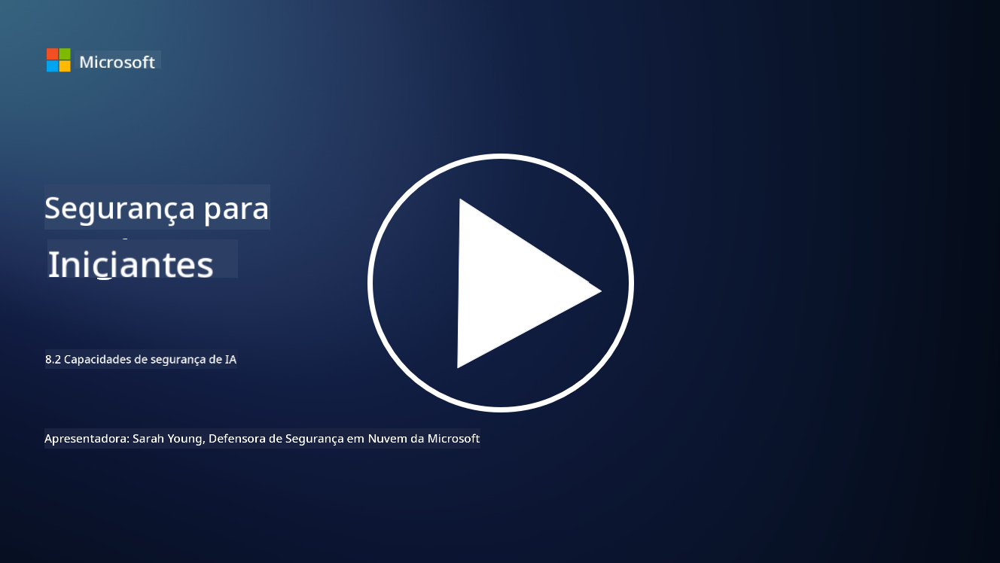

<!--
CO_OP_TRANSLATOR_METADATA:
{
  "original_hash": "b6bb7175672298d1e2f73ba7e0006f95",
  "translation_date": "2025-09-03T21:35:11+00:00",
  "source_file": "8.2 AI security capabilities.md",
  "language_code": "br"
}
-->
# Capacidades de segurança em IA

## Quais ferramentas e capacidades temos atualmente para proteger sistemas de IA?

Atualmente, existem várias ferramentas e capacidades disponíveis para proteger sistemas de IA:

-   **Counterfit**: Uma ferramenta de automação de código aberto para testes de segurança em sistemas de IA, projetada para ajudar organizações a realizar avaliações de risco de segurança em IA e garantir a robustez de seus algoritmos.
-   **Ferramentas de Aprendizado de Máquina Adversarial**: Essas ferramentas avaliam a robustez de modelos de aprendizado de máquina contra ataques adversariais, ajudando a identificar e mitigar vulnerabilidades.
-   **Toolkits de Segurança em IA**: Existem toolkits de código aberto que oferecem recursos para proteger sistemas de IA, incluindo bibliotecas e frameworks para implementar medidas de segurança.
-   **Plataformas Colaborativas**: Parcerias entre empresas e comunidades de IA para desenvolver scanners de segurança específicos para IA e outras ferramentas para proteger a cadeia de fornecimento de IA.

Essas ferramentas e capacidades fazem parte de um campo em crescimento dedicado a melhorar a segurança de sistemas de IA contra uma variedade de ameaças. Elas representam uma combinação de pesquisa, ferramentas práticas e colaboração na indústria, com o objetivo de enfrentar os desafios únicos apresentados pelas tecnologias de IA.

## E quanto ao red teaming em IA? Como isso difere do red teaming tradicional de segurança?

O red teaming em IA difere do red teaming tradicional de segurança em vários aspectos importantes:

-   **Foco em Sistemas de IA**: O red teaming em IA foca especificamente nas vulnerabilidades únicas de sistemas de IA, como modelos de aprendizado de máquina e pipelines de dados, em vez de infraestrutura de TI tradicional.
-   **Teste de Comportamento da IA**: Envolve testar como sistemas de IA respondem a entradas incomuns ou inesperadas, o que pode revelar vulnerabilidades exploráveis por atacantes.
-   **Exploração de Falhas em IA**: O red teaming em IA analisa tanto falhas maliciosas quanto benignas, considerando um conjunto mais amplo de personas e possíveis falhas de sistema além de apenas violações de segurança.
-   **Injeção de Prompt e Geração de Conteúdo**: Inclui investigar falhas como injeção de prompt, onde atacantes manipulam sistemas de IA para produzir conteúdo prejudicial ou sem fundamento.
-   **IA Ética e Responsável**: Faz parte de garantir uma IA responsável desde o design, assegurando que sistemas de IA sejam robustos contra tentativas de fazê-los agir de maneira não intencional.

De forma geral, o red teaming em IA é uma prática ampliada que não apenas cobre a busca por vulnerabilidades de segurança, mas também inclui testes para outros tipos de falhas específicas de tecnologias de IA. É uma parte essencial do desenvolvimento de sistemas de IA mais seguros, ao entender e mitigar riscos novos associados à implantação de IA.

## Leitura adicional

 - [Microsoft AI Red Team construindo o futuro de uma IA mais segura | Blog de Segurança da Microsoft](https://www.microsoft.com/en-us/security/blog/2023/08/07/microsoft-ai-red-team-building-future-of-safer-ai/?WT.mc_id=academic-96948-sayoung)
 - [Anunciando o framework de automação aberto da Microsoft para red team de sistemas de IA generativa | Blog de Segurança da Microsoft](https://www.microsoft.com/en-us/security/blog/2024/02/22/announcing-microsofts-open-automation-framework-to-red-team-generative-ai-systems/?WT.mc_id=academic-96948-sayoung)
 - [Ferramentas de Segurança em IA: O Toolkit de Código Aberto | Wiz](https://www.wiz.io/academy/ai-security-tools)

---

**Aviso Legal**:  
Este documento foi traduzido utilizando o serviço de tradução por IA [Co-op Translator](https://github.com/Azure/co-op-translator). Embora nos esforcemos para garantir a precisão, esteja ciente de que traduções automatizadas podem conter erros ou imprecisões. O documento original em seu idioma nativo deve ser considerado a fonte autoritativa. Para informações críticas, recomenda-se a tradução profissional realizada por humanos. Não nos responsabilizamos por quaisquer mal-entendidos ou interpretações equivocadas decorrentes do uso desta tradução.