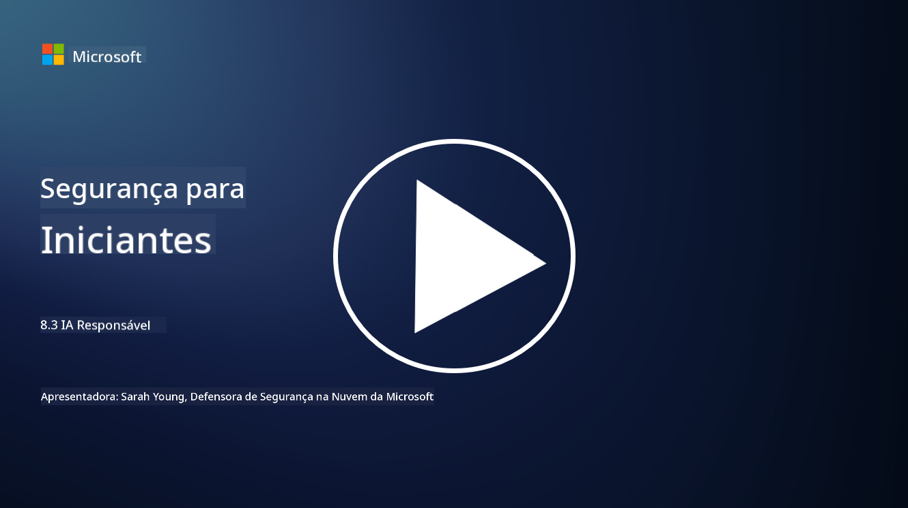

<!--
CO_OP_TRANSLATOR_METADATA:
{
  "original_hash": "5e9775ee91bde7d44577891d5f11c4c5",
  "translation_date": "2025-09-03T20:45:07+00:00",
  "source_file": "8.3 Responsible AI.md",
  "language_code": "br"
}
-->
# IA Responsável

## O que é IA responsável e como ela se relaciona com a segurança em IA?

IA responsável refere-se ao desenvolvimento e uso de inteligência artificial de maneira ética, transparente e alinhada com os valores da sociedade. Ela abrange princípios como justiça, responsabilidade e robustez, garantindo que os sistemas de IA sejam projetados e operados para beneficiar indivíduos, comunidades e a sociedade como um todo.

A relação entre IA responsável e segurança em IA é significativa porque:

-   **Considerações Éticas**: A IA responsável envolve considerações éticas que impactam diretamente a segurança, como privacidade e proteção de dados. Garantir que os sistemas de IA respeitem a privacidade dos usuários e protejam dados pessoais é um aspecto fundamental da IA responsável.
-   **Robustez e Confiabilidade**: Os sistemas de IA devem ser robustos contra manipulações e ataques, o que é um princípio central tanto da IA responsável quanto da segurança em IA. Isso inclui proteger contra ataques adversariais e garantir a integridade dos processos de tomada de decisão da IA.
-   **Transparência e Explicabilidade**: Parte da IA responsável é garantir que os sistemas de IA sejam transparentes e que suas decisões possam ser explicadas. Isso é crucial para a segurança, pois as partes interessadas precisam entender como os sistemas de IA operam para confiar em suas medidas de segurança.
-   **Responsabilidade**: Os sistemas de IA devem ser responsáveis por suas ações, o que significa que devem existir mecanismos para rastrear decisões e corrigir quaisquer problemas. Isso está alinhado com práticas de segurança que monitoram e auditam atividades do sistema para prevenir e responder a violações.

Em essência, IA responsável e segurança em IA estão interligadas, com práticas de IA responsável aprimorando a segurança dos sistemas de IA e vice-versa. Implementar princípios de IA responsável ajuda a criar sistemas de IA que não apenas são eticamente sólidos, mas também mais seguros contra ameaças potenciais.

## Como posso garantir que meu sistema de IA seja seguro e ético?

Garantir que seu sistema de IA seja seguro e ético envolve uma abordagem multifacetada que inclui as seguintes etapas:

- **Adote Princípios Éticos**: Siga diretrizes éticas estabelecidas que enfatizem o bem-estar humano, social e ambiental; justiça; proteção à privacidade; confiabilidade; transparência; contestabilidade; e responsabilidade.

- **Implemente Medidas de Segurança Robustas**: Utilize testes de segurança proativos e programas de gestão de confiança, risco e segurança em IA para proteger contra ameaças e vulnerabilidades.

- **Envolva Diversos Stakeholders**: Inclua uma ampla gama de participantes no processo de desenvolvimento da IA, como especialistas em ética, cientistas sociais e representantes das comunidades afetadas, para garantir que diferentes perspectivas e valores sejam considerados.

- **Garanta Transparência e Explicabilidade**: Certifique-se de que os processos de tomada de decisão da IA sejam transparentes e possam ser explicados, permitindo maior confiança e identificação mais fácil de possíveis vieses ou erros.

- **Mantenha a Privacidade dos Dados**: Proteja a privacidade e a autenticidade dos dados por meio de criptografia e outras medidas de proteção de dados para respeitar os direitos de privacidade dos usuários.

- **Habilite Supervisão Humana**: Implemente mecanismos de supervisão humana para permitir a contestação de decisões tomadas pelos sistemas de IA e garantir a responsabilidade.

- **Mantenha-se Informado sobre Segurança em IA**: Acompanhe as últimas pesquisas e discussões sobre segurança em IA para entender o cenário em constante evolução da segurança e ética em IA.

- **Cumpra as Regulamentações**: Certifique-se de que seu sistema de IA esteja em conformidade com todas as leis e regulamentações relevantes, que podem incluir leis de proteção de dados, leis antidiscriminação e diretrizes específicas do setor.

## Você pode me dar alguns exemplos de problemas de segurança causados pelo uso não ético de IA?

Aqui estão alguns exemplos de problemas de segurança que podem surgir do uso não ético de IA:

- **Decisões Tendenciosas**: Sistemas de IA podem perpetuar e amplificar vieses existentes se forem treinados com conjuntos de dados tendenciosos. Por exemplo, se um mecanismo de busca for treinado com dados que refletem estereótipos sociais, ele pode exibir resultados de busca tendenciosos, levando a tratamentos injustos ou discriminação.

- **IA em Sistemas Judiciais**: O uso de IA na tomada de decisões legais pode levantar preocupações éticas, especialmente se o processo de decisão da IA carecer de transparência ou for influenciado por dados tendenciosos. Isso pode resultar em resultados legais injustos e violar os direitos dos indivíduos.

- **Manipulação de Sistemas de IA**: Sistemas de IA podem ser suscetíveis a ataques adversariais, onde pequenas modificações nos dados de entrada podem causar resultados incorretos. Por exemplo, veículos autônomos podem ser induzidos a interpretar sinais de trânsito de forma errada, gerando riscos à segurança.

- **Vigilância Potencializada por IA**: O uso de IA para fins de vigilância pode levar a violações de privacidade, especialmente se for utilizado sem o devido consentimento ou de maneiras que infrinjam as liberdades individuais. Isso pode ser particularmente problemático em regimes autoritários que podem usar IA para monitorar e suprimir dissidências.

Esses exemplos destacam a importância de considerações éticas no desenvolvimento e implantação de sistemas de IA para prevenir problemas de segurança e proteger os direitos e a privacidade dos indivíduos.

## Leituras adicionais

 - [Microsoft Responsible AI Standard v2 General Requirements](https://query.prod.cms.rt.microsoft.com/cms/api/am/binary/RE5cmFl?culture=en-us&country=us&WT.mc_id=academic-96948-sayoung)
 - [Responsible AI (mit.edu)](https://sloanreview.mit.edu/big-ideas/responsible-ai/)
 - [13 Principles for Using AI Responsibly (hbr.org)](https://hbr.org/2023/06/13-principles-for-using-ai-responsibly)

---

**Aviso Legal**:  
Este documento foi traduzido utilizando o serviço de tradução por IA [Co-op Translator](https://github.com/Azure/co-op-translator). Embora nos esforcemos para garantir a precisão, esteja ciente de que traduções automatizadas podem conter erros ou imprecisões. O documento original em seu idioma nativo deve ser considerado a fonte autoritativa. Para informações críticas, recomenda-se a tradução profissional realizada por humanos. Não nos responsabilizamos por quaisquer mal-entendidos ou interpretações equivocadas decorrentes do uso desta tradução.