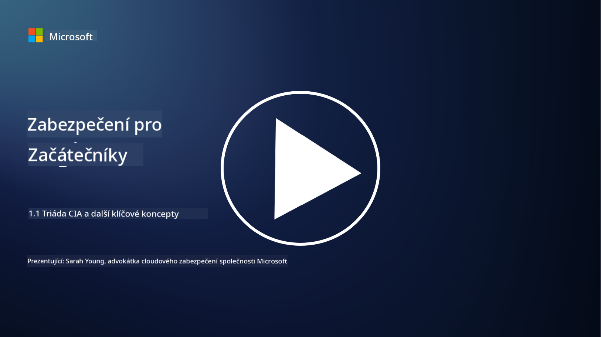
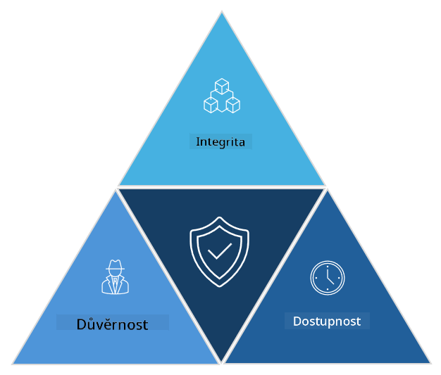

<!--
CO_OP_TRANSLATOR_METADATA:
{
  "original_hash": "16a76f9fa372fb63cffb6d76b855f023",
  "translation_date": "2025-09-03T21:39:14+00:00",
  "source_file": "1.1 The CIA triad and other key concepts.md",
  "language_code": "cs"
}
-->
# Triáda CIA a další klíčové koncepty

## Úvod

V této lekci se zaměříme na:

 - Co je kybernetická bezpečnost?
   
 
 - Co je triáda CIA v kybernetické bezpečnosti?

   

 - Co znamenají autenticita, nepopiratelnost a soukromí v kontextu kybernetické bezpečnosti?

## Co je kybernetická bezpečnost?

Kybernetická bezpečnost, známá také jako informační bezpečnost, je praxe ochrany počítačových systémů, sítí, zařízení a dat před digitálními útoky, neoprávněným přístupem, poškozením nebo krádeží. Hlavním cílem kybernetické bezpečnosti je zajistit důvěrnost, integritu a dostupnost digitálních aktiv a informací. Odborníci na kybernetickou bezpečnost navrhují a implementují bezpečnostní opatření k ochraně aktiv, dat a informací. Jak se stále více našich životů digitalizuje a přesouvá online, kybernetická bezpečnost se stala klíčovým problémem jak pro jednotlivce, tak pro organizace.

## Co je triáda CIA v kybernetické bezpečnosti?

Triáda kybernetické bezpečnosti odkazuje na model, který zahrnuje tři hlavní aspekty každé práce v oblasti kybernetické bezpečnosti nebo návrhu systému/prostředí:

### Důvěrnost

Tento aspekt je pravděpodobně nejznámější, když se řekne „kybernetická bezpečnost“: důvěrnost je proces ochrany dat a informací před neoprávněnými pokusy o přístup, tj. pouze lidé, kteří potřebují informace vidět, k nim mají přístup. Ne všechna data jsou však stejná, a proto se obvykle kategorizují a chrání na základě toho, jak velké škody by mohly vzniknout, pokud by se dostala do nesprávných rukou.

### Integrita

Odkazuje na ochranu přesnosti a důvěryhodnosti dat v prostředí a na zamezení jejich změn nebo úprav neoprávněnými osobami. Například student změní své datum narození v záznamu řidičského průkazu na DMV, aby se jevil starší a mohl si nechat vytisknout nový průkaz s dřívějším datem narození za účelem nákupu alkoholu.

### Dostupnost

Tento aspekt je důležitý nejen v provozním IT, ale také v kybernetické bezpečnosti. Existují specifické typy útoků, které cílí na dostupnost, proti kterým musí odborníci na bezpečnost chránit (např. útoky typu distribuované odmítnutí služby – DDoS).

**Triáda CIA v kybernetické bezpečnosti**

## Co znamenají autenticita, nepopiratelnost a soukromí v kontextu kybernetické bezpečnosti?

Jedná se o další důležité koncepty, které se týkají zajištění bezpečnosti a důvěryhodnosti systémů a dat:

**Autenticita** - odkazuje na záruku, že informace, komunikace nebo entita, se kterou komunikujete, jsou pravé a nebyly neoprávněně upraveny nebo pozměněny.

**Nepopiratelnost** - je koncept zajištění, že strana nemůže popřít svou účast nebo pravost transakce či komunikace. Zabraňuje tomu, aby někdo tvrdil, že neposlal zprávu nebo neprovedl určitou akci, když existují důkazy o opaku.

**Soukromí** - odkazuje na ochranu citlivých a osobně identifikovatelných informací před neoprávněným přístupem, použitím, zveřejněním nebo manipulací. Zahrnuje kontrolu nad tím, kdo má přístup k osobním údajům a jak jsou tyto údaje shromažďovány, ukládány a sdíleny.

## Další čtení

[Co je informační bezpečnost (InfoSec)? | Microsoft Security](https://www.microsoft.com/security/business/security-101/what-is-information-security-infosec#:~:text=Three%20pillars%20of%20information%20security%3A%20the%20CIA%20triad,as%20guiding%20principles%20for%20implementing%20an%20InfoSec%20plan.)

---

**Prohlášení**:  
Tento dokument byl přeložen pomocí služby pro automatický překlad [Co-op Translator](https://github.com/Azure/co-op-translator). Ačkoli se snažíme o přesnost, mějte na paměti, že automatické překlady mohou obsahovat chyby nebo nepřesnosti. Původní dokument v jeho původním jazyce by měl být považován za autoritativní zdroj. Pro důležité informace doporučujeme profesionální lidský překlad. Neodpovídáme za žádné nedorozumění nebo nesprávné interpretace vyplývající z použití tohoto překladu.