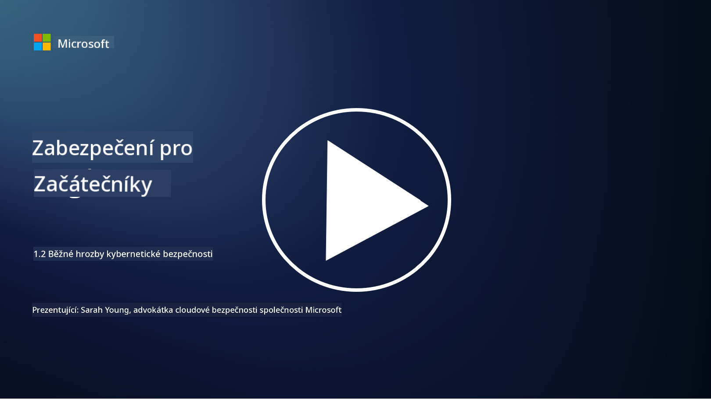

<!--
CO_OP_TRANSLATOR_METADATA:
{
  "original_hash": "6fc3030323139d7134a4ca9d03eccac9",
  "translation_date": "2025-09-03T20:11:03+00:00",
  "source_file": "1.2 Common cybersecurity threats.md",
  "language_code": "cs"
}
-->
# Běžné kybernetické hrozby

## Úvod

V této lekci se budeme zabývat:

- Co je kybernetická hrozba?

- Proč chtějí škodliví aktéři kompromitovat data a IT systémy?

- Jaké jsou nejběžnější typy kybernetických hrozeb?

- Co je rámec MITRE ATT&CK?

- Kde mohu sledovat aktuální stav kybernetických hrozeb?

## Co je kybernetická hrozba?

Kybernetická hrozba označuje jakékoli potenciální nebezpečí nebo riziko, které může ohrozit důvěrnost, integritu nebo dostupnost dat či IT systémů. Tyto hrozby pocházejí od škodlivých aktérů, kteří se snaží využít zranitelnosti k získání neoprávněného přístupu, krádeži citlivých informací, narušení provozu nebo způsobení škody jednotlivcům, organizacím nebo dokonce celým státům. Kybernetické hrozby mohou mít různé podoby a cílit na různé aspekty digitálních systémů a dat.

## Proč chtějí škodliví aktéři kompromitovat data a IT systémy?

Škodliví aktéři kompromitují data a IT systémy z různých důvodů, často motivováni osobním ziskem, ideologickými cíli nebo touhou způsobit narušení. Porozumění těmto motivacím může organizacím a jednotlivcům pomoci lépe se bránit proti kybernetickým hrozbám. Mezi běžné důvody, proč se škodliví aktéři zapojují do kybernetických útoků, patří:

1. **Finanční zisk**: Mnoho útoků je motivováno touhou po finančním zisku. Škodliví aktéři mohou krást citlivé informace, jako jsou čísla kreditních karet, údaje o bankovních účtech nebo osobní identifikační údaje, aby spáchali podvod, krádež identity, vydírali jednotlivce nebo organizace, nebo prodávali ukradená data na darknetu.

2. **Špionáž**: Státy, konkurenti nebo jiné subjekty se mohou zapojit do kybernetické špionáže, aby ukradli citlivé vládní, firemní nebo výzkumné údaje pro politické, ekonomické nebo vojenské výhody.

3. **Narušení a sabotáž**: Některé útoky mají za cíl narušit kritickou infrastrukturu, služby nebo provoz z politických nebo ideologických důvodů. Tyto útoky mohou způsobit rozsáhlý chaos, finanční ztráty a poškození reputace.

4. **Ideologické motivace**: Hacktivisté a skupiny s ideologickými nebo politickými motivacemi mohou kompromitovat systémy, aby upozornili na určité problémy, propagovali své názory nebo protestovali proti konkrétním akcím či organizacím.

5. **Neúmyslné akce**: Ne všechny škodlivé akce jsou úmyslné; někteří jednotlivci mohou nevědomky přispět k kybernetickým hrozbám tím, že se stanou obětí sociálního inženýrství nebo součástí kompromitované sítě.

Motivace pro kompromitaci dat a IT systémů se mohou značně lišit a dopady těchto útoků mohou být závažné. Je důležité, aby jednotlivci, organizace a vlády brali kybernetickou bezpečnost vážně a zavedli opatření na ochranu proti těmto hrozbám.

## Jaké jsou nejběžnější typy kybernetických hrozeb?

Existuje několik běžných typů kybernetických útoků, které škodliví aktéři používají k kompromitaci systémů, krádeži dat a způsobení narušení. Zde jsou některé z nejrozšířenějších typů:

1. **Phishing**:

Phishing zahrnuje zasílání klamavých e-mailů nebo zpráv, které vypadají jako od legitimních zdrojů, aby oklamaly příjemce a přiměly je k odhalení citlivých informací, jako jsou hesla, čísla kreditních karet nebo osobní údaje. Phishing může také vést oběti na škodlivé webové stránky nebo ke stažení malwaru.

2. **Malware**:

Malware (škodlivý software) zahrnuje řadu škodlivých programů navržených k infikování systémů, krádeži dat nebo způsobení škody. Typy malwaru zahrnují:

- **Ransomware**: Šifruje soubory a požaduje výkupné za jejich dešifrování.

- **Trojské koně**: Maskují se jako legitimní software a poskytují útočníkům neoprávněný přístup.

- **Viry**: Samoreplikující se programy, které se připojují k souborům a šíří se.

- **Červi**: Samoreplikující se programy, které se šíří přes sítě.

3. **Denial of Service (DoS) a Distributed Denial of Service (DDoS)**:

DoS útoky přetíží cílový systém, což ho činí nedostupným pro uživatele. DDoS útoky zahrnují použití sítě kompromitovaných zařízení k zahlcení cíle provozem, což ztěžuje správnou funkci systému nebo může systém zcela zastavit.

4. **SQL Injection**:

Při tomto útoku útočníci manipulují vstupními poli webové aplikace, aby vložili škodlivé SQL dotazy, což může vést k neoprávněnému přístupu k databázím a citlivým datům.

5. **Cross-Site Scripting (XSS)**:

Útočníci vkládají škodlivé skripty do webových aplikací, které jsou následně spuštěny v prohlížečích nic netušících uživatelů. To může vést ke krádeži uživatelských dat nebo šíření malwaru.

6. **Sociální inženýrství**:

Sociální inženýrství využívá lidské psychologie k manipulaci jednotlivců, aby odhalili důvěrné informace nebo provedli akce, které ohrožují bezpečnost.

7. **Zero-Day (0day) Exploits**:

Tyto útoky cílí na zranitelnosti v softwaru nebo hardwaru, které nejsou dosud známé výrobci nebo veřejnosti. Útočníci využívají těchto zranitelností předtím, než jsou vyvinuty záplaty. Mnoho organizací se obává zero-day útoků, protože na ně neexistuje záplata, ale nejsou tak běžné jako ostatní útoky na tomto seznamu. Když je zero-day objeven, bezpečnostní výzkumníci rychle pracují na vytvoření záplaty, a proto jsou zero-day útoky obecně krátkodobé.

8. **Útoky na přihlašovací údaje**:

Tyto útoky zahrnují hrubé síly, kdy útočníci opakovaně hádají hesla, a útoky typu credential stuffing, kdy jsou ukradené přihlašovací údaje z jednoho webu použity k pokusu o přístup na jiné weby.

## Co je rámec MITRE ATT&CK?

[Rámec MITRE ATT&CK](https://attack.mitre.org/) (Adversarial Tactics, Techniques, and Common Knowledge) je rámec, který katalogizuje a kategorizuje taktiky, techniky a postupy (TTPs), které útočníci používají během kybernetických útoků. Rámec byl vytvořen organizací MITRE Corporation, neziskovou organizací, která provozuje výzkumná a vývojová centra pro různé vládní agentury.

Rámec MITRE ATT&CK poskytuje standardizovaný způsob popisu a analýzy kybernetických hrozeb, což umožňuje odborníkům na kybernetickou bezpečnost lépe porozumět a bránit se různým technikám útoků. Je široce používán bezpečnostními týmy, lovci hrozeb a odborníky na reakci na incidenty k:

1. **Porozumění chování útočníků**: Rámec dokumentuje chování útočníků v reálném světě, popisuje kroky, které útočníci podnikají od počátečního vstupu až po dosažení svých cílů. Pokrývá širokou škálu technik útoků používaných různými skupinami hrozeb.

2. **Plánování a implementace obranných strategií**: Bezpečnostní týmy mohou využít rámec k vývoji proaktivních obranných strategií, které odpovídají konkrétním taktice a technikám, které útočníci mohou použít.

3. **Reakce na incidenty a lov hrozeb**: Při vyšetřování incidentů nebo provádění lovu hrozeb mohou odborníci na bezpečnost odkazovat na rámec, aby identifikovali a zmírnili konkrétní techniky používané útočníky.

Rámec MITRE ATT&CK je organizován do matic, které seskupují techniky útoků na základě konkrétních platforem a prostředí, jako jsou Windows, macOS, Linux a cloudové služby. Každá matice je rozdělena na taktiky (vysoké cíle) a techniky (konkrétní metody používané k dosažení těchto cílů). Pro každou techniku rámec poskytuje informace o tom, jak funguje, potenciální zmírnění a relevantní odkazy na skutečné aktéry hrozeb, kteří tuto techniku použili.

Rámec je neustále aktualizován a rozšiřován na základě nových informací o hrozbách a vývoje kybernetického prostředí. Je cenným zdrojem pro zlepšení kybernetické bezpečnosti organizace tím, že umožňuje hlubší porozumění tomu, jak útočníci operují a jak se bránit jejich taktikám.

## Kde mohu sledovat aktuální stav kybernetických hrozeb?

Existuje mnoho zdrojů, které lze použít k sledování kybernetických hrozeb, zde je výběr:

- [Open Web Application Security Project (OWASP) top 10 vulnerabilities](https://owasp.org/Top10/)
- [Common Vulnerabilities and Exposures (CVEs)](https://www.bing.com/ck/a?!&&p=53df6007f017bca2JmltdHM9MTY5MjU3NjAwMCZpZ3VpZD0zYmY4N2RiYS1jYWI1LTYwMDgtMWY1YS02ZmYyY2JjNjYxZWUmaW5zaWQ9NTc2OQ&ptn=3&hsh=3&fclid=3bf87dba-cab5-6008-1f5a-6ff2cbc661ee&psq=cve&u=a1aHR0cHM6Ly9iaW5nLmNvbS9hbGluay9saW5rP3VybD1odHRwcyUzYSUyZiUyZmN2ZS5taXRyZS5vcmclMmYmc291cmNlPXNlcnAtcnImaD1BZXN4S0VBWTNnbGhNZEFpd3daMlNSZkZQNTlrODhIUnYxRUtlSkY1RTk0JTNkJnA9a2NvZmZjaWFsd2Vic2l0ZQ&ntb=1 "Common Vulnerabilities and Exposures")
- [Microsoft Security Response Center blogs](https://msrc.microsoft.com/blog/)
- [National Institute of Standards and Technology (NIST)](https://www.dhs.gov/topics/cybersecurity): NIST poskytuje zdroje, upozornění a nejnovější aktualizace o potenciálních kybernetických hrozbách.
- [Cybersecurity and Infrastructure Security Agency (CISA)](https://www.cisa.gov/resources-tools/resources/free-cybersecurity-services-and-tools): CISA poskytuje zdroje kybernetické bezpečnosti a osvědčené postupy pro podniky, vládní agentury a další organizace. CISA sdílí aktuální informace o vysoce dopadových typech bezpečnostní aktivity ovlivňující komunitu jako celek a podrobné analýzy nových a vyvíjejících se kybernetických hrozeb.
- [National Cybersecurity Center of Excellence (NCCoE)](https://www.dhs.gov/topics/cybersecurity): NCCoE je centrum, které poskytuje praktická řešení kybernetické bezpečnosti, která lze aplikovat v reálných situacích.
- [US-CERT](https://www.cisa.gov/resources-tools/resources/free-cybersecurity-services-and-tools): United States Computer Emergency Readiness Team (US-CERT) poskytuje různé zdroje kybernetické bezpečnosti, včetně upozornění, tipů a dalších.
- Kybernetický tým pro reakci na mimořádné události (CERT) vaší země.

---

**Prohlášení**:  
Tento dokument byl přeložen pomocí služby pro automatický překlad [Co-op Translator](https://github.com/Azure/co-op-translator). Ačkoli se snažíme o přesnost, mějte prosím na paměti, že automatické překlady mohou obsahovat chyby nebo nepřesnosti. Původní dokument v jeho původním jazyce by měl být považován za autoritativní zdroj. Pro důležité informace doporučujeme profesionální lidský překlad. Neodpovídáme za žádná nedorozumění nebo nesprávné interpretace vyplývající z použití tohoto překladu.