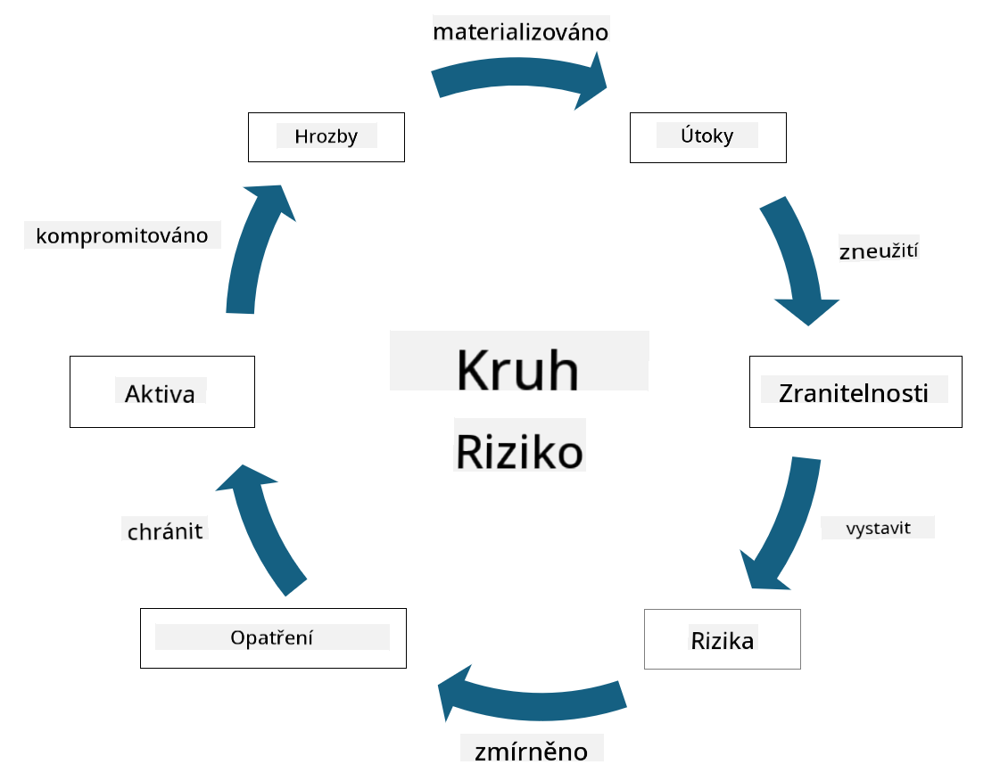

<!--
CO_OP_TRANSLATOR_METADATA:
{
  "original_hash": "fcca304f072cabf206388199e8e2e578",
  "translation_date": "2025-09-03T21:52:23+00:00",
  "source_file": "1.3 Understanding risk management.md",
  "language_code": "cs"
}
-->
# Porozumění řízení rizik

## Úvod

V této lekci se zaměříme na:

- Definice běžně používané bezpečnostní terminologie

- Typy bezpečnostních opatření

- Hodnocení bezpečnostních rizik

## Definice běžně používané bezpečnostní terminologie

Tyto pojmy jsou základními koncepty v oblasti kybernetické bezpečnosti a řízení rizik. Pojďme si je rozebrat a vysvětlit, jak spolu souvisí:

1. **Agent hrozby**:

Agent hrozby je jednotlivec, skupina, organizace nebo automatizovaný systém, který má potenciál využít zranitelnosti systému nebo sítě k způsobení škody nebo poškození. Agenti hrozby mohou být hackeři, autoři malwaru, nespokojení zaměstnanci nebo jakýkoli subjekt, který představuje riziko pro informační a technologické systémy.

2. **Hrozba**:

Hrozba je potenciální událost nebo akce, která může využít zranitelnosti systému a způsobit škodu na majetku. Hrozby mohou zahrnovat akce jako hacking, úniky dat, útoky typu denial-of-service a další. Hrozby představují „co“ v kontextu potenciální škody, kterou lze způsobit na majetku organizace.

3. **Zranitelnost**:

Zranitelnost je slabina nebo chyba v návrhu, implementaci nebo konfiguraci systému, kterou může agent hrozby využít k narušení bezpečnosti systému. Zranitelnosti mohou existovat v softwaru, hardwaru, procesech nebo lidském chování. Identifikace a řešení zranitelností je klíčové pro minimalizaci rizika úspěšných útoků.

4. **Riziko**:

Riziko je potenciál ztráty, škody nebo poškození, které vyplývá z interakce mezi hrozbou a zranitelností. Je to pravděpodobnost, že agent hrozby využije zranitelnost k způsobení negativního dopadu. Rizika se často hodnotí z hlediska jejich potenciálního dopadu a pravděpodobnosti výskytu.

5. **Majetek**:

Majetek je cokoli hodnotného, co organizace chce chránit. Majetek může zahrnovat fyzické objekty (například počítače a servery), data (informace o zákaznících, finanční záznamy), duševní vlastnictví (obchodní tajemství, patenty) a dokonce i lidské zdroje (dovednosti a znalosti zaměstnanců). Ochrana majetku je klíčovým cílem kybernetické bezpečnosti.

6. **Expozice**:

Expozice označuje stav, kdy je systém zranitelný vůči potenciálním hrozbám. Nastává, když existuje zranitelnost, kterou může agent hrozby využít. Expozice zdůrazňuje riziko spojené s přítomností zranitelností v systému nebo síti.

7. **Opatření**:

Opatření je krok nebo mechanismus zavedený za účelem snížení rizika spojeného se zranitelnostmi a hrozbami. Opatření mohou být technická, procedurální nebo administrativní. Jsou navržena tak, aby předcházela, detekovala nebo zmírňovala potenciální hrozby a zranitelnosti. Příklady zahrnují firewally, přístupové kontroly, šifrování, bezpečnostní politiky a školení zaměstnanců.

Shrnutí vztahu mezi těmito pojmy: Agenti hrozby využívají zranitelnosti k realizaci hrozeb, které mohou vést k rizikům s potenciálem způsobit škodu na hodnotném majetku. Expozice nastává, když jsou přítomny zranitelnosti, a opatření jsou zavedena za účelem snížení rizika tím, že předcházejí nebo zmírňují dopad hrozeb na majetek. Tento rámec tvoří základ řízení rizik v kybernetické bezpečnosti, který organizacím pomáhá identifikovat, hodnotit a řešit potenciální rizika pro jejich informační systémy a majetek.

## Typy bezpečnostních opatření

Bezpečnostní opatření jsou kroky nebo ochranné mechanismy zavedené za účelem ochrany informačních systémů a majetku před různými hrozbami a zranitelnostmi. Mohou být klasifikována do několika kategorií podle jejich zaměření a účelu. Zde jsou některé běžné typy bezpečnostních opatření:

1. **Administrativní opatření**:

Tato opatření se týkají politik, postupů a pokynů, které řídí bezpečnostní praktiky organizace a chování uživatelů.

- Bezpečnostní politiky a postupy: Dokumentované pokyny, které definují, jak je bezpečnost v organizaci udržována.

- Bezpečnostní povědomí a školení: Programy pro vzdělávání zaměstnanců o nejlepších bezpečnostních praktikách a potenciálních hrozbách.

- Reakce na incidenty a jejich řízení: Plány pro reakci na bezpečnostní incidenty a jejich zmírnění.

2. **Technická opatření**:

Technická opatření zahrnují použití technologie k prosazování bezpečnostních kroků a ochraně systémů a dat. Příklady technických opatření zahrnují:

- Přístupové kontroly: Mechanismy, které omezují přístup uživatelů k prostředkům na základě jejich rolí a oprávnění.

- Šifrování: Převod dat do zabezpečeného formátu, aby se zabránilo neoprávněnému přístupu.

- Firewally: Zařízení pro zabezpečení sítě, která filtrují a kontrolují příchozí a odchozí provoz.

- Systémy detekce a prevence průniků (IDPS): Nástroje, které monitorují síťový provoz na podezřelou aktivitu.

- Antivirový a antimalwarový software: Programy, které detekují a odstraňují škodlivý software.

- Mechanismy ověřování: Metody ověřování identity uživatelů, jako jsou hesla, biometrie a vícefaktorové ověřování.

- Správa záplat: Pravidelné aktualizace softwaru za účelem řešení známých zranitelností.

3. **Fyzická opatření**:

Fyzická opatření jsou kroky k ochraně fyzického majetku a zařízení.

- Bezpečnostní strážci a personál pro kontrolu přístupu: Personál, který monitoruje a kontroluje přístup do fyzických prostor.

- Kamerové systémy: Systémy pro video monitoring a záznam aktivit.

- Zámky a fyzické bariéry: Fyzické kroky k omezení přístupu do citlivých oblastí.

- Opatření pro regulaci prostředí: Kroky k regulaci teploty, vlhkosti a dalších environmentálních faktorů ovlivňujících zařízení a datová centra.

4. **Operační opatření**:

Tato opatření se týkají každodenních operací a aktivit, které zajišťují průběžnou bezpečnost systémů.

- Řízení změn: Procesy pro sledování a schvalování změn v systémech a konfiguracích.

- Zálohování a obnova po havárii: Plány pro zálohování dat a jejich obnovu v případě selhání systému nebo katastrofy.

- Protokolování a auditování: Monitorování a zaznamenávání aktivit systému pro účely bezpečnosti a souladu.

- Bezpečné praktiky při psaní kódu: Pokyny pro psaní softwaru za účelem minimalizace zranitelností.

5. **Právní a regulační opatření**:

Tato opatření zajišťují soulad s příslušnými zákony, předpisy a průmyslovými standardy. Standardy, které musí organizace dodržovat, závisí na jurisdikci, odvětví a dalších faktorech.

- Předpisy o ochraně dat: Soulad se zákony, jako jsou GDPR, HIPAA a CCPA.

- Průmyslové standardy: Dodržování standardů, jako je PCI DSS pro bezpečnost platebních karet.

Tyto kategorie bezpečnostních opatření spolupracují na vytvoření komplexního bezpečnostního přístupu organizací, který pomáhá chránit jejich systémy, data a majetek před širokou škálou hrozeb.

## Hodnocení bezpečnostních rizik

Někteří bezpečnostní profesionálové se domnívají, že řízení rizik je záležitostí odborníků na rizika, ale pochopení procesu řízení bezpečnostních rizik je důležité pro každého bezpečnostního profesionála, aby mohl vyjádřit bezpečnostní rizika jazykem, kterému zbytek organizace rozumí a na který může reagovat.

Organizace musí neustále hodnotit bezpečnostní rizika a rozhodovat, jaké kroky (nebo žádné) podniknout proti rizikům pro podnik. Níže je přehled toho, jak se tento proces obvykle provádí. Je třeba poznamenat, že tento proces je obvykle prováděn několika různými týmy v rámci organizace, je vzácné, aby jeden tým byl odpovědný za kompletní řízení rizik.

1. **Identifikace majetku a hrozeb**:

Organizace identifikuje majetek, který chce chránit. To může zahrnovat data, systémy, hardware, software, duševní vlastnictví a další. Poté identifikuje potenciální hrozby, které by mohly tento majetek ohrozit.

2. **Hodnocení zranitelností**:

Organizace poté identifikuje zranitelnosti nebo slabiny v systémech nebo procesech, které by mohly být využity hrozbami. Tyto zranitelnosti mohou vyplývat z chyb softwaru, špatné konfigurace, nedostatku bezpečnostních opatření a lidských chyb.

3. **Hodnocení pravděpodobnosti**:

Organizace poté vyhodnotí pravděpodobnost každé hrozby. To zahrnuje zohlednění historických dat, informací o hrozbách, trendů v odvětví a interních faktorů. Pravděpodobnost může být kategorizována jako nízká, střední nebo vysoká na základě pravděpodobnosti realizace hrozby.

4. **Hodnocení dopadu**:

Dále organizace určí potenciální dopad každé hrozby, pokud by využila zranitelnost. Dopad může zahrnovat finanční ztráty, narušení provozu, poškození reputace, právní důsledky a další. Dopad může být také kategorizován jako nízký, střední nebo vysoký na základě potenciálních následků.

5. **Výpočet rizika**:

Hodnocení pravděpodobnosti a dopadu se kombinuje k výpočtu celkové úrovně rizika pro každou identifikovanou hrozbu. To se často provádí pomocí matice rizik, která přiřazuje číselné hodnoty nebo kvalitativní popisy úrovním pravděpodobnosti a dopadu. Výsledná úroveň rizika pomáhá určit, které riziko vyžaduje okamžitou pozornost.

6. **Prioritizace a rozhodování**:

Organizace poté prioritizuje rizika tím, že se zaměří na ta s nejvyššími kombinovanými hodnotami pravděpodobnosti a dopadu. To jí umožňuje efektivněji alokovat zdroje a implementovat opatření. Hrozby s vysokým rizikem vyžadují okamžitou pozornost, zatímco hrozby s nižším rizikem mohou být řešeny v delším časovém horizontu.

7. **Řešení rizik**:

Na základě hodnocení rizik organizace určí, jak každé riziko zmírnit nebo řídit. To může zahrnovat implementaci bezpečnostních opatření, přenos rizika prostřednictvím pojištění nebo dokonce přijetí určité úrovně zbytkového rizika, pokud je považováno za zvládnutelné/příliš nákladné na odstranění/atd.

8. **Průběžné monitorování a přezkum**:

Hodnocení rizik není jednorázový proces. Mělo by být prováděno pravidelně nebo kdykoli dojde k významným změnám v prostředí organizace. Průběžné monitorování zajišťuje, že nové hrozby, zranitelnosti nebo změny v obchodním prostředí jsou zohledněny.

Díky strukturovanému hodnocení bezpečnostních rizik mohou organizace činit informovaná rozhodnutí o alokaci zdrojů, bezpečnostních opatřeních a celkových strategiích řízení rizik. Cílem je snížit celkovou expozici rizikům organizace a zároveň sladit bezpečnostní úsilí s obchodními cíli a prioritami organizace.

---

**Prohlášení**:  
Tento dokument byl přeložen pomocí služby pro automatický překlad [Co-op Translator](https://github.com/Azure/co-op-translator). I když se snažíme o přesnost, mějte na paměti, že automatické překlady mohou obsahovat chyby nebo nepřesnosti. Původní dokument v jeho původním jazyce by měl být považován za autoritativní zdroj. Pro důležité informace se doporučuje profesionální lidský překlad. Neodpovídáme za žádná nedorozumění nebo nesprávné interpretace vyplývající z použití tohoto překladu.