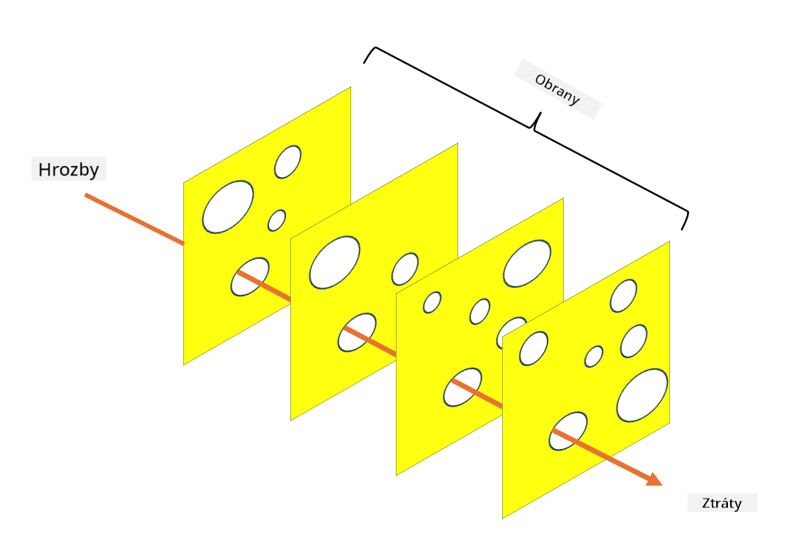

<!--
CO_OP_TRANSLATOR_METADATA:
{
  "original_hash": "75f77f972d2233c584f87c1eb96c983b",
  "translation_date": "2025-09-03T20:31:01+00:00",
  "source_file": "1.5 Zero trust.md",
  "language_code": "cs"
}
-->
# Zero Trust

„Zero trust“ je výraz, který se v dnešní době často používá v bezpečnostních kruzích. Ale co vlastně znamená? Je to jen módní slovo? V této lekci se podrobně podíváme na to, co zero trust skutečně je.

## Úvod

 - V této lekci se zaměříme na:
   
   
 - Co je zero trust?

   
  

 - Jak se zero trust liší od tradičních bezpečnostních architektur?

   
   

 - Co je hloubková obrana?

## Zero Trust

Zero Trust je přístup k kybernetické bezpečnosti, který zpochybňuje tradiční koncept „důvěřuj, ale ověřuj“ tím, že předpokládá, že žádný subjekt, ať už uvnitř nebo vně sítě organizace, by neměl být automaticky považován za důvěryhodný. Místo toho Zero Trust prosazuje ověřování každého uživatele, zařízení a aplikace, které se snaží získat přístup k prostředkům, bez ohledu na jejich umístění. Hlavním principem Zero Trust je minimalizace „povrchu útoku“ a snížení potenciálního dopadu bezpečnostních narušení.

V modelu Zero Trust jsou zdůrazněny následující principy:

1. **Ověření identity**: Autentizace a autorizace se důsledně aplikují na všechny uživatele a zařízení, bez ohledu na jejich umístění. Pamatujte, že identita nemusí být nutně lidská – může to být zařízení, aplikace atd.

2. **Minimální oprávnění**: Uživatelům a zařízením je přiděleno pouze nezbytné minimum přístupu potřebné k vykonání jejich úkolů, čímž se snižuje potenciální škoda v případě kompromitace.

3. **Mikrosegmentace**: Síťové prostředky jsou rozděleny na menší segmenty, aby se omezil laterální pohyb v síti v případě narušení.

4. **Nepřetržité monitorování**: Probíhá průběžné monitorování a analýza chování uživatelů a zařízení za účelem detekce anomálií a potenciálních hrozeb. Moderní monitorovací techniky využívají také strojové učení, AI a zpravodajství o hrozbách, aby poskytly další podrobnosti a kontext.

5. **Šifrování dat**: Data jsou šifrována jak při přenosu, tak při ukládání, aby se zabránilo neoprávněnému přístupu.

6. **Přísná kontrola přístupu**: Kontroly přístupu jsou vynucovány na základě kontextu, jako jsou role uživatelů, stav zařízení a umístění v síti.

Microsoft rozděluje zero trust do pěti pilířů, které probereme v pozdější lekci.

## Rozdíly oproti tradičním bezpečnostním architekturám

Zero Trust se liší od tradičních bezpečnostních architektur, jako jsou modely založené na perimetru, v několika ohledech:

1. **Perimetr vs. identita**: Tradiční modely se zaměřují na zabezpečení perimetru sítě a předpokládají, že interní uživatelé a zařízení mohou být důvěryhodní, jakmile jsou uvnitř. Zero Trust naopak předpokládá, že hrozby mohou pocházet jak zevnitř, tak zvenčí sítě, a vynucuje přísné kontroly založené na identitě.

2. **Implicitní vs. explicitní důvěra**: Tradiční modely implicitně důvěřují zařízením a uživatelům uvnitř sítě, dokud se neprokáže opak. Zero Trust explicitně ověřuje identity a nepřetržitě monitoruje anomálie.

3. **Plochá vs. segmentovaná síť**: Tradiční architektury často zahrnují ploché sítě, kde mají interní uživatelé široký přístup. Zero Trust prosazuje segmentaci sítě na menší, izolované zóny, aby se omezily potenciální narušení.

4. **Reaktivní vs. proaktivní**: Tradiční bezpečnost často spoléhá na reaktivní opatření, jako jsou perimetrické firewally a detekce narušení. Zero Trust přistupuje proaktivně tím, že předpokládá pravděpodobnost narušení a minimalizuje jeho dopad.

## Hloubková obrana

Hloubková obrana, známá také jako vrstvená bezpečnost, je strategie kybernetické bezpečnosti, která zahrnuje nasazení více vrstev bezpečnostních kontrol a opatření k ochraně aktiv organizace. Cílem je vytvořit překrývající se vrstvy obrany, aby v případě narušení jedné vrstvy ostatní stále poskytovaly ochranu. Každá vrstva se zaměřuje na jiný aspekt bezpečnosti a zvyšuje celkovou bezpečnostní úroveň organizace.

Hloubková obrana zahrnuje kombinaci technických, procedurálních a fyzických bezpečnostních opatření. Mohou zahrnovat firewally, systémy detekce narušení, kontroly přístupu, šifrování, školení uživatelů, bezpečnostní politiky a další. Myšlenkou je vytvořit více bariér, které společně ztěžují útočníkům proniknutí do systémů a sítí organizace. Tento přístup je někdy označován jako „model švýcarského sýra“, který se používá také v prevenci nehod v jiných odvětvích (např. doprava).

## Další čtení

[Co je Zero Trust?](https://learn.microsoft.com/security/zero-trust/zero-trust-overview?WT.mc_id=academic-96948-sayoung)

[Evoluce Zero Trust – Microsoft Position Paper](https://query.prod.cms.rt.microsoft.com/cms/api/am/binary/RWJJdT?WT.mc_id=academic-96948-sayoung)

[Zero Trust a BeyondCorp Google Cloud | Google Cloud Blog](https://cloud.google.com/blog/topics/developers-practitioners/zero-trust-and-beyondcorp-google-cloud)

---

**Upozornění**:  
Tento dokument byl přeložen pomocí služby pro automatický překlad [Co-op Translator](https://github.com/Azure/co-op-translator). I když se snažíme o co největší přesnost, mějte prosím na paměti, že automatické překlady mohou obsahovat chyby nebo nepřesnosti. Za autoritativní zdroj by měl být považován původní dokument v jeho původním jazyce. Pro důležité informace doporučujeme profesionální lidský překlad. Neodpovídáme za žádná nedorozumění nebo nesprávné výklady vyplývající z použití tohoto překladu.