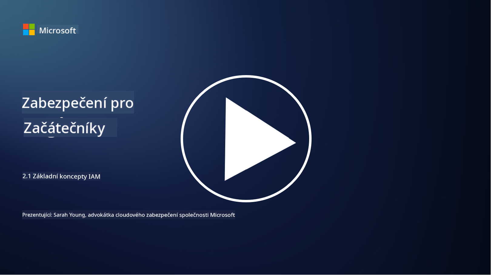

<!--
CO_OP_TRANSLATOR_METADATA:
{
  "original_hash": "2e3864e3d579f0dbb4ac2ec8c5f82acf",
  "translation_date": "2025-09-03T19:35:22+00:00",
  "source_file": "2.1 IAM key concepts.md",
  "language_code": "cs"
}
-->
# IAM klíčové koncepty

Už jste se někdy přihlásili do počítače nebo na webovou stránku? Samozřejmě, že ano! To znamená, že jste už ve svém každodenním životě použili kontrolu identity. Správa identit a přístupu (IAM) je klíčovým pilířem bezpečnosti, o kterém se dozvíme více v následujících lekcích.

**Úvod**

V této lekci se zaměříme na:

- Co znamená správa identit a přístupu (IAM) v kontextu kybernetické bezpečnosti?

- Co je princip minimálních oprávnění?

- Co je oddělení povinností?

- Co je autentizace a autorizace?

## Co znamená správa identit a přístupu (IAM) v kontextu kybernetické bezpečnosti?

Správa identit a přístupu (IAM) označuje soubor procesů, technologií a politik, které jsou implementovány za účelem zajištění, že správní jednotlivci mají odpovídající přístup k prostředkům v digitálním prostředí organizace. IAM zahrnuje správu digitálních identit (uživatelů, zaměstnanců, partnerů) a jejich přístupu k systémům, aplikacím, datům a sítím. Hlavním cílem IAM je zvýšit bezpečnost, zjednodušit uživatelský přístup a zajistit dodržování organizačních politik a předpisů. Řešení IAM obvykle zahrnují autentizaci uživatelů, autorizaci, poskytování identit, kontrolu přístupu a správu životního cyklu uživatelů (zajištění, že účty budou odstraněny, když již nejsou používány).

## Co je princip minimálních oprávnění?

Princip minimálních oprávnění je základní koncept, který prosazuje udělování uživatelům a systémům pouze těch nejmenších oprávnění, která jsou nezbytná k vykonávání jejich zamýšlených úkolů nebo rolí. Tento princip pomáhá omezit potenciální škody, které mohou nastat v případě narušení bezpečnosti nebo hrozby zevnitř. Dodržováním principu minimálních oprávnění organizace snižují útočný povrch a minimalizují riziko neoprávněného přístupu, úniků dat a neúmyslného zneužití oprávnění. V praxi to znamená, že uživatelé mají přístup pouze ke konkrétním prostředkům a funkcím potřebným pro jejich pracovní role, a nic víc. Například pokud potřebujete pouze číst dokument, bylo by nadbytečné, aby vám byla udělena plná administrátorská oprávnění k danému dokumentu.

## Co je oddělení povinností?

Oddělení povinností je princip zaměřený na prevenci střetu zájmů a snížení rizika podvodů a chyb rozdělením kritických úkolů a odpovědností mezi různé jednotlivce v organizaci. V kontextu kybernetické bezpečnosti oddělení povinností zahrnuje zajištění, že žádný jednotlivý člověk nemá kontrolu nad všemi aspekty kritického procesu nebo systému. Cílem je vytvořit systém kontrol a rovnováhy, který zabrání tomu, aby jedna osoba měla schopnost provádět jak fázi nastavení, tak fázi schvalování procesu. Například ve finančních systémech to může znamenat, že osoba, která zadává transakce do systému, by neměla být stejná osoba, která tyto transakce schvaluje. Tím se snižuje riziko neoprávněných nebo podvodných akcí, které by mohly zůstat neodhalené.

## Co je autentizace a autorizace?

Autentizace a autorizace jsou dva základní koncepty v kybernetické bezpečnosti, které hrají klíčovou roli při zajištění bezpečnosti a integrity počítačových systémů a dat. Často se používají společně k řízení přístupu k prostředkům a ochraně citlivých informací.

**1. Autentizace**: Autentizace je proces ověřování identity uživatele, systému nebo entity, která se snaží získat přístup k počítačovému systému nebo konkrétnímu prostředku. Zajišťuje, že deklarovaná identita je pravá a přesná. Metody autentizace obvykle zahrnují použití jednoho nebo více z následujících faktorů:

   a. Něco, co víte: To zahrnuje hesla, PINy nebo jiné tajné informace, které by měl mít pouze oprávněný uživatel.

   b. Něco, co máte: To zahrnuje fyzické tokeny nebo zařízení, jako jsou chytré karty, bezpečnostní tokeny nebo mobilní telefony, které potvrzují identitu uživatele.

   c. Něco, co jste: To se týká biometrických faktorů, jako jsou otisky prstů, rozpoznání obličeje nebo skeny sítnice, které jsou jedinečné pro jednotlivce.

Mechanismy autentizace se používají k potvrzení, že uživatel je tím, za koho se vydává, před tím, než mu je umožněn přístup k systému nebo prostředku. Pomáhá zabránit neoprávněnému přístupu a zajišťuje, že pouze legitimní uživatelé mohou provádět akce v systému.

**2. Autorizace**: Autorizace je proces udělování nebo odmítání konkrétních oprávnění a privilegií autentizovaným uživatelům nebo entitám poté, co byla jejich identita ověřena. Určuje, jaké akce nebo operace může uživatel provádět v systému nebo na konkrétních prostředcích. Autorizace je často založena na předem definovaných politikách, pravidlech kontroly přístupu a rolích přiřazených uživatelům.

Autorizaci lze chápat jako odpověď na otázku: "Co může autentizovaný uživatel dělat?" Zahrnuje definování a prosazování politik kontroly přístupu k ochraně citlivých dat a prostředků před neoprávněným přístupem nebo úpravou.

**Shrnutí:**

- Autentizace ověřuje identitu uživatelů nebo entit.
- Autorizace určuje, jaké akce a prostředky mohou autentizovaní uživatelé přistupovat nebo upravovat.

## Další čtení

- [Describe identity concepts - Training | Microsoft Learn](https://learn.microsoft.com/training/modules/describe-identity-principles-concepts/?WT.mc_id=academic-96948-sayoung)
- [Introduction to identity - Microsoft Entra | Microsoft Learn](https://learn.microsoft.com/azure/active-directory/fundamentals/identity-fundamental-concepts?WT.mc_id=academic-96948-sayoung)
- [What is Identity Access Management (IAM)? | Microsoft Security](https://www.microsoft.com/security/business/security-101/what-is-identity-access-management-iam?WT.mc_id=academic-96948-sayoung)
- [What is IAM? Identity and access management explained | CSO Online](https://www.csoonline.com/article/518296/what-is-iam-identity-and-access-management-explained.html)
- [What is IAM? (auth0.com)](https://auth0.com/blog/what-is-iam/)
- [Security+: implementing Identity and Access Management (IAM) controls [updated 2021] | Infosec (infosecinstitute.com)](https://resources.infosecinstitute.com/certifications/securityplus/security-implementing-identity-and-access-management-iam-controls/)
- [least privilege - Glossary | CSRC (nist.gov)](https://csrc.nist.gov/glossary/term/least_privilege)
- [Security: The Principle of Least Privilege (POLP) - Microsoft Community Hub](https://techcommunity.microsoft.com/t5/azure-sql-blog/security-the-principle-of-least-privilege-polp/ba-p/2067390?WT.mc_id=academic-96948-sayoung)
- [Principle of least privilege | CERT NZ](https://www.cert.govt.nz/it-specialists/critical-controls/principle-of-least-privilege/)
- [Why is separation of duties required by NIST 800-171 and CMMC? - (totem.tech)](https://www.totem.tech/cmmc-separation-of-duties/)

---

**Prohlášení**:  
Tento dokument byl přeložen pomocí služby pro automatický překlad [Co-op Translator](https://github.com/Azure/co-op-translator). I když se snažíme o přesnost, mějte prosím na paměti, že automatické překlady mohou obsahovat chyby nebo nepřesnosti. Původní dokument v jeho původním jazyce by měl být považován za autoritativní zdroj. Pro důležité informace se doporučuje profesionální lidský překlad. Neodpovídáme za žádné nedorozumění nebo nesprávné interpretace vyplývající z použití tohoto překladu.