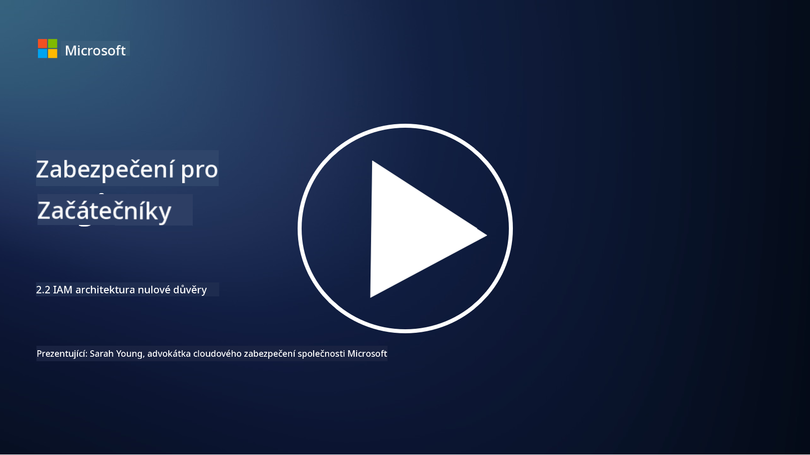

<!--
CO_OP_TRANSLATOR_METADATA:
{
  "original_hash": "4774a978af123f72ebb872199c4c4d4f",
  "translation_date": "2025-09-03T20:25:41+00:00",
  "source_file": "2.2 IAM zero trust architecture.md",
  "language_code": "cs"
}
-->
# IAM architektura nulové důvěry

Identita je klíčovou součástí implementace architektury nulové důvěry a budování perimetru pro jakékoli IT prostředí. V této části se podíváme na to, proč je důležité používat kontrolu identity k zavedení nulové důvěry.

## Úvod

V této lekci se budeme zabývat:

 - Proč je nutné používat identitu jako náš perimetr v moderních IT prostředích?
   
 - Jak se to liší od tradičních IT architektur?
   
 - Jak se identita využívá k implementaci architektury nulové důvěry?

## Proč je nutné používat identitu jako náš perimetr v moderních IT prostředích?

V moderních IT prostředích se tradiční koncept fyzického perimetru (využívající nástroje jako firewally a síťové hranice) jako hlavní linie obrany proti kybernetickým hrozbám stává méně efektivním kvůli rostoucí složitosti technologií, nárůstu práce na dálku a přijetí cloudových služeb. Místo toho se organizace přesouvají k používání identity jako nového perimetru. To znamená, že bezpečnost se zaměřuje na ověřování a správu identity uživatelů, zařízení a aplikací, které se snaží získat přístup ke zdrojům, bez ohledu na jejich fyzické umístění.

Zde je důvod, proč je používání identity jako perimetru klíčové v moderních IT prostředích:

**Práce na dálku**: S rostoucím trendem práce na dálku a používáním mobilních zařízení mohou uživatelé přistupovat ke zdrojům z různých míst a zařízení. Tradiční přístup založený na perimetru nefunguje, když uživatelé již nejsou omezeni na fyzickou kancelář.

**Cloudová a hybridní prostředí**: Organizace stále více přijímají cloudové služby a hybridní prostředí. Data a aplikace již nejsou výhradně umístěny v prostorách organizace, což činí tradiční obranu perimetru méně relevantní.

**Bezpečnost nulové důvěry**: Koncept bezpečnosti nulové důvěry předpokládá, že žádný subjekt, ať už uvnitř nebo vně sítě, by neměl být automaticky důvěryhodný. Identita se stává základem pro ověřování přístupových požadavků, bez ohledu na jejich původ.

**Hrozby v kyberprostoru**: Kybernetické hrozby se vyvíjejí a útočníci nacházejí způsoby, jak obejít tradiční obranu perimetru. Phishing, sociální inženýrství a vnitřní hrozby často zneužívají lidské slabiny spíše než pokusy o prolomení síťových perimetrů.

**Přístup zaměřený na data**: Ochrana citlivých dat je zásadní. Zaměřením na identitu mohou organizace kontrolovat, kdo má přístup k jakým datům, čímž snižují riziko úniku dat.

## Jak se to liší od tradičních IT architektur?

Tradiční IT architektury se silně spoléhaly na modely zabezpečení založené na perimetru, kde firewally a síťové hranice hrály významnou roli při ochraně před hrozbami. Hlavní rozdíly mezi tradičním a identitně orientovaným přístupem jsou:

|      Aspekt                 |      Tradiční IT architektury                                                                     |      Přístup orientovaný na identitu                                                                      |
|-----------------------------|----------------------------------------------------------------------------------------------------|------------------------------------------------------------------------------------------------------------|
|     Zaměření                |     Zaměření na perimetr: Spoléhalo se na obranu perimetru, jako jsou firewally a řízení přístupu. |     Zaměření na ověřování identity: Přesun od síťových hranic k ověřování identity uživatele/zařízení.     |
|     Umístění                |     Závislost na umístění: Bezpečnost byla vázána na fyzické kanceláře a síťové hranice.           |     Nezávislost na umístění: Bezpečnost není vázána na konkrétní místa; přístup odkudkoli.                 |
|     Předpoklad důvěry       |     Předpokládaná důvěra: Důvěra byla předpokládána uvnitř síťového perimetru pro uživatele/zařízení. |     Přístup nulové důvěry: Důvěra není nikdy předpokládána; přístup je ověřován na základě identity a kontextu. |
|     Zohlednění zařízení     |     Rozmanitost zařízení: Předpokládalo se, že zařízení uvnitř síťového perimetru jsou bezpečná.    |     Vědomí zařízení: Zohledňuje se stav a bezpečnostní profil zařízení, bez ohledu na umístění.            |
|     Ochrana dat             |     Ochrana dat: Zaměřeno na zabezpečení síťových perimetrů pro ochranu dat.                       |     Ochrana zaměřená na data: Zaměřeno na kontrolu přístupu k datům na základě identity a citlivosti dat.  |
|                             |                                                                                                    |                                                                                                            |

## Jak se identita využívá k implementaci architektury nulové důvěry?

V architektuře nulové důvěry je základním principem nikdy automaticky nedůvěřovat žádnému subjektu, bez ohledu na to, zda je uvnitř nebo vně síťového perimetru. Identita hraje klíčovou roli při implementaci přístupu nulové důvěry tím, že umožňuje nepřetržité ověřování subjektů, které se snaží získat přístup ke zdrojům. Moderní bezpečnostní kontroly identity umožňují, aby každý uživatel, zařízení, aplikace a služba, která žádá o přístup ke zdrojům, byla důkladně identifikována a ověřena před udělením přístupu. To zahrnuje ověřování jejich digitální identity prostřednictvím metod, jako jsou kombinace uživatelského jména a hesla, vícefaktorové ověřování (MFA), biometrie a další silné autentizační mechanismy.

## Další čtení

- [Zabezpečení identity s nulovou důvěrou | Microsoft Learn](https://learn.microsoft.com/security/zero-trust/deploy/identity?WT.mc_id=academic-96948-sayoung)
- [Principy a pokyny nulové důvěry pro identitu a přístup | CSA (cloudsecurityalliance.org)](https://cloudsecurityalliance.org/artifacts/zero-trust-principles-and-guidance-for-iam/)
- [Kontroly identity v nulové důvěře - Základní série - Epizoda 2 - YouTube](https://www.youtube.com/watch?v=fQZQznIKcGM&list=PLXtHYVsvn_b_gtX1-NB62wNervQx1Fhp4&index=13)

---

**Prohlášení**:  
Tento dokument byl přeložen pomocí služby pro automatický překlad [Co-op Translator](https://github.com/Azure/co-op-translator). Ačkoli se snažíme o přesnost, mějte prosím na paměti, že automatické překlady mohou obsahovat chyby nebo nepřesnosti. Původní dokument v jeho původním jazyce by měl být považován za autoritativní zdroj. Pro důležité informace doporučujeme profesionální lidský překlad. Neodpovídáme za žádná nedorozumění nebo nesprávné interpretace vyplývající z použití tohoto překladu.