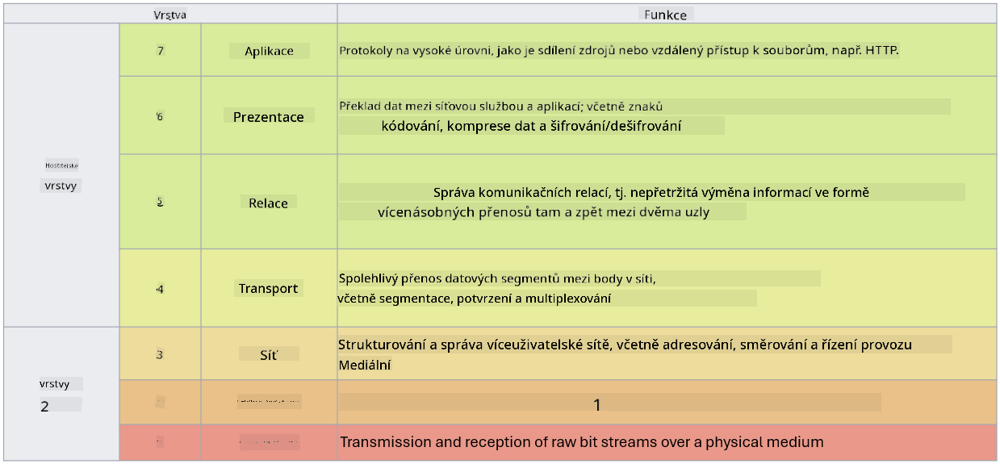

<!--
CO_OP_TRANSLATOR_METADATA:
{
  "original_hash": "252724eceeb183fb9018f88c5e1a3f0c",
  "translation_date": "2025-09-03T22:03:48+00:00",
  "source_file": "3.1 Networking key concepts.md",
  "language_code": "cs"
}
-->
# Klíčové koncepty síťování

Pokud jste někdy pracovali v IT, je pravděpodobné, že jste se setkali s koncepty síťování. Ačkoli v moderních prostředích používáme identitu jako primární kontrolu perimetru, neznamená to, že síťové kontroly jsou zbytečné. Přestože je toto téma velmi rozsáhlé, v této lekci se zaměříme na některé klíčové koncepty síťování.

V této lekci se budeme zabývat:

 - Co je IP adresování?
   
 - Co je model OSI?

 

 - Co je TCP/UDP?

   
 

 - Co jsou čísla portů?

   
  

 - Co je šifrování v klidu a při přenosu?

## Co je IP adresování?

IP adresování, neboli adresování internetového protokolu, je číselný identifikátor přiřazený každému zařízení připojenému k počítačové síti, která používá internetový protokol pro komunikaci. Slouží jako jedinečný identifikátor zařízení v síti, což umožňuje odesílání a přijímání dat přes internet nebo jiné propojené sítě. Existují dvě hlavní verze IP adresování: IPv4 (Internet Protocol verze 4) a IPv6 (Internet Protocol verze 6). IP adresa je obvykle reprezentována buď ve formátu IPv4 (např. 192.168.1.1) nebo ve formátu IPv6 (např. 2001:0db8:85a3:0000:0000:8a2e:0370:7334).

## Co je model OSI?

Model OSI (Open Systems Interconnection) je konceptuální rámec, který standardizuje funkce komunikačního systému do sedmi samostatných vrstev. Každá vrstva provádí specifické úkoly a komunikuje se sousedními vrstvami, aby zajistila efektivní a spolehlivou komunikaci dat mezi zařízeními v síti. Tyto vrstvy, odspodu nahoru, jsou následující:

 1. Fyzická vrstva
    
 
 2. Vrstva datového spojení

    
    

 1. Síťová vrstva

    
   

 1. Transportní vrstva

    

 1. Relační vrstva

    
   

 1. Prezentační vrstva

    
    

 1. Aplikační vrstva

Model OSI poskytuje společný referenční rámec pro pochopení, jak síťové protokoly a technologie spolupracují, bez ohledu na konkrétní hardwarové nebo softwarové implementace.

_ref: https://en.wikipedia.org/wiki/OSI_model_

## Co je TCP/UDP?

TCP (Transmission Control Protocol) a UDP (User Datagram Protocol) jsou dva základní protokoly transportní vrstvy používané v počítačových sítích k usnadnění komunikace mezi zařízeními přes internet nebo v rámci lokální sítě. Jsou odpovědné za rozdělení dat na pakety pro přenos a následné sestavení těchto paketů do původních dat na přijímací straně. Liší se však svými vlastnostmi a použitím.

**TCP (Transmission Control Protocol)**:

TCP je protokol orientovaný na spojení, který poskytuje spolehlivé a uspořádané doručení dat mezi zařízeními. Před zahájením výměny dat navazuje spojení mezi odesílatelem a příjemcem. TCP zajišťuje, že datové pakety dorazí ve správném pořadí, a dokáže znovu odeslat ztracené pakety, aby zajistil integritu a úplnost dat. Díky tomu je TCP vhodný pro aplikace, které vyžadují spolehlivé doručení dat, jako je prohlížení webu, e-mail, přenos souborů (FTP) a komunikace s databázemi.

**UDP (User Datagram Protocol)**:

UDP je protokol bez spojení, který nabízí rychlejší přenos dat, ale neposkytuje stejnou úroveň spolehlivosti jako TCP. Před odesláním dat nenavazuje formální spojení a neobsahuje mechanismy pro potvrzování nebo opětovné odesílání ztracených paketů. UDP je vhodný pro aplikace, kde je rychlost a efektivita důležitější než zaručené doručení, jako je komunikace v reálném čase, streamování médií, online hry a DNS dotazy.

Shrnuto, TCP upřednostňuje spolehlivost a uspořádané doručení, což ho činí vhodným pro aplikace, které vyžadují přesnost dat, zatímco UDP klade důraz na rychlost a efektivitu, což ho činí vhodným pro aplikace, kde je přijatelná menší ztráta dat nebo změna pořadí výměnou za sníženou latenci. Volba mezi TCP a UDP závisí na konkrétních požadavcích aplikace nebo služby.

## Co jsou čísla portů?

V síťování je číslo portu číselný identifikátor používaný k rozlišení mezi různými službami nebo aplikacemi, které běží na jednom zařízení v síti. Porty pomáhají směrovat příchozí data na správnou aplikaci. Čísla portů jsou 16bitová neznačená celá čísla, což znamená, že se pohybují v rozmezí od 0 do 65535. Jsou rozděleny do tří rozsahů:

- Dobře známé porty (0-1023): Rezervované pro standardní služby, jako je HTTP (port 80) a FTP (port 21).

- Registrované porty (1024-49151): Používané pro aplikace a služby, které nejsou součástí dobře známého rozsahu, ale jsou oficiálně registrované.

- Dynamické/soukromé porty (49152-65535): Dostupné pro dočasné nebo soukromé použití aplikacemi.

## Co je šifrování v klidu a při přenosu?

Šifrování je proces převodu dat do zabezpečeného formátu, aby byla chráněna před neoprávněným přístupem nebo manipulací. Šifrování lze aplikovat na data jak "v klidu" (při ukládání na zařízení nebo serveru), tak "při přenosu" (při přenosu mezi zařízeními nebo přes sítě).

Šifrování v klidu: To zahrnuje šifrování dat, která jsou uložena na zařízeních, serverech nebo úložných systémech. I když útočník získá fyzický přístup k úložnému médiu, nemůže data bez šifrovacích klíčů získat. To je zásadní pro ochranu citlivých dat v případě krádeže zařízení, narušení dat nebo neoprávněného přístupu.

Šifrování při přenosu: To zahrnuje šifrování dat při jejich cestě mezi zařízeními nebo přes sítě. To zabraňuje odposlechu a neoprávněnému zachycení dat během přenosu. Běžné protokoly pro šifrování při přenosu zahrnují HTTPS pro webovou komunikaci a TLS/SSL pro zabezpečení různých typů síťového provozu.

## Další čtení
- [Jak fungují IP adresy? (howtogeek.com)](https://www.howtogeek.com/341307/how-do-ip-addresses-work/)
- [Porozumění IP adresám: Úvodní průvodce (geekflare.com)](https://geekflare.com/understanding-ip-address/)
- [Co je model OSI? 7 vrstev OSI vysvětleno (techtarget.com)](https://www.techtarget.com/searchnetworking/definition/OSI)
- [Model OSI – 7 vrstev síťování vysvětleno jednoduše (freecodecamp.org)](https://www.freecodecamp.org/news/osi-model-networking-layers-explained-in-plain-english/)
- [Protokoly TCP/IP - IBM Dokumentace](https://www.ibm.com/docs/en/aix/7.3?topic=protocol-tcpip-protocols)
- [Přehled běžných portů: Konečný seznam portů a protokolů (stationx.net)](https://www.stationx.net/common-ports-cheat-sheet/)
- [Šifrování dat v klidu na Azure - Azure Security | Microsoft Learn](https://learn.microsoft.com/azure/security/fundamentals/encryption-atrest?WT.mc_id=academic-96948-sayoung)

---

**Prohlášení**:  
Tento dokument byl přeložen pomocí služby pro automatický překlad [Co-op Translator](https://github.com/Azure/co-op-translator). I když se snažíme o přesnost, mějte prosím na paměti, že automatické překlady mohou obsahovat chyby nebo nepřesnosti. Původní dokument v jeho původním jazyce by měl být považován za autoritativní zdroj. Pro důležité informace se doporučuje profesionální lidský překlad. Neodpovídáme za žádná nedorozumění nebo nesprávné interpretace vyplývající z použití tohoto překladu.