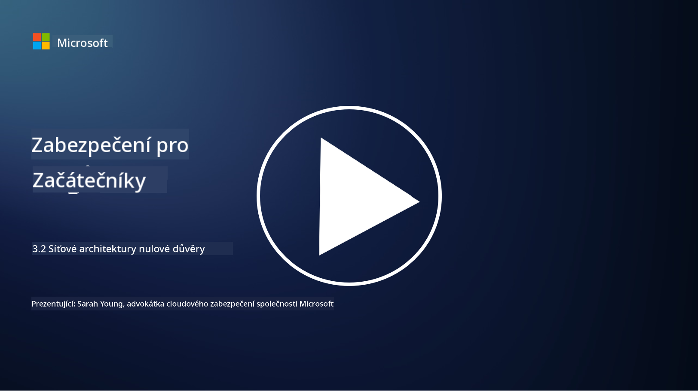

<!--
CO_OP_TRANSLATOR_METADATA:
{
  "original_hash": "680d6e14d9d33fc471c22f44679713f8",
  "translation_date": "2025-09-03T21:13:20+00:00",
  "source_file": "3.2 Networking zero trust architecture.md",
  "language_code": "cs"
}
-->
# Síťové architektury s nulovou důvěrou

Síť poskytuje klíčovou vrstvu v kontrolách nulové důvěry, v této lekci se dozvíme více o následujících tématech:

- Co je segmentace sítě?  
- Jak segmentace sítě pomáhá implementovat nulovou důvěru?  
- Co je šifrování typu end-to-end?

## Co je segmentace sítě?

Segmentace sítě je praxe rozdělení sítě na menší, izolované segmenty nebo podsítě. Každý segment je izolován od ostatních a přístup mezi segmenty je kontrolován a omezen na základě specifických bezpečnostních politik. Segmentace sítě se používá ke zlepšení bezpečnosti tím, že omezuje dopad potenciálních narušení a minimalizuje boční pohyb útočníků v rámci sítě.

Implementací segmentace sítě může organizace vytvořit „zóny“, které oddělují různé typy uživatelů, aplikací a dat. To snižuje povrch útoku a minimalizuje potenciální škody způsobené bezpečnostním incidentem. Segmentace sítě může být realizována pomocí technologií, jako jsou virtuální LANy (VLANy), firewally a přístupové kontroly.

## Jak segmentace sítě pomáhá implementovat nulovou důvěru?

Segmentace sítě úzce souvisí s principy modelu nulové důvěry. V architektuře nulové důvěry segmentace sítě pomáhá prosazovat princip „nejmenšího oprávnění“ tím, že zajišťuje, že uživatelé a zařízení mají přístup pouze k konkrétním zdrojům a službám, které potřebují k plnění svých úkolů. Segmentací sítě na menší zóny mohou organizace implementovat přísné přístupové kontroly, izolovat kritické prostředky a zabránit bočnímu pohybu útočníků.

Segmentace sítě také pomáhá prosazovat přístupy založené na identitě, kde jsou uživatelé a zařízení důkladně autentizováni a autorizováni před přístupem k určitým segmentům. To zabraňuje neoprávněnému přístupu k citlivým prostředkům a zmírňuje potenciální dopad kompromitovaných přihlašovacích údajů.

## Co je šifrování typu end-to-end?

Šifrování typu end-to-end (E2E) je bezpečnostní opatření, které zajišťuje, že data zůstávají šifrována po celou dobu své cesty od odesílatele k příjemci. V tomto procesu jsou data šifrována na straně odesílatele a pouze příjemce vlastní dešifrovací klíč, který umožňuje data odemknout a přečíst. Procesy šifrování a dešifrování probíhají na koncových bodech, což činí velmi obtížným pro neoprávněné strany, včetně poskytovatelů služeb a zprostředkovatelů, získat přístup k nešifrovaným datům.

E2E šifrování poskytuje vysokou úroveň důvěrnosti a bezpečnosti při přenosu dat, i když data procházejí různými zprostředkovatelskými systémy nebo sítěmi. Běžně se používá v aplikacích pro bezpečné zasílání zpráv, e-mailových službách a dalších komunikačních platformách k ochraně citlivých informací před odposlechem a neoprávněným přístupem.

Tato metoda šifrování zajišťuje, že i když útočníci získají přístup k datům během přenosu, uvidí pouze šifrovaný obsah, který je bez dešifrovacího klíče bezvýznamný. Šifrování typu end-to-end hraje klíčovou roli při ochraně soukromí uživatelů a zabezpečení citlivých informací před neoprávněným zveřejněním.

## Co je SASE?

SASE znamená „Secure Access Service Edge“ a jedná se o rámec a architekturu kybernetické bezpečnosti, která kombinuje síťovou bezpečnost a schopnosti širokopásmového připojení (WAN) do jedné cloudové služby. SASE je navrženo tak, aby poskytovalo bezpečný a škálovatelný přístup k síťovým zdrojům, aplikacím a datům pro vzdálené a mobilní uživatele, přičemž zjednodušuje správu sítě a snižuje složitost tradičních síťových a bezpečnostních architektur.

Klíčové charakteristiky a komponenty SASE zahrnují:

1. **Cloudové řešení:** SASE je poskytováno jako cloudová služba, což znamená, že bezpečnostní a síťové funkce jsou poskytovány z cloudu, nikoli prostřednictvím tradičního hardwaru a zařízení na místě.  

2. **Integrace bezpečnosti a sítě:** SASE integruje různé bezpečnostní služby, jako jsou bezpečné webové brány (SWG), firewall jako služba (FWaaS), prevence ztráty dat (DLP), přístup k síti s nulovou důvěrou (ZTNA) a optimalizace WAN s funkcemi širokopásmového připojení. Tato integrace pomáhá zefektivnit bezpečnostní a síťové operace.  

3. **Nulová důvěra:** SASE funguje na principu nulové důvěry, což znamená, že prosazuje přísné přístupové kontroly a politiky nejmenšího oprávnění. Uživatelé a zařízení nejsou automaticky důvěryhodní a musí být autentizováni a autorizováni před přístupem k prostředkům.  

4. **Zaměření na identitu:** SASE se zaměřuje na identity uživatelů a zařízení jako základ pro kontrolu přístupu. Politiky založené na identitě a kontextu se používají k určení oprávnění k přístupu a tyto politiky se dynamicky přizpůsobují na základě chování uživatelů a kontextu.  

5. **Škálovatelnost a flexibilita:** SASE se snadno škáluje, aby vyhovovalo velkému počtu uživatelů a zařízení, což jej činí vhodným pro organizace s různorodými a měnícími se potřebami v oblasti sítí a bezpečnosti.  

SASE je obzvláště relevantní v moderní éře vzdálené práce a adopce cloudu, protože poskytuje komplexní a agilní přístup k zabezpečení a správě síťového přístupu. Pomáhá organizacím přizpůsobit se měnícím se požadavkům na bezpečnost a sítě, přičemž zachovává silné zaměření na modely bezpečnosti zaměřené na uživatele a nulovou důvěru.

## Další čtení

- [Co je segmentace sítě? - Cisco](https://www.cisco.com/c/en/us/products/security/what-is-network-segmentation.html#~benefits)  
- [Co je mikrosegmentace? - Cisco](https://www.cisco.com/c/en/us/products/security/what-is-microsegmentation.html)  
- [Implementace segmentace a segregace sítě | Cyber.gov.au](https://www.cyber.gov.au/resources-business-and-government/maintaining-devices-and-systems/system-hardening-and-administration/network-hardening/implementing-network-segmentation-and-segregation)  
- [Co je segmentace sítě a proč je důležitá | CompTIA](https://www.comptia.org/blog/security-awareness-training-network-segmentation)  
- [Segmentace sítě: Koncepty a praxe (cmu.edu)](https://insights.sei.cmu.edu/blog/network-segmentation-concepts-and-practices/)  
- [Zabezpečené sítě s nulovou důvěrou | Microsoft Learn](https://learn.microsoft.com/security/zero-trust/deploy/networks?WT.mc_id=academic-96948-sayoung)  
- [Co je šifrování typu end-to-end? | IBM](https://www.ibm.com/topics/end-to-end-encryption)  
- [Co je šifrování typu end-to-end a proč je důležité? (howtogeek.com)](https://www.howtogeek.com/711656/what-is-end-to-end-encryption-and-why-does-it-matter/)  
- [Definice Secure Access Service Edge (SASE) - Gartner Information Technology Glossary](https://www.gartner.com/en/information-technology/glossary/secure-access-service-edge-sase)  
- [Co je Secure Access Service Edge (SASE)? | Microsoft Security](https://www.microsoft.com/security/business/security-101/what-is-sase?WT.mc_id=academic-96948-sayoung)  

---

**Prohlášení**:  
Tento dokument byl přeložen pomocí služby pro automatický překlad [Co-op Translator](https://github.com/Azure/co-op-translator). I když se snažíme o přesnost, mějte na paměti, že automatické překlady mohou obsahovat chyby nebo nepřesnosti. Původní dokument v jeho původním jazyce by měl být považován za autoritativní zdroj. Pro důležité informace doporučujeme profesionální lidský překlad. Neodpovídáme za žádné nedorozumění nebo nesprávné interpretace vyplývající z použití tohoto překladu.