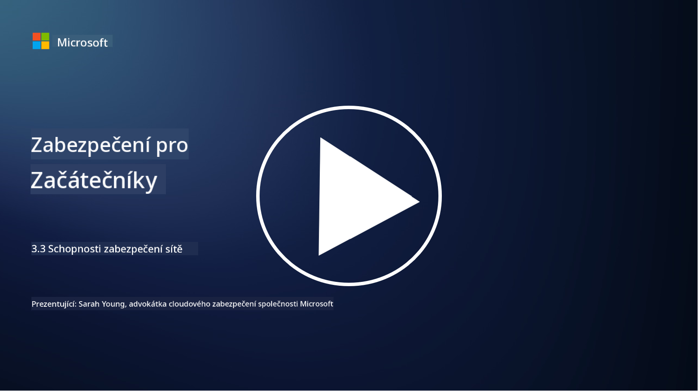

<!--
CO_OP_TRANSLATOR_METADATA:
{
  "original_hash": "c3aba077bb98eebc925dd58d870229ab",
  "translation_date": "2025-09-03T20:19:33+00:00",
  "source_file": "3.3 Network security capabilities.md",
  "language_code": "cs"
}
-->
# Schopnosti zabezpečení sítě

V této lekci se naučíme o následujících schopnostech, které lze použít k zabezpečení sítě:

 - Tradiční firewally
 - Firewally pro webové aplikace
 - Skupiny zabezpečení v cloudu
 - CDN
 - Load balancery
 - Bastion hosty
 - VPN
 - Ochrana proti DDoS útokům

## Tradiční firewally

Tradiční firewally jsou bezpečnostní zařízení, která kontrolují a monitorují příchozí a odchozí síťový provoz na základě předem definovaných bezpečnostních pravidel. Fungují jako bariéra mezi důvěryhodnou interní sítí a nedůvěryhodnými externími sítěmi, filtrují provoz, aby zabránily neoprávněnému přístupu a potenciálním hrozbám.

## Firewally pro webové aplikace

Firewally pro webové aplikace (WAF) jsou specializované firewally určené k ochraně webových aplikací před různými útoky, jako jsou SQL injection, cross-site scripting a další zranitelnosti. Analyzují HTTP požadavky a odpovědi, aby identifikovaly a blokovaly škodlivý provoz zaměřený na webové aplikace.

## Skupiny zabezpečení v cloudu

Skupiny zabezpečení jsou základní funkcí zabezpečení sítě poskytovanou poskytovateli cloudových služeb. Fungují jako virtuální firewally, které kontrolují příchozí a odchozí provoz do a z cloudových zdrojů, jako jsou virtuální stroje (VM) a instance. Skupiny zabezpečení umožňují organizacím definovat pravidla, která určují, jaké typy provozu jsou povoleny a zakázány, čímž přidávají další vrstvu obrany do cloudových nasazení.

## Content Delivery Network (CDN)

Content Delivery Network je distribuovaná síť serverů umístěných v různých geografických lokalitách. CDN pomáhají zlepšit výkon a dostupnost webových stránek tím, že ukládají obsah do mezipaměti a poskytují jej ze serverů, které jsou blíže uživateli. Poskytují také určitou úroveň ochrany proti DDoS útokům tím, že rozdělují provoz mezi více serverových lokalit.

## Load balancery

Load balancery rozdělují příchozí síťový provoz mezi více serverů, aby optimalizovaly využití zdrojů, zajistily vysokou dostupnost a zlepšily výkon aplikací. Pomáhají předcházet přetížení serverů a udržovat efektivní odezvy, čímž zvyšují odolnost sítě.

## Bastion hosty

Bastion hosty jsou vysoce zabezpečené a izolované servery, které poskytují kontrolovaný přístup do sítě z externí, nedůvěryhodné sítě (například internetu). Slouží jako vstupní body pro administrátory, kteří mohou bezpečně přistupovat k interním systémům. Bastion hosty jsou obvykle konfigurovány s přísnými bezpečnostními opatřeními, aby minimalizovaly povrch útoku.

## Virtuální privátní sítě (VPN)

VPN vytvářejí šifrované tunely mezi zařízením uživatele a vzdáleným serverem, což zajišťuje bezpečnou a soukromou komunikaci přes potenciálně nezabezpečené sítě, jako je internet. VPN se běžně používají k poskytování vzdáleného přístupu do interních sítí, což uživatelům umožňuje přístup k prostředkům, jako by byli fyzicky na stejné síti.

## Nástroje pro ochranu proti DDoS útokům

Nástroje a služby pro ochranu proti DDoS (Distributed Denial of Service) útokům jsou navrženy tak, aby zmírnily dopad DDoS útoků, při kterých více kompromitovaných zařízení zaplaví síť nebo službu, aby ji přetížily. Řešení pro ochranu proti DDoS identifikují a filtrují škodlivý provoz, čímž zajišťují, že legitimní provoz může stále dosáhnout svého cíle.

## Další čtení

- [Co je firewall? - Cisco](https://www.cisco.com/c/en/us/products/security/firewalls/what-is-a-firewall.html#~types-of-firewalls)
- [Co vlastně firewall dělá? (howtogeek.com)](https://www.howtogeek.com/144269/htg-explains-what-firewalls-actually-do/)
- [Co je firewall? Jak firewally fungují a typy firewallů (kaspersky.com)](https://www.kaspersky.com/resource-center/definitions/firewall)
- [Skupina zabezpečení sítě - jak funguje | Microsoft Learn](https://learn.microsoft.com/azure/virtual-network/network-security-group-how-it-works)
- [Úvod do Azure Content Delivery Network (CDN) - Školení | Microsoft Learn](https://learn.microsoft.com/training/modules/intro-to-azure-content-delivery-network/?WT.mc_id=academic-96948-sayoung)
- [Co je Content Delivery Network (CDN)? - Azure | Microsoft Learn](https://learn.microsoft.com/azure/cdn/cdn-overview?WT.mc_id=academic-96948-sayoung)
- [Co je load balancing? Jak fungují load balancery (nginx.com)](https://www.nginx.com/resources/glossary/load-balancing/)
- [Bastion hosty vs. VPN · Tailscale](https://tailscale.com/learn/bastion-hosts-vs-vpns/)
- [Co je VPN? Jak funguje, typy VPN (kaspersky.com)](https://www.kaspersky.com/resource-center/definitions/what-is-a-vpn)
- [Úvod do Azure DDoS Protection - Školení | Microsoft Learn](https://learn.microsoft.com/training/modules/introduction-azure-ddos-protection/?WT.mc_id=academic-96948-sayoung)
- [Co je DDoS útok? | Microsoft Security](https://www.microsoft.com/security/business/security-101/what-is-a-ddos-attack?WT.mc_id=academic-96948-sayoung)

---

**Prohlášení**:  
Tento dokument byl přeložen pomocí služby pro automatický překlad [Co-op Translator](https://github.com/Azure/co-op-translator). Ačkoli se snažíme o přesnost, mějte prosím na paměti, že automatické překlady mohou obsahovat chyby nebo nepřesnosti. Původní dokument v jeho původním jazyce by měl být považován za autoritativní zdroj. Pro kritické informace doporučujeme profesionální lidský překlad. Neodpovídáme za žádná nedorozumění nebo nesprávné interpretace vyplývající z použití tohoto překladu.