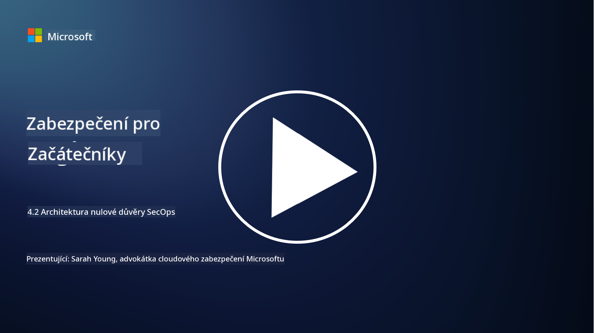

<!--
CO_OP_TRANSLATOR_METADATA:
{
  "original_hash": "45bbdc114e70936816b0b3e7c40189cf",
  "translation_date": "2025-09-03T21:19:07+00:00",
  "source_file": "4.2 SecOps zero trust architecture.md",
  "language_code": "cs"
}
-->
# Architektura nulové důvěry v oblasti bezpečnostních operací

Bezpečnostní operace tvoří dvě části architektury nulové důvěry a v této lekci se naučíme o obou:

- Jak musí být IT architektury navrženy, aby umožnily centralizovaný sběr logů?

- Jaké jsou osvědčené postupy pro bezpečnostní operace v moderních IT prostředích?

## Jak musí být IT architektury navrženy, aby umožnily centralizovaný sběr logů?

Centralizovaný sběr logů je klíčovou součástí moderních bezpečnostních operací. Umožňuje organizacím shromažďovat logy a data z různých zdrojů, jako jsou servery, aplikace, síťová zařízení a bezpečnostní nástroje, do centrálního úložiště pro analýzu, monitorování a reakci na incidenty. Zde jsou některé osvědčené postupy pro budování IT architektur podporujících centralizovaný sběr logů:

1. **Integrace zdrojů logů**:

- Zajistěte, aby všechna relevantní zařízení a systémy byly nakonfigurovány tak, aby generovaly logy. To zahrnuje servery, firewally, routery, switche, aplikace a bezpečnostní zařízení.

- Nakonfigurujte zdroje logů tak, aby odesílaly logy do centralizovaného sběrače nebo systému pro správu logů.

2. **Výběr správného nástroje SIEM (Security Information and Event Management)**:

- Vyberte řešení SIEM, které odpovídá potřebám a rozsahu vaší organizace.

- Ujistěte se, že zvolené řešení podporuje sběr, agregaci, analýzu a reportování logů.

3. **Škálovatelnost a redundance**:

- Navrhněte architekturu tak, aby byla škálovatelná a zvládla rostoucí počet zdrojů logů a zvýšený objem logů.

- Implementujte redundanci pro vysokou dostupnost, aby se předešlo výpadkům způsobeným selháním hardwaru nebo sítě.

4. **Bezpečný přenos logů**:

- Používejte bezpečné protokoly, jako jsou TLS/SSL nebo IPsec, pro přenos logů ze zdrojů do centrálního úložiště.

- Implementujte autentizaci a kontrolu přístupu, aby logy mohly odesílat pouze autorizovaná zařízení.

5. **Normalizace**:

- Standardizujte formáty logů a normalizujte data, aby byla konzistentní a snadno analyzovatelná.

6. **Úložiště a uchovávání**:

- Určete vhodnou dobu uchovávání logů na základě požadavků na shodu a bezpečnost.

- Uchovávejte logy bezpečně, chráněné před neoprávněným přístupem a manipulací.

## Jaké jsou osvědčené postupy pro bezpečnostní operace v moderních IT prostředích?

Kromě centralizovaného sběru logů zde uvádíme některé osvědčené postupy pro bezpečnostní operace v moderních IT prostředích:

1. **Nepřetržité monitorování**: Implementujte nepřetržité monitorování síťových a systémových aktivit, abyste mohli v reálném čase detekovat a reagovat na hrozby.

2. **Zpravodajství o hrozbách**: Sledujte aktuální hrozby a zranitelnosti pomocí zpravodajských kanálů a služeb.

3. **Školení uživatelů**: Provádějte pravidelná školení o bezpečnostním povědomí pro zaměstnance, abyste snížili rizika spojená se sociálním inženýrstvím a phishingovými útoky.

4. **Plán reakce na incidenty**: Vypracujte a otestujte plán reakce na incidenty, abyste zajistili rychlou a efektivní reakci na bezpečnostní incidenty.

5. **Automatizace bezpečnosti**: Využívejte nástroje pro automatizaci a orchestraci bezpečnosti, abyste zefektivnili reakci na incidenty a opakující se úkoly.

6. **Zálohování a obnova**: Implementujte robustní řešení zálohování a obnovy, abyste zajistili dostupnost dat v případě jejich ztráty nebo útoků ransomware.

## Další čtení

- [Modul Microsoft Security Best Practices: Bezpečnostní operace | Microsoft Learn](https://learn.microsoft.com/security/operations/security-operations-videos-and-decks?WT.mc_id=academic-96948-sayoung)
- [Bezpečnostní operace - Cloud Adoption Framework | Microsoft Learn](https://learn.microsoft.com/azure/cloud-adoption-framework/secure/security-operations?WT.mc_id=academic-96948-sayoung)
- [Co je architektura platformy pro bezpečnostní operace a analýzu? Definice SOAPA, jak funguje, výhody a další (digitalguardian.com)](https://www.digitalguardian.com/blog/what-security-operations-and-analytics-platform-architecture-definition-soapa-how-it-works#:~:text=All%20in%20all%2C%20security%20operations%20and%20analytics%20platform,become%20more%20efficient%20and%20operative%20with%20your%20security.)

---

**Prohlášení**:  
Tento dokument byl přeložen pomocí služby pro automatický překlad [Co-op Translator](https://github.com/Azure/co-op-translator). I když se snažíme o přesnost, mějte prosím na paměti, že automatické překlady mohou obsahovat chyby nebo nepřesnosti. Původní dokument v jeho původním jazyce by měl být považován za autoritativní zdroj. Pro důležité informace se doporučuje profesionální lidský překlad. Neodpovídáme za žádné nedorozumění nebo nesprávné interpretace vyplývající z použití tohoto překladu.