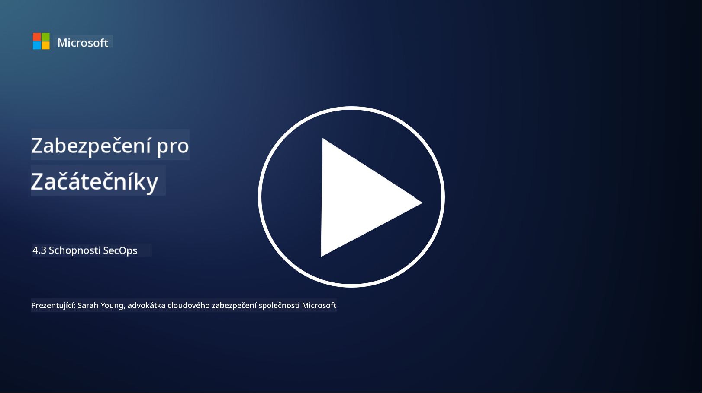

<!--
CO_OP_TRANSLATOR_METADATA:
{
  "original_hash": "553eb694c89f1caca0694e8d8ab89e0e",
  "translation_date": "2025-09-03T21:44:41+00:00",
  "source_file": "4.3 SecOps capabilities.md",
  "language_code": "cs"
}
-->
# Funkce SecOps

V této části se podrobněji podíváme na základní nástroje a funkce, které lze využít v bezpečnostních operacích.

V této lekci se zaměříme na:

- Co je nástroj pro správu bezpečnostních informací a událostí (SIEM)?

- Co je XDR?

- Jaké funkce lze využít ke zlepšení bezpečnostních operací?

## Co je nástroj pro správu bezpečnostních informací a událostí (SIEM)?

Nástroj pro správu bezpečnostních informací a událostí (Security Information and Event Management, SIEM) poskytuje analýzu bezpečnostních upozornění generovaných v rámci IT prostředí organizace. Sbírá, agreguje, koreluje a analyzuje logy a bezpečnostní události z různých zdrojů, jako jsou síťová zařízení, servery, aplikace a bezpečnostní systémy.

Klíčové funkce a schopnosti nástrojů SIEM zahrnují:

1. **Sbírání logů**: Nástroje SIEM sbírají logy a data o bezpečnostních událostech z široké škály zařízení, systémů a aplikací, včetně firewallů, systémů detekce průniků, antivirového softwaru a dalších.

2. **Normalizace dat**: Normalizují logy do jednotného formátu, aby usnadnily analýzu a korelaci.

3. **Korelace událostí**: Nástroje SIEM korelují události, aby identifikovaly vzory a anomálie, které mohou naznačovat bezpečnostní incidenty nebo hrozby.

4. **Upozornění a notifikace**: Generují upozornění a notifikace v reálném čase při detekci podezřelých aktivit nebo porušení bezpečnosti, což umožňuje okamžitou reakci.

5. **Detekce incidentů**: Usnadňují detekci bezpečnostních incidentů, včetně neoprávněného přístupu, úniků dat, infekcí malwarem a vnitřních hrozeb.

6. **Analýza chování uživatelů a entit (UEBA)**: Některé nástroje SIEM zahrnují funkce UEBA pro identifikaci abnormálního chování uživatelů a entit, které může naznačovat kompromitované účty nebo vnitřní hrozby.

7. **Integrace s hrozbami**: Nástroje SIEM mohou integrovat zdroje informací o hrozbách, aby zlepšily detekci hrozeb porovnáním známých indikátorů kompromitace (IOC) s aktivitami v síti.

8. **Automatizace a orchestrace**: Funkce automatizace umožňují SIEM automatizovat reakce na běžné bezpečnostní incidenty, čímž se zkracuje doba reakce a snižuje manuální úsilí.

9. **Dashboardy a vizualizace**: Nabízejí dashboardy a nástroje pro vizualizaci, které umožňují monitorování bezpečnostních dat a vytváření vlastních reportů.

10. **Integrace s dalšími bezpečnostními nástroji**: Nástroje SIEM často integrují další bezpečnostní technologie, jako jsou řešení pro detekci a reakci na koncových bodech (EDR), aby poskytly komplexní pohled na bezpečnostní stav organizace.

## Co je XDR?

XDR (Extended Detection and Response) je technologie, která rozšiřuje schopnosti tradiční detekce a reakce na koncových bodech (EDR) a kombinuje je s širší bezpečnostní telemetrií z různých zdrojů, aby poskytla komplexnější pohled na bezpečnostní stav organizace. XDR si klade za cíl zlepšit detekci hrozeb, reakci na incidenty a celkovou bezpečnost tím, že řeší omezení spojená s používáním pouze EDR, SIEM nebo jiných jednotlivých bezpečnostních nástrojů.

Klíčové vlastnosti a komponenty XDR zahrnují:

1. **Integrace dat**: XDR integruje data z více zdrojů, včetně koncových bodů, síťového provozu, cloudových služeb, e-mailu a dalších. Tato komplexní agregace dat poskytuje širší kontext pro detekci a analýzu hrozeb.

2. **Pokročilá analýza**: XDR využívá pokročilou analýzu, strojové učení a analýzu chování k identifikaci a prioritizaci bezpečnostních hrozeb. Hledá vzory a anomálie v integrovaných datech, aby detekoval známé i neznámé hrozby.

3. **Automatizovaná detekce hrozeb**: XDR automatizuje detekci bezpečnostních hrozeb a anomálií korelací informací z různých zdrojů. Dokáže identifikovat složité řetězce útoků, které mohou zahrnovat více vektorů.

4. **Vyšetřování a reakce na incidenty**: XDR poskytuje nástroje pro vyšetřování a reakci na incidenty, které pomáhají bezpečnostním týmům rychle posoudit rozsah a dopad incidentů a přijmout vhodná nápravná opatření.

5. **Integrace s hrozbami**: Integruje zdroje informací o hrozbách a data, aby zlepšil detekci hrozeb porovnáním známých indikátorů kompromitace (IOC) s aktivitami v síti a na koncových bodech organizace.

6. **Jednotná konzole**: XDR obvykle nabízí jednotnou konzoli nebo dashboard, kde mohou bezpečnostní týmy centrálně sledovat a spravovat bezpečnostní upozornění a incidenty z různých zdrojů.

7. **Pokrytí napříč platformami**: Řešení XDR pokrývají širokou škálu platforem, včetně koncových bodů, serverů, cloudových prostředí a mobilních zařízení, což je vhodné pro moderní, multiplatformní IT prostředí.

## Jaké funkce lze využít ke zlepšení bezpečnostních operací?

Pro zlepšení bezpečnostních operací mohou organizace využít několik funkcí kromě nástrojů SIEM:

1. **Strojové učení a umělá inteligence**: Implementace pokročilé analýzy, strojového učení a AI pro detekci vyvíjejících se hrozeb a automatizaci hledání hrozeb.

2. **Analýza chování uživatelů a entit (UEBA)**: Analýza chování uživatelů a entit pro detekci anomálií a vnitřních hrozeb.

3. **Zdroje informací o hrozbách**: Integrace zdrojů informací o hrozbách pro aktuální přehled o nejnovějších hrozbách a indikátorech kompromitace.

4. **Orchestrace, automatizace a reakce na bezpečnostní incidenty (SOAR)**: Implementace platforem SOAR pro automatizaci reakce na incidenty a zefektivnění pracovních postupů bezpečnostních operací.

5. **Technologie klamání**: Nasazení technologií klamání k oklamání a detekci útočníků v síti.

## Další čtení

- [What is SIEM? | Microsoft Security](https://www.microsoft.com/security/business/security-101/what-is-siem?WT.mc_id=academic-96948-sayoung)
- [What Is SIEM? - Security Information and Event Management - Cisco](https://www.cisco.com/c/en/us/products/security/what-is-siem.html)
- [Security information and event management - Wikipedia](https://en.wikipedia.org/wiki/Security_information_and_event_management)
- [What Is XDR? | Microsoft Security](https://www.microsoft.com/security/business/security-101/what-is-xdr?WT.mc_id=academic-96948-sayoung)
- [XDR & XDR Security (kaspersky.com.au)](https://www.kaspersky.com.au/resource-center/definitions/what-is-xdr)
- [The Power of SecOps: Redefining Core Security Capabilities - The New Stack](https://thenewstack.io/the-power-of-secops-redefining-core-security-capabilities/)
- [Seven Steps to Improve Your Security Operations and Response (securityintelligence.com)](https://securityintelligence.com/seven-steps-to-improve-your-security-operations-and-response/)

---

**Prohlášení**:  
Tento dokument byl přeložen pomocí služby pro automatický překlad [Co-op Translator](https://github.com/Azure/co-op-translator). I když se snažíme o přesnost, mějte na paměti, že automatické překlady mohou obsahovat chyby nebo nepřesnosti. Původní dokument v jeho původním jazyce by měl být považován za autoritativní zdroj. Pro důležité informace doporučujeme profesionální lidský překlad. Neneseme odpovědnost za jakékoli nedorozumění nebo nesprávné interpretace vyplývající z použití tohoto překladu.