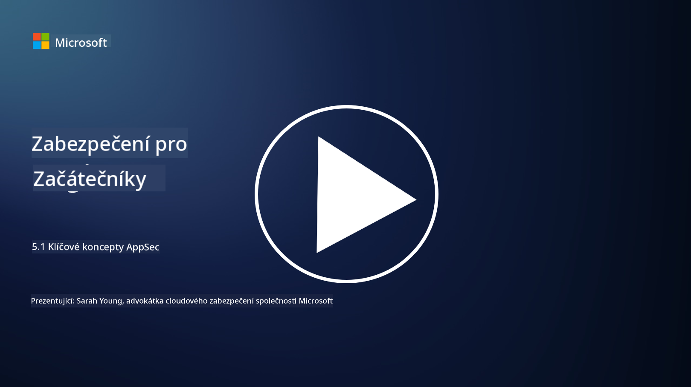

<!--
CO_OP_TRANSLATOR_METADATA:
{
  "original_hash": "e4b56bb23078d3ffb7ad407d280b0c36",
  "translation_date": "2025-09-03T21:08:38+00:00",
  "source_file": "5.1 AppSec key concepts.md",
  "language_code": "cs"
}
-->
# Klíčové koncepty AppSec

Aplikační bezpečnost je samostatná specializace v oblasti bezpečnosti. V této části kurzu se podrobněji zaměříme na aplikační bezpečnost.

## Úvod

V této lekci se budeme zabývat:

- Co je aplikační bezpečnost?

- Jaké jsou klíčové koncepty/principy aplikační bezpečnosti?

## Co je aplikační bezpečnost?

Aplikační bezpečnost, často zkracovaná jako "AppSec," označuje praxi ochrany softwarových aplikací před bezpečnostními hrozbami, zranitelnostmi a útoky. Zahrnuje procesy, techniky a nástroje používané k identifikaci, zmírnění a prevenci bezpečnostních rizik během vývoje, nasazení a údržby aplikace.

Aplikační bezpečnost je zásadní, protože aplikace jsou častým cílem kybernetických útoků. Zlomyslní aktéři využívají zranitelnosti a slabiny softwaru k získání neoprávněného přístupu, krádeži dat, narušení služeb nebo provádění jiných škodlivých aktivit. Efektivní aplikační bezpečnost pomáhá zajistit důvěrnost, integritu a dostupnost aplikace a jejích souvisejících dat.

## Jaké jsou klíčové koncepty/principy aplikační bezpečnosti?

Klíčové koncepty a principy, které tvoří základ aplikační bezpečnosti, zahrnují:

1. **Bezpečnost od návrhu**:

- Bezpečnost by měla být integrována do návrhu a architektury aplikace od samého začátku, nikoli přidávána dodatečně.

2. **Validace vstupů**:

- Všechny uživatelské vstupy by měly být validovány, aby odpovídaly očekávaným formátům a byly bez škodlivého kódu nebo dat.

3. **Kódování výstupů**:

- Data odesílaná klientovi by měla být správně kódována, aby se předešlo zranitelnostem, jako je cross-site scripting (XSS).

4. **Autentizace a autorizace**:

- Autentizujte uživatele a autorizujte jejich přístup k prostředkům na základě jejich rolí a oprávnění.

5. **Ochrana dat**:

- Citlivá data by měla být šifrována při ukládání, přenosu a zpracování, aby se zabránilo neoprávněnému přístupu.

6. **Správa relací**:

- Bezpečná správa relací zajišťuje ochranu uživatelských relací před únosem a neoprávněným přístupem.

7. **Bezpečné závislosti**:

- Udržujte všechny softwarové závislosti aktuální s bezpečnostními opravami, aby se předešlo zranitelnostem.

8. **Zpracování chyb a logování**:

- Implementujte bezpečné zpracování chyb, aby se zabránilo odhalení citlivých informací, a zajistěte bezpečné postupy logování.

9. **Bezpečnostní testování**:

- Pravidelně testujte aplikace na zranitelnosti pomocí metod, jako je penetrační testování, revize kódu a automatizované skenovací nástroje.

10. **Bezpečný životní cyklus vývoje softwaru (SDLC)**:

- Integrujte bezpečnostní postupy do každé fáze životního cyklu vývoje softwaru, od požadavků po nasazení a údržbu.

## Další čtení

- [SheHacksPurple: What is Application Security? - YouTube](https://www.youtube.com/watch?v=eNmccQNzSSY)
- [What Is Application Security? - Cisco](https://www.cisco.com/c/en/us/solutions/security/application-first-security/what-is-application-security.html#~how-does-it-work)
- [What is application security? A process and tools for securing software | CSO Online](https://www.csoonline.com/article/566471/what-is-application-security-a-process-and-tools-for-securing-software.html)
- [OWASP Cheat Sheet Series | OWASP Foundation](https://owasp.org/www-project-cheat-sheets/)

---

**Prohlášení**:  
Tento dokument byl přeložen pomocí služby AI pro překlady [Co-op Translator](https://github.com/Azure/co-op-translator). Ačkoli se snažíme o přesnost, mějte prosím na paměti, že automatizované překlady mohou obsahovat chyby nebo nepřesnosti. Původní dokument v jeho původním jazyce by měl být považován za autoritativní zdroj. Pro důležité informace se doporučuje profesionální lidský překlad. Neodpovídáme za žádná nedorozumění nebo nesprávné interpretace vyplývající z použití tohoto překladu.