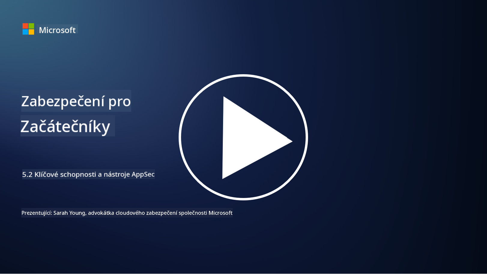

<!--
CO_OP_TRANSLATOR_METADATA:
{
  "original_hash": "790a3fa7e535ec60bb51bde13e759781",
  "translation_date": "2025-09-03T21:23:27+00:00",
  "source_file": "5.2 AppSec key capabilities.md",
  "language_code": "cs"
}
-->
## Úvod

V této lekci se podíváme na klíčové schopnosti a nástroje, které se používají v oblasti zabezpečení aplikací.

## Klíčové schopnosti a nástroje pro zabezpečení aplikací

Klíčové schopnosti a nástroje používané v zabezpečení aplikací jsou nezbytné pro identifikaci, zmírnění a prevenci bezpečnostních zranitelností a hrozeb v softwarových aplikacích. Zde jsou některé z nejdůležitějších:

**1. Statická analýza zabezpečení aplikací (SAST)**:

- **Schopnosti**: Analyzuje zdrojový kód, bytecode nebo binární kód za účelem identifikace bezpečnostních zranitelností v kódu aplikace.

- **Nástroje**: Příklady zahrnují Fortify, Checkmarx a Veracode.

**2. Dynamická analýza zabezpečení aplikací (DAST)**:

- **Schopnosti**: Skenuje běžící aplikaci, aby identifikovala zranitelnosti prostřednictvím zasílání vstupních požadavků a analýzy odpovědí.

- **Nástroje**: Příklady zahrnují ZAP, Burp Suite a Qualys Web Application Scanning.

**3. Interaktivní analýza zabezpečení aplikací (IAST)**:

- **Schopnosti**: Kombinuje prvky SAST a DAST k analýze kódu během běhu aplikace, poskytuje přesnější výsledky a snižuje počet falešných pozitiv.

- **Nástroje**: Příklady zahrnují Contrast Security a HCL AppScan.

**4. Ochrana aplikací za běhu (RASP)**:

- **Schopnosti**: Monitoruje a chrání aplikace v reálném čase, detekuje a reaguje na bezpečnostní hrozby, jakmile se objeví.

- **Nástroje**: Příklady zahrnují Veracode Runtime Protection a F5 Advanced WAF s RASP.

**5. Webové aplikační firewally (WAFs)**:

- **Schopnosti**: Poskytují ochrannou vrstvu mezi aplikací a internetem, filtrují příchozí provoz a blokují škodlivé požadavky.

- **Nástroje**: Příklady zahrnují ModSecurity, AWS WAF a Akamai Kona Site Defender.

**6. Skenování závislostí**:

- **Schopnosti**: Identifikuje zranitelnosti v knihovnách třetích stran a komponentách používaných v aplikaci.

- **Nástroje**: Příklady zahrnují OWASP Dependency-Check a Snyk.

**7. Penetrační testování (Pen Testing)**:

- **Schopnosti**: Simuluje útoky z reálného světa za účelem odhalení zranitelností a posouzení bezpečnosti aplikace.

- **Nástroje**: Provádějí certifikovaní etičtí hackeři a bezpečnostní profesionálové pomocí různých nástrojů, jako jsou Metasploit a Nmap.

**8. Skenování a analýza zabezpečení**:

- **Schopnosti**: Skenuje známé zranitelnosti, chyby konfigurace a bezpečnostní nesprávné nastavení.

- **Nástroje**: Příklady zahrnují Nessus, Qualys Vulnerability Management a OpenVAS.

**9. Nástroje pro zabezpečení kontejnerů**:

- **Schopnosti**: Zaměřují se na zabezpečení kontejnerizovaných aplikací a jejich prostředí.

- **Nástroje**: Příklady zahrnují Docker Security Scanning a Aqua Security.

**10. Školení pro bezpečný vývoj**:

- **Schopnosti**: Poskytuje školení a programy zvyšující povědomí pro vývojové týmy, aby podporovaly bezpečné praktiky při psaní kódu.

- **Nástroje**: Přizpůsobené školicí programy a platformy.

**11. Rámce pro testování zabezpečení**:

- **Schopnosti**: Poskytují komplexní testovací rámce pro různé potřeby testování zabezpečení aplikací.

- **Nástroje**: OWASP Amass, OWASP OWTF a FrAppSec.

**12. Nástroje pro kontrolu bezpečnosti kódu**:

- **Schopnosti**: Kontrolují zdrojový kód na bezpečnostní zranitelnosti a dodržování nejlepších postupů při psaní kódu.

- **Nástroje**: Příklady zahrnují SonarQube a Checkmarx.

**13. Nástroje pro zabezpečení API a mikroslužeb**:

- **Schopnosti**: Zaměřují se na zabezpečení API a mikroslužeb, včetně autentizace, autorizace a ochrany dat.

- **Nástroje**: Příklady zahrnují Apigee, AWS API Gateway a Istio.

## Další čtení

- [What Is Application Security? Concepts, Tools & Best Practices | HackerOne](https://www.hackerone.com/knowledge-center/what-application-security-concepts-tools-best-practices)
- [What is IAST? (Interactive Application Security Testing) (comparitech.com)](https://www.comparitech.com/net-admin/what-is-iast/)
- [10 Types of Application Security Testing Tools: When and How to Use Them (cmu.edu)](https://insights.sei.cmu.edu/blog/10-types-of-application-security-testing-tools-when-and-how-to-use-them/)
- [Shifting the Balance of Cybersecurity Risk: Principles and Approaches for Security-by-Design and Default | Cyber.gov.au](https://www.cyber.gov.au/about-us/view-all-content/publications/principles-and-approaches-for-security-by-design-and-default)

---

**Prohlášení**:  
Tento dokument byl přeložen pomocí služby pro automatický překlad [Co-op Translator](https://github.com/Azure/co-op-translator). I když se snažíme o přesnost, mějte na paměti, že automatické překlady mohou obsahovat chyby nebo nepřesnosti. Původní dokument v jeho původním jazyce by měl být považován za autoritativní zdroj. Pro důležité informace se doporučuje profesionální lidský překlad. Neodpovídáme za žádná nedorozumění nebo nesprávné interpretace vyplývající z použití tohoto překladu.