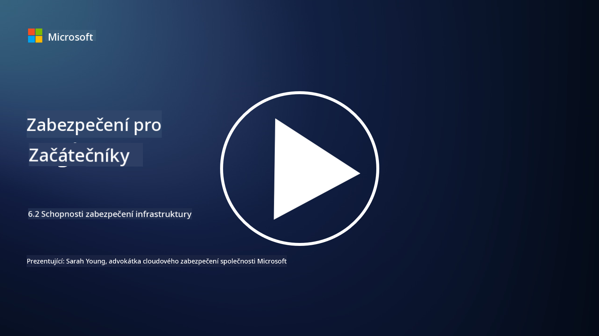

<!--
CO_OP_TRANSLATOR_METADATA:
{
  "original_hash": "7d79ba0e7668b3bdae1fba7aa047f6c0",
  "translation_date": "2025-09-03T20:51:48+00:00",
  "source_file": "6.2 Infrastructure security capabilities.md",
  "language_code": "cs"
}
-->
# Schopnosti zabezpečení infrastruktury

V této části se podrobněji podíváme na základní nástroje a schopnosti používané v zabezpečení infrastruktury.

**Úvod**

V této lekci se zaměříme na:

- Co je správa zranitelností?

- Co je CSPM?

- Co je CNAPP?

## Co je správa zranitelností?

Správa zranitelností je systematický proces identifikace, hodnocení, prioritizace, zmírňování a monitorování zranitelností v počítačových systémech, softwaru, sítích a infrastruktuře. Hlavním cílem správy zranitelností je snížit vystavení organizace bezpečnostním rizikům tím, že se proaktivně řeší známé zranitelnosti dříve, než je mohou zneužít škodliví aktéři. Zde je přehled klíčových kroků:

Identifikace: Skenování a objevování zranitelností v majetku organizace, což může zahrnovat servery, aplikace, síťová zařízení a koncové body.

Hodnocení: Posouzení závažnosti a potenciálního dopadu každé zranitelnosti na základě faktorů, jako je skóre Common Vulnerability Scoring System (CVSS) a obchodní kontext.

Prioritizace: Řazení zranitelností podle jejich úrovně rizika a potenciálního dopadu na provoz a data organizace.

Zmírnění: Vývoj a implementace strategií k odstranění nebo zmírnění zranitelností, což může zahrnovat aplikaci záplat, konfiguraci bezpečnostních nastavení nebo nasazení kompenzačních opatření.

Ověření: Potvrzení, že opatření ke zmírnění byla účinná při řešení zranitelností.

Nepřetržité monitorování: Průběžné sledování zranitelností a potenciálních hrozeb, včetně pravidelných skenů a hodnocení zranitelností.

Správa zranitelností je klíčovou součástí kybernetické bezpečnosti, která pomáhá organizacím udržovat silnou bezpečnostní pozici a snižovat pravděpodobnost bezpečnostních incidentů. Příklady nástrojů pro správu zranitelností zahrnují Defender for Cloud, Nessus a Qualys.

## Co je CSPM?

Cloud Security Posture Management (CSPM) je sada nástrojů, procesů a postupů určených k hodnocení, monitorování a prosazování bezpečnostních konfigurací a osvědčených postupů v cloudových prostředích. Řešení CSPM pomáhají organizacím identifikovat a řešit nesprávné konfigurace, bezpečnostní mezery a porušení souladu v jejich cloudové infrastruktuře, například v Amazon Web Services (AWS), Microsoft Azure, Google Cloud Platform (GCP) a dalších poskytovatelích cloudových služeb.

Klíčové aspekty CSPM zahrnují:

- Hodnocení konfigurace: Skenování cloudových zdrojů a služeb za účelem identifikace nesprávných konfigurací, nebezpečných nastavení a odchylek od osvědčených bezpečnostních postupů.

- Prosazování bezpečnostních politik: Prosazování bezpečnostních politik a standardů souladu napříč cloudovými prostředími automatickým řešením nesprávných konfigurací nebo generováním upozornění.

- Nepřetržité monitorování: Poskytování nepřetržitého přehledu o bezpečnostní pozici cloudových aktiv a zdrojů, včetně upozornění v reálném čase na bezpečnostní incidenty.

- Zprávy o souladu: Generování zpráv a přehledů k prokázání souladu s regulačními požadavky a průmyslovými standardy.

CSPM pomáhá organizacím zajistit, že jejich cloudová infrastruktura je bezpečná, v souladu s předpisy a v souladu s osvědčenými postupy, čímž se snižuje riziko bezpečnostních incidentů souvisejících s cloudem. Příklady nástrojů CSPM zahrnují Defender for Cloud a Snyk.

## Co je CNAPP?

CNAPP znamená Cloud-Native Application Protection Platform. Jedná se o komplexní cloud-native softwarovou platformu, která zjednodušuje monitorování, detekci a reakci na potenciální bezpečnostní hrozby a zranitelnosti v cloudu. Kombinuje více nástrojů a schopností do jednoho softwarového řešení, aby minimalizovala složitost a usnadnila operace týmů DevOps a DevSecOps. CNAPP nabízí komplexní zabezpečení cloudu a aplikací během celého životního cyklu CI/CD aplikace, od vývoje až po produkci. Řeší potřebu moderních nástrojů pro monitorování bezpečnosti cloudu, správu bezpečnostní pozice, prevenci narušení a kontrolní nástroje. Řešení CNAPP poskytují bezpečnostním týmům schopnost kvantifikovat a reagovat na rizika v cloudovém prostředí. Mezi funkce CNAPP patří rozšířená viditelnost, kvantifikace rizik, bezpečný vývoj softwaru a kombinované řešení pro zabezpečení cloudu. CNAPP integruje více cloudových bezpečnostních řešení, která byla tradičně oddělena, do jednoho uživatelského rozhraní, což organizacím usnadňuje ochranu celé jejich cloudové aplikace. CNAPP konsoliduje více cloud-native bezpečnostních nástrojů a datových zdrojů, včetně skenování kontejnerů, správy bezpečnostní pozice cloudu, skenování infrastruktury jako kódu, správy oprávnění cloudové infrastruktury a ochrany cloudových pracovních zátěží v reálném čase.

## Další čtení
- [What is CSPM? | Microsoft Security](https://www.microsoft.com/security/business/security-101/what-is-cspm?WT.mc_id=academic-96948-sayoung)
- [What is Cloud Security Posture Management (CSPM)? | HackerOne](https://www.hackerone.com/knowledge-center/what-cloud-security-posture-management)
- [Function of cloud security posture management - Cloud Adoption Framework | Microsoft Learn](https://learn.microsoft.com/azure/cloud-adoption-framework/organize/cloud-security-posture-management?WT.mc_id=academic-96948-sayoung)
- [What Is a CNAPP? | Microsoft Security](https://www.microsoft.com/security/business/security-101/what-is-cnapp?WT.mc_id=academic-96948-sayoung)
- [Why Everyone Is Talking About CNAPP (forbes.com)](https://www.forbes.com/sites/forbestechcouncil/2021/12/10/why-everyone-is-talking-about-cnapp/?sh=567275ca1549)
- [Improving Your Multi-Cloud Security with a Cloud-Native Application Protection Platform (CNAPP)](https://www.youtube.com/watch?v=5w42kQ_QjZg&t=212s)

---

**Prohlášení**:  
Tento dokument byl přeložen pomocí služby AI pro překlady [Co-op Translator](https://github.com/Azure/co-op-translator). Ačkoli se snažíme o přesnost, mějte prosím na paměti, že automatizované překlady mohou obsahovat chyby nebo nepřesnosti. Původní dokument v jeho původním jazyce by měl být považován za autoritativní zdroj. Pro důležité informace se doporučuje profesionální lidský překlad. Neodpovídáme za žádné nedorozumění nebo nesprávné interpretace vyplývající z použití tohoto překladu.