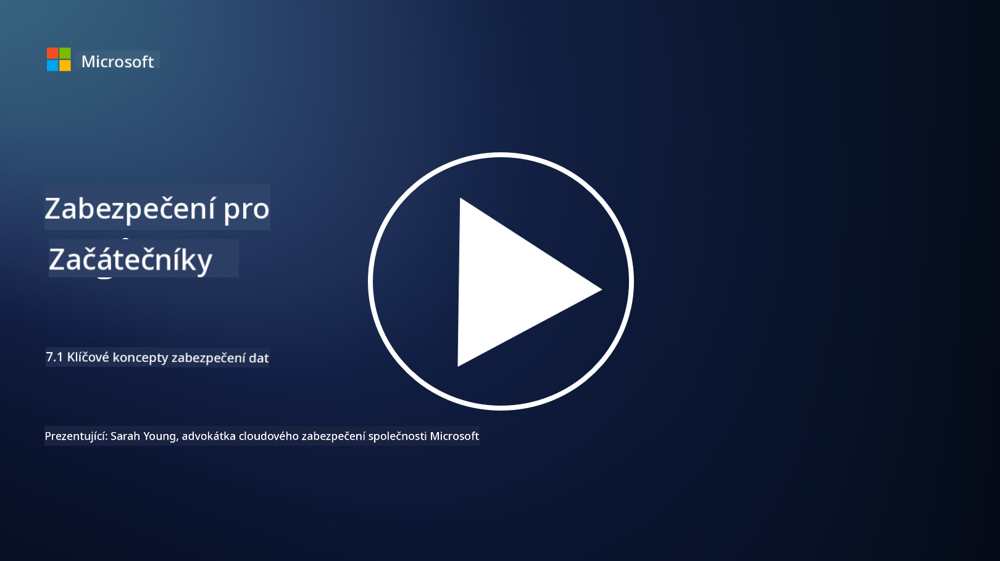

<!--
CO_OP_TRANSLATOR_METADATA:
{
  "original_hash": "9703868f41dcddd5a98dea9ea6fcd94d",
  "translation_date": "2025-09-03T20:38:22+00:00",
  "source_file": "7.1 Data security key concepts.md",
  "language_code": "cs"
}
-->
# Klíčové koncepty zabezpečení dat

V tomto kurzu jsme se několikrát zmínili o zabezpečení dat. Nyní se na toto téma podíváme podrobněji. V této lekci se naučíte:

- Co je zabezpečení dat?

- Co je klasifikace dat?

- Co je správa životního cyklu dat?

- Co je prevence ztráty dat (DLP)?

- Proč je zabezpečení dat důležité pro organizaci?

## Co je zabezpečení dat?

**Zabezpečení dat** označuje praxi ochrany digitálních dat, jako jsou databáze, soubory a citlivé informace, před neoprávněným přístupem, zveřejněním, změnou nebo zničením. Hlavním cílem zabezpečení dat je zajistit důvěrnost, integritu a dostupnost dat. To zahrnuje zavedení kombinace technických, administrativních a fyzických bezpečnostních opatření k ochraně dat před různými hrozbami a zranitelnostmi, včetně kybernetických útoků, interních hrozeb a úniků dat. Mezi opatření zabezpečení dat patří šifrování, kontrola přístupu, autentizace, auditní stopy a bezpečnostní politiky.

## Co je klasifikace dat?

**Klasifikace dat** je proces kategorizace dat na základě jejich citlivosti, hodnoty a důležitosti pro organizaci. Účelem klasifikace dat je pomoci organizacím identifikovat a prioritizovat ochranu a zpracování různých typů dat. Běžné kategorie klasifikace dat zahrnují "veřejné," "interní," "důvěrné" a "omezené" nebo "vysoce důvěrné." Jakmile jsou data klasifikována, organizace mohou aplikovat vhodná bezpečnostní opatření a omezení přístupu, aby zajistily, že citlivá data budou dostatečně chráněna a že bude dodržována regulace.

## Co je správa životního cyklu dat?

**Správa životního cyklu dat** je strukturovaný přístup k řízení dat během celého jejich životního cyklu, od vytvoření nebo získání až po archivaci nebo odstranění. Životní cyklus dat obvykle zahrnuje fáze, jako je vytvoření, ukládání, zpracování, přenos, archivace a likvidace. Správa životního cyklu dat zahrnuje definování politik a postupů pro každou fázi životního cyklu dat, včetně uchovávání dat, kontrol přístupu, zálohování a čištění dat. Efektivní správa životního cyklu dat pomáhá organizacím optimalizovat ukládání dat, zlepšit kvalitu dat a zajistit dodržování předpisů na ochranu dat.

## Co je prevence ztráty dat (DLP)?

**Prevence ztráty dat (DLP)** označuje soubor technologií, politik a postupů navržených k prevenci neoprávněného přístupu, sdílení nebo úniku citlivých či důvěrných dat. Řešení DLP využívají inspekci obsahu a kontextovou analýzu k monitorování a kontrole dat v pohybu (např. e-mail, webový provoz), dat v klidu (např. uložené soubory a databáze) a dat v použití (např. data přistupovaná nebo manipulovaná uživateli). Cílem DLP je identifikovat a blokovat nebo šifrovat citlivá data, aby se zabránilo únikům dat, dodržovaly předpisy na ochranu dat a chránila reputace organizace.

## Proč je zabezpečení dat důležité pro organizaci?

Zabezpečení dat je pro organizace zásadní z několika důvodů:

- **Ochrana citlivých informací**: Organizace často ukládají citlivá data, jako jsou záznamy zákazníků, duševní vlastnictví, finanční údaje a informace o zaměstnancích. Zabezpečení dat chrání tyto citlivé informace před neoprávněným přístupem nebo krádeží.

- **Dodržování předpisů**: Mnoho odvětví a jurisdikcí má přísné předpisy na ochranu dat a soukromí. Zabezpečení dat pomáhá organizacím dodržovat tyto zákony, vyhnout se právním sankcím a poškození reputace.

- **Prevence úniků dat**: Úniky dat mohou vést k finančním ztrátám, poškození reputace a právním důsledkům. Efektivní opatření zabezpečení dat pomáhají předcházet únikům dat nebo omezit jejich dopad.

- **Zachování důvěry**: Zákazníci a zainteresované strany důvěřují organizacím s jejich daty. Úniky dat narušují důvěru. Udržování silného zabezpečení dat pomáhá zachovat důvěru a důvěru zákazníků.

- **Konkurenční výhoda**: Prokazování závazku k zabezpečení dat může být konkurenční výhodou. Zákazníci a partneři pravděpodobněji spolupracují s organizacemi, které berou zabezpečení dat vážně.

- **Provozní kontinuita**: Opatření zabezpečení dat, včetně zálohování dat a plánování obnovy po havárii, pomáhají zajistit dostupnost kritických dat a kontinuitu podnikání v případě ztráty dat nebo katastrof.

- **Ochrana před interními hrozbami**: Opatření zabezpečení dat se také zabývají hrozbami uvnitř organizace, včetně náhodného odhalení dat zaměstnanci a škodlivých akcí ze strany interních osob.

Shrnuto, zabezpečení dat je nezbytné pro ochranu citlivých informací, dodržování předpisů, prevenci úniků dat, zachování důvěry a zajištění pokračujícího úspěchu a reputace organizace.

## Další čtení

- [What Is Data Security? | Microsoft Security](https://www.microsoft.com/en-au/security/business/security-101/what-is-data-security?WT.mc_id=academic-96948-sayoung)
- [Automatically Classify & Protect Documents & Data | Microsoft Purview Information Protection](https://youtu.be/v8LqmzBUaOo)
- [Example data classification policy](https://www.cmu.edu/data/guidelines/data-classification.html)
- [What is Data Security? Data Security Definition and Overview | IBM](https://www.ibm.com/topics/data-security)
- [Data Lifecycle Management: A 2023 Guide for Your Business (cloudwards.net)](https://www.cloudwards.net/data-lifecycle-management/)
- [What is data loss prevention (DLP)? | Microsoft Security](https://www.microsoft.com/security/business/security-101/what-is-data-loss-prevention-dlp?WT.mc_id=academic-96948-sayoung)
- [What is DLP? How data loss prevention software works and why you need it | CSO Online](https://www.csoonline.com/article/569559/what-is-dlp-how-data-loss-prevention-software-works-and-why-you-need-it.html)

---

**Prohlášení**:  
Tento dokument byl přeložen pomocí služby pro automatický překlad [Co-op Translator](https://github.com/Azure/co-op-translator). Přestože se snažíme o přesnost, mějte prosím na paměti, že automatické překlady mohou obsahovat chyby nebo nepřesnosti. Původní dokument v jeho původním jazyce by měl být považován za autoritativní zdroj. Pro důležité informace doporučujeme profesionální lidský překlad. Neodpovídáme za žádná nedorozumění nebo nesprávné interpretace vyplývající z použití tohoto překladu.