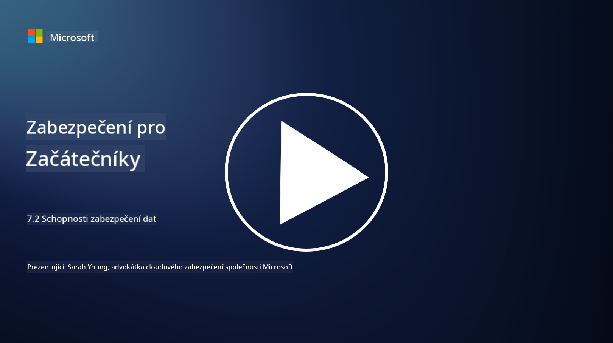

<!--
CO_OP_TRANSLATOR_METADATA:
{
  "original_hash": "50697add9758e54693442d502d2d5f8a",
  "translation_date": "2025-09-03T21:28:19+00:00",
  "source_file": "7.2 Data security capabilities.md",
  "language_code": "cs"
}
-->
# Schopnosti zabezpečení dat

V této části se podrobněji zaměříme na klíčové nástroje a schopnosti používané při zabezpečení dat:

**Úvod**

V této lekci se budeme zabývat:

- Co je nástroj pro prevenci ztráty dat?

- Co je nástroj pro řízení rizik zevnitř organizace?

- Jaké nástroje pro uchovávání dat jsou k dispozici?

## Co je nástroj pro prevenci ztráty dat?

Nástroje pro prevenci ztráty dat (Data Loss Prevention, DLP) označují sadu softwarových řešení a technologií navržených k zabránění neoprávněnému přístupu, sdílení nebo úniku citlivých či důvěrných dat v rámci organizace. Tyto nástroje využívají inspekci obsahu, prosazování politik a monitorování k identifikaci a ochraně citlivých dat před jejich odhalením nebo zneužitím. Příklady produktů DLP zahrnují: Symantec Data Loss Prevention, McAfee Total Protection for Data Loss Prevention, Microsoft 365 DLP**: Integruje se s aplikacemi Microsoft 365 a pomáhá organizacím identifikovat a chránit citlivá data v e-mailech, dokumentech a zprávách.

## Co je nástroj pro řízení rizik zevnitř organizace?

Nástroje pro řízení rizik zevnitř organizace pomáhají organizacím identifikovat a zmírňovat rizika, která představují zaměstnanci, dodavatelé nebo partneři, kteří mohou úmyslně nebo neúmyslně ohrozit bezpečnost dat. Tyto nástroje monitorují chování uživatelů, vzorce přístupu a využití dat, aby odhalily podezřelé aktivity a potenciální hrozby zevnitř organizace. Příklady produktů pro řízení rizik zevnitř organizace zahrnují: Microsoft Insider Risk Management (součást Microsoft 365), Forcepoint Insider Threat Data Protection, Varonis Insider Threat Detection.

## Jaké nástroje pro uchovávání dat jsou k dispozici?

Nástroje pro uchovávání dat zahrnují software a řešení navržená k řízení uchovávání a mazání dat v souladu s politikami uchovávání dat organizace a právními požadavky. Tyto nástroje pomáhají automatizovat proces uchovávání dat po specifické období a jejich bezpečné mazání, když již nejsou potřeba. Příklady produktů pro uchovávání dat zahrnují: Veritas Enterprise Vault, Commvault Complete Data Protection, Microsoft data lifecycle management. Tyto nástroje pomáhají organizacím udržovat kontrolu nad uchováváním a likvidací dat, zajišťovat soulad s předpisy o ochraně dat a efektivně spravovat data během jejich životního cyklu.

## Další čtení

- [Guide to Data Security Posture Management (DSPM) | CSA (cloudsecurityalliance.org)](https://cloudsecurityalliance.org/blog/2023/03/31/the-big-guide-to-data-security-posture-management-dspm/)
- [Data Loss Prevention across endpoints, apps, & services | Microsoft Purview](https://youtu.be/hvqq8L_0kgI)
- [18 Best Data Loss Prevention Software Tools 2023 (Free + Paid) (comparitech.com)](https://www.comparitech.com/data-privacy-management/data-loss-prevention-tools-software/)
- [Data Loss Prevention (nist.gov)](https://tsapps.nist.gov/publication/get_pdf.cfm?pub_id=904672)
- [Learn about insider risk management | Microsoft Learn](https://learn.microsoft.com/purview/insider-risk-management?WT.mc_id=academic-96948-sayoung)
- [Data Lifecycle Management | IBM](https://www.ibm.com/topics/data-lifecycle-management)
- [What Is Data Lifecycle Management (DLM)? | 2023 Best Practices (selecthub.com)](https://www.selecthub.com/big-data-analytics/data-lifecycle-management/)

---

**Prohlášení**:  
Tento dokument byl přeložen pomocí služby pro automatický překlad [Co-op Translator](https://github.com/Azure/co-op-translator). I když se snažíme o přesnost, mějte prosím na paměti, že automatické překlady mohou obsahovat chyby nebo nepřesnosti. Původní dokument v jeho původním jazyce by měl být považován za autoritativní zdroj. Pro důležité informace doporučujeme profesionální lidský překlad. Neodpovídáme za žádná nedorozumění nebo nesprávné interpretace vyplývající z použití tohoto překladu.