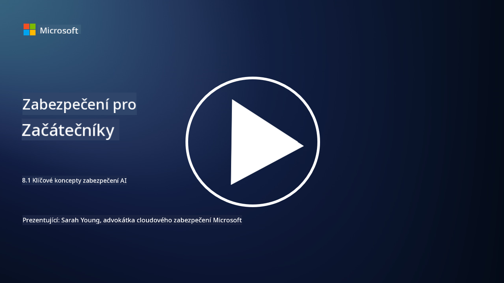

<!--
CO_OP_TRANSLATOR_METADATA:
{
  "original_hash": "66b61d96936cf25d20fcb411d4ce5227",
  "translation_date": "2025-09-03T19:41:16+00:00",
  "source_file": "8.1 AI security key concepts.md",
  "language_code": "cs"
}
-->
# Klíčové koncepty zabezpečení AI

## Jak se zabezpečení AI liší od tradiční kybernetické bezpečnosti?

Zabezpečení AI systémů přináší jedinečné výzvy ve srovnání s tradiční kybernetickou bezpečností, především kvůli povaze schopností učení a rozhodovacích procesů AI. Zde jsou některé klíčové rozdíly:

-   **Integrita dat**: AI systémy se silně spoléhají na data pro učení. [Zajištění integrity těchto dat je zásadní, protože útočníci mohou manipulovat s daty, aby ovlivnili chování AI, což je taktika známá jako otrava dat.
-   **Zabezpečení modelu**: Samotný rozhodovací model AI může být cílem útoku. [Útočníci se mohou pokusit model zpětně analyzovat nebo využít jeho slabiny k tomu, aby způsobili nesprávná nebo škodlivá rozhodnutí.
-   **Adversariální útoky**: AI systémy mohou být náchylné k adversariálním útokům, kdy drobné, často nepostřehnutelné změny vstupních dat mohou způsobit chyby nebo nesprávné předpovědi.
-   **Zabezpečení infrastruktury**: Zatímco tradiční kybernetická bezpečnost se také zaměřuje na ochranu infrastruktury, AI systémy mohou mít další vrstvy složitosti, jako jsou cloudové služby nebo specializovaný hardware, které vyžadují specifická bezpečnostní opatření.
-   **Etické aspekty**: Použití AI v bezpečnosti přináší etické otázky, jako jsou obavy o soukromí a potenciální zaujatost v rozhodování, které musí být zohledněny v bezpečnostní strategii.

Celkově zabezpečení AI systémů vyžaduje odlišný přístup, který bere v úvahu jedinečné aspekty technologie AI, včetně ochrany dat, modelů a procesu učení AI, a zároveň řeší etické důsledky nasazení AI.

Zabezpečení AI a tradiční kybernetická bezpečnost mají mnoho společného, ale také některé výrazné rozdíly kvůli jedinečným vlastnostem a schopnostem systémů umělé inteligence. Zde je, jak se liší:

- **Složitost hrozeb**: AI systémy přinášejí nové vrstvy složitosti do kybernetické bezpečnosti. Tradiční kybernetická bezpečnost se primárně zabývá hrozbami, jako je malware, phishingové útoky a narušení sítí. AI systémy však mohou být zranitelné vůči útokům, jako jsou adversariální útoky, otrava dat a obcházení modelů, které specificky cílí na algoritmy strojového učení.

- **Plocha útoku**: AI systémy často mají větší plochu útoku ve srovnání s tradičními systémy. To je způsobeno tím, že se nespoléhají pouze na software, ale také na data a modely. Útočníci mohou cílit na tréninková data, manipulovat s modely nebo využívat zranitelnosti samotných algoritmů.

- **Přizpůsobivost hrozeb**: AI systémy se mohou přizpůsobovat a učit se ze svého prostředí, což je činí náchylnějšími vůči adaptivním a vyvíjejícím se hrozbám. Tradiční bezpečnostní opatření nemusí být dostatečná k obraně proti útokům, které se neustále vyvíjejí na základě chování AI systému.

- **Interpretovatelnost a vysvětlitelnost**: Porozumět tomu, proč AI systém učinil konkrétní rozhodnutí, je často obtížnější ve srovnání s tradičními softwarovými systémy. Tento nedostatek interpretovatelnosti a vysvětlitelnosti může ztížit efektivní detekci a zmírnění útoků na AI systémy.

- **Obavy o soukromí dat**: AI systémy často spoléhají na velké množství dat, což může představovat rizika pro soukromí, pokud nejsou správně zpracována. Tradiční bezpečnostní opatření nemusí dostatečně řešit tyto obavy o soukromí dat specifické pro AI systémy.

- **Regulační shoda**: Regulační prostředí pro zabezpečení AI se stále vyvíjí, přičemž vznikají specifické předpisy a standardy, které řeší jedinečné výzvy, které AI systémy přinášejí. Tradiční rámce kybernetické bezpečnosti může být nutné rozšířit nebo přizpůsobit, aby byla zajištěna shoda s těmito novými předpisy.

- **Etické aspekty**: Zabezpečení AI zahrnuje nejen ochranu systémů před škodlivými útoky, ale také zajištění, že AI systémy jsou používány eticky a odpovědně. To zahrnuje aspekty, jako je spravedlnost, transparentnost a odpovědnost, které nemusí být tak výrazné v tradiční kybernetické bezpečnosti.

## Jak je AI podobná zabezpečení tradičních IT systémů?

Zabezpečení AI systémů sdílí několik základních principů s tradiční kybernetickou bezpečností:

-   **Ochrana před hrozbami**: Jak AI, tak tradiční systémy musí být chráněny před neoprávněným přístupem, modifikací dat a jejich zničením, stejně jako před dalšími běžnými hrozbami.
-   **Správa zranitelností**: Mnoho zranitelností, které ovlivňují tradiční systémy, jako jsou softwarové chyby nebo špatné konfigurace, může také ovlivnit AI systémy.
-   **Bezpečnost dat**: Ochrana zpracovávaných dat je klíčová v obou oblastech, aby se zabránilo únikům dat a zajistila důvěrnost.
-   **Bezpečnost dodavatelského řetězce**: Oba typy systémů jsou náchylné k útokům na dodavatelský řetězec, kdy kompromitovaná součást může ohrozit bezpečnost celého systému.

Tyto podobnosti ukazují, že zatímco AI systémy přinášejí nové bezpečnostní výzvy, vyžadují také aplikaci zavedených postupů kybernetické bezpečnosti k zajištění robustní ochrany. Je to kombinace využití tradiční bezpečnostní moudrosti a přizpůsobení se jedinečným aspektům technologie AI.

## Další čtení

- [Not with a Bug, But with a Sticker [Book] (oreilly.com)](https://www.oreilly.com/library/view/not-with-a/9781119883982/)
   
- [Intro to AI Security Part 1: AI Security 101 | by HarrietHacks | Medium](https://medium.com/@harrietfarlow/intro-to-ai-security-part-1-ai-security-101-b8662a9efe5)
   
- [Best practices for AI security risk management | Microsoft Security Blog](https://www.microsoft.com/en-us/security/blog/2021/12/09/best-practices-for-ai-security-risk-management/?WT.mc_id=academic-96948-sayoung)
   
- [OWASP AI Security and Privacy Guide | OWASP Foundation](https://owasp.org/www-project-ai-security-and-privacy-guide/)

---

**Prohlášení**:  
Tento dokument byl přeložen pomocí služby pro automatický překlad [Co-op Translator](https://github.com/Azure/co-op-translator). Ačkoli se snažíme o přesnost, mějte prosím na paměti, že automatické překlady mohou obsahovat chyby nebo nepřesnosti. Původní dokument v jeho původním jazyce by měl být považován za závazný zdroj. Pro důležité informace doporučujeme profesionální lidský překlad. Neodpovídáme za žádná nedorozumění nebo nesprávné interpretace vyplývající z použití tohoto překladu.