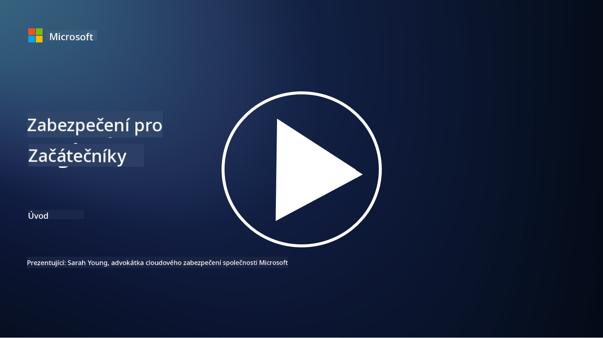

<!--
CO_OP_TRANSLATOR_METADATA:
{
  "original_hash": "0f9381fb23638f9341416474ce3c1563",
  "translation_date": "2025-09-03T19:48:39+00:00",
  "source_file": "README.md",
  "language_code": "cs"
}
-->
  
  
  
  
  
  

# 🚀 Kybernetická bezpečnost pro začátečníky – učební plán

V této rychle se měnící době adopce AI technologií je ještě důležitější pochopit, jak zabezpečit IT systémy. Tento kurz je navržen tak, aby vás naučil základní koncepty kybernetické bezpečnosti a pomohl vám začít s učením o bezpečnosti. Je nezávislý na dodavatelích a rozdělený do krátkých lekcí, které by měly trvat přibližně 30–60 minut. Každá lekce obsahuje krátký kvíz a odkazy na další čtení, pokud se chcete do tématu ponořit hlouběji.

Co tento kurz pokrývá 📚

- 🔐 Základní koncepty kybernetické bezpečnosti, jako je trojice CIA, rozdíly mezi riziky, hrozbami atd.
- 🛡️ Pochopení, co je bezpečnostní opatření a jaké má podoby.
- 🌐 Pochopení, co je zero trust a proč je důležitý v moderní kybernetické bezpečnosti.
- 🔑 Pochopení klíčových konceptů a témat v oblasti identity, sítí, bezpečnostních operací, infrastruktury a zabezpečení dat.
- 🔧 Příklady nástrojů používaných k implementaci bezpečnostních opatření.

Co tento kurz nepokrývá 🙅‍♂️

- 🚫 Jak používat konkrétní bezpečnostní nástroje.
- 🚫 Jak „hackovat“ nebo provádět red teaming/ofenzivní bezpečnost.
- 🚫 Učení o konkrétních standardech shody.

Po dokončení tohoto kurzu můžete pokračovat některými moduly na Microsoft Learn. Doporučujeme pokračovat ve studiu s [Microsoft Security, Compliance, and Identity Fundamentals.](https://learn.microsoft.com/training/paths/describe-concepts-of-security-compliance-identity/?WT.mc_id=academic-96948-sayoung)  

Nakonec můžete zvážit složení [Exam SC-900: Microsoft Security, Compliance, and Identity Fundamentals exam.](https://learn.microsoft.com/credentials/certifications/exams/sc-900/?WT.mc_id=academic-96948-sayoung)  

> 💁 Pokud máte jakoukoli zpětnou vazbu nebo návrhy k tomuto kurzu a myslíte si, že nám něco chybí, rádi si je vyslechneme!

## Přehled modulů 📝  
| **Číslo modulu** | **Název modulu**                           | **Učené koncepty**                  | **Cíle učení**                                                                                          |
|-------------------|-------------------------------------------|--------------------------------------|-----------------------------------------------------------------------------------------------------------------|
| **1.1**           | Základní bezpečnostní koncepty            | [Trojice CIA](https://github.com/microsoft/Security-101/blob/main/1.1%20The%20CIA%20triad%20and%20other%20key%20concepts.md)                        | Naučte se o důvěrnosti, dostupnosti a integritě. Také o autenticitě, nepopiratelnosti a ochraně soukromí.       |
| **1.2**           | Základní bezpečnostní koncepty            | [Běžné hrozby kybernetické bezpečnosti](https://github.com/microsoft/Security-101/blob/main/1.2%20Common%20cybersecurity%20threats.md)        | Naučte se o běžných hrozbách kybernetické bezpečnosti, kterým čelí jednotlivci a organizace.                    |
| **1.3**           | Základní bezpečnostní koncepty            | [Pochopení řízení rizik](https://github.com/microsoft/Security-101/blob/main/1.3%20Understanding%20risk%20management.md)       | Naučte se hodnotit a chápat rizika – dopad/pravděpodobnost a implementaci opatření.                             |
| **1.4**           | Základní bezpečnostní koncepty            | [Bezpečnostní praktiky a dokumentace](https://github.com/microsoft/Security-101/blob/main/1.4%20Security%20practices%20and%20documentation.md) | Naučte se rozdíly mezi politikami, postupy, standardy a předpisy/zákony.                                        |
| **1.5**           | Základní bezpečnostní koncepty            | [Zero trust](https://github.com/microsoft/Security-101/blob/main/1.5%20Zero%20trust.md)                           | Naučte se, co je zero trust a jak ovlivňuje architekturu. Co je obrana do hloubky?                              |
| **1.6**           | Základní bezpečnostní koncepty            | [Model sdílené odpovědnosti](https://github.com/microsoft/Security-101/blob/main/1.6%20Shared%20responsibility%20model.md)                           | Co je model sdílené odpovědnosti a jak ovlivňuje kybernetickou bezpečnost?                                      |
| **1.7**           | [Kvíz na konci modulu](https://github.com/microsoft/Security-101/blob/main/1.7%20End%20of%20module%20quiz.md)                        |                                      |                                                                                                                 |
| **2.1**           | Základy správy identity a přístupu        | [Klíčové koncepty IAM](https://github.com/microsoft/Security-101/blob/main/2.1%20IAM%20key%20concepts.md)                     | Naučte se o principu minimálních oprávnění, oddělení povinností, jak IAM podporuje zero trust.                  |
| **2.2**           | Základy správy identity a přístupu        | [IAM architektura zero trust](https://github.com/microsoft/Security-101/blob/main/2.2%20IAM%20zero%20trust%20architecture.md)          | Naučte se, jak je identita novým perimetrem pro moderní IT prostředí a jaké hrozby zmírňuje.                    |
| **2.3**           | Základy správy identity a přístupu        | [Schopnosti IAM](https://github.com/microsoft/Security-101/blob/main/2.3%20IAM%20capabilities.md)                     | Naučte se o schopnostech IAM a opatřeních k zabezpečení identit.                                                |
| **2.4**           | [Kvíz na konci modulu](https://github.com/microsoft/Security-101/blob/main/2.4%20End%20of%20module%20quiz.md)                        |                                      |                                                                                                                 |
| **3.1**           | Základy síťové bezpečnosti                | [Klíčové koncepty sítí](https://github.com/microsoft/Security-101/blob/main/3.1%20Networking%20key%20concepts.md)              | Naučte se o síťových konceptech (IP adresování, čísla portů, šifrování atd.).                                   |
| **3.2**           | Základy síťové bezpečnosti                | [Síťová architektura zero trust](https://github.com/microsoft/Security-101/blob/main/3.2%20Networking%20zero%20trust%20architecture.md)   | Naučte se, jak síť přispívá k E2E ZT architektuře a jaké hrozby zmírňuje.                                       |
| **3.3**           | Základy síťové bezpečnosti                | [Schopnosti síťové bezpečnosti](https://github.com/microsoft/Security-101/blob/main/3.3%20Network%20security%20capabilities.md)        | Naučte se o nástrojích síťové bezpečnosti – firewally, WAF, ochrana proti DDoS atd.                              |
| **3.4**           | [Kvíz na konci modulu](https://github.com/microsoft/Security-101/blob/main/3.4%20End%20of%20module%20quiz.md)                        |                                      |                                                                                                                 |
| **4.1**           | Základy bezpečnostních operací            | [Klíčové koncepty SecOps](https://github.com/microsoft/Security-101/blob/main/4.1%20SecOps%20key%20concepts.md)                  | Naučte se, proč jsou bezpečnostní operace důležité a jak se liší od běžných IT operací.                          |
| **4.2**           | Základy bezpečnostních operací            | [SecOps architektura zero trust](https://github.com/microsoft/Security-101/blob/main/4.2%20SecOps%20zero%20trust%20architecture.md)       | Naučte se, jak SecOps přispívá k E2E ZT architektuře a jaké hrozby zmírňuje.                                    |
| **4.3**           | Základy bezpečnostních operací            | [Schopnosti SecOps](https://github.com/microsoft/Security-101/blob/main/4.3%20SecOps%20capabilities.md)                  | Naučte se o nástrojích SecOps – SIEM, XDR atd.                                                                  |
| **4.4**           | [Kvíz na konci modulu](https://github.com/microsoft/Security-101/blob/main/4.4%20End%20of%20module%20quiz.md)                        |                                      |                                                                                                                 |
| **5.1**           | Základy bezpečnosti aplikací              | [Klíčové koncepty AppSec](https://github.com/microsoft/Security-101/blob/main/5.1%20AppSec%20key%20concepts.md)                  | Naučte se o konceptech AppSec, jako je bezpečnost při návrhu, validace vstupů atd.                               |
| **5.2**           | Základy bezpečnosti aplikací              | [Schopnosti AppSec](https://github.com/microsoft/Security-101/blob/main/5.2%20AppSec%20key%20capabilities.md)                  | Naučte se o nástrojích AppSec: nástroje pro zabezpečení pipeline, skenování kódu, skenování tajemství atd.       |
| **5.3**           | [Kvíz na konci modulu](https://github.com/microsoft/Security-101/blob/main/5.3%20End%20of%20module%20quiz.md)                        |                                      |                                                                                                                 |
| **6.1**           | Základy bezpečnosti infrastruktury        | [Klíčové koncepty bezpečnosti infrastruktury](https://github.com/microsoft/Security-101/blob/main/6.1%20Infrastructure%20security%20key%20concepts.md) | Naučte se o zpevňování systémů, aktualizacích, bezpečnostní hygieně, bezpečnosti kontejnerů.                     |
| **6.2**           | Základy bezpečnosti infrastruktury        | [Schopnosti bezpečnosti infrastruktury](https://github.com/microsoft/Security-101/blob/main/6.2%20Infrastructure%20security%20capabilities.md) | Naučte se o nástrojích, které mohou pomoci s bezpečností infrastruktury, např. CSPM, bezpečnost kontejnerů atd.  |
| **6.3**           | [Kvíz na konci modulu](https://github.com/microsoft/Security-101/blob/main/6.3%20End%20of%20module%20quiz.md)                        |                                      |                                                                                                                 |
| **7.1**           | Základy bezpečnosti dat                   | [Klíčové koncepty bezpečnosti dat](https://github.com/microsoft/Security-101/blob/main/7.1%20Data%20security%20key%20concepts.md)           | Naučte se o klasifikaci a uchovávání dat a proč je to důležité pro organizaci.                                   |
| **7.2**           | Základy bezpečnosti dat                   | [Schopnosti bezpečnosti dat](https://github.com/microsoft/Security-101/blob/main/7.2%20Data%20security%20capabilities.md)           | Naučte se o nástrojích pro bezpečnost dat – DLP, řízení vnitřních rizik, správa dat atd.                         |
| **7.3**           | [Kvíz na konci modulu](https://github.com/microsoft/Security-101/blob/main/7.3%20End%20of%20module%20quiz.md)                        |                                      |                                                                                                                 |
| **8.1**           | Základy bezpečnosti AI                    | [Klíčové koncepty bezpečnosti AI](https://github.com/microsoft/Security-101/blob/main/8.1%20AI%20security%20key%20concepts.md)          | Naučte se o rozdílech a podobnostech mezi tradiční bezpečností a bezpečností AI.                                 |
| **8.2**           | Základy bezpečnosti AI                    | [Schopnosti bezpečnosti AI](https://github.com/microsoft/Security-101/blob/main/8.2%20AI%20security%20capabilities.md)           | Naučte se o nástrojích pro bezpečnost AI a opatřeních, která lze použít k zabezpečení AI.                        |
| **8.3**           | Základy bezpečnosti AI                    | [Odpovědná AI](https://github.com/microsoft/Security-101/blob/main/8.3%20Responsible%20AI.md)          | Naučte se, co je odpovědná AI a jaké specifické škody by měli bezpečnostní profesionálové znát.                  |
| **8.4**           | [Kvíz na konci modulu](https://github.com/microsoft/Security-101/blob/main/8.4%20End%20of%20module%20quiz.md)                        |                                      |                                                                                                                 |

## 🎒 Další kurzy  

Náš tým vytváří další kurzy! Podívejte se na:  

- [Generativní AI pro začátečníky](https://aka.ms/genai-beginners)  
- [Generativní AI pro začátečníky .NET](https://github.com/microsoft/Generative-AI-for-beginners-dotnet)  
- [Generativní AI s JavaScriptem](https://github.com/microsoft/generative-ai-with-javascript)  
- [Generativní AI s Javou](https://github.com/microsoft/Generative-AI-for-beginners-java)  
- [AI pro začátečníky](https://aka.ms/ai-beginners)  
- [Data Science pro začátečníky](https://aka.ms/datascience-beginners)  
- [ML pro začátečníky](https://aka.ms/ml-beginners)  
- [Kybernetická bezpečnost pro začátečníky](https://github.com/microsoft/Security-101)  
- [Webový vývoj pro začátečníky](https://aka.ms/webdev-beginners)  
- [IoT pro začátečníky](https://aka.ms/iot-beginners)  
- [Vývoj XR pro začátečníky](https://github.com/microsoft/xr-development-for-beginners)  
- [Ovládnutí GitHub Copilot pro párové programování](https://github.com/microsoft/Mastering-GitHub-Copilot-for-Paired-Programming)  
- [Ovládnutí GitHub Copilot pro vývojáře C#/.NET](https://github.com/microsoft/mastering-github-copilot-for-dotnet-csharp-developers)  
- [Vyberte si vlastní dobrodružství s Copilotem](https://github.com/microsoft/CopilotAdventures)  

---

**Prohlášení**:  
Tento dokument byl přeložen pomocí služby pro automatický překlad [Co-op Translator](https://github.com/Azure/co-op-translator). Ačkoli se snažíme o přesnost, mějte na paměti, že automatické překlady mohou obsahovat chyby nebo nepřesnosti. Původní dokument v jeho původním jazyce by měl být považován za autoritativní zdroj. Pro důležité informace doporučujeme profesionální lidský překlad. Neodpovídáme za žádná nedorozumění nebo nesprávné interpretace vyplývající z použití tohoto překladu.