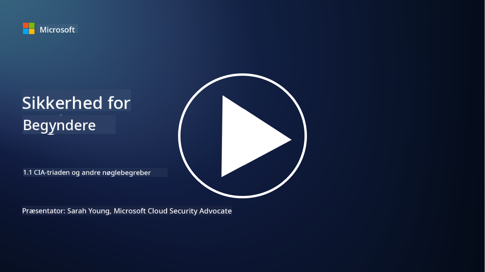
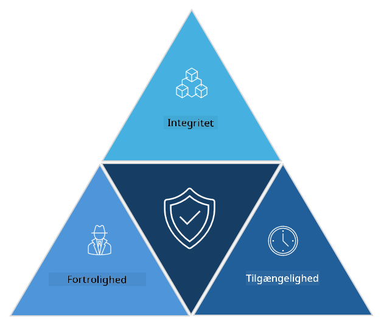

<!--
CO_OP_TRANSLATOR_METADATA:
{
  "original_hash": "16a76f9fa372fb63cffb6d76b855f023",
  "translation_date": "2025-09-03T21:39:28+00:00",
  "source_file": "1.1 The CIA triad and other key concepts.md",
  "language_code": "da"
}
-->
# CIA-triaden og andre nøglebegreber

## Introduktion

I denne lektion vil vi dække:

 - Hvad er cybersikkerhed?
   
 
 - Hvad er cybersikkerhedens CIA-triade?

   

 - Hvad er autenticitet, uafviselighed og privatliv i cybersikkerhedens kontekst?

## Hvad er cybersikkerhed?

Cybersikkerhed, også kendt som informationssikkerhed, er praksissen med at beskytte computersystemer, netværk, enheder og data mod digitale angreb, uautoriseret adgang, skade eller tyveri. Det primære mål med cybersikkerhed er at sikre fortrolighed, integritet og tilgængelighed af digitale aktiver og information. Cybersikkerhedsprofessionelle designer og implementerer sikkerhedskontroller for at beskytte aktiver, data og information. Efterhånden som mere og mere af vores liv er blevet digitaliseret og online, er cybersikkerhed blevet en topprioritet for både private individer og organisationer.

## Hvad er cybersikkerhedens CIA-triade?

Cybersikkerhedens triade refererer til modellen, der inkorporerer de tre hovedovervejelser for ethvert arbejde med cybersikkerhed eller design af et system/miljø:

### Fortrolighed

Dette er den overvejelse, som de fleste mennesker vil være bekendt med, når de tænker på "cybersikkerhed": fortrolighed er processen med at beskytte data og information mod uautoriserede adgangsforsøg, dvs. kun personer, der har behov for at se informationen, kan få adgang til den. Ikke alle data er skabt lige, og data kategoriseres og beskyttes normalt baseret på, hvor meget skade der ville opstå, hvis det blev tilgået af de forkerte personer.

### Integritet

Refererer til beskyttelsen af nøjagtigheden og pålideligheden af data, der findes i miljøer, og til at forhindre, at data ændres eller manipuleres af uautoriserede individer. F.eks. en studerende, der ændrer sin fødselsdato i DMV's kørekortsregister for at gøre sig ældre, så de kan få deres kørekort genudstedt med en tidligere fødselsdato for at købe alkohol.

### Tilgængelighed

Dette er en overvejelse på tværs af operationel IT, men tilgængelighed er også vigtig for cybersikkerhed. Der findes specifikke typer angreb, der målretter sig mod tilgængelighed, som sikkerhedsprofessionelle skal beskytte imod (f.eks. distribuerede denial-of-service – DDoS – angreb).

**Cybersikkerhedens CIA-triade**

## Hvad er autenticitet, uafviselighed og privatliv i cybersikkerhedens kontekst?

Disse er yderligere vigtige begreber, der relaterer sig til at sikre systemers og datas sikkerhed og pålidelighed:

**Autenticitet** - refererer til forsikringen om, at den information, kommunikation eller enhed, du interagerer med, er ægte og ikke er blevet manipuleret eller ændret af uautoriserede parter.

**Uafviselighed** - er begrebet, der sikrer, at en part ikke kan benægte deres involvering eller ægtheden af en transaktion eller kommunikation. Det forhindrer nogen i at påstå, at de ikke har sendt en besked eller udført en bestemt handling, når der er beviser for det modsatte.

**Privatliv** - refererer til beskyttelsen af følsomme og personligt identificerbare oplysninger mod uautoriseret adgang, brug, offentliggørelse eller manipulation. Det indebærer kontrol over, hvem der har adgang til personlige data, og hvordan disse data indsamles, opbevares og deles.

## Yderligere læsning

[Hvad er informationssikkerhed (InfoSec)? | Microsoft Security](https://www.microsoft.com/security/business/security-101/what-is-information-security-infosec#:~:text=Three%20pillars%20of%20information%20security%3A%20the%20CIA%20triad,as%20guiding%20principles%20for%20implementing%20an%20InfoSec%20plan.)

---

**Ansvarsfraskrivelse**:  
Dette dokument er blevet oversat ved hjælp af AI-oversættelsestjenesten [Co-op Translator](https://github.com/Azure/co-op-translator). Selvom vi bestræber os på nøjagtighed, skal du være opmærksom på, at automatiserede oversættelser kan indeholde fejl eller unøjagtigheder. Det originale dokument på dets oprindelige sprog bør betragtes som den autoritative kilde. For kritisk information anbefales professionel menneskelig oversættelse. Vi er ikke ansvarlige for eventuelle misforståelser eller fejltolkninger, der opstår som følge af brugen af denne oversættelse.