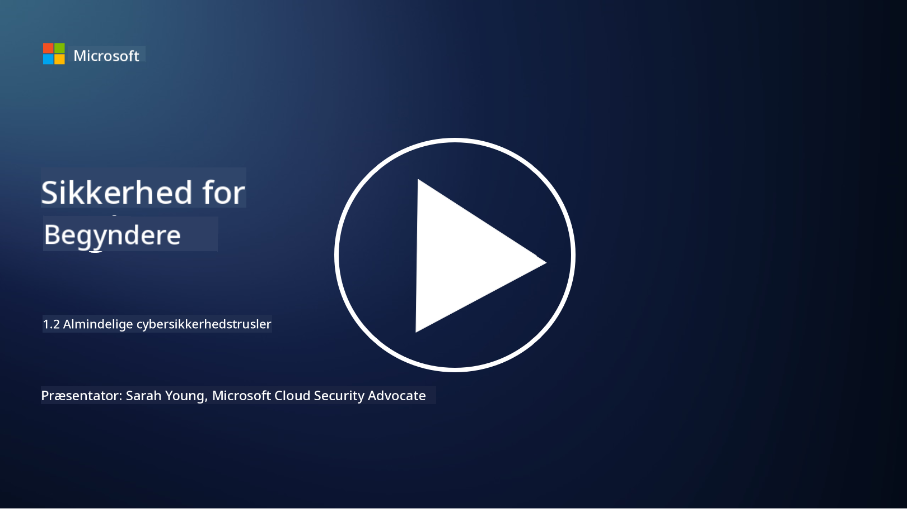

<!--
CO_OP_TRANSLATOR_METADATA:
{
  "original_hash": "6fc3030323139d7134a4ca9d03eccac9",
  "translation_date": "2025-09-03T20:11:39+00:00",
  "source_file": "1.2 Common cybersecurity threats.md",
  "language_code": "da"
}
-->
# Almindelige cybersikkerhedstrusler

## Introduktion

I denne lektion vil vi gennemgå:

- Hvad er en cybersikkerhedstrussel?

- Hvorfor ønsker ondsindede aktører at kompromittere data og IT-systemer?

- Hvad er de mest almindelige typer af cybersikkerhedstrusler?

- Hvad er MITRE ATT&CK-rammeværket?

- Hvor kan jeg holde mig opdateret om cybersikkerhedstrusler?

## Hvad er en cybersikkerhedstrussel?

En cybersikkerhedstrussel refererer til enhver potentiel fare eller risiko, der kan kompromittere fortroligheden, integriteten eller tilgængeligheden af data eller IT-systemer. Disse trusler stammer fra ondsindede aktører, der forsøger at udnytte sårbarheder for at opnå uautoriseret adgang, stjæle følsomme oplysninger, forstyrre driften eller forårsage skade på enkeltpersoner, organisationer eller endda hele nationer. Cybersikkerhedstrusler kan antage mange former og målrette forskellige aspekter af digitale systemer og data.

## Hvorfor ønsker ondsindede aktører at kompromittere data og IT-systemer?

Ondsindede aktører kompromitterer data og IT-systemer af forskellige årsager, ofte drevet af personlig vinding, ideologiske motiver eller ønsket om at skabe forstyrrelse. At forstå disse motiver kan hjælpe organisationer og enkeltpersoner med bedre at forsvare sig mod cybertrusler. Nogle almindelige årsager til, at ondsindede aktører udfører cyberangreb, inkluderer:

1. **Økonomisk gevinst**: Mange angreb drives af ønsket om økonomisk profit. Ondsindede aktører kan stjæle følsomme oplysninger som kreditkortnumre, bankoplysninger eller personlige identifikationsoplysninger for at begå bedrageri, identitetstyveri, afpresse enkeltpersoner eller organisationer eller sælge de stjålne data på det mørke web.

2. **Spionage**: Nationer, konkurrenter eller andre enheder kan udføre cyberspionage for at stjæle følsomme regerings-, virksomheds- eller forskningsdata til politiske, økonomiske eller militære formål.

3. **Forstyrrelse og sabotage**: Nogle angreb har til formål at forstyrre kritisk infrastruktur, tjenester eller drift af politiske eller ideologiske årsager. Disse angreb kan forårsage omfattende kaos, økonomiske tab og skade på omdømme.

4. **Ideologiske motiver**: Aktivister og grupper med ideologiske eller politiske motiver kan kompromittere systemer for at skabe opmærksomhed om bestemte emner, fremme deres overbevisninger eller protestere mod specifikke handlinger eller organisationer.

5. **Utilsigtede handlinger**: Ikke alle ondsindede handlinger er bevidste; nogle personer kan uforvarende bidrage til cybertrusler ved at falde for social engineering eller være en del af et kompromitteret netværk.

I sidste ende kan motiverne for at kompromittere data og IT-systemer variere meget, og konsekvenserne af disse angreb kan være alvorlige. Det er vigtigt, at enkeltpersoner, organisationer og regeringer tager cybersikkerhed alvorligt og implementerer foranstaltninger til at beskytte sig mod disse trusler.

## Hvad er de mest almindelige typer af cybersikkerhedstrusler?

Der er flere almindelige typer af cyberangreb, som ondsindede aktører bruger til at kompromittere systemer, stjæle data og skabe forstyrrelser. Her er nogle af de mest udbredte typer på tidspunktet for denne skrivning:

1. **Phishing**:

Phishing indebærer at sende vildledende e-mails eller beskeder, der ser ud til at komme fra legitime kilder, for at narre modtagere til at afsløre følsomme oplysninger som adgangskoder, kreditkortnumre eller personlige oplysninger. Phishing kan også føre ofre til ondsindede hjemmesider eller få dem til at downloade malware.

2. **Malware**:

Malware (ondsindet software) omfatter en række skadelige programmer designet til at inficere systemer, stjæle data eller forårsage skade. Typer af malware inkluderer:

- **Ransomware**: Krypterer filer og kræver løsesum for dekryptering.

- **Trojanere**: Forklædt som legitim software, giver de angribere uautoriseret adgang.

- **Virusser**: Selv-replikerende programmer, der vedhæfter sig filer og spreder sig.

- **Orme**: Selv-replikerende programmer, der spreder sig gennem netværk.

3. **Denial of Service (DoS) og Distributed Denial of Service (DDoS)**:

DoS-angreb overbelaster et målsystem, så det bliver utilgængeligt for brugere. DDoS-angreb involverer brugen af et netværk af kompromitterede enheder til at oversvømme et mål med trafik, hvilket gør det svært for systemet at fungere korrekt eller stopper det helt.

4. **SQL Injection**:

Ved dette angreb manipulerer angribere en webapplikations inputfelter for at indsætte ondsindede SQL-forespørgsler, hvilket potentielt giver uautoriseret adgang til databaser og følsomme data.

5. **Cross-Site Scripting (XSS)**:

Angribere indsætter ondsindede scripts i webapplikationer, som derefter udføres af intetanende brugeres browsere. Dette kan føre til tyveri af brugerdata og/eller spredning af malware.

6. **Social Engineering**:

Social engineering udnytter menneskelig psykologi til at manipulere enkeltpersoner til at afsløre fortrolige oplysninger eller udføre handlinger, der kompromitterer sikkerheden.

7. **Zero-Day (0day) Exploits**:

Disse angreb udnytter sårbarheder i software eller hardware, som endnu ikke er kendt af leverandøren eller offentligheden. Angribere udnytter disse sårbarheder, før der udvikles patches. Mange organisationer bekymrer sig om zero-days, da der ikke findes en patch til dem, men de er ikke så almindelige som de andre angreb på denne liste. Når en zero-day opdages, arbejder sikkerhedsforskere hurtigt på at udvikle en patch, og derfor er zero-days generelt kortvarige.

8. **Credential Attacks**:

Disse angreb inkluderer brute force-angreb, hvor angribere gentagne gange gætter adgangskoder, og credential stuffing-angreb, hvor stjålne legitimationsoplysninger fra ét sted bruges til at forsøge adgang på andre steder.

## Hvad er MITRE ATT&CK-rammeværket?

[MITRE ATT&CK-rammeværket](https://attack.mitre.org/) (Adversarial Tactics, Techniques, and Common Knowledge) er et rammeværk, der katalogiserer og kategoriserer de taktikker, teknikker og procedurer (TTP'er), som modstandere bruger under cyberangreb. Rammeværket blev skabt af MITRE Corporation, en non-profit organisation, der driver forsknings- og udviklingscentre for forskellige regeringsorganer.

MITRE ATT&CK-rammeværket giver en standardiseret måde at beskrive og analysere cybertrusler på, hvilket gør det muligt for cybersikkerhedsprofessionelle bedre at forstå og forsvare sig mod forskellige angrebsteknikker. Det bruges bredt af sikkerhedsteams, trusselsjægere og hændelsesrespondenter til:

1. **Forstå modstanders adfærd**: Rammeværket dokumenterer virkelige angrebsadfærd og beskriver de trin, angribere tager fra første indtrængen til opnåelse af deres mål. Det dækker et bredt spektrum af angrebsteknikker brugt af forskellige trusselgrupper.

2. **Planlægge og implementere forsvarsstrategier**: Sikkerhedsteams kan bruge rammeværket til at udvikle proaktive forsvarsstrategier, der er tilpasset de specifikke taktikker og teknikker, som modstandere kan anvende.

3. **Hændelsesrespons og trusselsjagt**: Når man undersøger hændelser eller udfører trusselsjagt, kan sikkerhedsprofessionelle henvise til rammeværket for at identificere og afbøde specifikke teknikker brugt af angribere.

MITRE ATT&CK-rammeværket er organiseret i matricer, der grupperer angrebsteknikker baseret på specifikke platforme og miljøer, såsom Windows, macOS, Linux og cloud-tjenester. Hver matrix er opdelt i taktikker (overordnede mål) og teknikker (specifikke metoder brugt til at opnå disse mål). For hver teknik giver rammeværket information om, hvordan den fungerer, potentielle afbødninger og relevante referencer til virkelige trusselaktører, der har brugt teknikken.

Rammeværket opdateres og udvides løbende, efterhånden som ny trusselintelligens indsamles, og cybersikkerhedslandskabet udvikler sig. Det er en værdifuld ressource til at forbedre en organisations cybersikkerhed ved at muliggøre en dybere forståelse af, hvordan angribere opererer, og hvordan man forsvarer sig mod deres taktikker.

## Hvor kan jeg holde mig opdateret om cybersikkerhedstrusler?

Der er mange kilder, der kan bruges til at holde sig opdateret om cybersikkerhedstrusler. Her er et udvalg:

- [Open Web Application Security Project (OWASP) top 10 sårbarheder](https://owasp.org/Top10/)
- [Common Vulnerabilities and Exposures (CVEs)](https://www.bing.com/ck/a?!&&p=53df6007f017bca2JmltdHM9MTY5MjU3NjAwMCZpZ3VpZD0zYmY4N2RiYS1jYWI1LTYwMDgtMWY1YS02ZmYyY2JjNjYxZWUmaW5zaWQ9NTc2OQ&ptn=3&hsh=3&fclid=3bf87dba-cab5-6008-1f5a-6ff2cbc661ee&psq=cve&u=a1aHR0cHM6Ly9iaW5nLmNvbS9hbGluay9saW5rP3VybD1odHRwcyUzYSUyZiUyZmN2ZS5taXRyZS5vcmclMmYmc291cmNlPXNlcnAtcnImaD1BZXN4S0VBWTNnbGhNZEFpd3daMlNSZkZQNTlrODhIUnYxRUtlSkY1RTk0JTNkJnA9a2NvZmZjaWFsd2Vic2l0ZQ&ntb=1 "Common Vulnerabilities and Exposures")
- [Microsoft Security Response Center blogs](https://msrc.microsoft.com/blog/)
- [National Institute of Standards and Technology (NIST)](https://www.dhs.gov/topics/cybersecurity): NIST tilbyder ressourcer, advarsler og de nyeste opdateringer om potentielle cybersikkerhedstrusler.
- [Cybersecurity and Infrastructure Security Agency (CISA)](https://www.cisa.gov/resources-tools/resources/free-cybersecurity-services-and-tools): CISA tilbyder cybersikkerhedsressourcer og bedste praksis for virksomheder, offentlige myndigheder og andre organisationer. CISA deler opdateret information om højrisiko sikkerhedsaktiviteter, der påvirker samfundet generelt, samt dybdegående analyser af nye og udviklende cybertrusler.
- [National Cybersecurity Center of Excellence (NCCoE)](https://www.dhs.gov/topics/cybersecurity): NCCoE er et center, der tilbyder praktiske cybersikkerhedsløsninger, der kan anvendes i virkelige situationer.
- [US-CERT](https://www.cisa.gov/resources-tools/resources/free-cybersecurity-services-and-tools): United States Computer Emergency Readiness Team (US-CERT) tilbyder en række cybersikkerhedsressourcer, herunder advarsler, tips og mere.
- Dit lands Cyber Emergency Response Team (CERT)

---

**Ansvarsfraskrivelse**:  
Dette dokument er blevet oversat ved hjælp af AI-oversættelsestjenesten [Co-op Translator](https://github.com/Azure/co-op-translator). Selvom vi bestræber os på nøjagtighed, skal du være opmærksom på, at automatiserede oversættelser kan indeholde fejl eller unøjagtigheder. Det originale dokument på dets oprindelige sprog bør betragtes som den autoritative kilde. For kritisk information anbefales professionel menneskelig oversættelse. Vi er ikke ansvarlige for eventuelle misforståelser eller fejltolkninger, der opstår som følge af brugen af denne oversættelse.