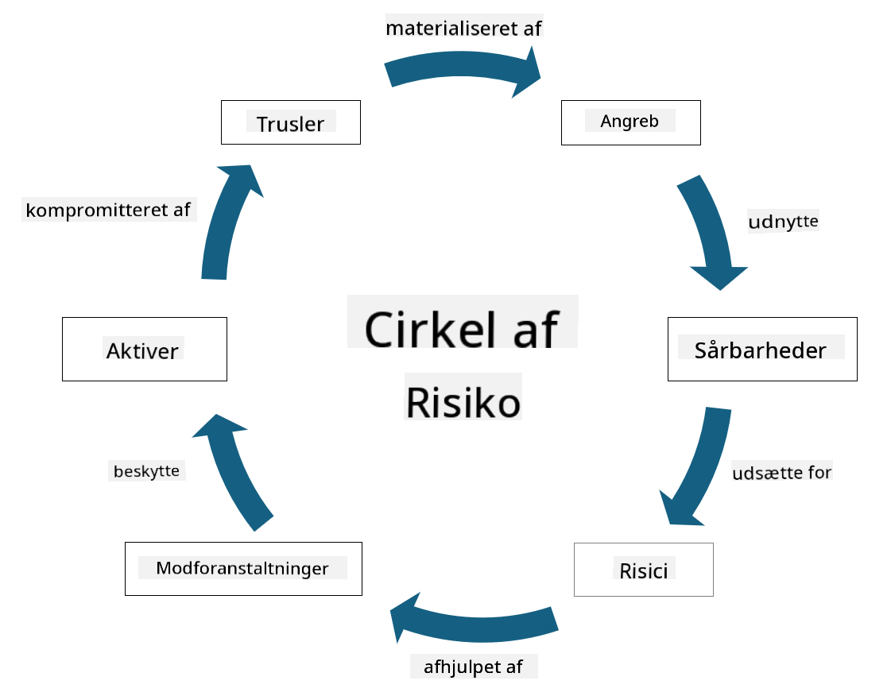

<!--
CO_OP_TRANSLATOR_METADATA:
{
  "original_hash": "fcca304f072cabf206388199e8e2e578",
  "translation_date": "2025-09-03T21:52:57+00:00",
  "source_file": "1.3 Understanding risk management.md",
  "language_code": "da"
}
-->
# Forståelse af risikostyring

## Introduktion

I denne lektion vil vi dække:

 - Definitioner af almindeligt anvendt sikkerhedsterminologi
   
 - Typer af sikkerhedskontroller

 - Vurdering af sikkerhedsrisici

## Definitioner af almindeligt anvendt sikkerhedsterminologi

Disse termer er grundlæggende begreber inden for cybersikkerhed og risikostyring. Lad os gennemgå hver term og deres indbyrdes relation:

1. **Trusselagent**:

En trusselagent er en person, gruppe, organisation eller automatiseret system, der har potentiale til at udnytte sårbarheder i et system eller netværk for at forårsage skade. Trusselagenter kan være hackere, malware-forfattere, utilfredse medarbejdere eller enhver enhed, der udgør en risiko for informations- og teknologisystemer.

2. **Trussel**:

En trussel er en potentiel hændelse eller handling, der kan udnytte sårbarheder i et system og forårsage skade på en ressource. Trusler kan inkludere handlinger som hacking, databrud, denial-of-service-angreb og mere. Trusler er "hvad" i forhold til den potentielle skade, der kan påføres en organisations ressourcer.

3. **Sårbarhed**:

En sårbarhed er en svaghed eller fejl i et systems design, implementering eller konfiguration, som kan udnyttes af en trusselagent til at kompromittere systemets sikkerhed. Sårbarheder kan findes i software, hardware, processer eller menneskelig adfærd. Identifikation og håndtering af sårbarheder er afgørende for at minimere risikoen for succesfulde angreb.

4. **Risiko**:

Risiko er potentialet for tab, skade eller ødelæggelse som følge af interaktionen mellem en trussel og en sårbarhed. Det er sandsynligheden for, at en trusselagent udnytter en sårbarhed til at forårsage en negativ påvirkning. Risici vurderes ofte ud fra deres potentielle konsekvenser og sandsynlighed for at opstå.

5. **Ressource**:

En ressource er alt af værdi, som en organisation ønsker at beskytte. Ressourcer kan omfatte fysiske objekter (såsom computere og servere), data (kundeoplysninger, økonomiske optegnelser), intellektuel ejendom (forretningshemmeligheder, patenter) og endda menneskelige ressourcer (medarbejderes færdigheder og viden). Beskyttelse af ressourcer er et centralt mål for cybersikkerhed.

6. **Eksponering**:

Eksponering refererer til tilstanden af at være sårbar over for potentielle trusler. Det opstår, når der findes en sårbarhed, som kan udnyttes af en trusselagent. Eksponering fremhæver risikoen forbundet med at have sårbarheder i et system eller netværk.

7. **Kontrol**:

En kontrol er en foranstaltning, der er indført for at reducere risikoen forbundet med sårbarheder og trusler. Kontroller kan være tekniske, proceduremæssige eller administrative. De er designet til at forebygge, opdage eller afbøde potentielle trusler og sårbarheder. Eksempler inkluderer firewalls, adgangskontroller, kryptering, sikkerhedspolitikker og medarbejderuddannelse.

For at opsummere forholdet mellem disse termer: Trusselagenter udnytter sårbarheder til at udføre trusler, som kan føre til risici, der har potentiale til at skade værdifulde ressourcer. Eksponering opstår, når sårbarheder er til stede, og kontroller implementeres for at reducere risikoen ved at forebygge eller afbøde truslers påvirkning på ressourcer. Denne ramme danner grundlaget for cybersikkerhedsrisikostyring og vejleder organisationer i at identificere, vurdere og håndtere potentielle risici for deres informationssystemer og ressourcer.

## Typer af sikkerhedskontroller

Sikkerhedskontroller er foranstaltninger eller beskyttelsesmekanismer, der implementeres for at beskytte informationssystemer og ressourcer mod forskellige trusler og sårbarheder. De kan klassificeres i flere kategorier baseret på deres fokus og formål. Her er nogle almindelige typer sikkerhedskontroller:

1. **Administrative kontroller**:

Disse kontroller vedrører politikker, procedurer og retningslinjer, der styrer organisationens sikkerhedspraksis og brugeradfærd.

- Sikkerhedspolitikker og -procedurer: Dokumenterede retningslinjer, der definerer, hvordan sikkerhed opretholdes i en organisation.

- Sikkerhedsbevidsthed og træning: Programmer til at uddanne medarbejdere om sikkerhedsbedste praksis og potentielle trusler.

- Hændelseshåndtering: Planer for at reagere på og afbøde sikkerhedshændelser.

2. **Tekniske kontroller**:

Tekniske kontroller involverer brugen af teknologi til at håndhæve sikkerhedsforanstaltninger og beskytte systemer og data. Eksempler på tekniske kontroller er:

- Adgangskontroller: Foranstaltninger, der begrænser brugeres adgang til ressourcer baseret på deres roller og tilladelser.

- Kryptering: Konvertering af data til et sikkert format for at forhindre uautoriseret adgang.

- Firewalls: Netværkssikkerhedsenheder, der filtrerer og kontrollerer indgående og udgående trafik.

- Intrusion Detection and Prevention Systems (IDPS): Værktøjer, der overvåger netværkstrafik for mistænkelig aktivitet.

- Antivirus- og antimalware-software: Programmer, der opdager og fjerner skadelig software.

- Autentifikationsmekanismer: Metoder til at verificere brugeres identitet, såsom adgangskoder, biometrik og multifaktorautentifikation.

- Patch management: Regelmæssig opdatering af software for at adressere kendte sårbarheder.

3. **Fysiske kontroller**:

Fysiske kontroller er foranstaltninger til at beskytte fysiske ressourcer og faciliteter.

- Sikkerhedsvagter og adgangskontrolpersonale: Personale, der overvåger og kontrollerer adgang til fysiske områder.

- Overvågningskameraer: Videoovervågningssystemer til at overvåge og registrere aktiviteter.

- Låse og fysiske barrierer: Fysiske foranstaltninger til at begrænse adgang til følsomme områder.

- Miljøkontroller: Foranstaltninger til at regulere temperatur, fugtighed og andre miljøfaktorer, der påvirker udstyr og datacentre.

4. **Operationelle kontroller**:

Disse kontroller vedrører daglige operationer og aktiviteter, der sikrer den løbende sikkerhed af systemer.

- Ændringsstyring: Processer til at spore og godkende ændringer i systemer og konfigurationer.

- Backup og katastrofeberedskab: Planer for datagendannelse i tilfælde af systemfejl eller katastrofer.

- Logning og revision: Overvågning og registrering af systemaktiviteter for sikkerheds- og overholdelsesformål.

- Sikker kodningspraksis: Retningslinjer for at skrive software, der minimerer sårbarheder.

5. **Juridiske og regulatoriske kontroller**:

Disse kontroller sikrer overholdelse af relevante love, regler og industristandarder. De standarder, en organisation skal overholde, afhænger af jurisdiktion, branche og andre faktorer.

- Databeskyttelsesregler: Overholdelse af love som GDPR, HIPAA og CCPA.

- Branche-specifikke standarder: Overholdelse af standarder som PCI DSS for sikkerhed af betalingskortdata.

Disse kategorier af sikkerhedskontroller arbejder sammen for at skabe en omfattende sikkerhedsholdning for organisationer og hjælper med at beskytte deres systemer, data og ressourcer mod en bred vifte af trusler.

## Vurdering af sikkerhedsrisici

Nogle sikkerhedsprofessionelle mener, at risikostyring bør overlades til risikoprofessionelle, men det er vigtigt for enhver sikkerhedsprofessionel at forstå processen med at håndtere sikkerhedsrisici for at kunne udtrykke risici på en måde, som resten af organisationen kan forstå og handle på.

Organisationer skal konstant vurdere sikkerhedsrisici og beslutte, hvilke handlinger (eller mangel på handling) der skal tages mod risici for forretningen. Nedenfor er en oversigt over, hvordan dette typisk gøres. Bemærk, at denne proces normalt udføres på tværs af flere forskellige teams i en organisation; det er sjældent, at ét team er ansvarligt for den samlede risikostyring.

1. **Identificer ressourcer og trusler**:

Organisationen identificerer de ressourcer, den ønsker at beskytte. Disse kan omfatte data, systemer, hardware, software, intellektuel ejendom og mere. Derefter identificerer de potentielle trusler, der kan målrette disse ressourcer.

2. **Vurder sårbarheder**:

Organisationer identificerer derefter sårbarheder eller svagheder i systemer eller processer, der kan udnyttes af trusler. Disse sårbarheder kan stamme fra softwarefejl, fejlkonfigurationer, manglende sikkerhedskontroller og menneskelige fejl.

3. **Sandsynlighedsvurdering**:

Organisationen vurderer derefter sandsynligheden for, at hver trussel opstår. Dette indebærer at overveje historiske data, trusselsinformation, branchetendenser og interne faktorer. Sandsynligheden kan kategoriseres som lav, medium eller høj baseret på truslens sandsynlighed.

4. **Konsekvensvurdering**:

Derefter fastlægger organisationen de potentielle konsekvenser af hver trussel, hvis den udnytter en sårbarhed. Konsekvenser kan omfatte økonomiske tab, driftsforstyrrelser, omdømmeskader, juridiske konsekvenser og mere. Konsekvenser kan også kategoriseres som lave, mellemstore eller høje baseret på de potentielle følger.

5. **Risikoberegning**:

Sandsynligheds- og konsekvensvurderinger kombineres for at beregne det samlede risikoniveau for hver identificeret trussel. Dette gøres ofte ved hjælp af en risikomatrix, der tildeler numeriske værdier eller kvalitative beskrivelser til sandsynligheds- og konsekvensniveauer. Det resulterende risikoniveau hjælper med at prioritere, hvilke risici der kræver øjeblikkelig opmærksomhed.

6. **Prioritering og beslutningstagning**:

Organisationen prioriterer derefter risici ved at fokusere på dem med de højeste kombinerede sandsynligheds- og konsekvensværdier. Dette gør det muligt at allokere ressourcer og implementere kontroller mere effektivt. Højrisikotrusler kræver øjeblikkelig opmærksomhed, mens lavrisikotrusler kan håndteres over længere tid.

7. **Risikobehandling**:

Baseret på risikovurderingen beslutter organisationen, hvordan hver risiko skal håndteres eller reduceres. Dette kan indebære implementering af sikkerhedskontroller, overførsel af risiko gennem forsikring eller endda accept af visse niveauer af resterende risiko, hvis de vurderes som håndterbare/for dyre at løse osv.

8. **Løbende overvågning og gennemgang**:

Risikovurdering er ikke en engangshandling. Den bør udføres periodisk eller hver gang der sker væsentlige ændringer i organisationens miljø. Løbende overvågning sikrer, at nye trusler, sårbarheder eller ændringer i forretningslandskabet tages i betragtning.

Ved at vurdere sikkerhedsrisici på denne strukturerede måde kan organisationer træffe informerede beslutninger om ressourceallokering, sikkerhedskontroller og overordnede risikostyringsstrategier. Målet er at reducere organisationens samlede risikoudsættelse, samtidig med at sikkerhedsindsatsen tilpasses organisationens forretningsmål og -strategier.

---

**Ansvarsfraskrivelse**:  
Dette dokument er blevet oversat ved hjælp af AI-oversættelsestjenesten [Co-op Translator](https://github.com/Azure/co-op-translator). Selvom vi bestræber os på nøjagtighed, skal du være opmærksom på, at automatiserede oversættelser kan indeholde fejl eller unøjagtigheder. Det originale dokument på dets oprindelige sprog bør betragtes som den autoritative kilde. For kritisk information anbefales professionel menneskelig oversættelse. Vi er ikke ansvarlige for eventuelle misforståelser eller fejltolkninger, der måtte opstå som følge af brugen af denne oversættelse.