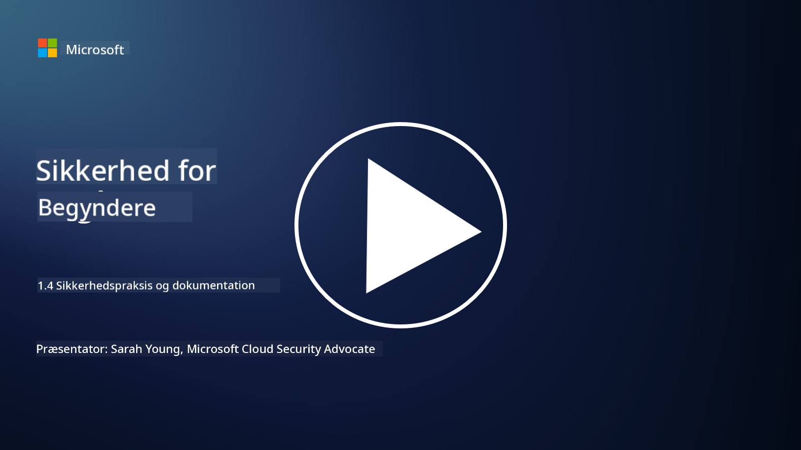

<!--
CO_OP_TRANSLATOR_METADATA:
{
  "original_hash": "d33500902124e52870935bdce4546fcc",
  "translation_date": "2025-09-03T20:59:08+00:00",
  "source_file": "1.4 Security practices and documentation.md",
  "language_code": "da"
}
-->
# Sikkerhedspraksis og dokumentation

Du har måske hørt udtryk som "sikkerhedspolitik", "sikkerhedsstandard" osv. før, men virkeligheden er, at mange cybersikkerhedsprofessionelle ikke bruger dem korrekt. I denne sektion vil vi forklare, hvad hver af disse udtryk betyder, og hvorfor en organisation ville anvende dem.

## Introduktion

I denne lektion vil vi dække:

- Hvad er en sikkerhedspolitik?

- Hvad er en sikkerhedsstandard?

- Hvad er en sikkerhedsbaseline?

- Hvad er en sikkerhedsvejledning?

- Hvad er en sikkerhedsprocedure?

- Hvad er love og regler i cybersikkerhedskontekst?

Disse udtryk bruges ofte i cybersikkerhedskonteksten til at definere forskellige niveauer af sikkerhedsdokumentation og praksis inden for en organisation. Lad os afklare hvert udtryk:

## Hvad er en sikkerhedspolitik?

En sikkerhedspolitik er et overordnet dokument, der beskriver en organisations overordnede sikkerhedsmål, principper og retningslinjer. Det giver en ramme for at træffe sikkerhedsrelaterede beslutninger og sætter tonen for organisationens sikkerhedsholdning. Sikkerhedspolitikker dækker typisk emner som acceptabel brug af ressourcer, databeskyttelse, adgangskontrol, hændelseshåndtering og mere. En politik er uafhængig af løsninger og teknologi. Et eksempel på en sikkerhedspolitik, som mange vil være bekendt med, kunne være en organisations politik for acceptabel brug.

## Hvad er en sikkerhedsstandard?

En sikkerhedsstandard er et mere detaljeret og specifikt dokument, der giver retningslinjer og krav til implementering af sikkerhedskontroller og -foranstaltninger inden for en organisation. Standarder er mere konkrete og tekniske end politikker og tilbyder specifikke instruktioner og anbefalinger til konfiguration og vedligeholdelse af systemer, netværk og processer for at opfylde sikkerhedsmål. Et eksempel på en sikkerhedsstandard kunne være _"Alle interne data skal krypteres i hvile og under transport."_

## Hvad er en sikkerhedsbaseline?

En sikkerhedsbaseline er et sæt minimumssikkerhedskonfigurationer, der anses for essentielle for et bestemt system, en applikation eller et miljø på et givet tidspunkt. Den definerer et udgangspunkt for sikkerhed, der bør implementeres på tværs af alle relevante instanser. Sikkerhedsbaselines hjælper med at sikre konsistens og et vist niveau af sikkerhed i hele organisationens IT-infrastruktur. Et eksempel på en sikkerhedsbaseline kunne være _"Azure VMs må ikke have direkte internetadgang."_

## Hvad er en sikkerhedsvejledning?

En sikkerhedsvejledning er et dokument, der tilbyder anbefalinger og vejledning, når en specifik sikkerhedsstandard ikke gælder. Vejledninger forsøger at håndtere de "grå områder", der opstår, når en standard ikke dækker eller kun delvist dækker et emne.

## Hvad er en sikkerhedsprocedure?

En sikkerhedsprocedure er en detaljeret trin-for-trin guide, der beskriver de specifikke handlinger og opgaver, der skal udføres for at gennemføre en sikkerhedsrelateret proces eller opgave. Procedurer er praktiske og handlingsorienterede dokumenter, der giver en klar rækkefølge af handlinger, der skal følges under hændelseshåndtering, systemvedligeholdelse, brugeroprettelse og andre sikkerhedsrelaterede aktiviteter. Et eksempel på en sikkerhedsprocedure kunne være _"Når en P1-sikkerhedshændelse genereres af Microsoft Sentinel, skal sikkerhedsoperationscenteret (SOC) straks informere den vagthavende sikkerhedsleder og sende detaljerne om hændelsen til dem."_

Sammenfattende repræsenterer disse udtryk forskellige niveauer af dokumentation og vejledning inden for en organisations cybersikkerhedsramme. Sikkerhedspolitikker fastsætter de overordnede mål, standarder giver detaljerede krav, baselines etablerer minimumssikkerhedskonfigurationer, vejledninger tilbyder bedste praksis, og procedurer giver handlingsorienterede trin for sikkerhedsprocesser.

## Hvad er love/regler i cybersikkerhedskontekst?

Love og regler refererer til juridiske rammer, der er etableret af regeringer og regulerende organer for at definere og håndhæve regler, standarder og krav til sikring af digitale systemer, data og information. Disse love og regler varierer afhængigt af jurisdiktion og fokuserer på forskellige aspekter af cybersikkerhed, herunder databeskyttelse, privatliv, hændelsesrapportering og sikkerheden for kritisk infrastruktur. Her er nogle eksempler på cybersikkerhedsrelaterede love og regler: f.eks. General Data Protection Regulation (GDPR), Health Insurance Portability and Accountability Act (HIPAA), California Consumer Privacy Act (CCPA), Payment Card Industry Data Security Standard (PCI DSS).

## Yderligere læsning

[Information Security Policy Templates | SANS Institute](https://www.sans.org/information-security-policy/)

[Compliance with Cybersecurity and Privacy Laws and Regulations | NIST](https://www.nist.gov/mep/cybersecurity-resources-manufacturers/compliance-cybersecurity-and-privacy-laws-and-regulations)

---

**Ansvarsfraskrivelse**:  
Dette dokument er blevet oversat ved hjælp af AI-oversættelsestjenesten [Co-op Translator](https://github.com/Azure/co-op-translator). Selvom vi bestræber os på nøjagtighed, skal du være opmærksom på, at automatiserede oversættelser kan indeholde fejl eller unøjagtigheder. Det originale dokument på dets oprindelige sprog bør betragtes som den autoritative kilde. For kritisk information anbefales professionel menneskelig oversættelse. Vi er ikke ansvarlige for eventuelle misforståelser eller fejltolkninger, der måtte opstå som følge af brugen af denne oversættelse.