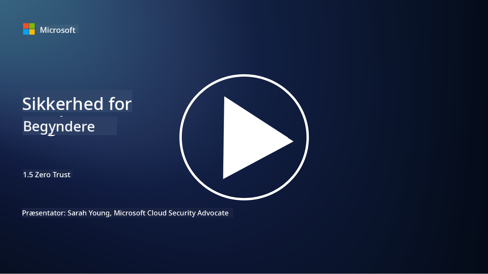
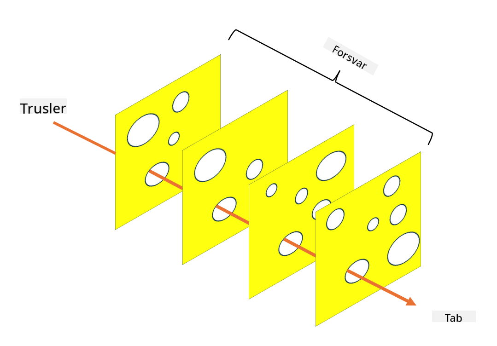

<!--
CO_OP_TRANSLATOR_METADATA:
{
  "original_hash": "75f77f972d2233c584f87c1eb96c983b",
  "translation_date": "2025-09-03T20:31:19+00:00",
  "source_file": "1.5 Zero trust.md",
  "language_code": "da"
}
-->
# Zero Trust

"Zero trust" er et udtryk, der ofte bruges i sikkerhedskredse i dag. Men hvad betyder det, og er det bare et modeord? I denne lektion vil vi dykke ned i, hvad zero trust egentlig er.

## Introduktion

- I denne lektion vil vi dække:

- Hvad er zero trust?

- Hvordan adskiller zero trust sig fra traditionelle sikkerhedsarkitekturer?

- Hvad er defense in depth?

## Zero Trust

Zero Trust er en cybersikkerhedsstrategi, der udfordrer den traditionelle tilgang "stol på, men verificér" ved at antage, at ingen enhed, hverken inden for eller uden for en organisations netværk, bør have iboende tillid. I stedet går Zero Trust ind for at verificere hver bruger, enhed og applikation, der forsøger at få adgang til ressourcer, uanset deres placering. Det centrale princip i Zero Trust er at minimere "angrebsfladen" og reducere den potentielle påvirkning af sikkerhedsbrud.

I en Zero Trust-model lægges der vægt på følgende principper:

1. **Verificér identitet**: Autentificering og autorisation anvendes strengt på alle brugere og enheder, uanset deres placering. Husk, at en identitet ikke nødvendigvis er en person: det kan også være en enhed, en applikation osv.

2. **Mindst privilegium**: Brugere og enheder får kun den minimale adgang, der er nødvendig for at udføre deres opgaver, hvilket reducerer skaden, hvis de kompromitteres.

3. **Mikro-segmentering**: Netværksressourcer opdeles i mindre segmenter for at begrænse lateral bevægelse inden for netværket i tilfælde af et brud.

4. **Kontinuerlig overvågning**: Løbende overvågning og analyse af bruger- og enhedsadfærd udføres for at opdage unormale mønstre og potentielle trusler. Moderne overvågningsteknikker anvender også maskinlæring, AI og trusselsintelligens for at give yderligere detaljer og kontekst.

5. **Datakryptering**: Data krypteres både under transport og i hvile for at forhindre uautoriseret adgang.

6. **Strenge adgangskontroller**: Adgangskontroller håndhæves baseret på kontekst, såsom brugerroller, enhedens tilstand og netværksplacering.

Microsoft opdeler Zero Trust i fem søjler, som vi vil diskutere i en senere lektion.

## Forskelle fra traditionelle sikkerhedsarkitekturer

Zero Trust adskiller sig fra traditionelle sikkerhedsarkitekturer, såsom perimeterbaserede modeller, på flere måder:

1. **Perimeter vs. identitetsfokus**: Traditionelle modeller fokuserer på at sikre netværkets perimeter og antager, at interne brugere og enheder kan have tillid, når de først er indenfor. Zero Trust antager derimod, at trusler kan opstå både inden for og uden for netværket og håndhæver strenge identitetsbaserede kontroller.

2. **Implicit vs. eksplicit tillid**: Traditionelle modeller har implicit tillid til enheder og brugere inden for netværket, indtil det modsatte er bevist. Zero Trust verificerer eksplicit identiteter og overvåger løbende for unormale mønstre.

3. **Fladt vs. segmenteret netværk**: Traditionelle arkitekturer involverer ofte flade netværk, hvor interne brugere har bred adgang. Zero Trust går ind for at segmentere netværket i mindre, isolerede zoner for at begrænse potentielle brud.

4. **Reaktiv vs. proaktiv**: Traditionel sikkerhed er ofte afhængig af reaktive foranstaltninger som perimeter-firewalls og indtrængningsdetektion. Zero Trust tager en proaktiv tilgang ved at antage, at brud er sandsynlige og minimere deres påvirkning.

## Defense in Depth

Defense in depth, også kendt som lagdelt sikkerhed, er en cybersikkerhedsstrategi, der indebærer implementering af flere lag af sikkerhedskontroller og foranstaltninger for at beskytte en organisations aktiver. Målet er at skabe overlappende lag af forsvar, så hvis ét lag brydes, kan andre stadig yde beskyttelse. Hvert lag fokuserer på en anden aspekt af sikkerhed og øger den samlede sikkerhed i organisationen.

Defense in depth involverer en kombination af tekniske, proceduremæssige og fysiske sikkerhedsforanstaltninger. Disse kan omfatte firewalls, indtrængningsdetektionssystemer, adgangskontroller, kryptering, brugeruddannelse, sikkerhedspolitikker og mere. Ideen er at skabe flere barrierer, der samlet gør det svært for angribere at trænge ind i en organisations systemer og netværk. Dette kaldes også nogle gange "swiss cheese"-modellen, som også bruges i ulykkesforebyggelse i andre industrier (f.eks. transport).

## Yderligere læsning

[Hvad er Zero Trust?](https://learn.microsoft.com/security/zero-trust/zero-trust-overview?WT.mc_id=academic-96948-sayoung)

[Evolution af Zero Trust – Microsoft Position Paper](https://query.prod.cms.rt.microsoft.com/cms/api/am/binary/RWJJdT?WT.mc_id=academic-96948-sayoung)

[Zero Trust og BeyondCorp Google Cloud | Google Cloud Blog](https://cloud.google.com/blog/topics/developers-practitioners/zero-trust-and-beyondcorp-google-cloud)

---

**Ansvarsfraskrivelse**:  
Dette dokument er blevet oversat ved hjælp af AI-oversættelsestjenesten [Co-op Translator](https://github.com/Azure/co-op-translator). Selvom vi bestræber os på at opnå nøjagtighed, skal du være opmærksom på, at automatiserede oversættelser kan indeholde fejl eller unøjagtigheder. Det originale dokument på dets oprindelige sprog bør betragtes som den autoritative kilde. For kritisk information anbefales professionel menneskelig oversættelse. Vi er ikke ansvarlige for eventuelle misforståelser eller fejltolkninger, der måtte opstå som følge af brugen af denne oversættelse.