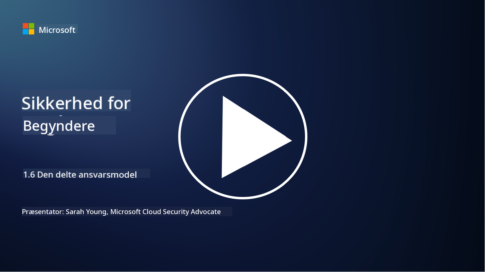

<!--
CO_OP_TRANSLATOR_METADATA:
{
  "original_hash": "a48db640d80c786b928ca178c414f084",
  "translation_date": "2025-09-03T21:04:10+00:00",
  "source_file": "1.6 Shared responsibility model.md",
  "language_code": "da"
}
-->
# Den delte ansvarsmodel

Delte ansvar er et nyere koncept inden for IT, som opstod med fremkomsten af cloud computing. Fra et cybersikkerhedsperspektiv er det afgørende at forstå, hvem der leverer hvilke sikkerhedskontroller, så der ikke opstår huller i forsvaret.

## Introduktion

I denne lektion vil vi dække:

 - Hvad er delt ansvar i cybersikkerhedens kontekst?
   
 - Hvad er forskellen i delt ansvar for sikkerhedskontroller
   mellem IaaS, PaaS og SaaS?

   

 - Hvor kan du finde ud af, hvilke sikkerhedskontroller din cloudplatform 
   tilbyder?

   
 

 - Hvad betyder "stol på, men verificér"?

## Hvad er delt ansvar i cybersikkerhedens kontekst?

Delt ansvar inden for cybersikkerhed refererer til fordelingen af sikkerhedsansvar mellem en cloudtjenesteudbyder (CSP) og dens kunder. I cloud computing-miljøer, såsom Infrastructure as a Service (IaaS), Platform as a Service (PaaS) og Software as a Service (SaaS), har både CSP og kunden roller i at sikre data, applikationer og systemer.

## Hvad er forskellen i delt ansvar for sikkerhedskontroller mellem IaaS, PaaS og SaaS?

Fordelingen af ansvar afhænger typisk af typen af cloudtjeneste, der anvendes:

 - **IaaS (Infrastructure as a Service)**: CSP leverer den grundlæggende infrastruktur (servere, netværk, lager), mens kunden er ansvarlig for at administrere operativsystemer, applikationer og sikkerhedskonfigurationer på den infrastruktur.
   
   
 - **PaaS (Platform as a Service):** CSP tilbyder en platform, hvor kunder kan bygge og implementere applikationer. CSP administrerer den underliggende infrastruktur, og kunden fokuserer på applikationsudvikling og datasikkerhed.

   

 - **SaaS (Software as a Service)**: CSP leverer fuldt funktionelle applikationer, der er tilgængelige via internettet. I dette tilfælde er CSP ansvarlig for applikationens sikkerhed og infrastruktur, mens kunden administrerer brugeradgang og dataanvendelse.

At forstå delt ansvar er afgørende, fordi det tydeliggør, hvilke sikkerhedsaspekter CSP dækker, og hvilke kunden skal tage sig af. Det hjælper med at undgå misforståelser og sikrer, at sikkerhedsforanstaltninger implementeres holistisk.

## Hvor kan du finde ud af, hvilke sikkerhedskontroller din cloudplatform tilbyder?

For at finde ud af, hvilke sikkerhedskontroller din cloudplatform tilbyder, skal du henvise til cloudtjenesteudbyderens dokumentation og ressourcer. Disse inkluderer:

 - **CSP’s hjemmeside og dokumentation**: CSP’s hjemmeside vil have information om de sikkerhedsfunktioner og kontroller, der tilbydes som en del af deres tjenester. CSP’er tilbyder normalt detaljeret dokumentation, der forklarer deres sikkerhedspraksis, kontroller og anbefalinger. Dette kan inkludere whitepapers, sikkerhedsguider og teknisk dokumentation.
   
 - **Sikkerhedsvurderinger og revisioner**: De fleste CSP’er får deres sikkerhedskontroller vurderet af uafhængige sikkerhedseksperter og organisationer. Disse vurderinger kan give indsigt i kvaliteten af CSP’s sikkerhedsforanstaltninger. Nogle gange fører dette til, at CSP får en sikkerhedskompliance-certificering (se næste punkt).
 - **Sikkerhedskompliance-certificeringer**: De fleste CSP’er opnår certificeringer såsom ISO:27001, SOC 2 og FedRAMP osv. Disse certificeringer viser, at udbyderen opfylder specifikke sikkerheds- og compliance-standarder.

Husk, at niveauet af detaljer og tilgængeligheden af information kan variere mellem cloududbydere. Sørg altid for, at du konsulterer officielle og opdaterede ressourcer fra cloudtjenesteudbyderen for at træffe informerede beslutninger om sikkerheden af dine cloud-baserede aktiver.

## Hvad betyder "stol på, men verificér"?

I konteksten af at bruge en CSP, tredjepartssoftware eller andre IT-sikkerhedstjenester, kan en organisation i første omgang stole på udbyderens påstande om sikkerhedsforanstaltninger. Men for virkelig at sikre sikkerheden af deres data og systemer, bør de verificere disse påstande gennem sikkerhedsvurderinger, penetrationstest og en gennemgang af den eksterne parts sikkerhedskontroller, før de fuldt ud integrerer softwaren eller tjenesten i deres drift. Alle individer og organisationer bør stræbe efter at stole på, men verificere de sikkerhedskontroller, som de ikke selv er ansvarlige for.

## Delt ansvar inden for en organisation

Husk, at delt ansvar for sikkerhed inden for en organisation også skal tages i betragtning for forskellige teams. Sikkerhedsteamet vil sjældent implementere alle kontroller selv og vil have behov for at samarbejde med driftsteams, udviklere og andre dele af virksomheden for at implementere alle de sikkerhedskontroller, der er nødvendige for at holde en organisation sikker.

## Yderligere læsning
- [Shared responsibility in the cloud - Microsoft Azure | Microsoft Learn](https://learn.microsoft.com/azure/security/fundamentals/shared-responsibility?WT.mc_id=academic-96948-sayoung)
- [What is shared responsibility model? – Definition from TechTarget.com](https://www.techtarget.com/searchcloudcomputing/definition/shared-responsibility-model)
- [The shared responsibility model explained and what it means for cloud security | CSO Online](https://www.csoonline.com/article/570779/the-shared-responsibility-model-explained-and-what-it-means-for-cloud-security.html)
- [Shared Responsibility for Cloud Security: What You Need to Know (cisecurity.org)](https://www.cisecurity.org/insights/blog/shared-responsibility-cloud-security-what-you-need-to-know)

---

**Ansvarsfraskrivelse**:  
Dette dokument er blevet oversat ved hjælp af AI-oversættelsestjenesten [Co-op Translator](https://github.com/Azure/co-op-translator). Selvom vi bestræber os på nøjagtighed, skal du være opmærksom på, at automatiserede oversættelser kan indeholde fejl eller unøjagtigheder. Det originale dokument på dets oprindelige sprog bør betragtes som den autoritative kilde. For kritisk information anbefales professionel menneskelig oversættelse. Vi er ikke ansvarlige for eventuelle misforståelser eller fejltolkninger, der måtte opstå som følge af brugen af denne oversættelse.