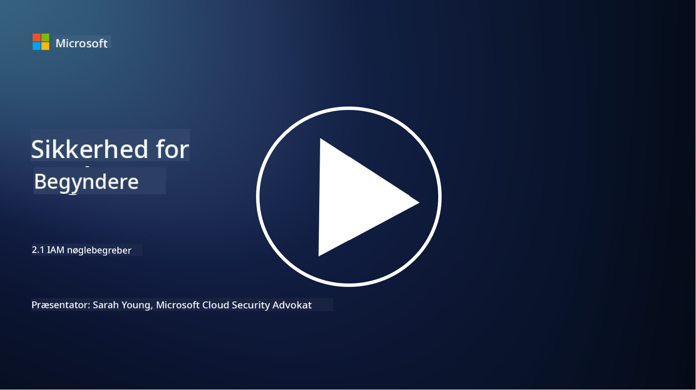

<!--
CO_OP_TRANSLATOR_METADATA:
{
  "original_hash": "2e3864e3d579f0dbb4ac2ec8c5f82acf",
  "translation_date": "2025-09-03T19:35:44+00:00",
  "source_file": "2.1 IAM key concepts.md",
  "language_code": "da"
}
-->
# IAM nøglebegreber

Har du nogensinde logget ind på en computer eller en hjemmeside? Selvfølgelig har du det! Det betyder, at du allerede har brugt identitetskontroller i din dagligdag. Identity and Access Management (IAM) er en vigtig søjle inden for sikkerhed, og vi vil lære mere om det i de kommende lektioner.

**Introduktion**

I denne lektion vil vi dække:

- Hvad mener vi med Identity and Access Management (IAM) i
  cybersikkerhedens kontekst?
  
- Hvad er princippet om mindst privilegium?
  
- Hvad er adskillelse af opgaver?
  
- Hvad er autentifikation og autorisation?

## Hvad mener vi med Identity and Access Management (IAM) i cybersikkerhedens kontekst?

Identity and Access Management (IAM) refererer til en række processer, teknologier og politikker, der implementeres for at sikre, at de rette personer har passende adgang til ressourcer inden for en organisations digitale miljø. IAM indebærer styring af digitale identiteter (brugere, medarbejdere, partnere) og deres adgang til systemer, applikationer, data og netværk. Det primære mål med IAM er at forbedre sikkerheden, strømline brugeradgang og sikre overholdelse af organisatoriske politikker og regler. IAM-løsninger omfatter typisk brugerautentifikation, autorisation, identitetsprovisionering, adgangskontrol og styring af brugerens livscyklus (sikre, at konti bliver slettet, når de ikke længere bruges).

## Hvad er princippet om mindst privilegium?

Princippet om mindst privilegium er et grundlæggende koncept, der går ud på at give brugere og systemer kun de minimumsrettigheder, der er nødvendige for at udføre deres tilsigtede opgaver eller roller. Dette princip hjælper med at begrænse den potentielle skade, der kan opstå i tilfælde af et sikkerhedsbrud eller en intern trussel. Ved at følge princippet om mindst privilegium reducerer organisationer angrebsfladen og minimerer risikoen for uautoriseret adgang, databrud og utilsigtet misbrug af rettigheder. I praksis betyder det, at brugere kun får adgang til de specifikke ressourcer og funktioner, der er nødvendige for deres jobroller, og ikke mere. For eksempel, hvis du kun skal læse et dokument, ville det være overdrevet at give dig fulde administratorrettigheder til det pågældende dokument.

## Hvad er adskillelse af opgaver?

Adskillelse af opgaver er et princip, der sigter mod at forhindre interessekonflikter og reducere risikoen for svindel og fejl ved at fordele kritiske opgaver og ansvar blandt forskellige personer i en organisation. I cybersikkerhedens kontekst indebærer adskillelse af opgaver at sikre, at ingen enkeltperson har kontrol over alle aspekter af en kritisk proces eller et system. Målet er at skabe et system med kontrolmekanismer, der forhindrer, at én person kan udføre både opsætnings- og godkendelsesstadierne af en proces. For eksempel kan det i finansielle systemer betyde, at den person, der indtaster transaktioner i systemet, ikke bør være den samme person, der godkender disse transaktioner. Dette reducerer risikoen for uautoriserede eller svigagtige handlinger, der går ubemærket hen.

## Hvad er autentifikation og autorisation?

Autentifikation og autorisation er to grundlæggende begreber inden for cybersikkerhed, der spiller en afgørende rolle i at sikre sikkerheden og integriteten af computersystemer og data. De bruges ofte sammen til at kontrollere adgang til ressourcer og beskytte følsomme oplysninger.

**1. Autentifikation**: Autentifikation er processen med at verificere identiteten af en bruger, et system eller en enhed, der forsøger at få adgang til et computersystem eller en specifik ressource. Det sikrer, at den påståede identitet er ægte og korrekt. Autentifikationsmetoder involverer typisk brugen af en eller flere af følgende faktorer:
    
    a. Noget du ved: Dette inkluderer adgangskoder, PIN-koder eller anden hemmelig viden, som kun den autoriserede bruger bør have.
    
    b. Noget du har: Dette involverer fysiske tokens eller enheder som smartkort, sikkerhedstokens eller mobiltelefoner, der bruges til at bekræfte brugerens identitet.
    
    c. Noget du er: Dette refererer til biometriske faktorer som fingeraftryk, ansigtsgenkendelse eller nethindescanninger, der er unikke for en person.
    

Autentifikationsmekanismer bruges til at bekræfte, at en bruger er den, de hævder at være, før de får adgang til et system eller en ressource. Det hjælper med at forhindre uautoriseret adgang og sikrer, at kun legitime brugere kan udføre handlinger i et system.

**2. Autorisation**: Autorisation er processen med at give eller nægte specifikke tilladelser og privilegier til autentificerede brugere eller enheder, når deres identitet er blevet verificeret. Det bestemmer, hvilke handlinger eller operationer en bruger har lov til at udføre i et system eller på specifikke ressourcer. Autorisation er ofte baseret på foruddefinerede politikker, adgangskontrolregler og roller, der er tildelt brugere.

Autorisation kan betragtes som svaret på spørgsmålet: "Hvad kan en autentificeret bruger gøre?" Det indebærer at definere og håndhæve adgangskontrolpolitikker for at beskytte følsomme data og ressourcer mod uautoriseret adgang eller ændring.

**Opsummering:**

- Autentifikation fastslår identiteten af brugere eller enheder.
- Autorisation bestemmer, hvilke handlinger og ressourcer autentificerede brugere har lov til at få adgang til eller manipulere.

## Yderligere læsning

- [Describe identity concepts - Training | Microsoft Learn](https://learn.microsoft.com/training/modules/describe-identity-principles-concepts/?WT.mc_id=academic-96948-sayoung)
- [Introduction to identity - Microsoft Entra | Microsoft Learn](https://learn.microsoft.com/azure/active-directory/fundamentals/identity-fundamental-concepts?WT.mc_id=academic-96948-sayoung)
- [What is Identity Access Management (IAM)? | Microsoft Security](https://www.microsoft.com/security/business/security-101/what-is-identity-access-management-iam?WT.mc_id=academic-96948-sayoung)
- [What is IAM? Identity and access management explained | CSO Online](https://www.csoonline.com/article/518296/what-is-iam-identity-and-access-management-explained.html)
- [What is IAM? (auth0.com)](https://auth0.com/blog/what-is-iam/)
- [Security+: implementing Identity and Access Management (IAM) controls [updated 2021] | Infosec (infosecinstitute.com)](https://resources.infosecinstitute.com/certifications/securityplus/security-implementing-identity-and-access-management-iam-controls/)
- [least privilege - Glossary | CSRC (nist.gov)](https://csrc.nist.gov/glossary/term/least_privilege)
- [Security: The Principle of Least Privilege (POLP) - Microsoft Community Hub](https://techcommunity.microsoft.com/t5/azure-sql-blog/security-the-principle-of-least-privilege-polp/ba-p/2067390?WT.mc_id=academic-96948-sayoung)
- [Principle of least privilege | CERT NZ](https://www.cert.govt.nz/it-specialists/critical-controls/principle-of-least-privilege/)
- [Why is separation of duties required by NIST 800-171 and CMMC? - (totem.tech)](https://www.totem.tech/cmmc-separation-of-duties/)

---

**Ansvarsfraskrivelse**:  
Dette dokument er blevet oversat ved hjælp af AI-oversættelsestjenesten [Co-op Translator](https://github.com/Azure/co-op-translator). Selvom vi bestræber os på nøjagtighed, skal du være opmærksom på, at automatiserede oversættelser kan indeholde fejl eller unøjagtigheder. Det originale dokument på dets oprindelige sprog bør betragtes som den autoritative kilde. For kritisk information anbefales professionel menneskelig oversættelse. Vi påtager os ikke ansvar for eventuelle misforståelser eller fejltolkninger, der opstår som følge af brugen af denne oversættelse.