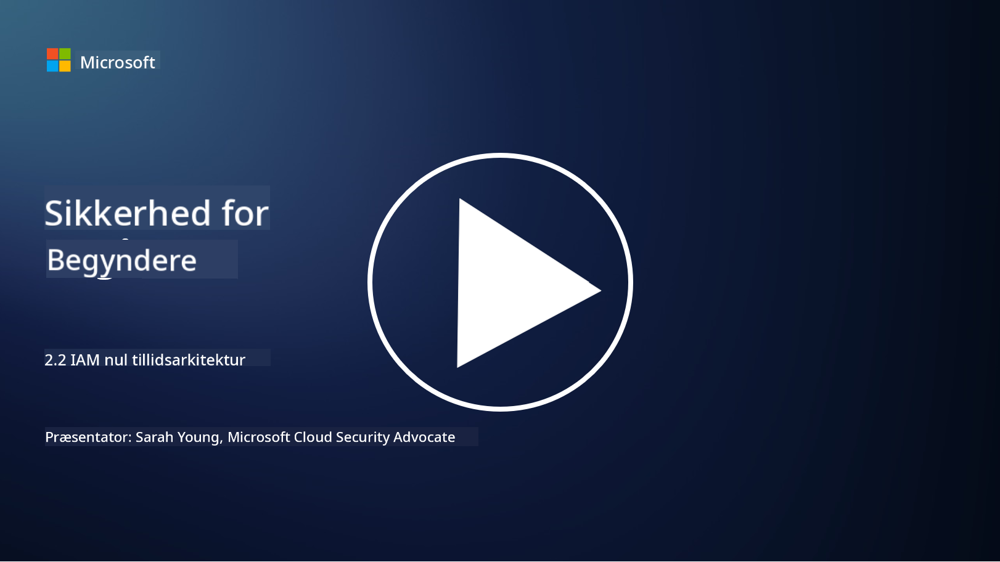

<!--
CO_OP_TRANSLATOR_METADATA:
{
  "original_hash": "4774a978af123f72ebb872199c4c4d4f",
  "translation_date": "2025-09-03T20:26:01+00:00",
  "source_file": "2.2 IAM zero trust architecture.md",
  "language_code": "da"
}
-->
# IAM zero trust arkitektur

Identitet er en central del af implementeringen af en zero trust arkitektur og opbygningen af en perimeter for ethvert IT-miljø. I denne sektion vil vi undersøge, hvorfor det er vigtigt at bruge identitetskontroller til at implementere zero trust.

## Introduktion

I denne lektion vil vi dække:

- Hvorfor er det nødvendigt at bruge identitet som vores perimeter i moderne IT-miljøer?

- Hvordan adskiller dette sig fra traditionelle IT-arkitekturer?

- Hvordan bruges identitet til at implementere en zero trust arkitektur?

## Hvorfor er det nødvendigt at bruge identitet som vores perimeter i moderne IT-miljøer?

I moderne IT-miljøer bliver det traditionelle koncept med en fysisk perimeter (ved brug af værktøjer som firewalls og netværksgrænser) som den primære forsvarslinje mod cybertrusler mindre effektivt på grund af den stigende kompleksitet i teknologi, fremkomsten af fjernarbejde og adoptionen af cloud-tjenester. I stedet skifter organisationer til at bruge identitet som den nye perimeter. Det betyder, at sikkerheden drejer sig om at verificere og administrere identiteten af brugere, enheder og applikationer, der forsøger at få adgang til ressourcer, uanset deres fysiske placering.

Her er hvorfor det er afgørende at bruge identitet som perimeter i moderne IT-miljøer:

**Fjernarbejde**: Med fjernarbejde og mobile enheder som normen kan brugere få adgang til ressourcer fra forskellige lokationer og enheder. Den traditionelle perimeter-tilgang fungerer ikke, når brugere ikke længere er begrænset til et fysisk kontor.

**Cloud- og hybridmiljøer**: Organisationer adopterer i stigende grad cloud-tjenester og hybridmiljøer. Data og applikationer er ikke længere udelukkende placeret inden for organisationens lokaler, hvilket gør traditionelle perimeterforsvar mindre relevante.

**Zero trust sikkerhed**: Konceptet med zero trust sikkerhed antager, at ingen enhed, hverken inden for eller uden for netværket, automatisk skal have tillid. Identitet bliver fundamentet for at verificere adgangsanmodninger, uanset hvor de stammer fra.

**Trusselslandskab**: Cybertrusler udvikler sig, og angribere finder måder at omgå traditionelle perimeterforsvar. Phishing, social engineering og insidertrusler udnytter ofte menneskelige svagheder frem for at forsøge at bryde netværksperimetre.

**Datafokuseret tilgang**: Beskyttelse af følsomme data er afgørende. Ved at fokusere på identitet kan organisationer kontrollere, hvem der har adgang til hvilke data, og dermed reducere risikoen for databrud.

## Hvordan adskiller dette sig fra traditionelle IT-arkitekturer?

Traditionelle IT-arkitekturer var stærkt afhængige af perimeterbaserede sikkerhedsmodeller, hvor firewalls og netværksgrænser spillede en væsentlig rolle i at holde trusler ude. De vigtigste forskelle mellem traditionelle og identitetscentrerede tilgange er:

|      Aspekt                 |      Traditionelle IT-arkitekturer                                                               |      Identitetscentreret tilgang                                                                          |
|-----------------------------|--------------------------------------------------------------------------------------------------|----------------------------------------------------------------------------------------------------------|
|     Fokus                   |     Perimeterfokus: Afhængig af perimeterforsvar som firewalls og adgangskontrol.               |     Fokus på identitetsverifikation: Skift fra netværksgrænser til verifikation af bruger/enhedsidentitet.|
|     Lokation                |     Lokationsafhængighed: Sikkerhed bundet til fysiske kontorlokationer og netværksgrænser.      |     Lokationsuafhængighed: Sikkerhed ikke bundet til specifikke lokationer; adgang fra hvor som helst.    |
|     Tillidsantagelse        |     Antaget tillid: Tillid antages inden for netværksperimeteren for brugere/enheder.           |     Zero trust tilgang: Tillid antages aldrig; adgang verificeres baseret på identitet og kontekst.      |
|     Enhedsovervejelse       |     Enhedsdiversitet: Antager, at enheder inden for netværksperimeteren er sikre.               |     Enhedsbevidsthed: Tager højde for enhedens sundhed og sikkerhedstilstand, uanset lokation.            |
|     Databeskyttelse         |     Databeskyttelse: Fokus på at sikre netværksperimetre for databeskyttelse.                   |     Datafokuseret beskyttelse: Fokus på at kontrollere dataadgang baseret på identitet og datasensitivitet.|

## Hvordan bruges identitet til at implementere en zero trust arkitektur?

I en zero trust arkitektur er det grundlæggende princip aldrig automatisk at have tillid til nogen enhed, uanset om den er inden for eller uden for netværksperimeteren. Identitet spiller en central rolle i implementeringen af en zero trust tilgang ved at muliggøre kontinuerlig verifikation af enheder, der forsøger at få adgang til ressourcer. Moderne identitetssikkerhedskontroller sikrer, at hver bruger, enhed, applikation og tjeneste, der søger adgang til ressourcer, skal identificeres og autentificeres grundigt, før adgang gives. Dette indebærer verifikation af deres digitale identitet gennem metoder som brugernavn/adgangskode-kombinationer, multifaktorautentificering (MFA), biometrik og andre stærke autentificeringsmekanismer.

## Yderligere læsning

- [Securing identity with Zero Trust | Microsoft Learn](https://learn.microsoft.com/security/zero-trust/deploy/identity?WT.mc_id=academic-96948-sayoung)
- [Zero Trust Principles and Guidance for Identity and Access | CSA (cloudsecurityalliance.org)](https://cloudsecurityalliance.org/artifacts/zero-trust-principles-and-guidance-for-iam/)
- [Zero Trust Identity Controls - Essentials Series - Episode 2 - YouTube](https://www.youtube.com/watch?v=fQZQznIKcGM&list=PLXtHYVsvn_b_gtX1-NB62wNervQx1Fhp4&index=13)

---

**Ansvarsfraskrivelse**:  
Dette dokument er blevet oversat ved hjælp af AI-oversættelsestjenesten [Co-op Translator](https://github.com/Azure/co-op-translator). Selvom vi bestræber os på at sikre nøjagtighed, skal du være opmærksom på, at automatiserede oversættelser kan indeholde fejl eller unøjagtigheder. Det originale dokument på dets oprindelige sprog bør betragtes som den autoritative kilde. For kritisk information anbefales professionel menneskelig oversættelse. Vi påtager os intet ansvar for misforståelser eller fejltolkninger, der måtte opstå som følge af brugen af denne oversættelse.