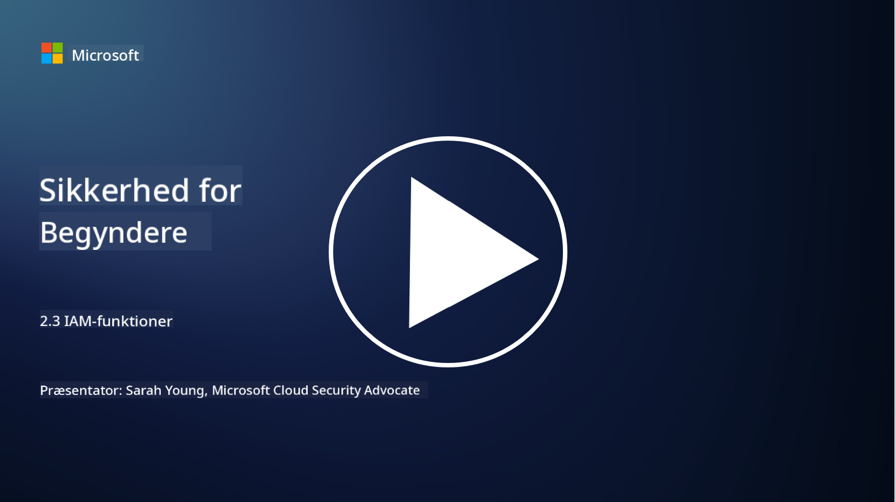

<!--
CO_OP_TRANSLATOR_METADATA:
{
  "original_hash": "bf0b8a54f2c69951744df5a94bc923f7",
  "translation_date": "2025-09-03T22:09:58+00:00",
  "source_file": "2.3 IAM capabilities.md",
  "language_code": "da"
}
-->
# IAM-funktioner

I denne sektion vil vi dække flere detaljer om de centrale værktøjer og funktioner, der bruges til identitetssikkerhed.

## Introduktion

I denne lektion vil vi dække:

 - Hvad er en katalogtjeneste?
      
     
    
 - Hvilke funktioner kan bruges til at sikre identiteter?
>
>        Multifaktorautentifikation (MFA)
> 
>        Single Sign-On (SSO)
> 
>        Rollebaseret adgangskontrol (RBAC)
> 
>        Adaptiv autentifikation
> 
>        Biometrisk autentifikation
> 
>        Privilegeret adgangsstyring (PAM)
> 
>        Identitetsstyring og administration (IGA)
> 
>        Adfærdsanalyse

## Hvad er en katalogtjeneste?

En katalogtjeneste er en specialiseret database, der gemmer og administrerer information om netværksressourcer, herunder brugere, grupper, enheder, applikationer og andre objekter. Den fungerer som et centralt lager for identitets- og adgangsrelaterede data, hvilket gør det muligt for organisationer effektivt at administrere og kontrollere brugerautentifikation, autorisation og andre sikkerhedsrelaterede opgaver.

Katalogtjenester spiller en afgørende rolle i moderne IT-miljøer ved at give en grundlæggende platform for løsninger inden for identitets- og adgangsstyring (IAM). De muliggør sikker adgang til ressourcer, håndhæver adgangspolitikker og forenkler administrative opgaver. En af de mest kendte katalogtjenester er Microsoft Active Directory, men der findes også andre løsninger som LDAP (Lightweight Directory Access Protocol), der tjener lignende formål.

Nøglefunktioner og egenskaber ved en katalogtjeneste i forbindelse med cybersikkerhed inkluderer:

 - **Brugerautentifikation**: Katalogtjenester validerer brugeroplysninger (såsom brugernavne og adgangskoder) for at sikre, at kun autoriserede brugere kan få adgang til netværket og dets ressourcer.
 - **Brugerautorisation**: De bestemmer niveauet af adgang, hver bruger har, baseret på deres rolle, gruppemedlemskab og andre attributter. Dette sikrer, at brugere kun kan få adgang til de ressourcer, de har ret til.
 - **Gruppeadministration**: Katalogtjenester giver administratorer mulighed for at organisere brugere i logiske grupper, hvilket forenkler styringen af adgangskontrol. Tilladelser kan tildeles grupper i stedet for individuelle brugere.
 - **Adgangskodepolitikker**: De håndhæver regler for adgangskodekompleksitet og udløb, hvilket forbedrer sikkerheden for brugerkonti.
 - **Single Sign-On (SSO)**: Nogle katalogtjenester understøtter SSO, hvilket gør det muligt for brugere at få adgang til flere applikationer og tjenester med et enkelt sæt legitimationsoplysninger.
 - **Centraliseret brugerstyring**: Katalogtjenester centraliserer brugerinformation, hvilket gør det lettere at administrere brugerkonti, profiler og attributter fra ét sted.
 - **Revision og logning**: De kan registrere brugerautentifikation og adgangsaktiviteter, hvilket hjælper med sikkerhedsrevisioner og overholdelsesindsatser.

## Hvilke funktioner kan bruges til at sikre identiteter?

**Multifaktorautentifikation (MFA)**

MFA kræver, at brugere leverer flere former for verifikation, før adgang gives. Dette inkluderer typisk noget, brugeren ved (adgangskode), noget, brugeren har (smartphone eller sikkerhedstoken), og noget, brugeren er (biometriske data som fingeraftryk eller ansigtsgenkendelse).

**Single Sign-On (SSO)**

SSO giver brugere mulighed for at få adgang til flere applikationer og systemer med et enkelt sæt legitimationsoplysninger. Dette forbedrer brugeroplevelsen og reducerer risikoen forbundet med at administrere flere adgangskoder.

**Rollebaseret adgangskontrol (RBAC)**

RBAC tildeler tilladelser baseret på foruddefinerede roller. Brugere får adgang baseret på deres roller inden for en organisation.

**Adaptiv autentifikation**

Adaptiv autentifikation vurderer risikofaktorer som placering, enhed, tidspunkt for adgang og brugeradfærd for dynamisk at justere niveauet af krævet autentifikation. Hvis en anmodning virker mistænkelig, kan yderligere autentifikationstrin udløses.

**Biometrisk autentifikation**

Biometrisk autentifikation bruger unikke biologiske egenskaber som fingeraftryk, ansigtstræk, stemmemønstre og endda adfærdsmæssige træk som skrivehastighed til identitetsverifikation.

**Privilegeret adgangsstyring (PAM)**

PAM fokuserer på at sikre adgang til kritiske systemer og data ved at håndhæve strenge kontroller på privilegerede konti. Det inkluderer funktioner som adgang efter behov og sessionsovervågning.

**Identitetsstyring og administration (IGA)**

IGA-løsninger administrerer brugeridentiteter og deres adgang til ressourcer gennem hele deres livscyklus. Dette inkluderer onboarding, provisionering, rollebaseret adgangskontrol og deprovisionering.

**Adfærdsanalyse**

Adfærdsanalyse overvåger brugeradfærd og etablerer baseline-mønstre. Afvigelser fra normen kan udløse advarsler til yderligere undersøgelse.

# Yderligere læsning
- [Azure Active Directory fundamentals documentation - Microsoft Entra | Microsoft Learn](https://learn.microsoft.com/azure/active-directory/fundamentals/?WT.mc_id=academic-96948-sayoung)
- [What is Azure Active Directory? - Microsoft Entra | Microsoft Learn](https://learn.microsoft.com/azure/active-directory/fundamentals/whatis?WT.mc_id=academic-96948-sayoung)
- [Manage your multi-cloud identity infrastructure with Microsoft Entra - YouTube](https://www.youtube.com/watch?v=9qQiq3wTS2Y&list=PLXtHYVsvn_b_gtX1-NB62wNervQx1Fhp4&index=18)

---

**Ansvarsfraskrivelse**:  
Dette dokument er blevet oversat ved hjælp af AI-oversættelsestjenesten [Co-op Translator](https://github.com/Azure/co-op-translator). Selvom vi bestræber os på nøjagtighed, skal du være opmærksom på, at automatiserede oversættelser kan indeholde fejl eller unøjagtigheder. Det originale dokument på dets oprindelige sprog bør betragtes som den autoritative kilde. For kritisk information anbefales professionel menneskelig oversættelse. Vi er ikke ansvarlige for eventuelle misforståelser eller fejltolkninger, der opstår som følge af brugen af denne oversættelse.