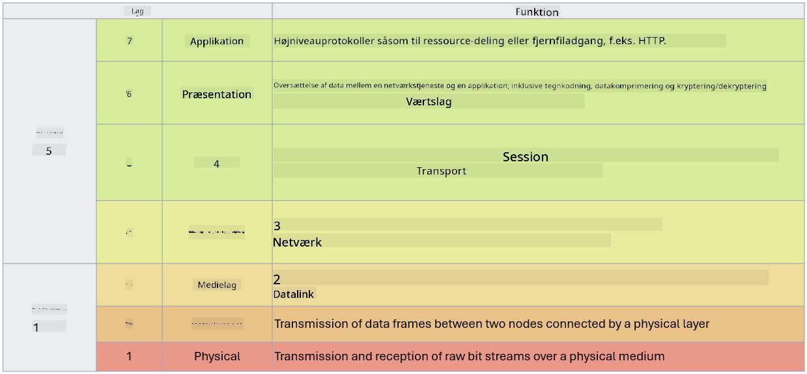

<!--
CO_OP_TRANSLATOR_METADATA:
{
  "original_hash": "252724eceeb183fb9018f88c5e1a3f0c",
  "translation_date": "2025-09-03T22:04:10+00:00",
  "source_file": "3.1 Networking key concepts.md",
  "language_code": "da"
}
-->
# Netværksnøglebegreber

Hvis du har arbejdet med IT, er det sandsynligt, at du er blevet introduceret til netværksbegreber. Selvom vi bruger identitet som vores primære perimeterkontrol i moderne miljøer, betyder det ikke, at netværkskontroller er overflødige. Selvom dette er et stort emne, vil vi i denne lektion dække nogle centrale netværksbegreber.

I denne lektion vil vi dække:

 - Hvad er IP-adressering?
   
 - Hvad er OSI-modellen?

 

 - Hvad er TCP/UDP?

   
 

 - Hvad er portnumre?

   
  

 - Hvad er kryptering i hvile og under transport?

## Hvad er IP-adressering?

IP-adressering, eller Internet Protocol-adressering, er en numerisk etiket, der tildeles hver enhed, der er tilsluttet et computernetværk, som bruger Internet Protocol til kommunikation. Det fungerer som en unik identifikator for enheder inden for et netværk, hvilket gør det muligt for dem at sende og modtage data via internettet eller andre sammenkoblede netværk. Der er to hovedversioner af IP-adressering: IPv4 (Internet Protocol version 4) og IPv6 (Internet Protocol version 6). En IP-adresse repræsenteres typisk i enten IPv4-format (f.eks. 192.168.1.1) eller IPv6-format (f.eks. 2001:0db8:85a3:0000:0000:8a2e:0370:7334).

## Hvad er OSI-modellen?

OSI (Open Systems Interconnection)-modellen er en konceptuel ramme, der standardiserer funktionerne i et kommunikationssystem i syv forskellige lag. Hvert lag udfører specifikke opgaver og kommunikerer med tilstødende lag for at sikre effektiv og pålidelig datakommunikation mellem enheder i et netværk. Lagene, fra bund til top, er som følger:

 1. Fysisk lag
    
 
 2. Dataforbindelseslag

    
    

 1. Netværkslag

    
   

 1. Transportlag

    

 1. Sessionslag

    
   

 1. Præsentationslag

    
    

 1. Applikationslag

OSI-modellen giver en fælles reference for at forstå, hvordan netværksprotokoller og teknologier interagerer, uanset de specifikke hardware- eller softwareimplementeringer.

_ref: https://en.wikipedia.org/wiki/OSI_model_

## Hvad er TCP/UDP?

TCP (Transmission Control Protocol) og UDP (User Datagram Protocol) er to grundlæggende transportlagsprotokoller, der bruges i computernetværk til at lette kommunikationen mellem enheder via internettet eller inden for et lokalt netværk. De er ansvarlige for at opdele data i pakker til transmission og derefter samle disse pakker til de oprindelige data på modtagerens side. Dog adskiller de sig i deres egenskaber og anvendelsesområder.

**TCP (Transmission Control Protocol)**:

TCP er en forbindelsesorienteret protokol, der leverer pålidelig og ordnet dataoverførsel mellem enheder. Den etablerer en forbindelse mellem afsenderen og modtageren, før dataudvekslingen begynder. TCP sikrer, at datapakker ankommer i den korrekte rækkefølge og kan håndtere genudsendelse af mistede pakker for at garantere dataintegritet og fuldstændighed. Dette gør TCP velegnet til applikationer, der kræver pålidelig dataoverførsel, såsom web browsing, e-mail, filoverførsel (FTP) og databasekommunikation.

**UDP (User Datagram Protocol)**:

UDP er en forbindelsesløs protokol, der tilbyder hurtigere dataoverførsel, men ikke leverer samme niveau af pålidelighed som TCP. Den etablerer ikke en formel forbindelse, før data sendes, og inkluderer ikke mekanismer til at bekræfte eller genudsende mistede pakker. UDP er velegnet til applikationer, hvor hastighed og effektivitet er vigtigere end garanteret levering, såsom realtidskommunikation, streaming af medier, online gaming og DNS-forespørgsler.

Kort sagt prioriterer TCP pålidelighed og ordnet levering, hvilket gør det velegnet til applikationer, der kræver dataakkurathed, mens UDP fokuserer på hastighed og effektivitet, hvilket gør det passende til applikationer, hvor mindre datatab eller omarrangering af rækkefølge er acceptabelt i bytte for reduceret latenstid. Valget mellem TCP og UDP afhænger af de specifikke krav til den applikation eller tjeneste, der bruges.

## Hvad er portnumre?

I netværk er et portnummer en numerisk identifikator, der bruges til at skelne mellem forskellige tjenester eller applikationer, der kører på en enkelt enhed inden for et netværk. Porte hjælper med at dirigere indkommende data til den relevante applikation. Portnumre er 16-bit usignerede heltal, hvilket betyder, at de spænder fra 0 til 65535. De er opdelt i tre områder:

- Velkendte porte (0-1023): Reserveret til standardtjenester som HTTP (port 80) og FTP (port 21).

- Registrerede porte (1024-49151): Bruges til applikationer og tjenester, der ikke er en del af det velkendte område, men er officielt registreret.

- Dynamiske/Private porte (49152-65535): Tilgængelige til midlertidig eller privat brug af applikationer.

## Hvad er kryptering i hvile og under transport?

Kryptering er processen med at konvertere data til et sikkert format for at beskytte det mod uautoriseret adgang eller manipulation. Kryptering kan anvendes på data både "i hvile" (når det er lagret på en enhed eller server) og "under transport" (når det overføres mellem enheder eller over netværk).

Kryptering i hvile: Dette indebærer kryptering af data, der er lagret på enheder, servere eller lagringssystemer. Selv hvis en angriber får fysisk adgang til lagringsmediet, kan de ikke få adgang til dataene uden krypteringsnøglerne. Dette er afgørende for at beskytte følsomme data i tilfælde af enhedstyveri, databrud eller uautoriseret adgang.

Kryptering under transport: Dette indebærer kryptering af data, mens det bevæger sig mellem enheder eller over netværk. Dette forhindrer aflytning og uautoriseret opsnapning af data under transmission. Almindelige protokoller til kryptering under transport inkluderer HTTPS til webkommunikation og TLS/SSL til sikring af forskellige typer netværkstrafik.

## Yderligere læsning
- [How Do IP Addresses Work? (howtogeek.com)](https://www.howtogeek.com/341307/how-do-ip-addresses-work/)
- [Understanding IP Address: An Introductory Guide (geekflare.com)](https://geekflare.com/understanding-ip-address/)
- [What is the OSI model? The 7 layers of OSI explained (techtarget.com)](https://www.techtarget.com/searchnetworking/definition/OSI)
- [The OSI Model – The 7 Layers of Networking Explained in Plain English (freecodecamp.org)](https://www.freecodecamp.org/news/osi-model-networking-layers-explained-in-plain-english/)
- [TCP/IP protocols - IBM Documentation](https://www.ibm.com/docs/en/aix/7.3?topic=protocol-tcpip-protocols)
- [Common Ports Cheat Sheet: The Ultimate Ports & Protocols List (stationx.net)](https://www.stationx.net/common-ports-cheat-sheet/)
- [Azure Data Encryption-at-Rest - Azure Security | Microsoft Learn](https://learn.microsoft.com/azure/security/fundamentals/encryption-atrest?WT.mc_id=academic-96948-sayoung)

---

**Ansvarsfraskrivelse**:  
Dette dokument er blevet oversat ved hjælp af AI-oversættelsestjenesten [Co-op Translator](https://github.com/Azure/co-op-translator). Selvom vi bestræber os på nøjagtighed, skal du være opmærksom på, at automatiserede oversættelser kan indeholde fejl eller unøjagtigheder. Det originale dokument på dets oprindelige sprog bør betragtes som den autoritative kilde. For kritisk information anbefales professionel menneskelig oversættelse. Vi er ikke ansvarlige for eventuelle misforståelser eller fejltolkninger, der måtte opstå som følge af brugen af denne oversættelse.