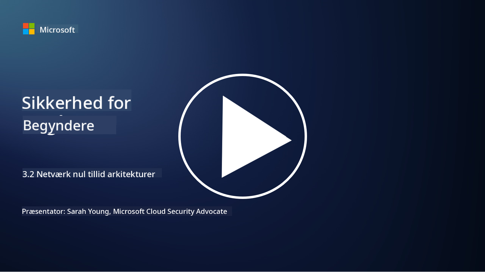

<!--
CO_OP_TRANSLATOR_METADATA:
{
  "original_hash": "680d6e14d9d33fc471c22f44679713f8",
  "translation_date": "2025-09-03T21:13:44+00:00",
  "source_file": "3.2 Networking zero trust architecture.md",
  "language_code": "da"
}
-->
# Netværksarkitekturer med nul tillid

Netværket udgør et vigtigt lag i kontrollerne for nul tillid. I denne lektion vil vi lære mere om:

- Hvad er netværkssegmentering?  
- Hvordan hjælper netværkssegmentering med at implementere nul tillid?  
- Hvad er end-to-end kryptering?

## Hvad er netværkssegmentering?

Netværkssegmentering er praksissen med at opdele et netværk i mindre, isolerede segmenter eller subnetværk. Hvert segment er isoleret fra de andre, og adgang mellem segmenterne kontrolleres og begrænses baseret på specifikke sikkerhedspolitikker. Netværkssegmentering bruges til at forbedre sikkerheden ved at begrænse konsekvenserne af potentielle brud og reducere angriberes mulighed for lateral bevægelse inden for netværket.

Ved at implementere netværkssegmentering kan en organisation oprette "zoner," der adskiller forskellige typer brugere, applikationer og data. Dette reducerer angrebsfladen og minimerer den potentielle skade forårsaget af en sikkerhedshændelse. Netværkssegmentering kan opnås gennem teknologier som virtuelle LANs (VLANs), firewalls og adgangskontroller.

## Hvordan hjælper netværkssegmentering med at implementere nul tillid?

Netværkssegmentering stemmer godt overens med principperne i nul tillidsmodellen. I en nul tillidsarkitektur hjælper netværkssegmentering med at håndhæve princippet om "mindst privilegium" ved at sikre, at brugere og enheder kun har adgang til de specifikke ressourcer og tjenester, de har brug for til at udføre deres opgaver. Ved at opdele netværket i mindre zoner kan organisationer implementere strenge adgangskontroller, isolere kritiske aktiver og forhindre lateral bevægelse af angribere.

Netværkssegmentering hjælper også med at håndhæve identitetsbaserede adgangskontroller, hvor brugere og enheder grundigt autentificeres og autoriseres, før de får adgang til specifikke segmenter. Dette forhindrer uautoriseret adgang til følsomme ressourcer og reducerer konsekvenserne af kompromitterede legitimationsoplysninger.

## Hvad er end-to-end kryptering?

End-to-end (E2E) kryptering er en sikkerhedsforanstaltning, der sikrer, at data forbliver krypteret gennem hele deres rejse fra afsenderen til modtageren. I denne proces krypteres data ved afsenderens ende, og kun modtageren har dekrypteringsnøglen til at låse op og læse dataene. Krypterings- og dekrypteringsprocesserne foregår ved endepunkterne, hvilket gør det ekstremt vanskeligt for uautoriserede parter, inklusive tjenesteudbydere og mellemled, at få adgang til de ukrypterede data.

E2E kryptering giver et højt niveau af fortrolighed og sikkerhed for datatransmission, selv hvis dataene passerer gennem forskellige mellemsystemer eller netværk. Det bruges ofte i sikre beskedapps, e-mailtjenester og andre kommunikationsplatforme til at beskytte følsomme oplysninger mod aflytning og uautoriseret adgang.

Denne krypteringsmetode sikrer, at selv hvis angribere får adgang til data undervejs, vil de kun se krypteret indhold, som er meningsløst uden dekrypteringsnøglen. End-to-end kryptering spiller en afgørende rolle i at beskytte brugerens privatliv og forhindre, at følsomme oplysninger bliver eksponeret for uautoriserede parter.

## Hvad er SASE?

SASE står for "Secure Access Service Edge" og er en cybersikkerhedsramme og arkitektur, der kombinerer netværkssikkerhed og bredt område-netværk (WAN) kapaciteter i en enkelt cloud-baseret tjeneste. SASE er designet til at levere sikker og skalerbar adgang til netværksressourcer, applikationer og data for fjern- og mobile brugere, samtidig med at det forenkler netværksadministration og reducerer kompleksiteten i traditionelle netværks- og sikkerhedsarkitekturer.

Nøgleegenskaber og komponenter i SASE inkluderer:

1. **Cloud-baseret:** SASE leveres som en cloud-tjeneste, hvilket betyder, at sikkerheds- og netværksfunktioner leveres fra skyen i stedet for at være afhængige af traditionelle hardware og enheder på stedet.  

2. **Integration af sikkerhed og netværk:** SASE integrerer forskellige sikkerhedstjenester som sikre web-gateways (SWG), firewall som en tjeneste (FWaaS), datatabforebyggelse (DLP), nul tillids netværksadgang (ZTNA) og WAN-optimering med bredt område-netværkskapaciteter. Denne integration hjælper med at strømline sikkerheds- og netværksoperationer.  

3. **Nul tillid:** SASE opererer ud fra princippet om nul tillid, hvilket betyder, at det håndhæver strenge adgangskontroller og politikker for mindst privilegium. Brugere og enheder er ikke betroet som standard og skal autentificeres og autoriseres, før de får adgang til ressourcer.  

4. **Identitetsfokuseret:** SASE fokuserer på bruger- og enhedsidentiteter som grundlag for adgangskontrol. Identitets- og kontekstbaserede politikker bruges til at bestemme adgangstilladelser, og disse politikker tilpasser sig dynamisk baseret på brugeradfærd og kontekst.  

5. **Skalerbarhed og fleksibilitet:** SASE kan nemt skaleres til at imødekomme et stort antal brugere og enheder, hvilket gør det velegnet til organisationer med forskellige og skiftende netværks- og sikkerhedsbehov.  

SASE er særligt relevant i den moderne æra med fjernarbejde og cloud-adoption, da det giver en omfattende og agil tilgang til at sikre og administrere netværksadgang. Det hjælper organisationer med at tilpasse sig skiftende sikkerheds- og netværkskrav, samtidig med at der opretholdes et stærkt fokus på brugercentrerede og nul tillids sikkerhedsmodeller.

## Yderligere læsning

- [What Is Network Segmentation? - Cisco](https://www.cisco.com/c/en/us/products/security/what-is-network-segmentation.html#~benefits)  
- [What Is Micro-Segmentation? - Cisco](https://www.cisco.com/c/en/us/products/security/what-is-microsegmentation.html)  
- [Implementing Network Segmentation and Segregation | Cyber.gov.au](https://www.cyber.gov.au/resources-business-and-government/maintaining-devices-and-systems/system-hardening-and-administration/network-hardening/implementing-network-segmentation-and-segregation)  
- [What Is Network Segmentation and Why It Matters | CompTIA](https://www.comptia.org/blog/security-awareness-training-network-segmentation)  
- [Network Segmentation: Concepts and Practices (cmu.edu)](https://insights.sei.cmu.edu/blog/network-segmentation-concepts-and-practices/)  
- [Secure networks with Zero Trust | Microsoft Learn](https://learn.microsoft.com/security/zero-trust/deploy/networks?WT.mc_id=academic-96948-sayoung)  
- [What is end-to-end encryption? | IBM](https://www.ibm.com/topics/end-to-end-encryption)  
- [What Is End-to-End Encryption, and Why Does It Matter? (howtogeek.com)](https://www.howtogeek.com/711656/what-is-end-to-end-encryption-and-why-does-it-matter/)  
- [Definition of Secure Access Service Edge (SASE) - Gartner Information Technology Glossary](https://www.gartner.com/en/information-technology/glossary/secure-access-service-edge-sase)  
- [What Is Secure Access Service Edge (SASE)? | Microsoft Security](https://www.microsoft.com/security/business/security-101/what-is-sase?WT.mc_id=academic-96948-sayoung)  

---

**Ansvarsfraskrivelse**:  
Dette dokument er blevet oversat ved hjælp af AI-oversættelsestjenesten [Co-op Translator](https://github.com/Azure/co-op-translator). Selvom vi bestræber os på at sikre nøjagtighed, skal du være opmærksom på, at automatiserede oversættelser kan indeholde fejl eller unøjagtigheder. Det originale dokument på dets oprindelige sprog bør betragtes som den autoritative kilde. For kritisk information anbefales professionel menneskelig oversættelse. Vi påtager os ikke ansvar for eventuelle misforståelser eller fejltolkninger, der måtte opstå som følge af brugen af denne oversættelse.