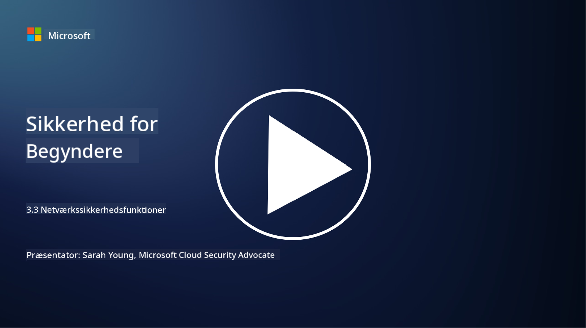

<!--
CO_OP_TRANSLATOR_METADATA:
{
  "original_hash": "c3aba077bb98eebc925dd58d870229ab",
  "translation_date": "2025-09-03T20:19:52+00:00",
  "source_file": "3.3 Network security capabilities.md",
  "language_code": "da"
}
-->
# Netværkssikkerhedsfunktioner

I denne lektion vil vi lære om følgende funktioner, der kan bruges til at sikre et netværk:

 - Traditionelle firewalls
 - Webapplikations-firewalls
 - Cloud-sikkerhedsgrupper
 - CDN
 - Load balancere
 - Bastion hosts
 - VPN'er
 - DDoS-beskyttelse

## Traditionelle firewalls

Traditionelle firewalls er sikkerhedsenheder, der kontrollerer og overvåger indgående og udgående netværkstrafik baseret på foruddefinerede sikkerhedsregler. De fungerer som en barriere mellem et betroet internt netværk og ubetroede eksterne netværk, hvor de filtrerer trafik for at forhindre uautoriseret adgang og potentielle trusler.

## Webapplikations-firewalls

Webapplikations-firewalls (WAF'er) er specialiserede firewalls designet til at beskytte webapplikationer mod forskellige angreb, såsom SQL-injektion, cross-site scripting og andre sårbarheder. De analyserer HTTP-anmodninger og -svar for at identificere og blokere skadelig trafik, der er rettet mod webapplikationer.

## Cloud-sikkerhedsgrupper

Sikkerhedsgrupper er en grundlæggende netværkssikkerhedsfunktion, der tilbydes af cloud-tjenesteudbydere. De fungerer som virtuelle firewalls, der kontrollerer indgående og udgående trafik til og fra cloud-ressourcer, såsom virtuelle maskiner (VM'er) og instanser. Sikkerhedsgrupper giver organisationer mulighed for at definere regler, der bestemmer, hvilke typer trafik der er tilladt og nægtet, og tilføjer et ekstra lag af forsvar til cloud-implementeringer.

## Content Delivery Network (CDN)

Et Content Delivery Network er et distribueret netværk af servere placeret i forskellige geografiske områder. CDN'er hjælper med at forbedre ydeevnen og tilgængeligheden af websites ved at cache indhold og levere det fra servere, der er tættere på brugeren. De giver også en vis beskyttelse mod DDoS-angreb ved at distribuere trafik på tværs af flere serverlokationer.

## Load balancere

Load balancere fordeler indgående netværkstrafik på tværs af flere servere for at optimere ressourceudnyttelse, sikre høj tilgængelighed og forbedre applikationsydelsen. De hjælper med at forhindre serveroverbelastning og opretholde effektive svartider, hvilket styrker netværkets robusthed.

## Bastion hosts

Bastion hosts er meget sikre og isolerede servere, der giver kontrolleret adgang til et netværk fra et eksternt, ubetroet netværk (såsom internettet). De fungerer som indgangspunkter for administratorer til at få sikker adgang til interne systemer. Bastion hosts er typisk konfigureret med stærke sikkerhedsforanstaltninger for at minimere angrebsfladen.

## Virtuelle private netværk (VPN'er)

VPN'er opretter krypterede tunneler mellem en brugers enhed og en fjernserver, hvilket sikrer sikker og privat kommunikation over potentielt usikre netværk som internettet. VPN'er bruges ofte til at give fjernadgang til interne netværk, så brugere kan få adgang til ressourcer, som om de fysisk var på samme netværk.

## DDoS-beskyttelsesværktøjer

DDoS (Distributed Denial of Service) beskyttelsesværktøjer og -tjenester er designet til at afbøde virkningen af DDoS-angreb, hvor flere kompromitterede enheder oversvømmer et netværk eller en tjeneste for at overbelaste det. DDoS-beskyttelsesløsninger identificerer og filtrerer skadelig trafik, så legitim trafik stadig kan nå sin tiltænkte destination.

## Yderligere læsning

- [What Is a Firewall? - Cisco](https://www.cisco.com/c/en/us/products/security/firewalls/what-is-a-firewall.html#~types-of-firewalls)
- [What Does a Firewall Actually Do? (howtogeek.com)](https://www.howtogeek.com/144269/htg-explains-what-firewalls-actually-do/)
- [What is a Firewall? How Firewalls Work & Types of Firewalls (kaspersky.com)](https://www.kaspersky.com/resource-center/definitions/firewall)
- [Network security group - how it works | Microsoft Learn](https://learn.microsoft.com/azure/virtual-network/network-security-group-how-it-works)
- [Introduction to Azure Content Delivery Network (CDN) - Training | Microsoft Learn](https://learn.microsoft.com/training/modules/intro-to-azure-content-delivery-network/?WT.mc_id=academic-96948-sayoung)
- [What is a content delivery network (CDN)? - Azure | Microsoft Learn](https://learn.microsoft.com/azure/cdn/cdn-overview?WT.mc_id=academic-96948-sayoung)
- [What Is Load Balancing? How Load Balancers Work (nginx.com)](https://www.nginx.com/resources/glossary/load-balancing/)
- [Bastion hosts vs. VPNs · Tailscale](https://tailscale.com/learn/bastion-hosts-vs-vpns/)
- [What is VPN? How It Works, Types of VPN (kaspersky.com)](https://www.kaspersky.com/resource-center/definitions/what-is-a-vpn)
- [Introduction to Azure DDoS Protection - Training | Microsoft Learn](https://learn.microsoft.com/training/modules/introduction-azure-ddos-protection/?WT.mc_id=academic-96948-sayoung)
- [What Is a DDoS Attack? | Microsoft Security](https://www.microsoft.com/security/business/security-101/what-is-a-ddos-attack?WT.mc_id=academic-96948-sayoung)

---

**Ansvarsfraskrivelse**:  
Dette dokument er blevet oversat ved hjælp af AI-oversættelsestjenesten [Co-op Translator](https://github.com/Azure/co-op-translator). Selvom vi bestræber os på nøjagtighed, skal du være opmærksom på, at automatiserede oversættelser kan indeholde fejl eller unøjagtigheder. Det originale dokument på dets oprindelige sprog bør betragtes som den autoritative kilde. For kritisk information anbefales professionel menneskelig oversættelse. Vi er ikke ansvarlige for eventuelle misforståelser eller fejltolkninger, der måtte opstå som følge af brugen af denne oversættelse.